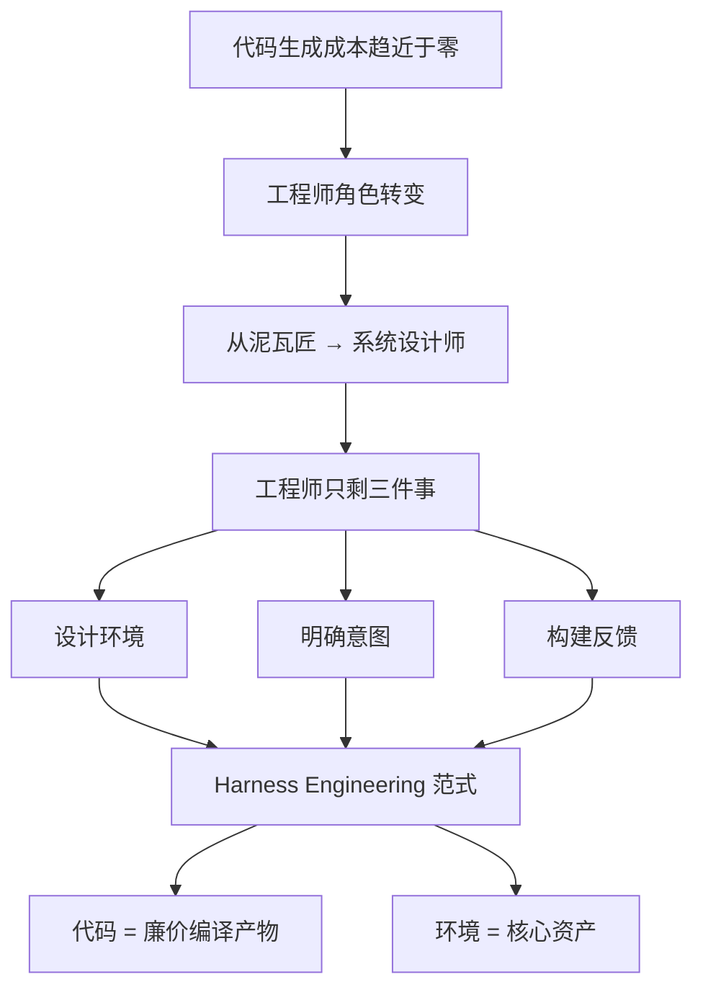
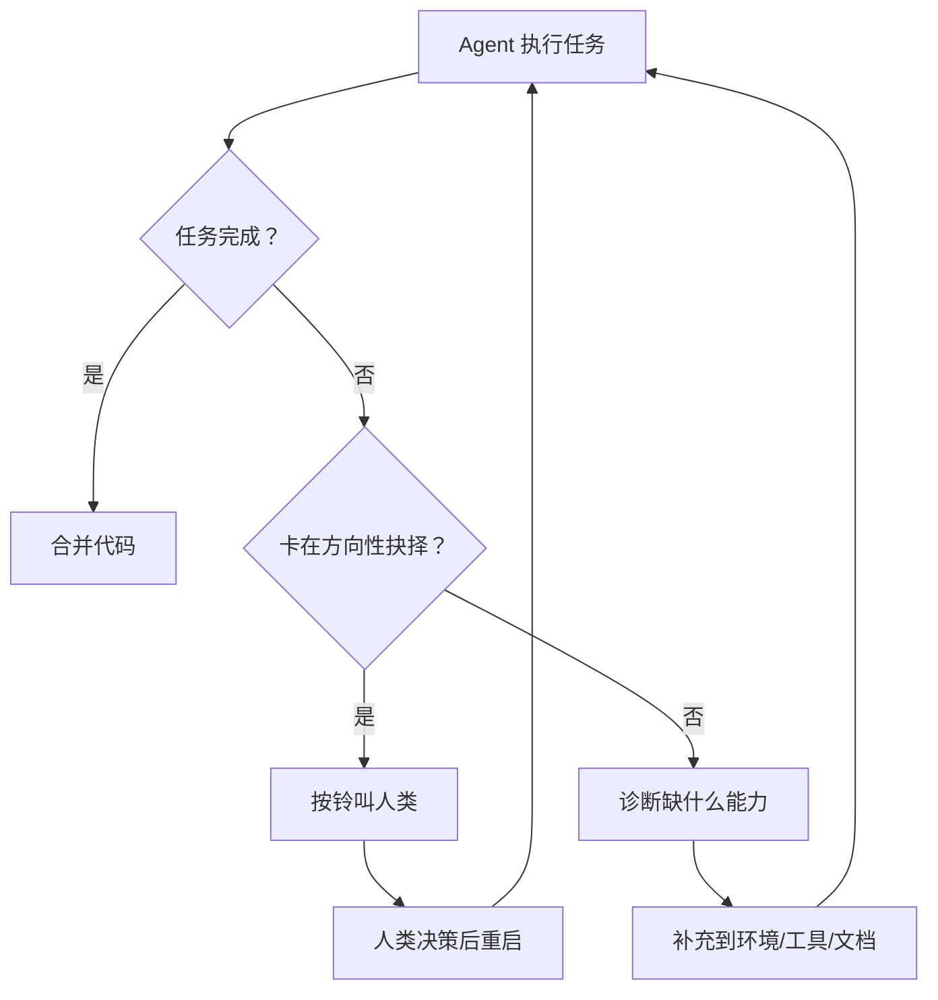

# 范式转移

> 本章是 **Hermes Engineering 系列**第 1 模块的第 1 章。

当代码可以被无限生成，工程师的价值就从「写代码」迁移到了「设计让代码产生的环境」。这不是科幻小说——OpenAI 团队用一个三人团队、五个月时间，构建了一个百万行代码的复杂系统，期间大约合并了 1500 个 PR。后来团队扩展到七人，人均产出反而提升了。

这就是 Harness Engineering——软件工程正在经历的一次范式转移。

> 💡 **图解：** 代码从"稀缺资产"降级为"可再生资源"，工程师的核心价值从写代码本身转移到了制造代码的环境。

---

## Agent 不是笨，是瞎

早期的进展其实很慢。但原因不是模型不够强，而是**环境定义不足**。

Agent 缺什么？工具、对系统架构的认知、上下文。真正的瓶颈不是模型智商不够，而是工程结构没搭好。Harness 就是为了解决这个问题而诞生的——它不仅仅是让 AI 写代码，而是构建一个系统，让 AI 可以稳定、可控、可验证地工作。

当 Agent 犯错时，第一反应不应该是去修代码，而是问：**环境里缺了什么信息，导致 Agent 犯了这个错误？** 是提示词没写清楚？是测试用例覆盖不足？还是工具链报错不明显？

你是在调试 Agent，而不是在调试程序。

---

## 工程师角色的转变

在传统的软件工程里，工程师是泥瓦匠，关心每一行代码的语法，关心每一块砖。但在 Harness Engineering 里，工程师变成了**系统设计师**。

代码的属性变了——以前代码是昂贵的资产，现在代码变成了廉价的编译产物，像打印出来的纸一样，随时可以生成，随时可以丢弃。

Harness 工程师的核心职责只剩三件事：

**1. 设计环境**——给 Agent 搭好脚手架：仓库结构、CI 流水线、Lint 规则、开发者工具。没有这些，Agent 就是在一片荒地上盖房子。

**2. 明确意图**——把需求拆解成 Agent 能理解的、无歧义的规范。不是"帮我写个功能"，而是足够清晰的语言告诉 Agent 你到底想要什么。

**3. 构建反馈**——这是最关键的一环。Agent 自我审查、静态检查、集成测试，让 Agent 在提交代码前在这个闭环里自己跑通。这不是提示词工程，这是**反馈闭环工程**。

---

## 打破人月神话

这打破了软件工程经典著作《人月神话》的核心定律。通常来说，人越多效率越低。但在这个团队，人数翻倍，人均产出反而加速了。

为什么？因为新人的角色变了：

| 传统开发 | Harness 开发 |
|---|---|
| 新人是来流水线上拧螺丝的 | 新人是来升级流水线的 |

当你的工作是改进基础设施时，你的每一分投入都会通过 Agent 的执行力被放大成千上万倍。

---

## Vibe Coding 与深度优先

具体怎么做？把一个大目标拆解成一个个小的构建模块：设计、编码、审查、测试，然后让 Agent 逐个完成这些模块，再用它们去解锁更复杂的任务。

Vibe Coding 概念来自独立开发者 Jeffrey Hunley——把 AI Agent 放进一个循环里，给他一个目标，让他反复执行编码、审查、测试、修复，直到循环跑通为止。

工程师描述一个任务，启动 Agent，然后 Agent 自己开一个 Pull Request。接下来，为了让这个 PR 推到完成，他们会让 Agent 先在本地自我审查，再请求 Agent 在本地和云端分别做额外的审查，然后根据反馈自动修改，循环往复，直到所有 Agent 审查者都满意为止。

随着时间推移，他们已经把**几乎所有的代码审查工作都交给了 Agent 之间互相审查**。人类甚至不需要审查这些 PR。

---

## 失败时的处理原则

> 💡 **图解：** Agent 失败后绝不"再试一次"，而是诊断环境缺口——补的是基建，不是手把手教。

失败时，修复手段几乎从来不是「再试一次」，而是回到原问题：缺了什么能力？如何让这个能力对 Agent 既清晰又可执行？

这种深度优先的思路确保了每一个构建模块都是稳固的。Agent 不会因为一次失败就放弃，而是会从失败中学习，调整策略，直到找到正确的路径。

---

> **Harness Engineering 的重要性正在凸显。** 当代码可以被无限生成，工程师的价值就从"写代码"迁移到了"设计让代码产生的环境"。你不再是泥瓦匠，你是系统设计师。

---

## 本章要点

- Agent 写不出好代码不是因为笨，而是因为"瞎"——环境定义不足
- 工程师角色从泥瓦匠转变为系统设计师
- Harness 工程师核心三件事：设计环境、明确意图、构建反馈
- 代码从昂贵资产变为廉价编译产物，等待成本取代修正成本成为瓶颈
- Vibe Coding：让 Agent 在编码-审查-测试的循环中自主完成任务

**下一章**: [让Agent拥有感官](./02-让Agent拥有感官.md)

---

[← 返回首页](/) | [下一模块: 上下文工程 →](/02-上下文工程/)
