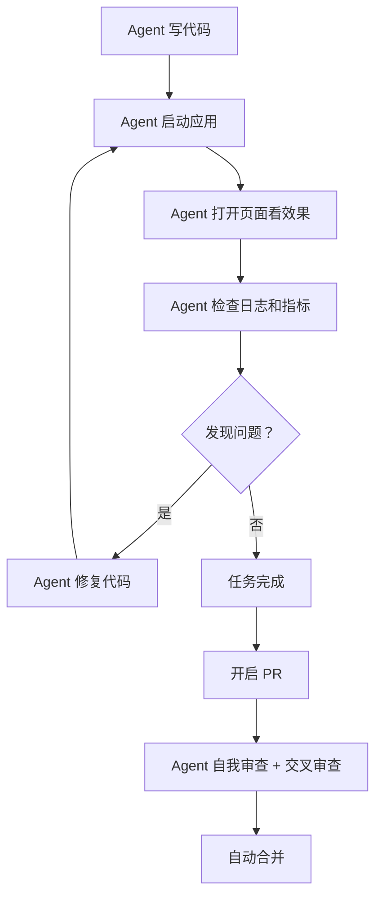
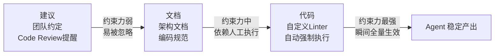

# 让Agent拥有感官

> 本章是 **Hermes Engineering 系列**第 1 模块的第 2 章。

当代码生成速度不再是瓶颈，验证能力就成了新的瓶颈。Agent 写完代码后，怎么知道它写得对不对？OpenAI 的答案是：让 Agent 自己验证自己。但这里有一个前提——Agent 得先**看得见**系统的状态。

---

## Agent 以前是个瞎子

想象一个人类工程师修完 Bug 后会做什么：打开浏览器看看页面对不对、打开日志看看有没有报错、看看性能监控面板确认响应时间正常。这些动作的本质是人在用眼睛和听诊器感知系统的状态。

但以前的 Agent 不具备这些感官。它只能写代码，写完就甩手了。它看不到页面渲染成什么样，不知道系统有没有报错，更不知道性能有没有变差。需要人类验证后，截图告诉它哪里有问题。

这就是瓶颈所在：**生成代码只需要几秒钟，验证代码却需要一个人类工程师。**

---

## 给 Agent 装眼睛：看见 UI

OpenAI 把 Chrome 浏览器的开发者工具协议（CDP）接入了 Agent 的运行时。Agent 可以启动应用、打开页面、看到页面上每个按钮每段文字每个输入框的位置和状态。

他们还给 Agent 创建了专门的技能来处理 DOM 快照、截图和页面导航。DOM 快照就像网页的 X 光片——把网页底层的树状结构在某一刻的状态完整拍下来，交给 Agent 分析。

有了这些，Agent 能够直接复现 Bug、验证修复结果、推理 UI 的行为。以前 Agent 写完代码就结束了，现在它可以自己打开应用、自己看效果、发现不对就自己修。

> 💡 **图解：** 有了感官的 Agent 形成了"编码→验证→修复"的自主闭环，人类工程师彻底退出执行环节。

---

## 给 Agent 装听诊器：看见系统内部

光看 UI 还不够。OpenAI 对可观测性工具做了同样的改造——日志、指标、链路追踪，这三件套让 Agent 能感知肉眼看不到的系统内部状态。

他们给每个 Agent 任务搭建了一套临时的可观测性环境，每个任务有自己独立的日志和指标，用完就销毁。就像给每个 Agent 配了一间隔音室——它看到的日志只属于自己这个任务，不会被其他并行任务的信息干扰。

Agent 可以用 LogQL 在海量日志里精确搜索某一条错误记录，用 PromQL 查询"最近五分钟的平均响应时间是多少"。以前这些约束不容易被 Agent 验证，需要靠人类盯着监控面板去看。**现在 Agent 自己就能查，就能判断，就能通过或者打回。**

---

## 给 Agent 一张地图：知识可发现

光有感官还不够，Agent 还需要知道去哪里找信息。OpenAI 的解法是：**给 Codex 一张地图，而不是一本一千页的说明书。**

他们一开始试了一个巨型 `agents.md` 方案，把所有规则全塞进一个超长文件里，结果以完全可预见的方式失败了：

- **上下文是稀缺资源**——巨大的指令文件会挤占任务本身代码的空间
- **指导太多等于没有指导**——当所有东西都被标记为重要时，什么都不重要
- **它会立即腐烂**——巨型说明文件会变成过时规则的坟场

正确做法是把 `agents.md` 当目录——一百行的目录，指向 `dox/` 目录里的具体文档。Agent 从一个小的、稳定的起点开始，然后被告知接下来该去哪里找信息，而不是一上来就被淹没。

知识得先在仓库里。从 Agent 的视角来看，任何它在运行时无法在上下文中访问的东西，实际上就不存在。Slack 频道里的讨论、Google Docs 里的方案、同事脑子里的 API 坑——对 Agent 来说都是黑洞。Agent 能看到的现实世界，只有仓库里的版本化文件。

---

## 把建议变成法律：强制执行

有了眼睛和地图，Agent 还需要约束。当 AI 接管了写代码这件事，如何保证它不会以光速造出一座屎山？

OpenAI 的思路：**严格的约束**。约束是速度的前提。边界必须刚性封死，但边界之内让 Agent 完全自由地实现。

文档是建议，Agent 需要的是法律。如果规则只是写在文档里，Agent 会复制已有结构、放大已有模式，错误结构会被指数级复制。所以必须把建议变成法律——通过自定义 Linter 机械执行。

这里有一个精妙的设计：**Linter 不只是报错工具，它们是上下文注入工具。** 当 Linter 报错时，错误信息里会直接写上补救指令。Agent 读到这条报错，等于读到了一条 Prompt，然后它自己重构代码，重新跑 Linter，直到全部变绿。

同一条规则，在人类世界是负担，在 Agent 世界是杠杆。一旦你把一条规则写进代码，它瞬间就在所有 Agent 的所有任务中生效。

---

## 投资回报率：6 小时的自主工作

给 Agent 装眼睛和听诊器带来的最终效果是什么？单次 Codex 在一个任务上工作经常超过 6 个小时，通常是在人类睡觉的时候。

因为 Agent 有了感官和地图，它可以自主地：写代码 → 看效果 → 查日志 → 发现问题 → 修复 → 再验证，循环直到通过，完全不需要人类介入。

**状态可读，让 Agent 能看见 UI、感知系统内部状态，从而实现闭环自主工作。**

---

## ⚠️ 常见错误

| ❌ 错误做法 | ✅ 正确做法 | 为什么 |
|:---|:---|:---|
| 把所有规则塞进一个巨型 `agents.md` 文件 | 用 100 行 `agents.md` 做目录，指向 `dox/` 具体文档 | 巨型文件挤占上下文空间、指导太多等于没有、立即腐烂变成过时规则坟场 |
| 知识散落在 Slack、Google Docs、同事脑子里 | 把重要知识搬进仓库，版本化管理 | Agent 运行时无法访问的东西，对它来说就不存在——它只看得见仓库里的文件 |
| 用建议文档约束 Agent 行为 | 通过自定义 Linter 机械执行规则 | 文档是建议，Agent 会复制已有结构放大错误；Linter 报错自带修复指令，等同于 Prompt |
| Agent 写完代码就甩手，不给它验证手段 | 接入 CDP、LogQL/PromQL，让 Agent 自己看到系统状态 | 生成代码只需几秒，验证却需要人类——瓶颈不在模型智商，而在环境定义不足 |
| 让 Agent 盲目探索仓库结构 | 提供 `architecture.md` 鸟瞰图 + 结构化目录 | Agent 自行搜索路径本身是高错误率环节，会浪费大量 Token 在无效探索上 |

---

## 本章要点

- 状态可读三层含义：可见（CDP）、可解析（LogQL/PromQL）、可验证（闭环反馈）
- 知识可发现：一张地图而非一本说明书，知识必须在仓库里
- 强制执行：Linter 即 Prompt，规则是倍增器
- 投资仓库可读性是一次投入，多个 Agent 同时受益
- 约束的三级火箭：建议 → 文档 → 代码

> 💡 **图解：** 约束力逐级递增——Linter 报错本身就是一条 Prompt，Agent 读完自己修，规则瞬间在所有 Agent 中生效。

---

**上一章**: [范式转移](./01-范式转移.md) | **下一章**: [成本、自主与熵增](./03-成本、自主与熵增.md)
