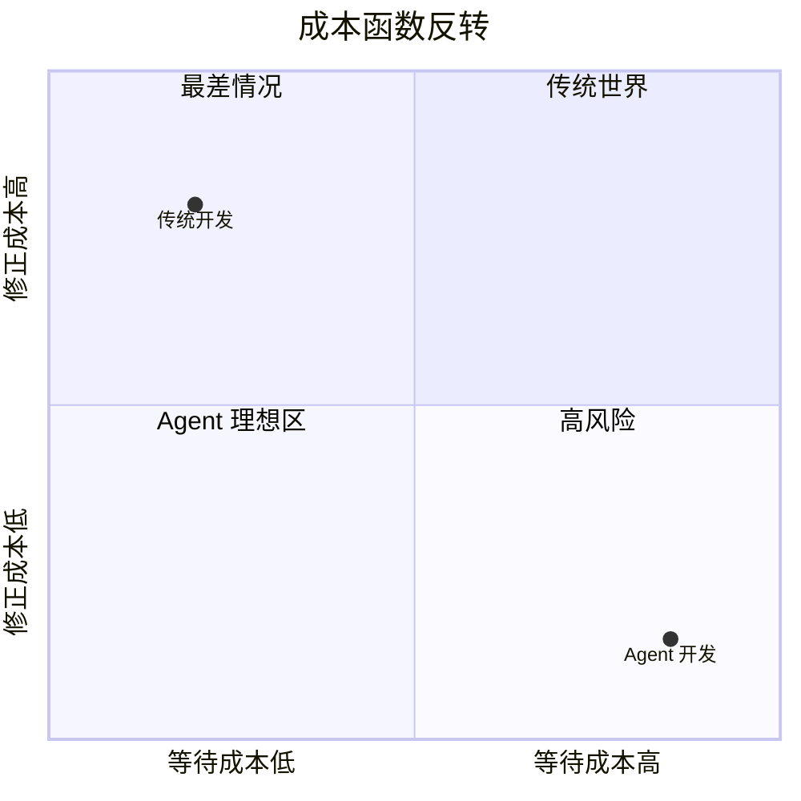
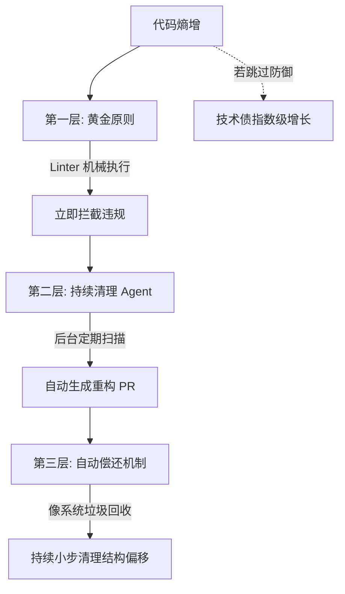

# 成本、自主与熵增

**Harness Engineering 核心原则 · 第三章**

> 代码变便宜了，等待变贵了。然后 Agent 接管了全流程，但熵增也随之而来。

前两章我们建立了 Harness 的基础——工程师变成系统设计师，Agent 拥有了眼睛、地图和法律。现在我们要面对三个更深层的问题：成本结构怎么变了？自主的边界在哪里？大量自动生成的代码带来的熵增怎么办？

---

## 一、当等待成为最昂贵的成本

传统的软件工程有一套大家都很熟悉的流程：写完代码 → 开 PR → 等人 Review → 测试全过 → 审批通过 → 才能合并。每一步都是一道门。

对人类团队来说，这很合理——人写代码慢，每次合并都是一件大事儿，值得停下来仔细检查。

但当 Agent 接管了代码生产，这套传统逻辑可能适得其反。

### 成本函数反转

想象一个工厂的质检流程。传统场景每小时生产 10 件，质检员在每件出厂前仔细检查——完全合理。但当产量飙升到每小时 1000 件，质检员根本看不过来。**整条线都会被他一个人堵死。**

而这时候，修一件次品的成本几乎为零——自动返工几秒钟就能修好。

| 维度 | 传统世界 | Agent 世界 |
|:---|:---|:---|
| **修正成本** | 很贵 | 很便宜 |
| **等待成本** | 很便宜 | **最贵** |

传统世界的逻辑是"修正贵，等待便宜"→ 多检查、多审批，宁可慢也不能错。Agent 世界的逻辑是"修正便宜，等待最贵"→ **快速放行，快速暴露问题，快速修正。**



> 💡 **图解：** 传统开发在"修正贵、等待便宜"象限，Agent 开发反转到"修正便宜、等待最贵"——工程实践必须随之反转。

### 三个具体动作

**最小化阻塞门控。** 不是不要检查，而是把"必须等人批准才能继续"变成"自动检查 + 快速反馈"，把"层层审批"变成"护栏 + 自动修复"。

**PR 保持短生命周期。** 人类往往习惯花好几天写一个极其庞大的 PR，导致漫长的 Review 和极高的合并冲突率。Agent 流程的做法是高频小步快跑——合并碰壁的概率极低，哪怕出错了，代替一个短周期的修复 PR 也就是几秒钟的事儿。

**绝不让 Flaky Test 无限期阻塞进度。** 那种跑同一段代码有时候通有时候挂的幽灵测试，在传统做法中会阻塞所有人、停机排查。在 Agent 时代，用后续的重跑机制来解决——绝不无限期地卡住全盘进度，因为等待的代价太高昂了。

> **最佳工程实践不是绝对的，它取决于你的约束条件。** 当约束条件发生数量级变化时，最佳实践本身也必须跟着变。

---

## 二、端到端自主：Agent 接管全流程

一旦跨越了某个工程临界点，Agent 将完全接管从代码到运维的每一环。

### Agent 生成的不只是代码

当 OpenAI 说这个代码库是由 Codex 生成时，指的不只是产品代码和测试代码。Agent 生成的清单包括：CI 配置与发布工具链、内部开发管理工具、架构设计的历史文档、评估系统与测试框架、PR 下的审查评论与回复、仓库本身的脚本、生产环境的监控面板定义文件。

Agent 正在像人类一样直接使用标准的开发工具——拉取审查意见、进行内联回复、推送更新、自己压缩并合并 PR。

### 人类工程师在干什么？

当繁琐的执行环节被全面接管，人类的工作重心转移到了一个完全不同的抽象层：

1. **排定优先级**——决定做什么，不做什么
2. **翻译需求**——将用户反馈翻译成明确的验收标准
3. **最终验证**——验证交付成果是否符合预期

如果在中间过程中 Agent 卡壳了，人类也**绝对不会下场去帮他逐行修代码**。他们会把 Agent 的挣扎视为一种报错信号，去排查：是不是系统里少了某个检测工具？缺了某种护栏？还是文档没写清楚？找到缺口并补充到系统后，依旧让 Agent 自己去完成代码修复。

> **人类不再是执行者，而是环境与标准的设计者。**

### 全自动闭环

随着测试、评审、反馈、处理等整个开发循环都被明确编码到系统架构中后，Agent 跨越了一个决定性的自治阈值：

```
输入需求 → 查验代码库现状 → 遇到 Bug 自主复现
→ 录制展示错误的视频（留作证据）→ 完成代码修复
→ 再次驱动应用进行自我验证 → 录制成功运行的视频
→ 自己开启 PR → 响应审查意见
→ 遇到构建报错自我排查并修复
→ [涉及方向性抉择？] → 按铃叫人类
→ 否则自动合并代码
```

除非遇到真正涉及方向性抉择的情况，它才会按铃叫人类。否则它会一路走到底，最终自动合并代码。

从输入一段需求到最终代码合并，中间长达数小时的执行过程全由机器接管。

### 冷峻的提醒

但 OpenAI 紧接着给出了一个非常冷峻的提醒：此行为高度依赖于该代码库的具体结构和工具链，也不应假设其能普遍推广——除非投入了类似的开发资源。

这种自治**不能被简单复制粘贴**。让大模型自动写代码而不搭建基础设施，只会制造出加速系统崩溃的数字垃圾。

> **越是高度的自治，越离不开极度严密的环境设计与工程约束。**

---

## 三、对抗熵增：技术债的自动偿还

当 Agent 能瞬间写出大量代码，随之而来的是逐渐难以察觉却不断累积的**代码熵增**。

### Agent 的本能：复制与放大

哪怕你投入了再多精力去设计架构护栏，Agent 的本能依然是**复制**——它会模仿仓库中已有代码的模式。一旦某个角落出现了细微的技术债，这种便宜的妥协就可能被 Agent 快速复制放大，最终导致系统结构逐渐失去连贯性。

恶性循环：技术债 → Agent 复制 → 更多技术债 → 更快复制 → 系统失控。

### 人工清理为什么失败

OpenAI 团队曾尝试每周抽出大约 20% 的时间，由工程师专门做代码清理。听起来合理，但在一个高度自动化、吞吐量极高的环境中，代码生成的速度远超人类清理的速度。人工清理永远追不上自动生产。

### 三层防御体系



> 💡 **图解：** 三层防御像持续运行的垃圾回收——不等系统失控才大规模重构，而是小步自动清理。

**第一层：黄金原则。** 把工程师对代码的品味编码成一组明确的规则——可以被机器检查和强制执行。比如：优先使用共享的工具库而不是在不同模块里各自手写小工具函数；拿到外部数据后必须先做显式的结构验证，不能直接假设字段一定存在。

**第二层：持续运行的清理机制。** 后台定期运行专门的 Agent 任务，扫描代码库中是否出现偏离黄金原则的模式。一旦发现问题，自动生成针对性的重构 PR。这些 PR 力度很小，可以快速 Review 甚至自动合并。

这种机制更像系统底层的**垃圾回收**——不是等系统失控再进行一次痛苦的大规模重构，而是持续小步、自动地清理结构偏移。

**第三层：技术债的自动偿还。** 在 Agent 时代，技术债更像是**高利贷**——如果放任它，累积增长速度会超过你的偿还能力。唯一可持续的方式是建立一个持续小额自动偿还的机制。

---

## 四、纪律的转移

在这些实践背后，有一件事非常明确：

> **纪律正在从代码本身转移到工程的支架上。**

代码本身将不再是纪律的主要载体。支架指的是工具、执行环境、系统抽象、反馈回路——整个底层的控制系统。

现在最困难的挑战不在于如何榨取模型生成代码的能力极限，而在于**你能否构建出一个足够稳健的控制架构**。

---

## 本章要点

1. **成本反转**——修正变便宜、等待变贵；最小化阻塞门控，高频小步快跑
2. **端到端自主**——Agent 接管从代码到运维的全流程，人类变成甲方工程师
3. **自治的代价**——高度自治需要极高的基础设施门槛，不是撒手不管
4. **熵增对抗**——黄金原则 + 持续清理 Agent + 自动偿还机制
5. **纪律转移**——从代码本身转移到工程支架（工具、环境、反馈回路）

---

[← 上一章：让 Agent 拥有感官](02-让Agent拥有感官.md) | [下一章：Harness 即操作系统 →](04-Harness即操作系统.md)
