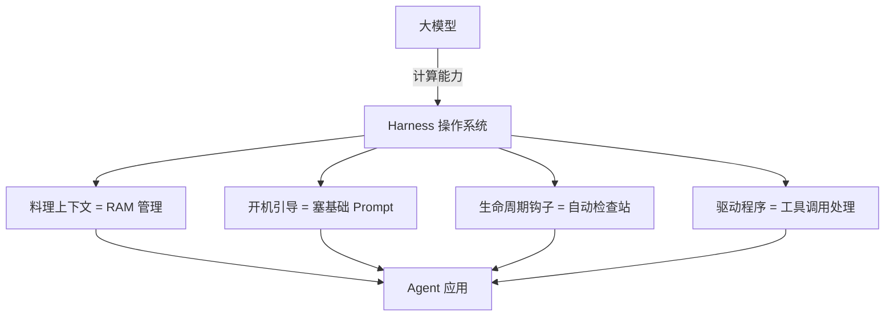
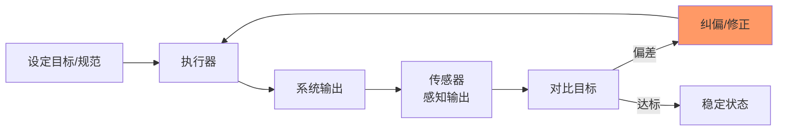

# Harness 即操作系统

**Harness Engineering 核心原则 · 第四章**

> 这个时代的操作系统是什么？是 Agent Harness。

前三章建立了 Harness 的基本图景：范式转移、感官系统、成本与熵增。本章我们把视角拉到最高——Harness 到底是什么？怎么构建？底层逻辑是什么？

答案分三层：Harness 是操作系统，但要为废弃而建，而这一切的底层是控制论。

---

## 一、Harness = 操作系统

Google DeepMind 工程师 Filip Hráček 提出了一个精妙的比喻。

### 静态跑分的错觉

各家顶尖模型在静态跑分上的差距已经缩小到很小了。但这可能是一种错觉——**任务越长越复杂，模型之间真正的差距才会暴露出来。**

你让模型进企业跑一个长线自动化流程：读几百页文档、查代码总结依赖关系、调 API、建工单、汇总报告。跑着跑着它就开始跑偏了，或者完全忘了第一步定好的安全规则。

排行榜上那点分差，根本测不出这种灾难。

### 四大核心功能

Agent Harness 是包裹在 AI 模型外围的基础设施，用来管理长生命周期的任务。它有四大核心功能：

| 功能 | 作用 |
|:---|:---|
| **Prompt Presets** | 模型开始干活前，自动塞好一套规矩 |
| **Tool Call Handling** | 统一处理 Agent 调用外部工具的逻辑 |
| **Lifecycle Hooks** | 每执行完一步自动触发检查，不过就拦截打回 |
| **高阶能力** | 自动规划、文件系统读写、子 Agent 管理 |

其中**生命周期钩子**尤其关键——它是提前在流程里埋好的检查站。模型每执行完一步，钩子就自动触发一次检查：输出格式对不对？Token 有没有超限？有没有触发安全红线？如果检查不过，钩子直接拦截打回重来。

### 完整的比喻

> 💡 **图解：** Harness 是包裹在大模型外围的 OS——大模型是 CPU，上下文窗口是 RAM，Harness 才是让一切协同运转的操作系统。

| 组件 | 比喻 | 作用 |
|:---|:---|:---|
| **大模型** | CPU | 提供原始的计算处理能力 |
| **上下文窗口** | RAM（内存条） | 容量有限，关掉就没了 |
| **Agent Harness** | **操作系统（OS）** | 料理上下文、处理开机引导、预埋钩子、提供驱动 |
| **Agent 应用** | APP | 跑在操作系统之上的应用程序 |

Harness 就是操作系统。它负责料理上下文、处理开机引导（塞基础提示词）、预埋生命周期钩子、提供标准化的驱动程序（工具调用处理）。

### 2026 年的核心定位

| 不是 | 而是 |
|:---|:---|
| 业务代码 | **底座** |
| 应用 | **操作系统** |
| 锦上添花 | **基础设施** |

Harness 弥合了跑分和真实体验之间的鸿沟，释放了模型的潜力，构建了闭环反馈——你改进系统的能力上限，完全取决于你验证输出有多容易。

---

## 二、为废弃而构建

Harness 是操作系统，那该怎么构建它？

你可能会想：输出格式不对就加一层校验拦截重试，多步规划走偏了就搭一套复杂的状态机强制纠偏。这套思路在传统软件工程里没毛病，但放到 Agent Harness 上——**行不通**。

### 苦涩的教训

计算机科学家 Rich Sutton 写过一篇著名的短文叫 *"The Bitter Lesson"*。核心论点：过去 30 年，凡是**依赖庞大算力的通用方法**，每一次都击败了人类手工编码进去的先验知识。无一例外。

这堂课正在 Agent 开发领域真实重演。

### 顶级团队在疯狂删代码

| 团队 | 动作 |
|:---|:---|
| **Mistral** | 6 个月内把 Harness 重构了 5 次 |
| **LangChain** | 一年内把 Open Deep Research 架构推翻重写了 3 次 |
| **Vercel** | 直接砍掉了 Agent 80% 的代码，结果执行步骤更少、Token 消耗更低、响应速度更快 |

顶级团队不是在加代码，是在**疯狂地删代码**。之前精心设计的"聪明逻辑"，在新模型面前全成了累赘。

### Build to Delete

所以 Harness 的构建原则是：**为废弃而构建。**

每当新模型一发布，它必然带来全新的 Agent 构建方式。2024 年还需要复杂管道才能实现的功能，2026 年可能一条 Prompt 就搞定了。所以你的 Harness 架构必须像乐高积木一样松散——允许你随时流畅地撕掉昨天才写好的那段"聪明控制逻辑"。

> 如果你对控制流做了过度设计，下一次模型更新会直接击穿你的系统。

### Harness 的真正价值：捕获崩溃数据

既然写的 Harness 代码注定要被删，它的价值在哪儿？

答案是**模型漂移（Model Drift）**。模型在短对话里表现得很好，但在超长任务中会慢慢"缺氧"——忘记开局设定的规则，开始胡言乱语。

Harness 像飞机黑匣子一样，精确记录模型在第 100 步之后到底是在哪个节点上丧失了遵循指令的能力。这些断点数据可以直接投喂回训练集，反哺到下一轮训练。

> **The Harness is the dataset.**

谁的 Harness 在真实场景里拦截到了更多崩溃轨迹，谁就能提炼出更好的后训练数据集，就有可能训练出更好的模型。

所以结论很简单：**不要抗拒重构和废弃代码。** 学会张开监控网，记录大模型每一次失控的瞬间——这是用来训练更强模型的宝贵数据集。

---

## 三、控制论：闭环与校准

为什么很多团队一上 Coding Agent，反而更乱了？代码产出多了，但代码库更脏了。PR 合并快了，但架构漂移也快了。

硅谷工程师 George 的判断是：这不是简单的 AI 写码问题，**这是控制论进入代码生产层**。

### 这个模式见过三次

第一次是 18 世纪的蒸汽机调速器。James Watt 发明了离心调速器——一个机械装置感知转速，自动调节阀门。工人的工作从转阀门变成设计调速器。

第二次是 Google 的 Borg 服务器管理系统。你告诉它系统应该长什么样，它就自动维持那个状态。工程师的工作从手动重启服务变成写清楚系统应该长什么样。

第三次就是现在，OpenAI 的 Coding Agent。工程师不再写代码，他们设计环境、构建反馈回路，让 Agent 写代码。五个月，100 万行，零行手写。

Norbert Wiener 在 1948 年给这个模式命名：**控制论（Cybernetics）**。核心就一个词——**闭环**。输出影响输入，系统自己纠偏。

> 💡 **图解：** 每一次技术跃迁——蒸汽机调速器、Borg、Coding Agent——本质都是在某个层级上第一次成功闭环。

> 每一次技术跃迁，都是在某个层级上第一次成功闭环。

### 为什么代码库是最后一个被攻克的？

代码库一直有反馈回路，但只在低层级：编译器检查语法、测试检查行为、Linter 检查风格。这些只能处理可以机械检查的东西。

更高层的问题从来没有自动化过——这个改动符合系统架构吗？这个抽象随着代码库增长会出问题吗？这些问题没有传感器，也没有执行器，只有人能在这个层级上操作。

**LLM 同时改变了两者**：它能感知架构质量，也能执行架构修改。历史上第一次，反馈回路可以在重要决策发生的地方闭合。

### 闭环是必要条件，不是充分条件

Watt 的调速器需要调教。Borg 的控制器需要正确的 spec。接上 Agent 不等于完事儿了——真正的工作是**校准这个回路**，让它知道什么叫"好"。

工程师脑子里的判断力是隐性知识，通过经验积累，很难言传。Agent 没有 code review、结对编程、口耳相传的渠道。你必须把隐性知识变成**显性知识写下来**，才能让 Agent 使用。

OpenAI 每周花 20% 的时间做代码清理，后来他们把标准编码进 Harness 本身才解决了这个问题。Anthropic 的 Nicholas Carlini 做过 16 个并行 Agent 构建 C 编译器的实验，他的原话是："我大部分精力都花在设计 Claude 周围的环境上。"

### 为什么上了 Agent 反而更乱了？

文档、自动化测试、成文的架构决策——这些一直都是对的。过去 30 年几乎所有工程师都在推荐这些事，很多人跳过是因为代价来得很慢。

Agent 工程把这种代价放大到了极端：

| 跳过的实践 | 传统代价 | Agent 时代的代价 |
|:---|:---|:---|
| 文档 | 一个 PR 里忽略约定 | 机器速度、全天候、每一个 PR 都忽略约定 |
| 测试 | 偶尔漏检 bug | 反馈回路根本闭合不起来 |
| 架构约束 | 架构缓慢漂移 | 漂移速度比你修补的速度还快 |

更糟的陷阱：如果 Agent 根本不知道"整洁"长什么样，你甚至没法用 Agent 来清理它制造出来的混乱。没有校准，制造问题的机器也同样无法解决问题。

> **实践本身没有变。变得难以承受的是忽视这些实践的代价。**

### 人在 Agent 时代的位置

验证一个答案对不对，比生成一个正确答案要容易得多。这个规律在 LLM 上也被实验证实了。所以你不需要在实现速度上跟机器竞争。

你需要专注在评估这一侧：**定义**什么叫正确、**识别**输出哪里偏了、**判断**方向是否对路。

工程师不会消失，但工程师的工作会像前两次一样——再上移一层。设计 Watt 调速器的工人没有回去转阀门，不是因为他们不能，而是因为这样做不再有意义。

---

## 本章要点

1. **Harness = 操作系统**——料理上下文、处理引导、预埋钩子、提供驱动；2026 年的核心定位是基础设施
2. **Build to Delete**——Harness 代码注定被删，真正的价值是捕获崩溃数据（The Harness is the dataset）
3. **控制论闭环**——输出影响输入、系统自己纠偏；每一次技术跃迁都是在某个层级上第一次成功闭环
4. **校准比闭环更重要**——闭环是必要条件，校准是充分条件；必须把隐性知识显性化写进 Harness
5. **人再上移一层**——不需要跟机器比实现速度，专注定义正确、识别偏差、判断方向

---

[← 上一章：成本、自主与熵增](03-成本、自主与熵增.md) | [下一章：验证、工具与优化 →](05-验证、工具与优化.md)
