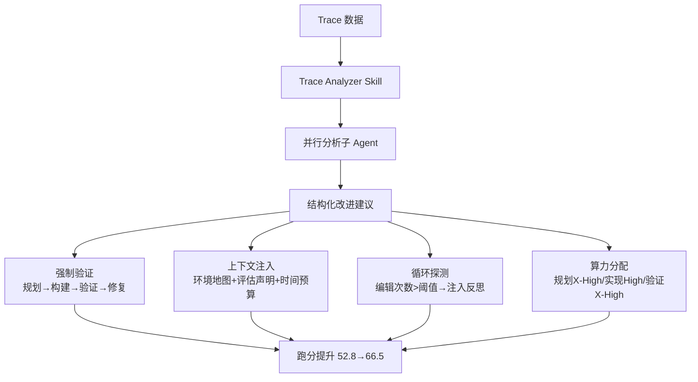

# LangChain实战与工具设计

> 本章是 **Hermes Engineering 系列**第 1 模块的第 5 章。

LangChain 通过调优 Harness 让 Deep Agents 跑分从 52.8 提升到 66.5，从榜单第 30 开外一路进到前五——不改变模型基座，只调 Harness。

---

## 诊断：Trace 即反馈

Agent 跑偏、报错、超时之后，留下的是成千上万行运行轨迹。LangChain 把"读日志找问题"做成了 Trace Analyzer Skill——从 LangSmith 把所有运行轨迹拉下来，按批次切分启动多个分析子 Agent 并行跑，所有结论汇总成改进建议。

关键约束：改动必须是通用的。对特定任务过度拟合的修改可能让其他题目的表现退步。Trace 是整个改进闭环的核心信号。

---

## 四条有效改进

> 💡 **图解：** LangChain 不换模型、不改架构，只调 Harness 就推了 13.7 分——Harness 是逼近模型能力上限的杠杆。

**强制验证**：Agent 最常见的失败模式是写完代码直接宣告完成没运行测试。两道防线——提示词层面的规划→构建→验证→修复四步框架，系统层面的完结前检查中间件强制拦截验证。

**上下文注入**：Agent 一启动系统自动扫描目录结构注入环境地图；明确声明"你的产出会被自动化测试评估"；接近截止时间时注入时间预算提醒。不要让 Agent 自己去发现和组装运行条件，Harness 要主动递给模型。

**循环探测**：Doom Loops——Agent 在同一文件上连续修改超过十次但思路没变。循环探测中间件记录编辑次数，超过阈值注入反思提示。这是针对当下模型缺陷的工程护栏，随着模型进化会变得多余。

**算力分配**：全程 X-High 推理反而更差。分段式分配——规划阶段 X-High、实现阶段 High、验证阶段 X-High。推理加薪策略把分数推到 66.5%。

---

## 工具设计哲学

Seeing Like an Agent——从 Agent 的角度观察，盯着调用频率、调用时机、输出质量。

**ask_user_question 的三次迭代**：第一次塞进 Exit Plan 工具（意图混淆失败），第二次改输出格式（格式不稳定失败），第三次专门建工具（成功——语义对应、Schema 约束、阻塞机制）。

三条经验：一个工具一种意图、Schema 约束而非格式约定、工具要让模型愿意用。

**工具迭代**：模型变强后旧工具变枷锁。todo_write 升级为 task——从单 Agent 清单变成多 Agent 共享协作面板。

**渐进式披露**：Guide 子代理按需读取文档只返回精确答案，避免主模型认知膨胀。

---

## ⚠️ 常见错误

| ❌ 错误做法 | ✅ 正确做法 | 为什么 |
|:---|:---|:---|
| Agent 写完代码读一遍自己写的，觉得逻辑自洽就宣告完成 | 强制要求运行测试，结果对照原始任务要求而非自己的代码 | 大模型在语言层面可自洽，实际运行完全可能出错——只有测试给出真实反馈信号 |
| 让 Agent 自行探索目录结构、安装环境信息 | 系统自动扫描目录注入环境地图，Agent 拿到的是整理好的运行地图 | Agent 自行发现上下文的过程本身是高错误率环节——路径理解错误、文件层级判断失误都会让任务跑偏 |
| 不告诉 Agent 评估标准是什么 | 在系统提示中明确声明"你的产出会被自动化测试评估" | 模型不知道什么叫可测试性，把评估标准提前显性化才能避免只在理想情况下通过 |
| Agent 在同一文件上反复修改超过十次思路不变 | 循环探测中间件记录编辑次数，超过阈值注入反思提示 | Doom Loops：模型卡在局部最优出不来，不断消耗算力却无法推进——需要强制跳出重新审视整体方案 |
| 全程用最高推理等级 | 分段式算力分配——规划 X-High、实现 High、验证 X-High | 全程 X-High 推理反而更差，合理分配算力才能在关键环节集中火力 |

---

## 本章要点

- LangChain 用 Harness 提升 13.7 分（52.8→66.5）
- 四条改进：强制验证、上下文注入、循环探测、算力分配
- Seeing Like an Agent：一个工具一种意图，Schema 约束
- 模型能力决定上限，Harness 决定逼近上限多少

---

**上一章**: [Harness即操作系统](./04-Harness即操作系统.md) | **下一章**: [争论与未来](./06-争论与未来.md)
