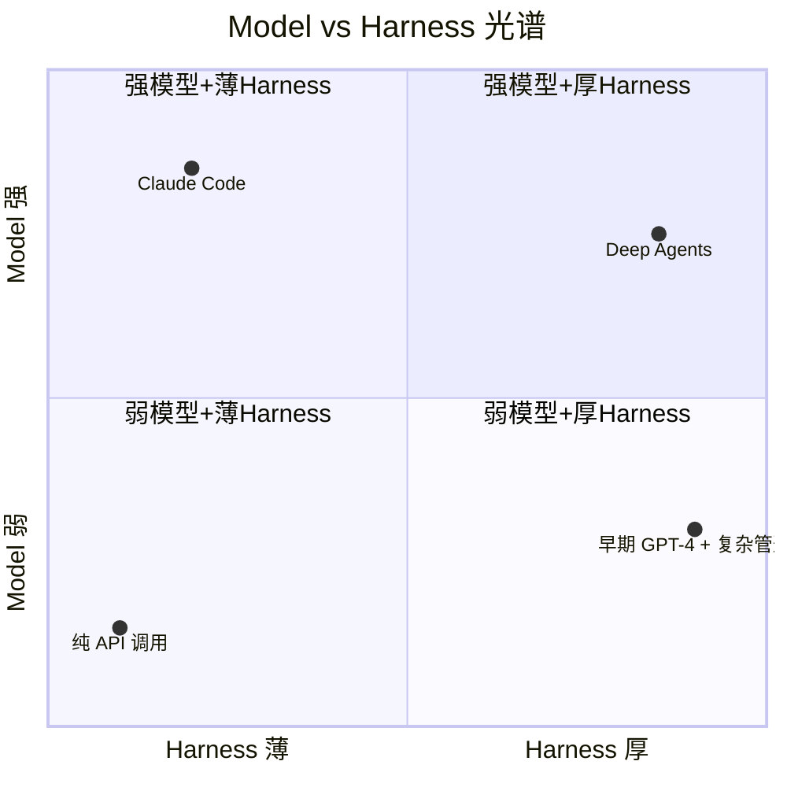

# 争论与未来

**Harness Engineering 核心原则 · 第六章**

> 模型是马，Harness 是挽具。模型决定你能跑多快，Harness 决定你能不能把力量真正拉到车上。

前五章建立了 Harness Engineering 的完整体系：范式转移、感官系统、成本结构、操作系统视角、实战调优方法。本章回到一个根本性的问题——**Harness 到底有没有长期价值？**

AI 工程圈对此有激烈的争论。两种观点，一个工具光谱，以及最终的调和。

---

## 一、Big Model vs Big Harness

一个 Agent 表现得好，到底是因为底层基座模型的能力极强，还是因为它外围包裹的工程 Harness 搭得极好？

这就像金融圈的经典争论：一个交易员一年给公司赚了 300 万美金，到底是因为他个人操盘能力极其厉害，还是因为他坐在了高盛的交易席位上？

### Big Model 派

以 Claude Code 为代表的大模型派认为：Harness 很可能只是一个过渡产物。Claude Code 的 Harness 被刻意设计成**最薄的一层 wrapper**，主创们的主要工作就是尽量不要干预模型，让模型自己发挥全部能力。

一些测试数据似乎支持这种观点。在 Scale AI 的 SWE Atlas 编程基准测试中，Claude 的 Opus 4.6 在 Claude Code 的 Harness 下表现好一点点，但 GPT-5.2 反而在通用的 SWE Agent Harness 下表现稍微好一点——分差非常小，基本都在误差范围之内。

高阶推理模型核心作者 Noam Brown 说得更直接：在推理模型出现之前，为了让 GPT-4 表现出类似推理的能力，工程师在外围写了大量复杂的重试逻辑和 Prompt。但现在底层的 reasoning model 自己就能完成很多推理步骤——**如果还强行塞进去一堆复杂脚手架，反而可能拖慢模型的表现。**

> Big Model 派的核心论断：**模型越强，需要的套壳代码就越薄。** 一旦基座模型跨代升级，你辛苦写的几万行编排代码可能很快就会变成历史遗产。

### Big Harness 派

LlamaIndex 创始人 Jerry Liu 的观点完全不同。他认为今天我们已经拥有很强的模型和很多优秀的工具，但企业真正难解决的问题**从来不是模型够不够聪明**，而是你有没有能力把业务里的上下文正确地组织并喂给模型。

举个最直观的例子：如果你想用 Claude Code 去自动处理公司客户流程，你必须先花大量时间把业务类型、流程规范、权限规则全部写成清晰的文档。一份标准 SOP 光是把规则描述清楚，往往就要反复修改几个小时——这件事模型很难自动帮你完成。

Jerry Liu 的结论：未来几乎所有 AI 产品本质上都在做两件事——**提供上下文**和**提供工作流**。

### 一个有趣的实验

一位开发者维护着一个开源编程 Agent。有一天下午他只改了一件事——没有换模型，也没有重新训练任何东西，只是**调整了 Harness 里编辑代码的工具格式**。结果 15 个主流大模型在编程基准测试里全部获得了明显提升。

他的结论非常形象：**"模型出问题很多时候不是因为他理解不了任务，而是因为他没有合适的语言来表达自己。你一直在怪飞行员，但其实是起落架坏了。"**

### 调和：Model × Harness

AI 圈一直有一种调和派说法叫 Compound AI——模型有价值，系统工程也有价值。但这次情况可能有所不同。随着 Cursor 估值突破 500 亿美元，随着越来越多企业 Agent 真正落地，"所有套壳工程最终都会消失"的判断正在被市场挑战。欧洲 AI Eng Europe 大会上已经正式开设了全球第一个 Harness Engineering 专赛道。

未来的竞争很可能不是 Model **VS** Harness，而是 **Model × Harness**。两者相乘，共同决定最终的表现。



> 💡 **图解：** 强模型不需要厚 Harness？但企业难题从来不是模型聪明度——未来的竞争是 Model × Harness 的乘法效应。

---

## 二、Framework vs Harness：工具光谱

很多人学 AI 开发的第一步是去学 LangChain，学完发现还有 Crew AI、AutoGen、LangGraph……就像打地鼠，层出不穷。但真正重要的问题根本不在这里——**没有人告诉你这些工具压根儿不是同一类东西。** 有的是 Framework，有的是 Harness。

### 光谱：从左到右

```
纯代码 ←——————→ Framework ←——————→ Harness
(最左)            (中间)            (最右)
```

**纯代码**——没有任何封装，直接调大模型 API，手动管理所有状态。灵活性最大，但所有麻烦都得自己扛。

**Framework**（LangChain、Crew AI）——给你封装好的组件、工具接口、任务调度、角色分工，帮你屏蔽底层通信的麻烦。但系统怎么设计还是你说了算，用什么模型你决定，怎么存记忆你决定。就像去宜家买家具——板材和螺丝钉都给了，拼成什么是你的事。

**Harness**（OpenAI Codex）——不给你零件，直接给你一套完整的系统。填一个 API 密钥就能跑，记忆怎么存、出错怎么重试，全都替你决定好了。就像买了一辆原厂精调好的跑车——给油就走，代价是不能动它的内部逻辑。Harness 是用控制权换上限速度。

### LangChain 自己的扩张

有意思的是，LangChain 自己也在向右扩张。他们把技术栈分成了三层：最底层 LangChain（Framework）、中间层 LangGraph（执行引擎）、最外层 Deep Agents（Harness）。一家公司把整条光谱都吃下来了。

### 选型指南

选工具之前，先问自己一个问题：**你是要长期掌控每一行代码，还是要赶进度拿现成套件直接交付？**

| 需求 | 选择 |
|:---|:---|
| 长期掌控、深度定制 | Framework |
| 快速交付、开箱即用 | Harness |
| 极简场景、完全自主 | 纯代码 |

### Anthropic 的忠告

Anthropic 在 *Building Effective Agents* 里明确说过：做 Agent 要慎用复杂框架。框架的黑盒一旦出错，调试会很痛苦，而且调用太方便容易让团队陷入过度工程化。很多时候**直接写几行代码连大模型 API，反而更快更稳**。

---

## 三、回到 Harness Engineering

争论归争论，有一个事实越来越清晰：当代码开始由 Agent 生成，仓库就不再只是人类协作空间——它变成了一个**机器认知系统**。

在这个系统里，Harness 不是锦上添花的框架，而是操作系统级别的基础设施。它管理上下文、约束行为、捕获崩溃数据、构建反馈闭环。

不管 Big Model 派和 Big Harness 派怎么争论，有一点双方都会同意：**你改进系统的能力上限，完全取决于你验证输出有多容易。** 而验证，恰恰是 Harness 的核心功能。

> **唯一可靠的方法仍然是不断实验，观察结果，持续调整——Seeing Like an Agent。**

---

## 本章要点

1. **Big Model 派**——Harness 是过渡产物，模型越强套壳越薄，一旦基座升级编排代码变遗产
2. **Big Harness 派**——企业难题不在模型聪明度，在上下文组织；未来 AI 产品本质做两件事：提供上下文 + 提供工作流
3. **调和：Model × Harness**——两者相乘共同决定最终表现，市场正在验证 Harness 的长期价值
4. **工具光谱**——纯代码（灵活）→ Framework（宜家家具）→ Harness（原厂跑车），搞清区别才能正确选型
5. **核心共识**——不管什么派，都同意"验证输出有多容易"决定了改进系统的上限

---

[← 上一章：验证、工具与优化](05-验证、工具与优化.md) | [返回目录 →](index.md)

---

[← 返回首页](/) | [下一模块: 上下文工程 →](/02-上下文工程/)
