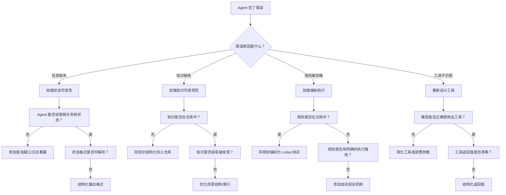

# Harness 工程速查

> 快速查阅决策框架和选择标准。按问题查找解决方案。

---

## 一、Harness 工程师的三件事速查

Harness 工程师的核心职责不是写代码，而是**设计让 Agent 能高效运行的环境**。

| 支柱 | 核心问题 | 关键指标 |
|:---|:---|:---|
| **状态可读性** | Agent 能"看见"系统状态吗？ | Agent 是否能自主工作 6 小时以上 |
| **知识可发现** | Agent 能"找到"需要的知识吗？ | 新 Agent 接手后能否在 10 分钟内理解项目 |
| **强制执行** | 规则能被"自动执行"吗？ | 规则是否写进了代码而非停留在文档 |

---

## 二、状态可读性：可见性层次速查

| 层次 | 含义 | 实现方式 | 判断标准 |
|:---|:---|:---|:---|
| **可见** | Agent 能看见 UI 和系统状态 | Chrome DevTools 协议、DOM 快照 | Agent 能读取到当前页面/系统状态 |
| **可解析** | 状态数据能被 Agent 理解 | LogQL、PromQL 查询接口 | Agent 能从原始数据中提取有意义的信息 |
| **可验证** | Agent 能自主判断对错 | 闭环反馈：写代码 → 验证 → 修复 | Agent 能通过测试确认自己的操作是否正确 |

**投资回报**：当 Agent 有了完整的感知能力，它可以自主工作 6 小时以上（通常是在人类睡觉的时候），完全不需要人类介入。

---

## 三、知识可发现：知识组织速查

### 核心原则

> **不在仓库里的知识，对 Agent 来说就是不存在。**

### 知识目录结构参考

```
dox/
├── design/          # 设计文档，带验证状态
├── beliefs/         # 核心信念
├── plans/           # 执行计划（进行中/已完成）
├── tech-debt/       # 技术债务追踪
├── specs/           # 产品规格
└── health/          # 质量评分
```

### 关键实践

| 实践 | 错误做法 | 正确做法 |
|:---|:---|:---|
| 知识组织 | 把所有规则塞进一个巨大的 `agents.md` | 用 100 行的 `agents.md` 做**目录**，指向具体文档 |
| 知识更新 | 写一次就不管了 | 建立持续更新机制，文档带验证状态 |
| 知识可搜索 | 知识散落在 Slack/邮件里 | 把知识结构化地放在 Agent 能访问的文件系统中 |

---

## 四、强制执行：把建议变成法律

| 维度 | 文档规则（建议） | 代码规则（法律） |
|:---|:---|:---|
| **执行方式** | Agent 可能忽略 | Linter 强制报错 |
| **覆盖面** | 单次任务 | 所有 Agent 的所有任务 |
| **更新成本** | 低 | 高（但收益更大） |
| **杠杆效应** | 无 | **瞬间在所有任务中生效** |

### 三层执行策略

| 策略 | 做什么 | 例子 |
|:---|:---|:---|
| **刚性分层** | 代码只能向前依赖，绝不能回头 | 架构层约束 |
| **Providers 模式** | 所有公共能力必须通过统一入口进入 | API 网关 |
| **Linter 即 Prompt** | 不仅报错，还自带修复指令 | ESLint + 自动修复 |

---

## 五、工具设计速查

### Tool 光谱：Framework vs Harness vs 纯代码

```
纯代码 ←————————————————→ Framework ←————————————————→ Harness
(最左)                      (中间)                      (最右)
```

| 类型 | 特征 | 适合谁 | 比喻 |
|:---|:---|:---|:---|
| **纯代码** | 灵活性最大，所有麻烦自己扛 | 底层系统开发者 | 自己造车 |
| **Framework** | 封装组件，系统设计自己决定 | 喜欢搭系统的工程师 | 宜家买家具 |
| **Harness** | 完整系统，给油就走 | 追求速度的团队 | 原厂精调跑车 |

### 工具设计核心原则

> **工具的有效性取决于模型能不能稳定正确地使用它。**

### Seeing Like an Agent：工具评估信号

| 信号 | 健康状态 | 问题信号 |
|:---|:---|:---|
| **调用频率** | 适中，任务需要时自然调用 | 很低（模型不知道什么时候用）或过度（模型过度依赖） |
| **调用时机** | 正确的场景调用 | 总是在错误的时机调用 |
| **输出质量** | 调用后输出质量提升 | 调用后质量反而下降 |

### 工具设计 Checklist

- [ ] 工具意图是否单一？（一个工具不要承载两种互斥意图）
- [ ] 工具名称是否清晰？（模型能从名称推断用途）
- [ ] 工具参数是否有明确约束？（类型、范围、必填/选填）
- [ ] 工具返回值是否结构化？（方便模型解析）
- [ ] 错误信息是否友好？（模型能理解为什么失败）
- [ ] 是否避免了格式约定？（不要把关键交互建立在 Prompt 格式上）

---

## 六、成本与效率速查

### 成本结构反转

| 维度 | 传统世界 | Agent 世界 |
|:---|:---|:---|
| **修正成本** | 很贵 | 很便宜（自动化修复几秒钟） |
| **等待成本** | 很便宜 | **最贵**（1000 件产品全在等） |

### 实践转变

| 做法 | 理由 |
|:---|:---|
| 最小化阻塞门控 | 等待是 Agent 世界最贵的成本 |
| PR 保持短生命周期 | 高频小步快跑 |
| 绝不让 Flaky Test 无限期阻塞 | 一个 flaky test 会拖垮整个流水线 |

---

## 七、什么时候该做什么？决策流程图



---

## 八、Build to Delete：为废弃而构建

| 原则 | 说明 |
|:---|:---|
| **松散耦合** | Harness 架构必须像乐高积木一样松散 |
| **随时可弃** | 允许随时撕掉昨天才写好的"聪明控制逻辑" |
| **新模型击穿** | 过度设计的控制流会被新模型直接击穿 |

### Harness 即 Dataset

Harness 的真正价值：**捕获模型漂移（Model Drift）的数据**。

- 当模型在超长任务中（第 100 步）开始"缺氧"、忘记规则时
- Harness 像**飞机黑匣子**一样记录断点数据
- 这些崩溃轨迹是最稀缺的数据金矿
- **谁的 Harness 拦截到更多崩溃轨迹，谁就能训练出更好的模型**
