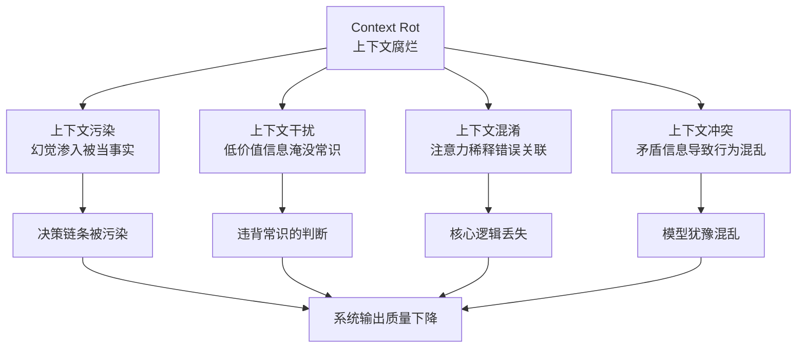
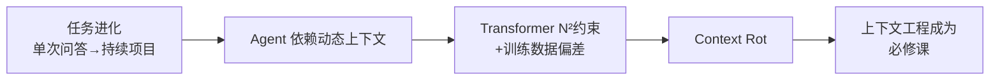

# 上下文的诅咒

> 本章是 **Hermes Engineering 系列**第 2 模块的第 1 章。

AI 的任务从单次问答进化成持续项目，但上下文越多，模型越容易失焦。这就是上下文的诅咒——它不会报错，只会慢慢变糊。

---

## 从提示工程到上下文工程

我们正在经历一次重要的范式转移：从提示工程（Prompt Engineering）到上下文工程（Context Engineering）。

提示工程是早期阶段——写好一条完美的提示，核心目标是在一次调用中尽量得到理想的结果。它是战术层面的优化，关注的是那一瞬间的语言表达。但它的局限在于作用范围是点状的，只能让模型聪明一瞬，无法让模型持续聪明。

随着 Agent 的出现，AI 能够自主规划、调用工具、执行多轮交互任务。性质从一次性问答变成了持续性项目。AI 需要的不再只是一条提示，而是它的完整信息视野——系统指令、可用工具、历史对话记录、从外部数据库检索到的知识。

上下文工程不再只是写提示，而是一门架构学科。核心任务是动态、持续地为 Agent 策划并管理它完整的上下文状态。我们正在从语言大师变成系统架构师。

---

## Context Rot：上下文腐烂

既然模型越来越强，上下文窗口越来越大，为什么不能直接把所有信息都塞进去？

答案在于所有大模型都无法回避的根本性约束：**上下文腐烂（Context Rot）**——随着上下文中信息量的增加，模型精确回忆以及进行长距离推理的能力会呈现出平滑下降。

简单说：上下文越长、越嘈杂，模型越容易失焦。

### 两个底层原因

**架构的内在限制**：所有主流大模型都基于 Transformer 架构，每个 Token 都能关注到上下文中的所有其他 Token，产生 N² 的成对关系。上下文长度每增加一倍，模型需要处理的关系数就几乎增加四倍。就像一个人注意力有限——信息越多，分配到每个细节的注意力就越分散。

**训练数据的分布偏差**：模型在预训练阶段读过无数文本，但大多数是中短序列。它非常擅长处理短序列文本，但对长文本的经验极度有限。

上下文腐烂的危险特征在于它是结构性的——不是立刻崩溃，而是性能渐进退化。模型不会告诉你"我不行了"，但会开始答非所问、遗漏重点、逻辑漂移。这是最危险的地方——因为它不会报错，只会慢慢变糊。

---

## 四种失效模式

上下文腐烂是底层状态，在具体任务中它会表现为四种可被诊断的失败模式：

**上下文污染（Contamination）**：一次幻觉或错误信息渗入上下文中，还被后续推理当做事实依据。一旦有毒数据进入 Agent 的认知循环，后续基于此的所有决策链条都可能被污染。

**上下文干扰（Interference）**：上下文信息过多，压倒了模型的预训练知识。大量低价值即时信息淹没模型固有的知识信号，让它在噪声中迷失做出违背常识的判断。

**上下文混淆（Confusion）**：多余不相关的语境信息影响了最终回应。模型注意力被稀释，无法清晰追踪核心逻辑，把两个不相关概念错误关联。

**上下文冲突（Conflict）**：上下文中不同部分包含相互矛盾的信息。系统提示要求"保持简洁"，但历史对话中却有很多冗长例子——模型陷入决策困境，行为混乱或犹豫不决。

### 因果关系

上下文腐烂是根本病因，四种失效模式是具体并发症。一个精神饱满的司机，就算遇到烂路也能成功应对；但一个疲劳的司机，处理烂路的能力大大下降，出车祸概率大大增加。

上下文腐烂导致的注意力稀释和信噪比降低，会直接引发干扰和混淆。在腐烂状态下模型推理能力下降，更容易产生幻觉从而主动制造污染源头。腐烂状态还屏蔽问题发现——模型可能发现不了上下文中早已存在的语境冲突，因为相隔较远的两条矛盾信息已经超出了有效的注意力范围。

> 💡 **图解：** Context Rot 是病因，四种失效模式是并发症——模型不会报错，只会慢慢变糊。

---

## 逻辑链

> 💡 **图解：** 任务复杂度的进化撞上了 Transformer 的物理墙——不主动设计上下文，腐烂就会吞噬 Agent 的判断力。

任务进化（从单次问答到持续项目）→ Agent 运行依赖动态上下文环境 → Transformer 结构决定了上下文越多性能越可能腐烂 → **上下文工程成为构建高可靠 Agent 的必修课**。

真正的解决方案不是被动等待一个无限大的内存，而是成为一名主动的上下文架构师——用工程方法来主动设计上下文，让模型始终保持清晰与聚焦。

---

## ⚠️ 常见错误

| ❌ 错误做法 | ✅ 正确做法 | 为什么 |
|:---|:---|:---|
| 把所有信息都塞进上下文，"窗口够大就行" | 主动设计上下文——只注入下一步决策需要的信息 | Context Rot 是结构性的：Transformer N² 约束 + 训练数据偏差，上下文越长性能越差，不会报错只会慢慢变糊 |
| 一次幻觉渗入上下文后继续当事实使用 | 保留错误信息但标记隔离，让 Agent 从失败中学习 | 上下文污染一旦进入认知循环，后续所有决策链条都可能被污染——有毒数据会产生连锁反应 |
| 上下文中塞满工具返回的原始日志 | 子 Agent 过滤噪声，只返回 50-200 Token 关键信息 | 上下文干扰：大量低价值信息淹没模型预训练知识，让 Agent 在噪声中做出违背常识的判断 |
| 系统提示要求简洁，但历史对话中大量冗长例子 | 保持指令风格一致，矛盾信息必须消除 | 上下文冲突让模型陷入决策困境——不同部分的矛盾指令导致行为混乱或犹豫不决 |
| 把无关的上下文也保留"以防万一" | 只保留与当前任务相关的语境信息 | 上下文混淆：注意力被稀释，模型把两个不相关概念错误关联，核心逻辑丢失 |

---

## 本章要点

- 范式转移：从提示工程到上下文工程，从语言大师到系统架构师
- Context Rot：Transformer 架构限制 + 训练数据偏差，上下文越长性能越差
- 四种失效模式：污染、干扰、混淆、冲突，上下文腐烂是病因它们是并发症
- 解决之道不是等更大的窗口，而是主动设计上下文

---

**下一章**: [三大支柱](./02-三大支柱.md)

---

[← 返回首页](/) | [← 上一模块: Harness工程核心原则](/01-Harness工程核心原则/) | [下一模块: Agent基础 →](/03-Agent基础/)
