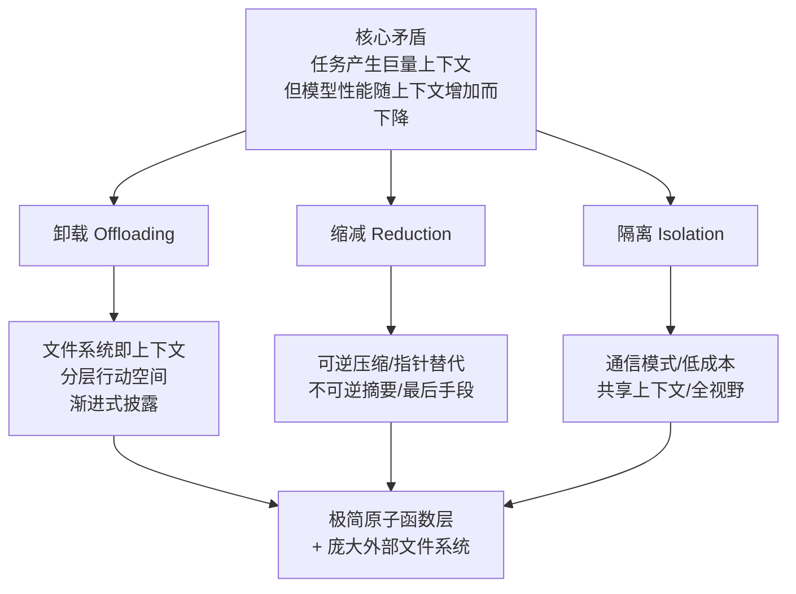
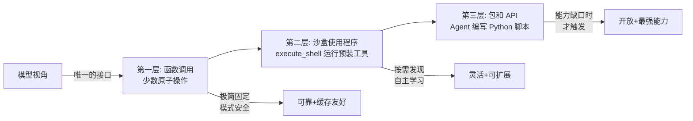

# 三大支柱

> 本章是 **Hermes Engineering 系列**第 2 模块的第 2 章。

业界顶尖团队正在趋同于一套上下文工程架构：极简的原子函数调用层 + 庞大的可供探索的外部文件系统与脚本库。这是整个行业为平衡无限的能力拓展与有限的上下文窗口，共同演进而来的最优解。

---

## 核心矛盾

Agent 的本质是在循环中调用工具的大语言模型。这个简单的循环在长任务时带来巨大挑战——上下文爆炸。Menlo 提到一个典型任务平均需要 50 次工具调用，Anthropic 佐证生产级 Agent 对话轮次可能长达数百轮。

这意味着模型在每一步决策时都要背负之前所有轮次的工具结果，不仅导致成本和延迟急剧膨胀，更致命地引发上下文腐烂。

核心矛盾：Agent 任务天然会产生巨量上下文，但模型在巨量上下文下性能会下降。

上下文工程就是这门精巧的艺术和科学——用恰到好处、下一步所需的正确信息填充上下文窗口。它被提炼为三个核心支柱：

> 💡 **图解：** 三大支柱的共同目标是让模型在每一步只看它需要的东西——多一点是噪音，少一点是盲区。

| 支柱 | 核心思想 |
|---|---|
| **卸载（Offloading）** | 将上下文从 LLM 窗口转移到外部存储，以便后续选择性检索 |
| **缩减（Reduction）** | 减小每步传递给模型的上下文大小 |
| **隔离（Isolation）** | 为不同独立任务使用单独的上下文窗口 |

---

## 支柱一：卸载

卸载已从卸载数据进化到卸载工具。

**卸载数据**：赋予 Agent 文件系统，使其能在长任务中保存和回忆信息。Anthropic 的多 Agent 研究中，Agent 会将计划写入文件，执行完子任务后再读回计划确保不偏离目标。Claude Code 的 `.claude.md` 文件允许 Agent 在多次调用间持久化存储用户偏好。

**卸载工具——分层行动空间**：若有 100 个工具都塞进 Prompt，会导致模型混淆和 Prompt 膨胀。Menlo 的解决方案是保持函数调用层极简，只保留少数原子工具（bash 和文件操作），将绝大多数动作卸载为文件系统中的脚本。

顶级 Agent 的原生工具集都极少：Claude Code 约 12 个，Menlo 不到 20 个，Deep Agents 仅 11 个。

**最终演进——渐进式披露**：连脚本也不必一开始就全部告知模型。Agent 启动时仅加载每个 Skill 的标题，决定使用某技能时才完整读取。Agent 通过 bash 工具在庞大脚本目录中自主寻找和阅读说明书。

### 三层行动空间

Menlo 设计了由内到外的三个层次：

**第一层：函数调用（原子操作）**——与模型直接交互的唯一一层，极少数固定不变的原子函数。用灵活性换取可靠性与高性能，模式安全、缓存友好。

**第二层：沙盒使用程序（命令行）**——Agent 通过 `execute_shell` 运行预装工具。模型被教会如何去发现和学习：引导提示告知工具目录、主动执行 `ls` 查看可用工具、执行 `--help` 学习用法。适合处理可以稍等一下的复杂离线任务。

**第三层：包和 API（编写代码）**——最开放、能力最强。Agent 编写并执行 Python 脚本调用任意 API。取决于能力缺口——一二层现成工具无法完成任务时才做出"我需要编写代码"的决策。

从模型视角看，它完全不知道有三层的存在，最终都只需要调用第一层的几个原子函数。接口简洁、缓存友好、正交设计。

> 💡 **图解：** 三层行动空间对模型完全透明——它只看到几个原子函数，但通过它们能撬动整个工具世界。

---

## 支柱二：缩减

**压缩（Compression）**——可逆操作。当工具结果变得陈旧时，将完整内容卸载到文件，再在消息历史中用指向该文件的指针替换。Agent 未来仍可 100% 恢复原始信息。

压缩 ≠ 摘要。压缩是可逆无损的外部化操作，用轻量级指针替代。摘要是有损不可逆操作，只有当压缩收益非常小时才作为最后手段启用。

执行策略：先反复压缩，压缩收益变小后再用摘要。摘要前先卸载完整上下文到日志文件（买保险）。只压缩旧 50%，保留最新几个完整工具调用作为 Few-shot 示例校准模型行为。摘要必须基于完整版本，不能基于已压缩数据。

定义浅腐烂阈值（128K-200K Token）作为触发器，达到时优先压缩，接近极限时才启用摘要。

---

## 支柱三：隔离

**通过通信**：主 Agent 给子 Agent 传递简短指令，子 Agent 在隔离干净的上下文中完成任务，仅返回最终结果。成本低、延迟低、KV 缓存友好。适合可清晰切分的简单任务。

**通过共享上下文**：子 Agent 被允许访问主 Agent 的完整上下文历史，但在新的 System Prompt 下行动。收益是完整历史视野能处理复杂任务，代价是 KV 缓存完全失效，必须支付全价预填充成本。

---

## 业界共识

所有顶级生产级 Agent 都在趋同于一套共同的、经实战检验的架构：一个极简的原子函数调用层 + 一个庞大的可供探索的外部文件系统与脚本库。上下文工程从零散技巧提升为完整严谨的系统设计哲学。

---

## 本章要点

- 卸载：文件系统即上下文、分层行动空间、渐进式披露
- 缩减：可逆压缩（指针替代）vs 不可逆摘要（最后手段）
- 隔离：通信模式（低成本）vs 共享上下文模式（高代价全视野）
- 最终公式：极简原子函数层 + 庞大外部文件系统 = 生产级 Agent 架构

---

**上一章**: [上下文的诅咒](./01-上下文的诅咒.md) | **下一章**: [动态上下文与实战](./03-动态上下文与实战.md)
