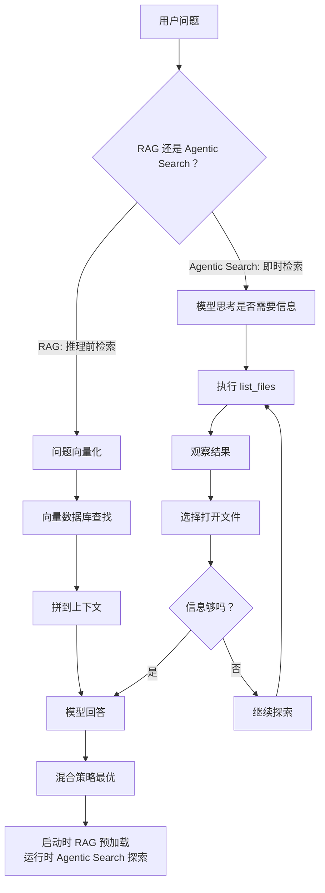

# 动态上下文与实战

> 本章是 **Hermes Engineering 系列**第 2 模块的第 3 章。

从静态塞入到动态发现的转变——随着模型在充当 Agent 方面的能力不断提升，预先提供更少的细节，反而能让 Agent 更容易自主地按需提取相关上下文。

---

## 静态上下文：AI 的出厂设置

静态上下文是智能体启动之前准备好的——它是谁、能做什么、该怎么做。三大核心组件构成 AI 的出厂配置：

**系统提示**是 AI 的灵魂，告诉模型身份、职责和行为方式。关键在于"合适的粒度"——不能太细（像伪代码一样 if-else 硬编码，模型变得死板），也不能太空（"请像专家一样思考"，输出飘忽不定）。结构化分层 + 迭代优化，先用最小版本测试，再针对性补充。

**工具**是 AI 的手和眼，让 Agent 和外部世界交互。但工具定义本身也属于上下文——每个工具的名字、描述、输入输出说明都会占用模型的注意力预算。核心原则是最小可行工具集：能解决任务所需的最小那一组工具。如果人类工程师自己都不确定该用哪个工具，就别指望 AI 能选对。

**示例**告诉模型你希望它怎么思考、怎么回答。不是训练记答案，而是教思维方式。示例太多会让上下文膨胀。好的示例不是覆盖所有情况，而是展示一种思考模式——价值不在数量而在代表性。

---

## 动态发现：Cursor 的五大实践

Cursor 团队的判断：在当下模型能力、成本和可靠性都仍受约束的阶段，最稳妥的路线是选择更简单、更可控、更可演化的原语作为外部大脑的底座。

### 实践一：工具响应转文件

Agent 运行数据库迁移脚本，终端吐出 5000 行日志。传统做法截断到 2000 字符，关键报错可能藏在被截断的部分。Cursor 的做法：把输出完整写入文件，不塞进上下文，只告诉 Agent "结果在这里"。配合 Tail 工具从末尾开始探测——末尾信息够用就到此为止，不够再深入展开。先探测再展开，直到信息刚好够用。

### 实践二：摘要时引用对话历史

对话太长必须摘要时，原始完整对话被转存成文本文件。Agent 脑子里只有简短摘要，但手里握着历史文件的路径。发现摘要信息不够时，暂停去搜索历史文件，把具体细节精准捞回来——像开卷考试，脑子里只记重点脉络，允许随时翻书查细节。

### 实践三：Skills 按需加载

所有 Skill 的全文塞进 System Prompt 会造成严重膨胀。Cursor 做法：静态上下文只保留名称+描述，全文按需发现后加载。能用 Grep 关键词搜索就用关键词，关键词不够再用语义匹配。

### 实践四：MCP 工具按需加载

传统做法把所有工具说明书塞进 Prompt，100 个工具可能占 5 万 Token。Cursor 做法：工具说明书卸载到文件系统，初始 Prompt 只保留极简菜单。Agent 看到菜单意识到需要某个能力时，主动读取说明书文件。Token 消耗减少 46.9%。

### 实践五：终端会话视为文件

集成终端所有输出无感写入本地日志文件。用户说"修好它"时，Agent 不需要任何上下文，自己读取终端日志、grep 定位 error、分析堆栈、给出修复建议。整个过程不需要一次复制粘贴。

---

## RAG vs Agentic Search

> 💡 **图解：** RAG 是"考试前发的复习提纲"，Agentic Search 是"开卷考试现场翻书"——两者结合才是最优解。

**推理前检索（RAG）**：问题向量化 → 向量数据库查找相似片段 → 拼到上下文 → 交给模型。稳定、速度快、成本低，但信息可能过时、检索不够智能、无法探索。模型只能被动等待信息投喂。

**即时检索（Agentic Search）**：模型思考是否调用工具 → 执行 list_files → 观察返回 → 选择打开 → 读取前几行 → 决定下一步。信息永远最新、只取当下需要的、具备探索能力。

**混合策略**是最优解。Claude Code 启动时预加载 `CLAUDE.md`（RAG），运行时配备 `glob`、`read` 工具（Agentic Search）。

智能探索的两个关键机制：**元数据**（Agent 不仅看内容还能理解信息结构——文件名、目录、时间戳都是方向信号）和**渐进式披露**（不要一次塞所有信息，让模型逐步发现）。

---

## 行业趋势的收敛

Cursor、Minecraft、Devin、Anthropic 的 Skill 机制——不同团队在不同产品形态下，独立收敛到一套相似的工程思路：上下文是稀缺内存、文件系统是几乎无限的外部存储、卸载是缓解压力的基本手段、渐进式披露是默认策略。

---

## 本章要点

- 静态上下文三组件：系统提示（灵魂）、工具（手脚）、示例（范本）
- Cursor 五大实践：响应转文件、摘要引用历史、Skills 按需加载、MCP 按需加载、终端即文件
- RAG vs Agentic Search：被动投喂 vs 主动探索，混合策略最优
- 行业收敛：文件系统作为外部大脑是共同选择

---

**上一章**: [三大支柱](./02-三大支柱.md) | **下一章**: [Menlo的教训](./04-Menlo的教训.md)
