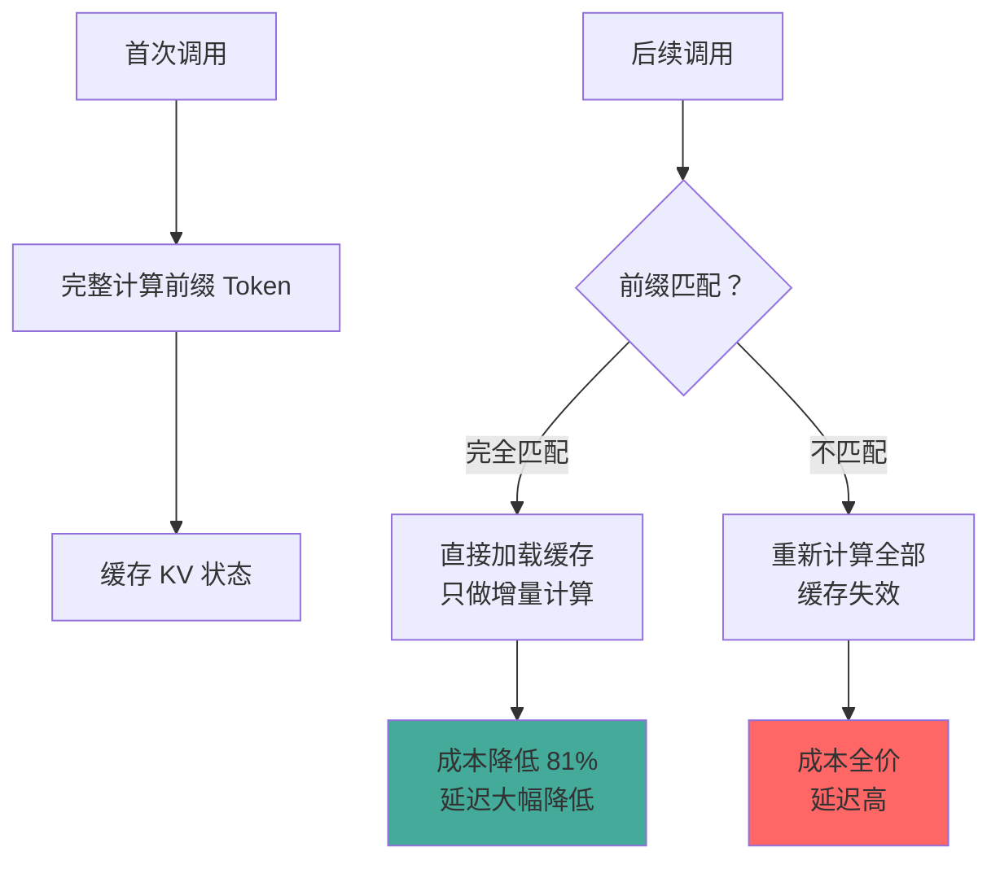

# Menlo的教训

> 本章是 **Hermes Engineering 系列**第 2 模块的第 4 章。

一个真实项目的上下文工程之路——从微调 vs 上下文工程的关键决策，到 KV 缓存优化、文件系统跃迁的实战经验。

---

## 关键决策：微调 vs 上下文工程

Menlo AI 面临所有 AI 产品团队启动时都会遇到的问题：花数周微调专属模型，还是基于前沿大模型敏捷地开展上下文工程？

把一位通才医生培养成专科专家有两条路径。**微调**是专科深造之路——用海量专业病例让模型专项学习，直接改变内部权重。模型把新技能内化为本能，但反馈周期以周为单位，一旦基础模型更新换代适应性很差。**上下文工程**是临床指南之路——不改变通才本身，每次工作时提供一套完美的临床指南。模型并非真正成为专家，但每次任务中都能表现得像专家。迭代快、门槛低、适应性强。

Menlo 选择上下文工程路线。对于绝大多数希望转型 AI 的团队，默认从上下文工程开始——迭代更快、门槛更低，能迅速构建产品原型并验证。

---

## KV 缓存命中率：北极星指标

在多轮循环中 Agent 需要反复提交冗长且大部分重复的上下文，直接导致高延迟和高成本。Menlo 认为北极星指标应该是 KV 缓存命中率——这是生产级 Agent 最重要的单一指标。

LLM 处理文本时会把对前面每个 Token 的理解缓存下来。推理引擎利用前缀匹配技术：第一次调用完整计算前缀并缓存，第二次调用检测到开头一致直接加载缓存，只对新增内容做增量计算。

高缓存命中率意味着更快更便宜。输入 10000 Token，9000 命中缓存时，成本从 3 美分降到 0.57 美分——节省 81%。

> 💡 **图解：** KV 缓存命中率是生产级 Agent 的北极星指标——前缀一个字符变了，缓存就全废了。

### 五大黄金法则

1. **开启与选型**：选用支持高效 KV 缓存的推理框架（如 vLLM）
2. **保证会话保持**：同一用户会话路由到同一工作进程
3. **保持前缀稳定**：Prompt 前缀中任何一个字符变更都会导致缓存失效
4. **上下文只追加**：最缓存友好的操作是在末尾追加，任何中间修改都是缓存杀手
5. **明确标记缓存断点**：手动插入特殊标记告诉引擎前缀范围

### F1 赛车 vs 全地形越野车

通过固定 Prompt 前缀最大化 KV 缓存命中率（F1 赛车模式）追求极致低延迟低成本但扩展性差。动态选择上下文（全地形越野车模式）扩展性强但牺牲缓存复用。需要根据业务需求做合理架构选择。

---

## 文件系统即上下文

现代大模型上下文窗口越来越大，但在真实 Agent 场景中常常不够用甚至成为负担——物理限制、性能衰减（Context Rot）、成本高昂。

上下文压缩的陷阱：任何不可逆的压缩都带来语义丢失风险。Agent 必须根据历史状态做预测时，你无法确定哪一步的 Observation 在十步之后仍然关键。

Menlo 的创新：**不再依赖模型上下文来存储所有历史，而是将文件系统本身视为 Agent 的外部长期记忆。** 标志着从内存上下文到外部语义存储的架构跃迁。

三大好处：文件系统存储空间几乎无穷，天然支持网页、PDF、代码库；存入的数据可长期保存并以结构化方式存储中间产物；大模型不再被动读上下文，而是被赋予工具主动操作文件系统——"上下文"的概念从 Token 窗口扩展成了 Agent 可以交互、可读可写的持久化世界。

### 闪电大脑 + 无限硬盘

Transformer 模型强大但计算成本极高，新兴 SSM 架构（如 Mamba）速度极快但长距离记忆能力是短板。这恰好形成完美组合：SSM 作为闪电大脑高效处理当前任务，文件系统作为无限硬盘保真存储长期记忆。这是神经图灵机这个伟大梦想在现代技术下的真正实现。

---

## 本章要点

- 默认从上下文工程开始，迭代快门槛低适应性强
- KV 缓存命中率是北极星指标，前缀稳定+只追加+会话保持
- 文件系统即上下文：从内存到外部语义存储的架构跃迁
- 闪电大脑+无限硬盘：SSM + 文件系统的黄金组合

---

**上一章**: [动态上下文与实战](./03-动态上下文与实战.md) | **下一章**: [长运行Agent](./05-长运行Agent.md)
