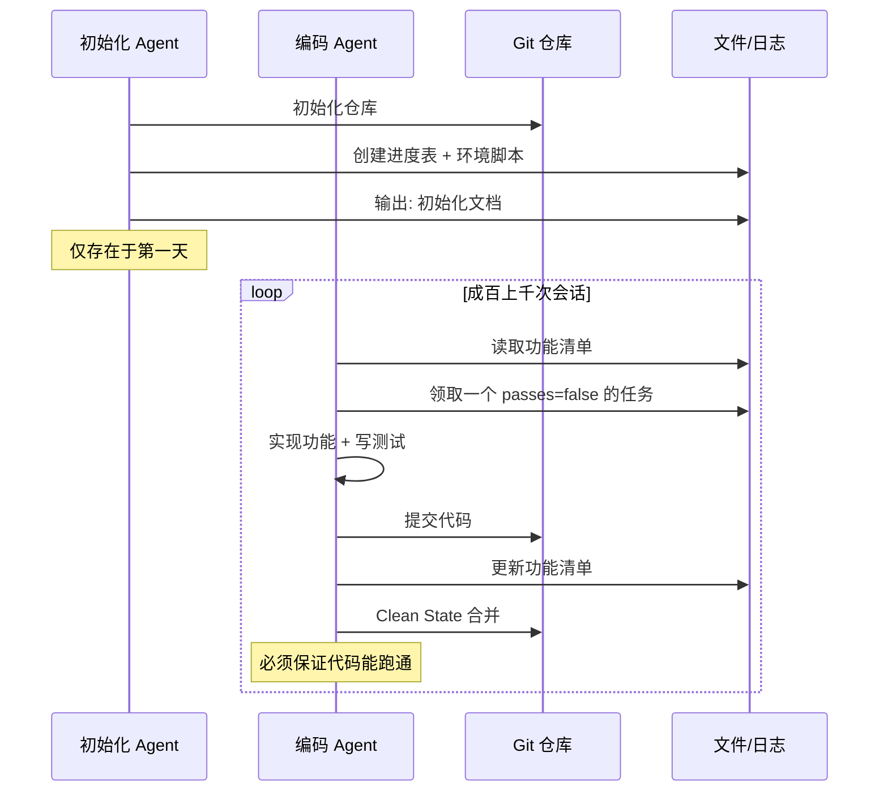

# 长运行Agent

> 本章是 **Hermes Engineering 系列**第 2 模块的第 5 章。

当 Agent 要跑几百轮怎么办？压缩、串行接力、环境管理——Anthropic 的方案教我们在坚持单 Agent 决策流的前提下突破上下文窗口的物理上限。

---

## 压缩策略

面对上下文溢出，压缩是第一道防线。但压缩是有损的——一段 10000 字的对话压缩成 500 字摘要，不可能保留所有细节。

Anthropic 在 Claude Code 中的做法：自动把历史对话传给模型，让它总结核心要点——关键决策、待解决问题、重要细节，清理掉冗余的工具调用结果，以最小信息损耗继续工作。先追求高召回尽量多保留信息，再逐步提高精度剔除重复无关的部分。

**结构化笔记**则是一种更持久的做法。Agent 在工作过程中定期写笔记，把关键内容持久化到上下文之外的记忆系统。Claude Code 维护 `notes.md` 文件记录任务目标、未完成事项、依赖关系。即使上下文窗口被清空，AI 也能从笔记中恢复思路。

---

## 压缩与摘要的精细管理

Menlo 将缩减操作严格划分为两种：**压缩**是可逆无损的外部化操作，用轻量级指针替代原始信息（文件路径替代文件内容、URL 替代网页 HTML）。**摘要**是有损不可逆操作，仅在压缩收益非常小时作为最后手段。

"先卸载再摘要"——执行摘要前将完整上下文写入日志文件，为不可逆操作买保险。

执行策略：定义浅腐烂阈值（128K-200K）作为触发器，达到时优先压缩，压缩收益变小后再用摘要。只压缩旧 50%，保留最新完整工具调用作为 Few-shot 示例——模型是强大的模仿者，如果看到的都是残缺格式会认为那是正确的。摘要必须基于完整版本，保留最后几个完整行动-观察对作为任务连续性的锚点。

---

## 串行接力：Anthropic 的方案

单 Agent 决策统一但上下文窗口有限。当期待从"写一个函数"提高到"开发复杂 Web 应用"时，成千上万行代码会撑爆窗口。多 Agent 并行容易决策冲突，单 Agent 串行能力不够用。

Anthropic 的解决方案：一个 Agent，但分成两个阶段运行。

**初始化 Agent**：只存在于项目第一天，不写业务代码，只搭架子——配服务器环境、建进度打卡表、初始化 Git 仓库，确保后续工作有据可查，把隐性知识变成显性文档。

**编码 Agent**：真正干活的角色，在后续成百上千次会话中执行，但被施加严格约束——增量循环：每次醒来领一个任务，写完测试然后提交。

贯穿全文的核心概念是 **Clean State（干净状态）**：不管你这一班干了多少活，下班交接前必须保证代码能跑通、文档已更新，达到主分支合并标准，绝不能把编译报错的代码留给下一班。

> 💡 **图解：** Clean State 是跨会话接力的生命线——任何一班 Agent 都不能把烂摊子留给下一班。

### 外部记忆系统

既然内部记忆不可靠，就把记忆放到模型脑子之外。靠文件和日志而不是靠上下文来了解：

| 问题 | 解决方案 |
|---|---|
| 失忆 | 持久化日志和 Git 历史 |
| 信息不足导致猜测 | 结构化功能清单（JSON 格式） |
| 贪多嚼不烂 | 一次只做一个功能，清单驱动 |
| 盲目自信 | 默认失败原则，必须完成测试才允许改为 true |
| 烂尾文件污染 | Clean State + Git 回滚 |

---

## 启动序列

每次会话对 Agent 来说都是一次从零开始，需要迅速恢复项目理解。标准步骤：定位（pwd 确认目录）→ 回忆（读进度记录和 Git 历史）→ 领任务（读功能清单找未通过条目）→ 复原（init.sh 启动环境）→ 验证（确认基础功能正常）→ 开始新开发。

功能清单采用 JSON 而非 Markdown——强结构性防止 Agent 编辑时造成结构破坏。Prompt 约束 Agent 只能修改 `passes` 字段，不得更改测试描述。

端到端测试用 Puppeteer：Agent 启动开发环境、执行用户交互行为、通过截图验证前端界面。不能只看后端数据库多了记录就宣布成功，需要视觉确认侧边栏变化、输入框清空等。

---

## 本章要点

- 压缩三技术：摘要压缩、结构化笔记、Sub-agent 架构
- 压缩 vs 摘要：可逆无损 vs 不可逆有损，先卸载再摘要
- Anthropic 串行方案：初始化 Agent + 编码 Agent，Clean State 原则
- 启动序列：定位→回忆→领任务→复原→验证→开工
- 外部记忆系统靠文件和日志，不靠上下文窗口

---

**上一章**: [Menlo的教训](./04-Menlo的教训.md)

---

## 模块总结

上下文工程系列全部完结，共 5 章：

| 章节 | 主题 | 核心洞察 |
|---|---|---|
| 1 | 上下文的诅咒 | Context Rot + 四种失效模式 |
| 2 | 三大支柱 | 卸载、缩减、隔离 |
| 3 | 动态上下文与实战 | Cursor 五大实践、RAG vs Agentic Search |
| 4 | Menlo的教训 | KV 缓存、文件系统即上下文 |
| 5 | 长运行Agent | 压缩策略、串行接力、启动序列 |

---

[← 返回首页](/) | [下一模块: Agent基础 →](/03-Agent基础/)
