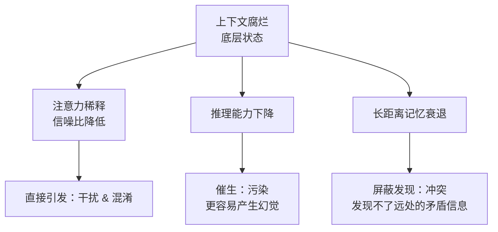
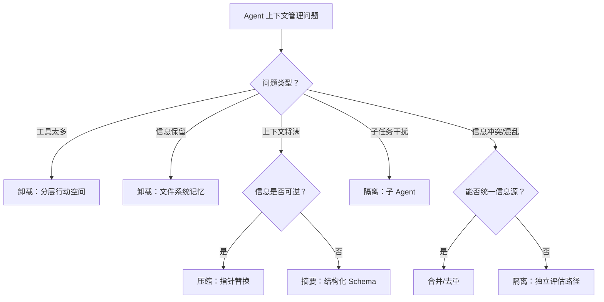

# 上下文工程速查

> 快速查阅上下文管理的策略选择、适用场景和常见问题解决方案。

---

## 一、核心概念速查

| 概念 | 定义 | 一句话理解 |
|:---|:---|:---|
| **上下文工程** | 为 Agent 动态管理其完整信息视野的架构学科 | 从"写好一句 Prompt"变成"设计整个信息环境" |
| **上下文腐烂** | 上下文越长，模型回忆和推理能力平滑下降 | 信息越多，AI 越容易"失焦" |
| **上下文债务** | Agent 循环中不断累积的、未经管理的信息 | 像信用卡债务，不还会利滚利 |

---

## 二、三大支柱速查表

**核心问题：什么时候用卸载 vs 缩减 vs 隔离？**

| 支柱 | 核心思想 | 适用场景 | 典型实现 | 代价 |
|:---|:---|:---|:---|:---|
| **卸载 (Offloading)** | 将上下文从 LLM 窗口转移到外部存储 | 工具太多塞不下、信息需要跨会话保留 | 文件系统、分层行动空间、渐进式披露 | 增加外部存储和检索复杂度 |
| **缩减 (Reduction)** | 减小每步传递给模型的上下文大小 | 上下文接近极限、历史信息过时 | 压缩（指针替换）、摘要（结构化摘要） | 可能丢失信息（尤其摘要不可逆） |
| **隔离 (Isolation)** | 不同任务使用独立上下文窗口 | 子任务独立、需要干净上下文 | 子 Agent、通信/共享上下文模式 | 协调成本、Token 消耗增加 |

---

## 三、卸载策略详解

### 3.1 卸载数据：文件系统即上下文

| 场景 | 做法 | 价值 |
|:---|:---|:---|
| 对抗目标漂移 | Agent 将计划写入文件，执行中定期读回 | 确保不偏离目标 |
| 跨会话记忆 | `CLAUDE.md` / `.cursor/` 文件持久化用户偏好 | 零部署、版本控制友好 |
| 知识库扩展 | 结构化目录（`dox/`），Agent 自主探索 | 知识可无限增长 |

### 3.2 卸载工具：分层行动空间

```
┌─────────────────────────────────────────┐
│  第三层：包和 API（编写和执行代码）        │  ← 最开放、能力最强
└─────────────────────────────────────────┘
                    ↑ 通过第一层函数调用
┌─────────────────────────────────────────┐
│  第二层：沙盒使用程序（命令行程序）        │  ← 能力扩展的主要层面
└─────────────────────────────────────────┘
                    ↑ 通过第一层函数调用
┌─────────────────────────────────────────┐
│  第一层：函数调用（原子操作）              │  ← 与模型直接交互的唯一一层
└─────────────────────────────────────────┘
```

| 层级 | 设计原则 | 顶级 Agent 的工具数 |
|:---|:---|:---|
| 第一层 | 极简、固定不变、KV 缓存友好 | Claude Code ~12个，Menlo <20个 |
| 第二层 | 预装在沙盒中的命令行工具 | 通过 bash 自主发现 |
| 第三层 | 编写脚本调用任意 API | 无上限 |

### 3.3 渐进式披露

| 层级 | 内容 | Token 消耗 | 加载方式 |
|:---|:---|:---|:---|
| **Level 1** | 技能名称 + 简介（YAML Front Matter） | ~100 | 始终加载 |
| **Level 2** | 核心指令与 SOP（Markdown 正文） | <5,000 | 触发时加载 |
| **Level 3+** | 详细文档、脚本、配置 | 无上限 | 按需加载 |

**关键洞察**：模型并不扩大上下文窗口，而是通过外部化执行让技能包的体积与上下文无关。

---

## 四、缩减策略详解

### 4.1 压缩 vs 摘要对比

| 维度 | 压缩 (Compression) | 摘要 (Summarization) |
|:---|:---|:---|
| **可逆性** | ✅ 可逆 | ❌ 不可逆 |
| **做法** | 完整内容卸载到文件，消息历史中用指针替换 | 生成结构化摘要替代原始内容 |
| **适用时机** | 工具结果变得陈旧时 | 上下文接近极限（如 95%）时 |
| **信息保真度** | 100%（可随时恢复） | 取决于摘要质量 |
| **最佳实践** | 优先使用 | 仅在压缩收益变小时才启用 |

### 4.2 摘要最佳实践

| 原则 | 说明 |
|:---|:---|
| **结构化 Schema** | 用"填表"而非自由格式，保证关键信息不丢失 |
| **优先级排序** | 先摘要最不重要的信息，保留核心上下文 |
| **触发条件** | 仅在上下文接近极限时才启用（别太早用） |

---

## 五、隔离策略详解

### 两种隔离模式对比

| 维度 | 通过通信 (By Communication) | 通过共享上下文 (By Shared Context) |
|:---|:---|:---|
| **工作方式** | 主 Agent 传简短指令，子 Agent 在干净上下文中完成，仅返回结果 | 子 Agent 访问主 Agent 完整历史，但使用新 System Prompt |
| **适用场景** | 可清晰切分的简单任务 | 需要完整历史视野的复杂任务 |
| **成本** | 低（KV 缓存友好） | 极高（KV 缓存完全失效） |
| **延迟** | 低 | 高 |
| **选择标准** | 任务是否需要之前所有上下文？ | 任务是否必须基于完整历史决策？ |

---

## 六、上下文失效的四种模式速查

| 模式 | 定义 | 比喻 | 诊断信号 | 解法 |
|:---|:---|:---|:---|:---|
| **污染 (Contamination)** | 幻觉/错误信息渗入上下文，被后续推理当事实 | 信息源被投毒 | 输出基于错误前提推导出荒谬结论 | 验证关键事实来源；保留错误信息供学习 |
| **干扰 (Interference)** | 信息过多，压倒模型预训练知识 | 信噪比过低 | 模型做出违背常识的判断 | 缩减上下文；优先保留高价值信息 |
| **混淆 (Confusion)** | 多余的不相关信息影响最终回应 | 注意力被分散 | 把两个不相关概念错误关联 | 隔离上下文；精简不相关内容 |
| **冲突 (Conflict)** | 不同部分包含相互矛盾的信息 | 指令集冲突 | 模型犹豫不决或行为混乱 | 统一信息源；消解矛盾 |

### 与上下文腐烂的因果关系



---

## 七、常见的上下文问题 → 解法速查

| 问题 | 症状 | 推荐策略 |
|:---|:---|:---|
| Agent 在长任务中忘记目标 | 执行到一半偏离原始计划 | **卸载**：将计划写入文件，定期读回 |
| 工具太多导致调用错误 | Agent 调用了错误的工具或不存在的工具 | **卸载**：分层行动空间，极简第一层 |
| 上下文窗口快满了 | Token 消耗急剧上升 | **缩减**：压缩（先）→ 摘要（后） |
| 子任务需要干净上下文 | 子任务结果被历史信息干扰 | **隔离**：子 Agent + 通信模式 |
| Agent 重复搜索同一信息 | 多轮对话中反复查询 | **卸载**：文件系统记忆 + 渐进式披露 |
| 不同来源信息矛盾 | 模型犹豫不决 | **隔离**：为不同来源建立独立评估路径 |
| 输出质量随对话变长下降 | 越聊越"傻" | **缩减**：适时摘要 + **隔离**：复杂子任务独立处理 |

---

## 八、选型决策流程图



---

## 九、Menlo 的实战经验速查

| 经验 | 教训 |
|:---|:---|
| **遮蔽而非移除** | 不要在运行时动态加载/卸载工具（破坏 KV 缓存） |
| **文件系统即上下文** | 当上下文装不下时，给 Agent 一个文件系统 |
| **工具集固定** | 顶级 Agent 的原生工具集都极少（<20个） |
| **渐进式披露** | 连脚本也不必一开始就全部告知模型 |
| **保留错误信息** | 让 Agent 从失败中学习 |
