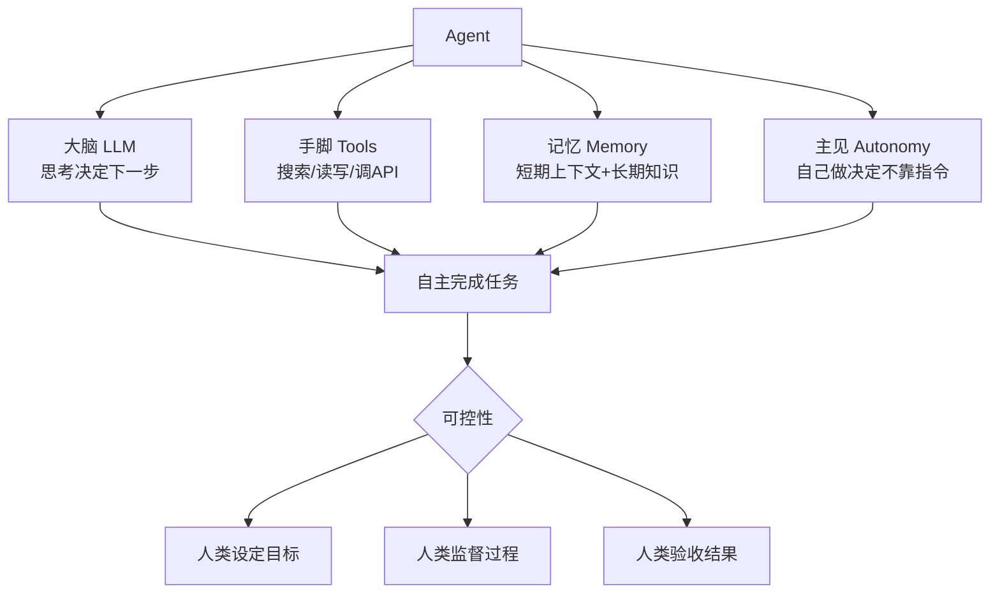
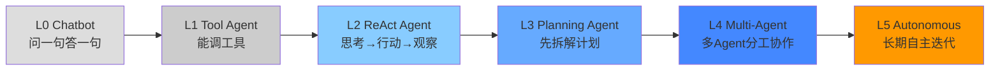

# Agent的本质

> 本章是 **Hermes Engineering 系列**第 3 模块的第 1 章。

从"说一句动一句"到"自主做事"——Agent 不是更会聊天的 Chatbot，而是系统让它能安全地做事。

---

## Agent 到底是什么？

Agent 就是一个能自己干活的 AI。更工程一点：你给它一个目标、一个工具箱和一套边界（预算/权限/审批/沙箱），它在循环里推进任务，直到完成或停下。

核心就四样东西：**Agent = 大脑(LLM) + 手脚(Tools) + 记忆(Memory) + 主见(Autonomy)**。

> 💡 **图解：** 四个组件缺一不可——光有大脑没手脚是聊天机器人，光有手脚没主见是脚本，有主见没记忆是失忆症患者。

大脑负责思考决定下一步干什么。手脚负责执行——搜索网页、读写文件、调用 API。记忆负责记住之前发生了什么——短期记忆是当前对话上下文，长期记忆是跨会话知识积累。主见最关键——它得自己做决定，不是你说一步它动一步。

ChatGPT 和 Agent 的分水岭：ChatGPT 说一句回一句，你得不停追问引导。让它订机票，它只会给你航班信息让你去携程。真正的 Agent 区别不是更会聊天，而是系统让它能安全地做事——能用工具、能拿到授权、关键节点会停下来确认、全过程可追溯。

### 与传统软件的区别

传统软件是确定性的：给定输入 A，必然产出 B。Agent 是概率性的：给定输入 A，它会"思考"该怎么做，可能产出 B 也可能产出 C。这带来了灵活性，也带来了不确定性。生产环境中如何控制这种不确定性，是 Agent 系统设计的核心挑战。

---

## 自主性等级

Agent 不是非黑即白的概念，而是一个谱系：

| 等级 | 名称 | 核心能力 |
|---|---|---|
| **L0** | Chatbot | 问一句答一句，无工具调用 |
| **L1** | Tool Agent | 能调用工具但无多步推理 |
| **L2** | ReAct Agent | 思考→行动→观察循环 |
| **L3** | Planning Agent | 先拆解计划再逐个执行 |
| **L4** | Multi-Agent | 多个 Agent 分工协作 |
| **L5** | Autonomous | 长期自主运行自我迭代 |

大多数人用的是 L0-L1。L2-L4 是实际可构建的范围。L5 目前还没有真正可靠的实现，谁说有可以持保留态度。

> 💡 **图解：** 自主性不是开关而是光谱——L2-L4 是实际可构建范围，L5 目前更像愿景而非现实。

---

## 一个真实的例子

你让 Agent "研究字节跳动，写一份分析报告"。

Chatbot 给你一段训练数据里的信息然后说"需要最新信息请自行搜索"。

Agent 的做法：任务分解（搜索背景 → 查产品线 → 分析竞争对手 → 查财务信息 → 综合写报告），逐个执行每个子任务调用搜索工具获取信息，自我检查哪些信息够了哪些需要补充，最后综合输出结构化报告。

整个过程你只说了一句话。这就是 Agent。

---

## 能做什么，不能做什么

**擅长**：目标明确、步骤可拆解、结果可验证、信息可获取、重复性高。

**不擅长**：开放性创意、主观判断、复杂人际、高风险决策、不可逆副作用、实时物理操作。

一个简单的判断方法：如果这个任务你交给一个实习生，能用文字清楚地告诉他怎么做，大概率适合 Agent。如果自己都说不清楚"怎么算做好了"，那 Agent 也搞不定。

很多事情不是不能做，而是必须加确认点才敢做——付款、发布、删除、群发邮件，默认都应该是人类确认 Agent 执行。

---

## 技术演进

2022 年前是规则驱动（Siri、Alexa 本质是规则引擎+意图识别）。2023 年 LLM 成为大脑（GPT-4 等大模型让 LLM 驱动工具调用成为可能）。2023-2024 年 ReAct 与 Function Calling 成为关键突破。2024-2025 年多 Agent 与生产化成为主流，企业关注成本控制、安全性、可靠性、可观测性。

---

## 常见误区

**Agent ≠ ChatGPT + 插件**：插件只是工具，Agent 核心是自主决策循环。有工具不代表是 Agent，能自己决定什么时候用什么工具才是。

**Agent 不能替代人类**：至少现在不能。Agent 是增强工具，能处理重复性结构化任务，但需要人类设定目标、监督过程、验收结果。

**Agent 不是越自主越好**：自主性越高不确定性越大。生产环境需要在自主性和可控性之间找平衡。

**最强模型 ≠ 最好 Agent**：模型能力只是基础。Agent 系统质量取决于工具设计、Prompt 清晰度、错误处理、架构扩展性。

---

---

## ⚠️ 常见错误

| ❌ 错误做法 | ✅ 正确做法 | 为什么 |
|:---|:---|:---|
| 把 Agent 当 Chatbot 用（每次一条消息等回复） | 一次给出完整任务描述 + 约束 + 验证标准 | Agent 需要完整上下文才能自主决策 |
| 没有终止条件就启动循环 | 明确定义「成功」和「失败」的判定标准 | 没有终止条件的 Agent 会无限循环 |
| 给 Agent 所有工具都配上 | 只给完成任务必需的最少工具 | 工具过多会导致选择困难 |
| 期望 Agent 一次完美完成 | 设计 ReAct 循环，允许多轮尝试和修正 | Agent 的价值在于迭代 |

## 本章要点

- Agent 定义：能自主完成任务的 AI 系统，核心是自己做决定
- 四个组件：大脑(LLM) + 手脚(Tools) + 记忆(Memory) + 主见(Autonomy)
- 自主性等级 L0-L5，L2-L4 是实际可构建范围
- 适用场景：目标明确、步骤可拆解、结果可验证

---

**下一章**: [工具与协议](./02-工具与协议.md)

---

[← 返回首页](/) | [← 上一模块: 上下文工程](/02-上下文工程/) | [下一模块: 多Agent架构 →](/04-多Agent架构/)
