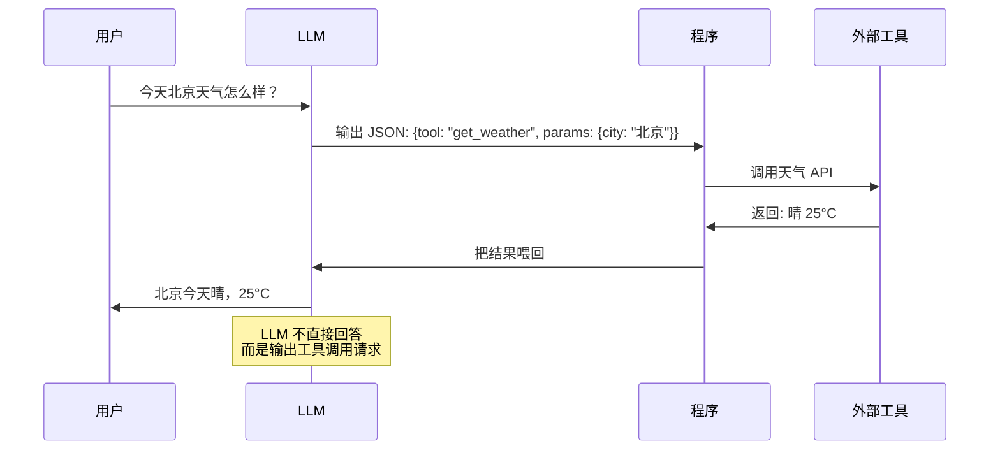
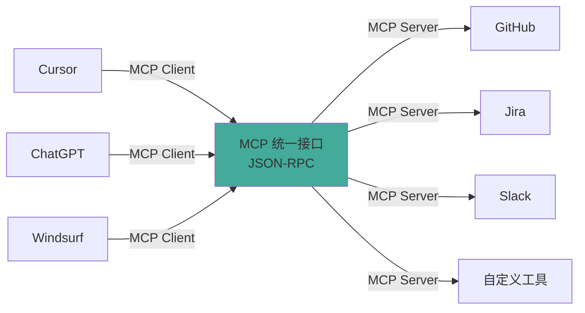

# 工具与协议

> 本章是 **Hermes Engineering 系列**第 3 模块的第 2 章。

工具让 LLM 从"会说"变成"能做"。MCP 协议让工具像 USB 设备一样即插即用。

---

## Function Calling：让 LLM 学会请求帮助

> 💡 **图解：** Function Calling 让 LLM 从"编答案"变成"说需求"——它不查天气，但它知道该调谁来查。

LLM 有一个致命缺陷：它只能编，不能查。你问今天北京天气怎么样，它会根据训练数据编一个答案。知识截止到训练时间，不知道今天的天气、利率、新闻。

Function Calling 的本质：让 LLM 不直接回答问题，而是输出一个 JSON 说"我需要调用某个工具"。程序解析 JSON 后真正调用工具，把结果喂回给 LLM。

LLM 是根据 description 来理解怎么填参数的。description 越清晰，LLM 填得越准。检验方法：把 description 给不懂技术的人看，如果他说不知道，那 LLM 大概率也不知道。

---

## 工具定义的三部分

**元数据**——工具是干什么的（name、description、category）。生产必备字段：timeout_seconds（防工具卡死）、rate_limit（防疯狂调用）、dangerous（危险操作需确认）、cost_per_use（追踪成本）、sandboxed（防恶意代码逃逸）。

**参数定义**——需要什么输入（name、type、description、required）。LLM 是根据 description 来理解怎么填参数的，这是最重要的字段。

**执行逻辑**——具体干什么。关键：异步不阻塞、安全不直接 eval、结构化返回 ToolResult（含 success 和 error 字段）。

### 容错处理

LLM 填参数不准怎么办？类型强转——整数接受浮点数和数字字符串，布尔接受常见字符串形式。参数有 min/max 时自动 clamp。

---

## 工具管理

工具太多 LLM 会懵。测试显示 20 个工具时选择准确率明显下降，5 个相关工具时高得多。要根据任务类型只暴露相关工具——研究任务给搜索和读取，数据分析给计算和数据库，代码任务给文件操作。

限流两层：工具级别限流（每次调用前检查）+ 滑动窗口限流（基于时间间隔）。

---

## MCP 协议：工具的 USB 接口

2025 年 MCP 已经成为 Agent 工具集成的事实标准——9700 万月下载、1 万+活跃 Server，加入 Linux Foundation 做中立治理。

没有 MCP 之前：每个 Agent 都要重新实现 GitHub 集成，格式不统一（GitHub 返回 issues、Jira 返回 tickets），权限分散，难以复用。

MCP 统一了接口：所有工具用相同 JSON-RPC 格式通信，新工具只需实现 MCP Server 所有 Client 自动支持，社区写好的 Server 任何 Agent 都能用，认证授权在 Server 端统一管理。

> 💡 **图解：** MCP 就是 Agent 工具世界的 USB 接口——一个 Server 写好，所有 Client 都能用。

### 核心概念

**Client 和 Server**：Client 调用工具使用资源（Cursor、Windsurf、ChatGPT），Server 提供工具暴露资源。

**Tools vs Resources**：Tools 是执行操作改变状态的（写操作），Resources 是读取数据不改变状态的（读操作），还支持订阅变更通知。

### 安全问题

**Prompt Injection**：恶意 Server 在返回值里注入指令，LLM 可能把工具输出当成系统指令执行。缓解：严格过滤、明确标记隔离工具输出。

**Tool 权限组合攻击**：单独看每个工具安全，但组合起来 Agent 可能用 read_file 读 SSH 密钥再用 http_request 发到攻击者服务器。缓解：最小权限原则、审计工具组合。

**Lookalike Tools**：攻击者创建恶意 Server 伪装成官方。缓解：使用 MCP Registry 验证身份。

### 生产必备配置

域名白名单（防 SSRF）、响应大小限制（防恶意 Server 返回 1GB）、超时控制（防请求卡住）、熔断器（下游故障时停止重试）、敏感信息用环境变量不硬编码。

---

## 本章要点

- Function Calling 让 LLM 学会请求帮助而不是瞎编
- 工具定义三部分：元数据、参数（description 最关键）、执行逻辑
- 工具数量控制在 3-5 个，按任务类型过滤
- MCP 协议：工具的 USB 接口，2025 年成为事实标准
- 安全：Prompt Injection、权限组合攻击、域名白名单、熔断器

---

**上一章**: [Agent的本质](./01-Agent的本质.md) | **下一章**: [记忆与上下文](./03-记忆与上下文.md)
