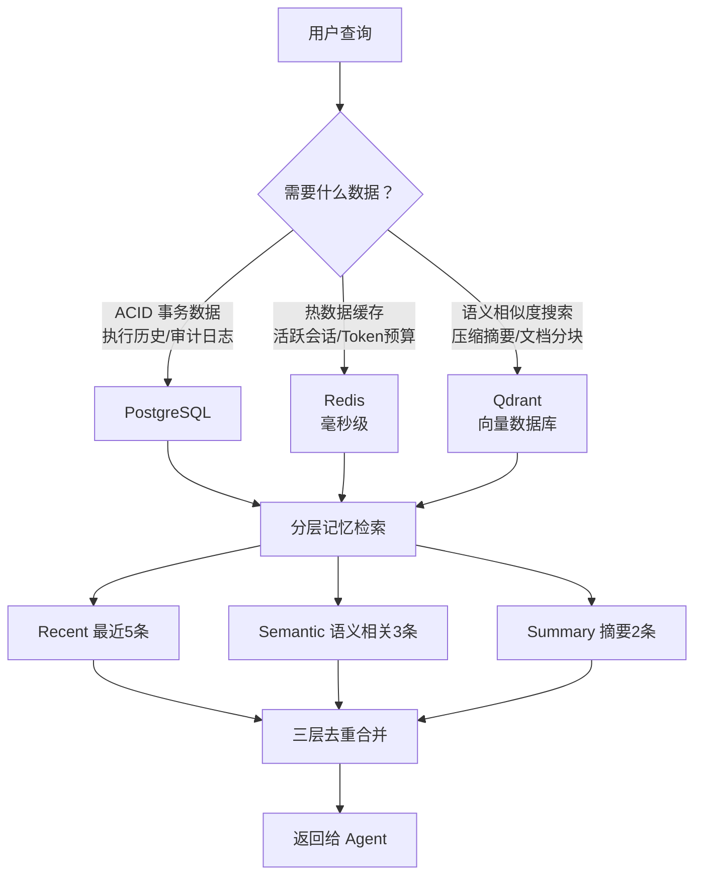

# 记忆与上下文

> 本章是 **Hermes Engineering 系列**第 3 模块的第 3 章。

记忆系统让 Agent 从"每次都是陌生人"变成"越用越懂你"。但别指望它记住一切——向量相似度不是精确匹配，召回率和准确率需要取舍。

---

## 上下文窗口管理

LLM 有一个叫"上下文窗口"的东西——Agent 的工作台。工作台能放多少东西取决于窗口大小。每个 Token 都是钱：50 轮对话约 25000 tokens 输入，每天 10 万个会话每月成本 $187,500。

上下文管理要解决四个互相矛盾的核心问题：超限（请求直接失败）、成本（历史越长越贵）、信息丢失（关键上下文被截掉）、噪音干扰（太多无关信息降低质量）。

### 滑动窗口压缩

核心策略：保留重要的，压缩中间的。前 3 条（Primers）保留初始上下文建立，中间部分压缩成语义摘要，后 20 条（Recents）保持对话连贯。

触发时机：预算使用率 >= 75% 时触发压缩，压到 37.5%。为什么 75%？留 25% 余量给当前轮。为什么 37.5%？压到一半以下留更多空间给后续对话。

### Token 预算管理

多层预算架构：Session 预算（整个会话总预算）→ Task 预算（单次任务）→ Agent 预算（单个 Agent）。分层让每个 Agent 都有自己的额度，不会相互挤占。

三种模式：硬限制（超预算直接拒绝，适合对外 API）、软限制（超预算发警告继续执行，适合内部工具）、审批模式（超预算暂停等人工确认，适合关键任务）。

背压机制：预算压力增大时不是突然停止，而是渐进式限流——使用率 80% 时轻微延迟，95% 时重度限流。

---

## 记忆架构

用户不会精确查询。用户问"React 组件怎么优化？"，存的可能是"前端渲染性能提升方案"。字符串完全不同但语义相关——这就是向量数据库的价值：按语义相似度检索而不是精确匹配。

### 三层存储

> 💡 **图解：** 三层存储各司其职——PostgreSQL 管事务、Redis 管速度、Qdrant 管语义——缺一层就不完整。

**PostgreSQL**：需要 ACID 事务的数据——执行历史、审计日志、用户偏好。

**Redis**：热数据缓存毫秒级访问——活跃会话、Token 预算、速率限制。

**Qdrant**：向量相似度搜索——语义记忆、压缩摘要、文档分块。

另一种思路是本地文件存储（Claude Code 的 CLAUDE.md、Cursor 的 .cursor/ 目录）——零部署、版本控制友好、用户可读可编辑，但不适合多设备同步、语义检索弱、规模受限。

### 语义检索

核心流程：用户问题 → 生成 Embedding 向量 → 在向量数据库搜索相似向量 → 返回相关历史。

Embedding 把文本变成一串数字，语义相近的文本向量也相近。相似度阈值从 0.7 开始调——太高找不到太低返回垃圾。

### 分层记忆检索

融合三种策略：Recent（最近 5 条保持对话连贯）+ Semantic（语义相关 3 条找历史中相关的）+ Summary（摘要 2 条快速建立长期上下文）。三层去重后返回。

### 智能存储

不是所有内容都值得存。去重（95% 相似度阈值）、长回答分块（2000 tokens 一块 200 tokens 重叠）、跳过低价值内容（太短、错误消息、闲聊）。

---

## 多轮对话设计

两级缓存架构：内存缓存（1ms）+ Redis 持久化（5ms）。热数据在内存冷数据落 Redis。

会话自动标题：用 LLM 从第一轮对话生成简短描述。PII 脱敏：存储前自动检测移除邮箱、电话、信用卡等敏感信息。租户隔离：不同租户记忆绝对不能互相访问，返回 ErrSessionNotFound 而不是 ErrUnauthorized。

---

## 本章要点

- 上下文窗口管理：三段式保留（Primers+Summary+Recents）+ 多层预算 + 背压
- 记忆三层存储：PostgreSQL（ACID）+ Redis（热缓存）+ Qdrant（语义检索）
- 分层检索：Recent + Semantic + Summary 三层融合去重
- 多轮对话：两级缓存、自动标题、PII 脱敏、租户隔离

---

**上一章**: [工具与协议](./02-工具与协议.md) | **下一章**: [高级推理](./04-高级推理.md)
