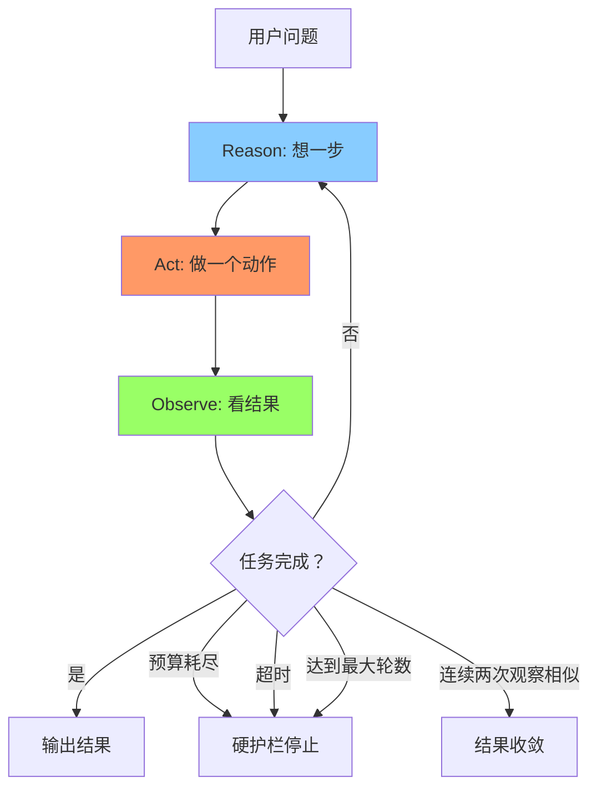
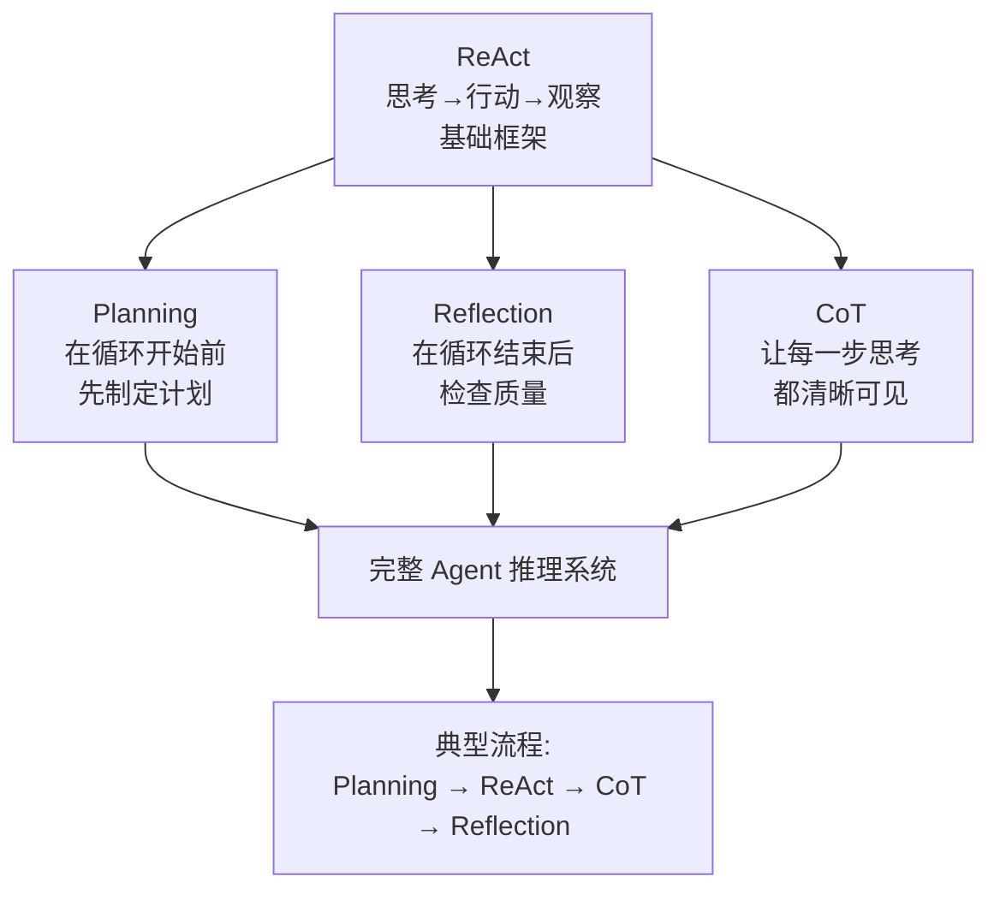

# 高级推理

> 本章是 **Hermes Engineering 系列**第 3 模块的第 4 章。

Agent 怎么"想"？Planning 让它先想后做，Reflection 让它自我检查，Chain-of-Thought 让它把推理过程外显。

---

## ReAct 循环：Agent 的心脏

> 💡 **图解：** ReAct 强迫 LLM 从"一口气说完"变成"想一步做一步看一步"——每一轮只推进一个关键动作。

ReAct 是 Agent 最核心的运行机制——Reasoning + Acting，推理与行动的交织循环。

LLM 天生是"一口气说完"的——你问一句它生成一整段，不会停下来想对不对，也不会中途查资料。这导致信息过时（只能用训练数据）和无法验证（说完就完容易胡说八道）。

ReAct 强迫 LLM 停下来：问题 → 想一步 → 做一步 → 看结果 → 再想 → 再做。三个阶段：Reason（只想一步不发散）、Act（一轮只推进一个关键动作）、Observe（客观记录不判断）。

### 终止条件

六种：用户中断（最高优先级）、任务完成、预算耗尽（硬护栏）、超时（硬护栏）、结果收敛（连续两次观察相似）、最大轮数（兜底）。生产环境还要求"要证据再收工"——检查是否真正执行了工具调用，避免模型没查就说完成了。

---

## Planning：先想后做

面对复杂任务 Agent 需要拆解、排序、评估。没有规划会信息量太大（超出上下文）、没有结构（输出杂乱）、无法追踪（用户干等）、重复劳动（浪费 Token）。

有规划的典型流程：公司基本信息 → 产品矩阵 → 技术创新 → 竞争对手 → 市场定位 → 综合报告。每个子任务独立可控，中间出问题只重做那一步。

### 依赖关系

任务之间有四种关系：串行（A 必须在 B 之前）、并行（A 和 B 同时进行）、条件（B 的执行取决于 A 的结果）、汇聚（C 需要 A 和 B 都完成）。用 DAG（有向无环图）表达这些关系。

---

## Reflection：自我检查

LLM 单次输出质量不稳定——同一个问题问 10 次，质量分布参差不齐。Reflection 的作用是发现那些"明显有缺陷"的输出，给它一次改进的机会。

但 Reflection 不是万能药。它不能让烂回答变成好回答，只能让"有明显问题"变成"基本及格"。三个主要场景：高价值输出值得花 2 倍成本保证质量、可客观评估的任务、迭代改进。

核心组件：质量评估（打分 0-1 + 改进建议）→ 反馈生成（指出具体问题）→ 带反馈重生成。重复直到达标或达到最大重试次数。

### 评估标准

好的标准是客观可衡量的：完整性（覆盖所有要求的方面）、准确性（数据和逻辑正确）、格式规范（符合要求的结构）。差的标准是主观模糊的："写得更好""更有说服力"。

### 何时使用

适合：有明确评估标准的任务、初稿质量不够需要改进、高价值输出值得额外成本。不适合：创意写作（标准太主观）、实时交互（延迟不允许）、低价值任务（不值得花 2 倍成本）。

---

## Chain-of-Thought：把推理外显

CoT 不是让 LLM 变聪明，而是让它把隐式推理变成显式步骤——这样你能看到它错在哪，也更容易把它拉回来。

LLM 默认行为是"一口气说完"，对于多步骤问题这种跳步很容易出错。加一句 "Please solve step by step"，准确率可以显著提升。

CoT 的价值：准确性（逐步验证减少跳跃性错误）、可解释性（透明过程可追溯每一步）、调试能力（可定位具体哪一步出错）。

### 实现方式

**Zero-shot CoT**：加一句"Let's think step by step"，最简单但效果有限。

**Few-shot CoT**：在 Prompt 中提供包含推理过程的示例，效果更好但占用上下文。

**自动 CoT**：让模型自动生成推理步骤的示例。

CoT 的局限：逐步推理的每一步仍然可能出错。CoT 增加 Token 消耗（每一步都是成本）。对于简单问题 CoT 反而浪费 Token。

---

## 四种模式的关系

> 💡 **图解：** 四种模式不是替代关系而是组合积木——Planning 定方向、ReAct 做执行、CoT 显推理、Reflection 守质量。

ReAct 是基础框架——思考行动观察循环。Planning 是 ReAct 的扩展——在循环开始前先制定计划。Reflection 是 ReAct 的增强——在循环结束后检查质量。CoT 是贯穿其中的推理方式——让每一步思考都清晰可见。

在实际系统中，这四种模式常常组合使用：先 Planning 拆解任务，再用 ReAct 执行每个子任务，执行过程中用 CoT 显式推理，最后用 Reflection 检查整体质量。

---

## 本章要点

- ReAct 循环：思考→行动→观察，终止条件含预算/超时硬护栏
- Planning：先拆解再执行，DAG 表达依赖关系，粒度不能太粗也不能太细
- Reflection：自我检查提高下限，好的评估标准是客观可衡量的
- Chain-of-Thought：把隐式推理变显式，逐步验证减少跳跃性错误
- 四种模式组合使用：Planning → ReAct → CoT → Reflection

---

**上一章**: [记忆与上下文](./03-记忆与上下文.md)

---

## 模块总结

Agent 基础系列全部完结，共 4 章：

| 章节 | 主题 | 核心概念 |
|---|---|---|
| 1 | Agent的本质 | 四大组件、L0-L5 自主性等级 |
| 2 | 工具与协议 | Function Calling、MCP 协议 |
| 3 | 记忆与上下文 | 上下文管理、三层存储、语义检索 |
| 4 | 高级推理 | ReAct、Planning、Reflection、CoT |

---

[← 返回首页](/) | [下一模块: 多Agent架构 →](/04-多Agent架构/)
