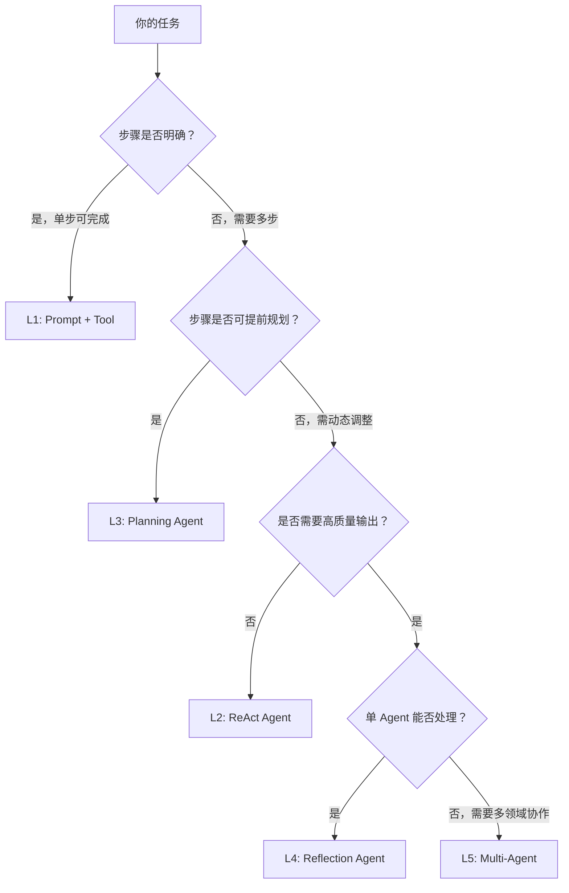
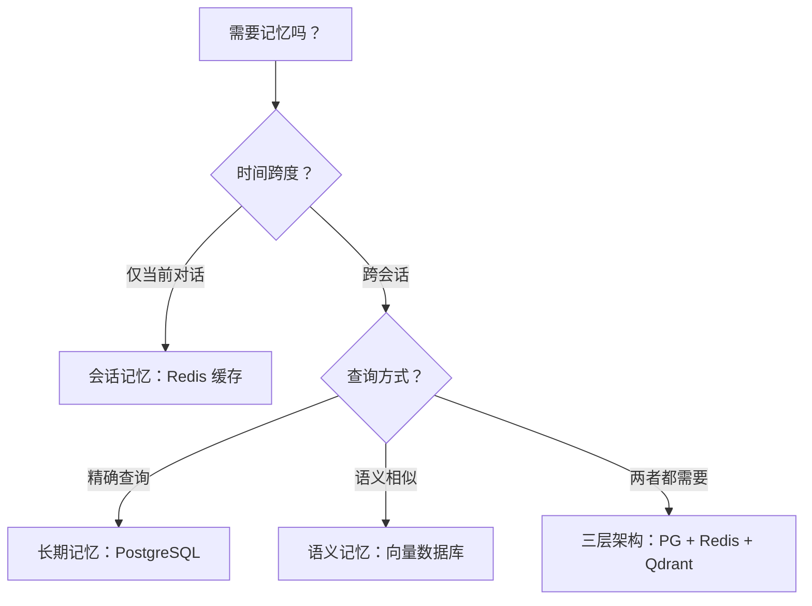

# Agent 基础速查

> 快速查阅 Agent 等级、推理模式选择和记忆架构决策。

---

## 一、Agent 等级速查（L0-L5）

| 等级 | 名称 | 核心特征 | 典型场景 |
|:---:|:---|:---|:---|
| **L0** | 传统软件 | 确定性逻辑，输入 A 必然输出 B | `if-else`、规则引擎 |
| **L1** | Prompt + Tool | 单次调用 + 工具调用，无自主循环 | 翻译、总结、简单问答 |
| **L2** | ReAct Agent | 思考 → 行动 → 观察，自主循环 | 信息检索、简单任务执行 |
| **L3** | Planning Agent | 任务分解、依赖管理、多步骤执行 | 研究报告、复杂数据分析 |
| **L4** | Reflection Agent | 自我评估、反馈循环、迭代改进 | 代码审查、高质量内容生成 |
| **L5** | Multi-Agent | 多 Agent 协作、分工、编排 | 战略分析、端到端项目 |

### 判断该用哪一级



---

## 二、推理模式速查

### 什么时候用 ReAct vs Planning vs Reflection？

| 维度 | ReAct | Planning | Reflection |
|:---|:---|:---|:---|
| **核心机制** | 思考→行动→观察 循环 | 任务分解→排序→执行 | 生成→评估→反馈→改进 |
| **适合任务** | 探索性、步骤不确定的任务 | 复杂、多步骤、依赖关系明确的任务 | 需要高质量输出、有明确评估标准的任务 |
| **优势** | 灵活、可纠正、可追溯 | 结构清晰、可并行、可追踪 | 提高下限、减少明显错误 |
| **劣势** | 可能陷入死循环 | 分解粒度难把握 | 成本翻倍、不保证改进 |
| **典型场景** | 信息检索、故障排查 | 研究报告、数据处理流水线 | 代码生成、文档撰写 |

### ReAct 详解

| 要素 | 说明 |
|:---|:---|
| **循环结构** | Reason（思考）→ Act（行动）→ Observe（观察）→ 循环 |
| **解决的问题** | 信息过时（可以去查）、无法验证（做完再检查）、无法追溯（每步有记录） |
| **关键约束** | 需要预算上限、终止条件、验收机制（否则可能死循环） |
| **生产底线** | ReAct 不是正确保证，预算 + 终止 + 验收才是真正的底线 |

### Planning 详解

| 要素 | 说明 |
|:---|:---|
| **三个核心问题** | ① 如何分解？② 如何执行（并行/串行）？③ 何时停止？ |
| **最容易忽视** | 第三个问题——不知道什么时候该停，导致无限循环 |
| **分解原则** | 能画出流程图 → 用工作流；画不出来 → 考虑多 Agent |
| **执行策略** | 有依赖 → 串行；无依赖 → 并行；混合 → DAG |

### Reflection 详解

| 要素 | 说明 |
|:---|:---|
| **核心组件** | 质量评估 → 反馈生成 → 带反馈重生成 |
| **适用场景** | 高价值输出、可客观评估的任务、迭代改进 |
| **本质** | 锦上添花，不是核心依赖——不能让烂回答变好 |
| **成本** | 约 2 倍调用成本（生成 + 评估 + 可能的重生成） |

---

## 三、记忆架构选择速查

### 记忆类型对比

| 类型 | 时间跨度 | 存储方式 | 适用场景 | 选择标准 |
|:---|:---|:---|:---|:---|
| **工作记忆** | 秒-分钟级 | 上下文窗口 | 正在处理的任务 | 所有 Agent 必需 |
| **会话记忆** | 分钟-小时级 | Redis 缓存 | 单次对话历史 | 需要多轮交互的场景 |
| **长期记忆** | 天-月级 | PostgreSQL | 用户偏好、成功模式 | 需要跨会话个性化 |
| **语义记忆** | 永久 | 向量数据库 | 相关历史问答、知识库 | 需要语义相似度检索 |

### 记忆架构选择决策



### 三层存储架构

| 存储 | 职责 | 典型数据 |
|:---|:---|:---|
| **PostgreSQL** | ACID 事务数据 | 执行历史、审计日志、用户偏好 |
| **Redis** | 热数据缓存（毫秒级） | 活跃会话、Token 预算、速率限制 |
| **Qdrant** | 向量相似度搜索 | 语义记忆、压缩摘要、文档分块 |

### 另一种选择：本地文件存储

| 方案 | 优势 | 劣势 | 适合谁 |
|:---|:---|:---|:---|
| 本地文件（CLAUDE.md 等） | 零部署、Git 友好、隐私 | 语义检索弱、多设备同步难 | 单机开发者工具 |
| 服务器端存储 | 多租户、语义检索强 | 需要部署、数据在云端 | 企业级多租户应用 |

---

## 四、Agent 四大核心组件速查

```
Agent = 大脑 + 手脚 + 记忆 + 主见
       (LLM)  (Tools) (Memory) (Autonomy)
```

| 组件 | 职责 | 没有会怎样 |
|:---|:---|:---|
| **大脑 (LLM)** | 思考，决定下一步 | 没有智能，只是死板脚本 |
| **手脚 (Tools)** | 执行，搜索/读写/调用 API | 只能聊天，不能做事 |
| **记忆 (Memory)** | 记住之前发生了什么 | 每次从零开始，效率极低 |
| **主见 (Autonomy)** | 自己做决定 | 只是 Chatbot，不是 Agent |

### 生产环境的第五层：护栏（Guardrails）

| 护栏类型 | 说明 |
|:---|:---|
| **预算** | Token 消耗上限 |
| **权限** | 操作范围限制 |
| **审批** | 关键操作需要人工确认 |
| **审计** | 全过程可追溯 |
| **沙箱** | 隔离执行环境 |

---

## 五、Agent 与传统软件对比

| 维度 | 传统软件 | Agent |
|:---|:---|:---|
| **确定性** | 确定性：给定输入 A，必然产出 B | 概率性：给定输入 A，可能产出 B 或 C |
| **灵活性** | 低——按固定逻辑执行 | 高——能自主调整策略 |
| **可预测性** | 高 | 低（每次运行路径可能不同） |
| **调试方式** | 调试代码 | 调试环境——"环境里缺了什么导致 Agent 犯错？" |
| **错误来源** | 代码 bug | 环境缺失（工具、上下文、约束） |

---

## 六、Chain-of-Thought 速查

| CoT 类型 | 做法 | 适用场景 |
|:---|:---|:---|
| **Zero-shot CoT** | Prompt 中加"Let's think step by step" | 简单推理任务 |
| **Few-shot CoT** | 提供推理示例 | 需要特定推理模式 |
| **Tree-of-Thoughts** | 多条推理路径并行探索 | 复杂决策、需要多视角 |

---

## 七、常见问题速查

| 问题 | 原因 | 解法 |
|:---|:---|:---|
| Agent 死循环 | 没有终止条件 | 设置最大轮次 + Token 预算上限 |
| Agent 偏离目标 | 目标漂移 | 用文件记录计划，定期读回检查 |
| Agent 调用错误工具 | 工具设计不匹配模型能力 | Seeing Like an Agent，简化工具接口 |
| 输出质量不稳定 | LLM 概率性 | 引入 Reflection 模式 |
| 长对话质量下降 | 上下文腐烂 | 上下文工程（卸载/缩减/隔离） |
