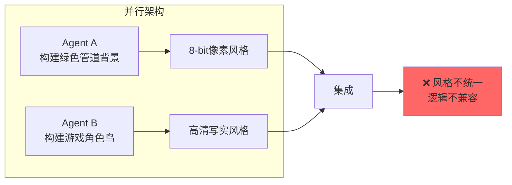
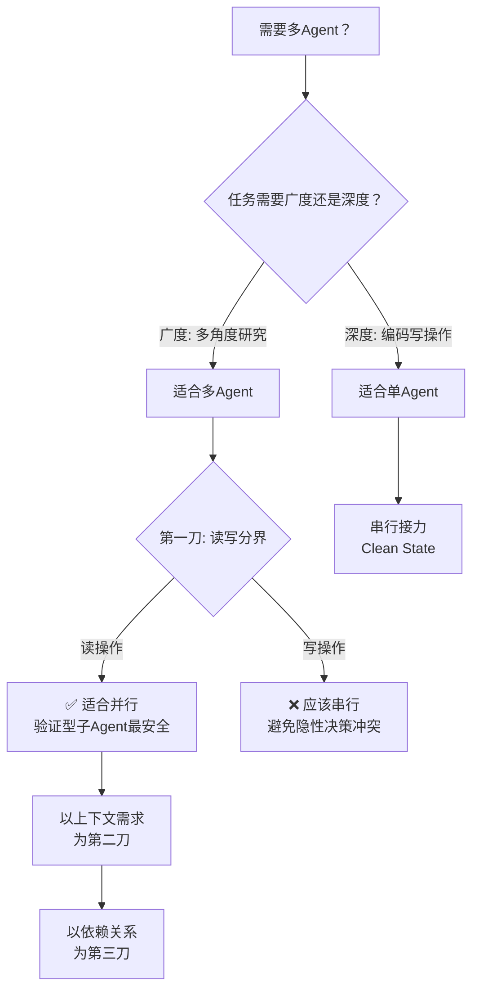

# 何时用多Agent

> 本章是 **Hermes Engineering 系列**第 4 模块的第 1 章。

到底该不该用多Agent？什么时候用？怎么拆？两种工程哲学的较量——Anthropic 注重广度与解耦，Cognition 关注深度与一致性。

---

## 两种工程哲学

几乎在同一时间，Anthropic 发表了《How We Built Our Multi-Agent Research System》，Cognition AI（Devin 开发者）发表了《Don't Build Multi-Agents》。这不是简单的观点冲突，而是两种工程哲学的较量。

### Cognition 的核心关切：可靠性

在构建长程智能体时首要挑战是可靠性——对误差累积的控制。在多步骤推理系统中，如果每一步准确率不能维持极高水平，随着步骤增加系统整体成功率会呈指数级下降。

工程重点需要从提示词工程转向上下文工程——在动态系统中通过代码自动管理信息的流入流出，精准为模型提供当前决策所需的全部背景信息，同时屏蔽干扰信息。

### Flappy Bird 案例

> 💡 **图解：** 行动承载着隐性决策——并行架构把这些决策打散到不同上下文中，集成时必然撞车。

典型的多 Agent 并行架构：Agent A 构建包含绿色管道的游戏背景，Agent B 构建游戏角色（一只鸟）。Agent A 基于训练数据倾向生成 8-bit 像素风格，Agent B 无法知晓这个决策，可能生成高清写实风格的鸟。集成时风格不统一、底层逻辑不兼容。

关键规律：**行动承载着隐性决策。** 在并行架构中这些隐性决策分散且难以察觉，必然导致一致性缺失。

### Cognition 的结论

编程的核心是写操作，涉及大量细微的隐性决策。并行架构导致决策分散、上下文割裂，最终引发灾难性的一致性缺失。因此在现阶段应坚持使用单智能体。

---

## Anthropic 的回应：何时用多Agent

但 Anthropic 并非主张所有场景都用多 Agent。他们认为多 Agent 系统在需要广度而非深度的探索性任务中表现卓越。

### 三类适合多 Agent 的场景

**1. 多角度研究**：一个 Agent 擅长一个领域，另一个 Agent 擅长另一个领域，各自独立探索后汇总。

**2. 验证型子 Agent**：最安全的拆分起点。主 Agent 负责写，子 Agent 负责验证——检查代码质量、安全漏洞、测试覆盖。验证型子 Agent 只读不写，不会产生冲突。

**3. 以上下文为中心的边界划分**：当不同任务需要截然不同的上下文时（比如一个需要产品文档，一个需要代码库），用独立 Agent 避免上下文污染。

### 第一刀切在哪

最安全的第一刀是验证型子 Agent——只读不写，不存在隐性决策冲突。OpenAI 的 Arbor 安全 Agent 就是这个模式：自动审核代码、发现漏洞，因为它和 Codex 共享同一个高可读性仓库，能准确理解业务逻辑找出潜在风险。

### 边界划分原则

以任务的读写特性为第一刀：读操作（搜索、分析、验证）适合并行，写操作（编码、修改、创建）应该串行。以上下文需求为第二刀：需要不同上下文的子任务用独立 Agent 避免干扰。以依赖关系为第三刀：有前后依赖的子任务必须串行。

---

## 广度 vs 深度

| 维度 | 多Agent（广度） | 单Agent（深度） |
|---|---|---|
| 适合场景 | 探索性研究、多角度分析 | 编程、写操作密集任务 |
| 优势 | 覆盖面广、可并行 | 决策一致、无冲突 |
| 风险 | 隐性决策分散、一致性缺失 | 上下文窗口限制 |
| 解决方案 | 以读写分界、验证型拆分 | 串行接力、Clean State |

核心洞察：不是多 Agent 好不好，而是**什么时候用**。选择架构时先问：这个任务更需要广度还是深度？

> 💡 **图解：** 选架构的第一刀永远是"读还是写"——读操作天生适合并行，写操作必须串行以防决策打架。

---

---

## ⚠️ 常见错误

| ❌ 错误做法 | ✅ 正确做法 | 为什么 |
|:---|:---|:---|
| 一上来就用多 Agent | 先用单 Agent + 好的 Harness，解决不了再拆 | 多 Agent 增加协调成本和调试复杂度 |
| 按「角色」拆分（前端 + 后端 Agent） | 按「上下文」拆分（不同领域知识独立窗口） | 按角色拆分会增加跨角色通信开销 |
| 每个子任务都用最强模型 | 简单任务用小模型，复杂任务用大模型 | 成本和延迟不划算 |
| 子 Agent 共享完整上下文 | 隔离子 Agent 的上下文，只传递必要信息 | 共享上下文导致信息干扰 |

---

## 🎮 交互式决策树

不确定该不该用多 Agent？点下面的按钮一步步判断：

<DecisionTree />

---

## 本章要点

- 两种哲学：Cognition（深度一致性）vs Anthropic（广度解耦）
- 并行架构的核心风险：行动承载隐性决策，分散导致不一致
- 三类适合多 Agent 的场景：多角度研究、验证型子 Agent、上下文隔离
- 最安全的第一刀：验证型子 Agent（只读不写）
- 边界划分原则：读写分界 → 上下文需求 → 依赖关系

---

**下一章**: [指挥官与工人](./02-指挥官与工人.md)

---

[← 返回首页](/) | [← 上一模块: Agent基础](/03-Agent基础/) | [下一模块: Skill工程 →](/05-Skill工程/)
