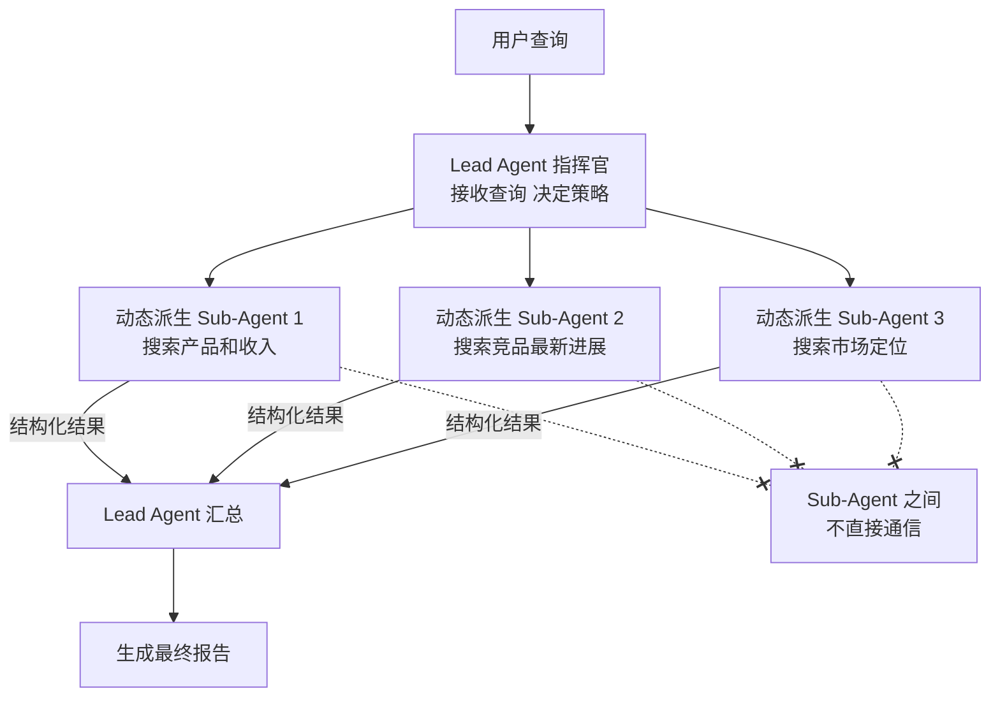

# 指挥官与工人

> 本章是 **Hermes Engineering 系列**第 4 模块的第 2 章。

Anthropic 的多 Agent 架构实践——指挥官-工人架构、动态派生、八条提示词工程原则。

---

## 指挥官-工人架构

Anthropic 的多 Agent 研究系统采用经典的指挥官-工人（Lead Agent + Sub-Agents）架构。

**Lead Agent（指挥官）**：接收用户查询，决定研究策略，将子任务分派给 Sub-Agents，汇总结果生成最终报告。它不直接做研究，而是做决策和协调。

**Sub-Agents（工人）**：每个 Sub-Agent 在隔离的上下文中执行特定子任务——搜索、阅读文档、分析数据。完成后将结构化结果返回给 Lead Agent。

这种架构的核心优势是**解耦**：每个 Sub-Agent 有自己的上下文窗口，不会被其他 Agent 的信息干扰。Lead Agent 只需要理解汇总后的要点，不需要知道每个细节。

> 💡 **图解：** 指挥官-工人的核心是"单线汇报"——工人之间永不通信，所有协调通过指挥官，避免状态同步的噩梦。

---

## 动态派生

Sub-Agents 不是预先静态配置的，而是根据任务需要动态派生。

用户说"研究 OpenAI 的竞争格局"，Lead Agent 可能会动态派生：
- 一个 Sub-Agent 搜索 OpenAI 的产品和收入
- 一个 Sub-Agent 搜索 Google DeepMind 的最新进展
- 一个 Sub-Agent 搜索 Anthropic 的市场定位

每个 Sub-Agent 收到不同的指令和搜索方向，各自在独立上下文中工作。这种动态派生确保了覆盖面——Lead Agent 不需要预知所有子任务，而是根据初步探索发现需要深入的方向后实时创建 Sub-Agent。

### 关键约束

Sub-Agents 之间不直接通信，所有协调通过 Lead Agent。这避免了多 Agent 之间的状态同步问题——每个 Sub-Agent 只和 Lead Agent 单线联系，汇报结果后就被销毁。

---

## 八条提示词工程原则

Anthropic 在构建多 Agent 研究系统时总结了八条核心原则：

**1. 明确角色定义**：每个 Agent 的职责必须清晰无歧义。Lead Agent 负责决策和协调，Sub-Agent 负责执行和收集。角色混淆会导致重复工作或任务遗漏。

**2. 提供充分上下文**：Sub-Agent 启动时需要足够的背景信息——任务目标、搜索策略、输出格式要求。上下文不足会导致 Sub-Agent 做无用功。

**3. 定义清晰的输出格式**：Sub-Agent 返回的结果必须是结构化的——Lead Agent 需要解析和汇总多个来源的结果，格式不统一会导致汇总失败。

**4. 设置合理的超时和预算**：每个 Sub-Agent 应有独立的 token 预算和时间限制。一个失控的 Sub-Agent 不应该拖垮整个系统。

**5. 实现优雅降级**：如果某个 Sub-Agent 失败，Lead Agent 应该能感知到并调整策略，而不是静默忽略或整个任务失败。

**6. 验证 Sub-Agent 结果**：Lead Agent 不应该盲目信任 Sub-Agent 的返回结果。需要进行基本的一致性检查——来源是否可靠、数据是否矛盾。

**7. 控制并发数量**：并行 Sub-Agent 的数量应该受控。太多并行会增加成本、增加汇总复杂度、增加不一致风险。

**8. 记录决策过程**：整个研究过程应该可追溯——Lead Agent 为什么派生了这些 Sub-Agent、每个 Sub-Agent 找到了什么、最终结论基于哪些证据。

---

## 实践中的权衡

指挥官-工人架构不是没有代价的。Lead Agent 的上下文窗口会累积所有 Sub-Agent 的返回结果，如果 Sub-Agent 很多或返回内容很长，Lead Agent 自己也可能面临上下文爆炸。

解决方案是让 Sub-Agent 的返回尽可能精简——只返回关键发现和来源链接，而不是完整的搜索结果。Lead Agent 可以在需要时再派新的 Sub-Agent 去深入某个方向。

另一个权衡是成本：每个 Sub-Agent 都是一次完整的 LLM 调用。对于简单任务，单 Agent 直接做可能更便宜。多 Agent 架构适合复杂度高、覆盖面要求广的任务。

---

## 本章要点

- 指挥官-工人架构：Lead Agent 决策协调，Sub-Agents 隔离执行
- 动态派生：根据任务需要实时创建 Sub-Agent，不预设静态配置
- Sub-Agents 之间不直接通信，所有协调通过 Lead Agent
- 八条原则：角色定义、充分上下文、输出格式、预算控制、优雅降级、结果验证、并发控制、决策记录
- 权衡：Lead Agent 上下文累积、成本随 Sub-Agent 数量线性增长

---

**上一章**: [何时用多Agent](./01-何时用多Agent.md) | **下一章**: [六种Workflow模式](./03-六种Workflow模式.md)
