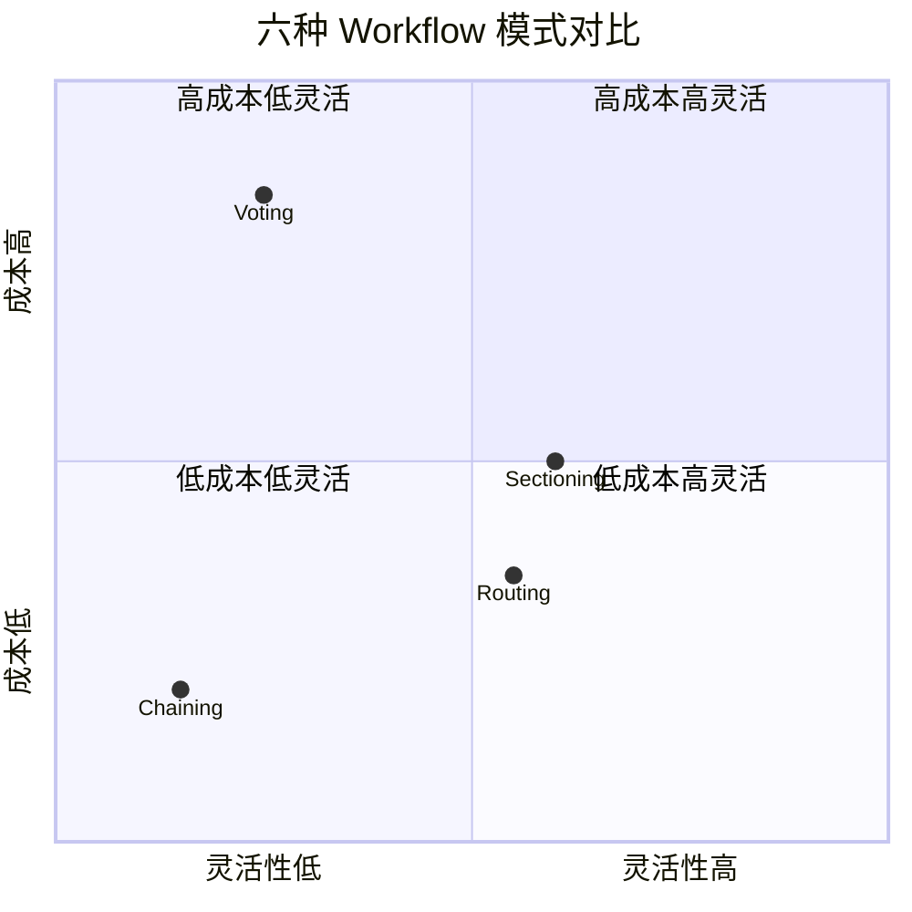
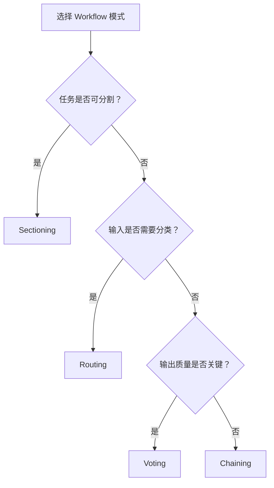

# 六种Workflow模式

> 本章是 **Hermes Engineering 系列**第 4 模块的第 3 章。

从确定性到并行化的模式光谱——Chaining 用确定性结构对冲不确定性，Routing 分而治之，Sectioning 用成本换效率，Voting 用算力换确定性。

---

## Prompt Chaining

用确定性结构对冲不确定性。将复杂任务拆解成一系列固定的步骤，每个步骤的输出作为下一个步骤的输入。

```
用户查询 → [步骤1: 理解意图] → [步骤2: 检索信息] → [步骤3: 生成回答] → 输出
```

每个步骤是独立的 LLM 调用，有明确的输入输出格式。像工厂流水线——每个工位只做一件事，产品在流水线上依次通过。

**优势**：流程可控可预测，每步可独立测试调试，中间结果可缓存复用。

**劣势**：灵活性差，无法处理计划外的情况，某个步骤失败整个链断裂。

**适用场景**：流程固定的标准化任务——文档处理、数据转换、格式化输出。

---

## Routing

分而治之的关注点分离。根据输入特征将请求路由到不同的处理路径。

```
用户查询 → [路由器: 意图分类] → ┬→ [技术支持 Agent]
                                ├→ [销售咨询 Agent]
                                └→ [投诉处理 Agent]
```

路由器本身是一个轻量 LLM 调用，只做分类不做处理。分类后将请求交给专门的 Agent 处理。

**优势**：每个处理路径可以针对特定场景优化，资源不会浪费在无关处理上。

**劣势**：路由器的分类准确率是瓶颈——分错了后面的处理全白费。

**适用场景**：客服系统、多领域问答、有明确分类维度的场景。

---

## Sectioning

用成本换效率的并行结构。将输入分成多个独立部分，每个部分由独立的 Agent 并行处理，最后合并结果。

```
长文档 → ┬→ [Agent 1: 摘要第1-3章]
         ├→ [Agent 2: 摘要第4-6章]
         └→ [Agent 3: 摘要第7-9章]
    → [合并: 生成完整摘要]
```

**优势**：大幅降低延迟（并行处理），充分利用资源。

**劣势**：部分之间可能有依赖关系，分割点选择不当会导致信息丢失，合并逻辑可能复杂。

**适用场景**：可自然分割的任务——长文档摘要、批量数据处理、多文件代码审查。

---

## Voting

用算力换确定性的投票机制。同一个任务交给多个 Agent 独立处理，然后通过投票或合并策略选出最佳结果。

```
用户查询 → ┬→ [Agent 1: 回答A]
           ├→ [Agent 2: 回答B]
           └→ [Agent 3: 回答A]
    → [投票: 回答A 胜出]
```

**优势**：提高输出质量和可靠性，减少随机性带来的波动。

**劣势**：成本是 N 倍（N 个 Agent 同时跑），延迟取决于最慢的那个。

**适用场景**：高价值输出、需要高确定性的关键决策、对抗 LLM 随机性的场景。

---

## 模式对比



> 💡 **图解：** 没有最优模式——Chaining 最便宜最死板，Voting 最贵最可靠，选型取决于任务的灵活性和成本容忍度。

| 模式 | 核心思想 | 灵活性 | 成本 | 延迟 | 适用场景 |
|---|---|---|---|---|---|
| **Chaining** | 确定性流水线 | 低 | 低 | 串行 | 流程固定的标准任务 |
| **Routing** | 意图分类路由 | 中 | 中 | 取决于路径 | 多领域多场景 |
| **Sectioning** | 并行分割 | 中 | 中 | 并行低延迟 | 可分割的批量任务 |
| **Voting** | 多数表决 | 低 | 高 | 并行高可靠 | 高价值关键决策 |

四种模式是确定性编排的基础。它们的共同特点是流程在执行前就已经确定——Agent 不需要做决策，只需要按预定流程执行。

---

## 选型指南



> 💡 **图解：** 从 Chaining 开始——它最简单最可控，需要并行用 Sectioning，需要分类用 Routing，需要高可靠用 Voting。

选择模式之前先问三个问题：

**任务是否可分割？** 可以自然分成独立子任务 → Sectioning。不能 → 继续下一个问题。

**输入是否需要分类？** 有明确的分类维度（意图、领域、类型）→ Routing。没有 → 继续。

**输出质量是否关键？** 关键到需要多 Agent 验证 → Voting。不关键 → Chaining。

大多数情况下，从 Chaining 开始——它最简单最可控。需要并行化时用 Sectioning，需要分类时用 Routing，需要高可靠性时用 Voting。

---


---

## ⚠️ 常见错误

| ❌ 错误做法 | ✅ 正确做法 | 为什么 |
|:---|:---|:---|
| 简单任务用 Orchestrator-Workers | 简单任务用 Chaining 就够了 | 过度设计增加延迟和成本 |
| 需要并行的任务用 Chaining | 用 Sectioning 或 Orchestrator-Workers | Chaining 是线性的，不支持并行 |
| 需要迭代打磨的任务只跑一遍 | 用 Evaluator-Optimizer 模式 | 质量需要多轮反馈 |
| Voting 模式只投 1 票 | 至少投 3 票取多数 | 1 票等于没有投票机制 |

---

## 🎮 交互式模式探索器

点击不同模式标签，查看流程图、适用场景和优劣势：

<WorkflowExplorer />

---

## 本章要点

- Chaining：确定性流水线，流程固定可预测
- Routing：意图分类路由，路由器准确率是瓶颈
- Sectioning：并行分割降低延迟，注意分割点和合并逻辑
- Voting：多 Agent 独立处理投票选出最佳，成本 N 倍
- 选型三问：可分割？需分类？质量关键？

---

**上一章**: [指挥官与工人](./02-指挥官与工人.md) | **下一章**: [动态编排与迭代](./04-动态编排与迭代.md)
