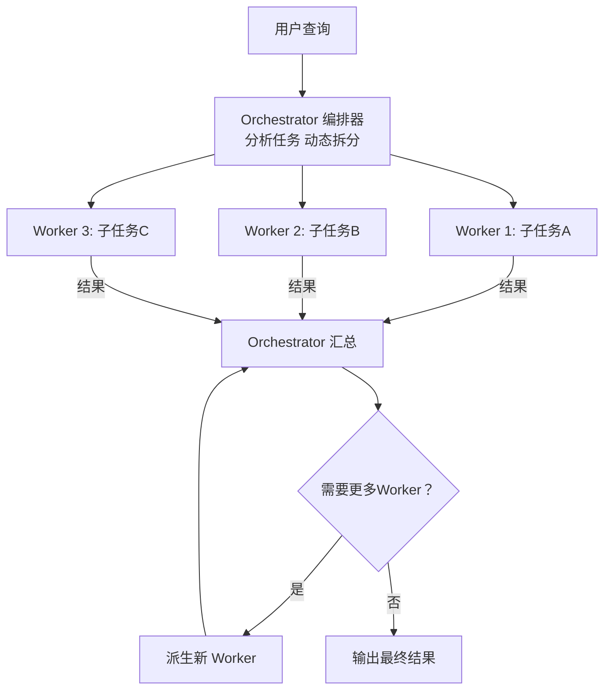
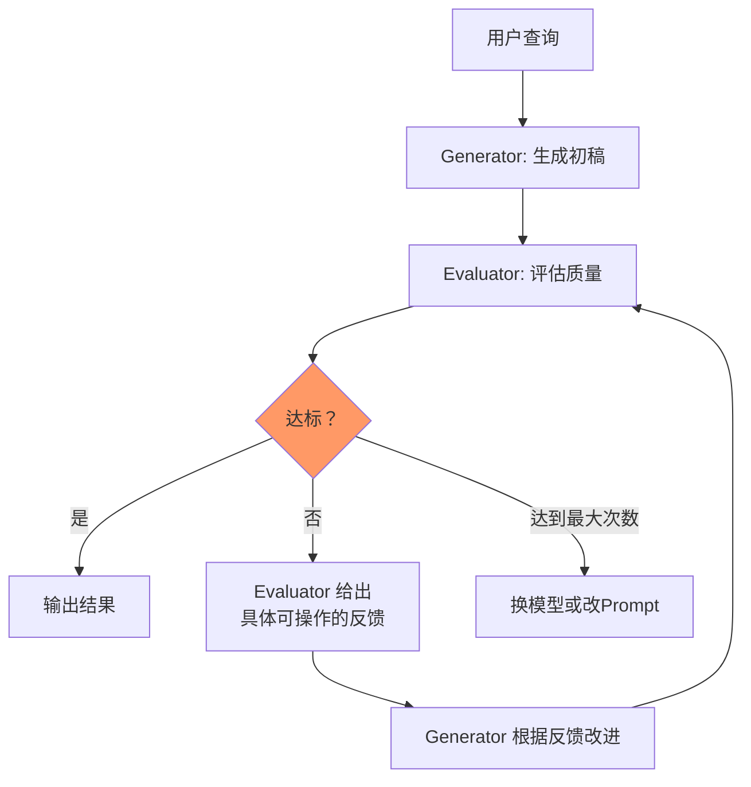

# 动态编排与迭代

> 本章是 **Hermes Engineering 系列**第 4 模块的第 4 章。

从静态 Workflow 到动态编排——Orchestrator-Workers 动态拆分并行，Evaluator-Optimizer 用反馈循环打磨质量。

---

## Orchestrator-Workers：动态拆分的并行架构



> 💡 **图解：** 编排器做元决策——它不做具体工作，只决定谁做什么、拆几份、何时收工。

前面讲的四种模式都是确定性编排——流程在执行前就已确定。Orchestrator-Workers 模式则引入了动态性：编排器根据实时情况动态决定如何拆分任务和分配 Worker。

```
用户查询 → [Orchestrator: 分析任务，动态拆分子任务]
              ├→ [Worker 1: 处理子任务A]
              ├→ [Worker 2: 处理子任务B]
              └→ [Worker 3: 处理子任务C]
         → [Orchestrator: 汇总结果，决定是否需要更多 Worker]
```

### 与 Sectioning 的区别

Sectioning 的分割是预设的——你事先知道要把文档分成三段。Orchestrator-Workers 的分割是动态的——编排器先审视任务，根据复杂度和依赖关系决定如何拆分、派几个 Worker。

这意味着编排器本身是一个 LLM 调用，它做的是元决策：不做具体工作，只决定谁做什么。

### 优势与代价

**优势**：能处理未知结构的任务——你不需要提前知道任务能分成几部分。Worker 数量和分配随任务复杂度自动调整。

**代价**：编排器的决策质量是瓶颈——拆分不当会导致 Worker 做无用功。额外的编排器调用增加延迟和成本。Worker 之间可能存在隐性依赖，动态拆分可能忽略这些依赖。

### 典型场景

复杂研究任务：用户问"分析 SaaS 行业的 AI 趋势"。Orchestrator 先搜索初步信息，发现需要深入三个方向（基础设施层、应用层、投资趋势），动态派生三个 Worker 各自研究，最后汇总。

---

## Evaluator-Optimizer：用反馈循环打磨质量



> 💡 **图解：** 生成器和评估器是独立 Agent——评估不受"自己写的"偏见干扰，标准越客观迭代越有效。

这是 Reflection 模式的系统化实现。生成器产出初稿，评估器打分并给反馈，如果不达标则把反馈喂回生成器重新生成。

```
用户查询 → [Generator: 生成初稿]
              ↓
         [Evaluator: 评估质量，给出分数和反馈]
              ↓
         [达标？] → 是 → 输出
              ↓ 否
         [Generator: 根据反馈改进]
              ↓
         [Evaluator: 再次评估]
              ↓ (循环直到达标或最大次数)
```

### 关键设计

**评估标准必须客观可衡量**：完整性（覆盖所有要求的方面）、准确性（数据逻辑正确）、格式规范。差的标准是"写得更好""更有说服力"——模型无法可靠地评估主观质量。

**反馈必须具体可操作**：不能说"第三段不好"，要指出具体问题（"第三段缺少数据支持，需要添加 2024 年市场份额数据"）。

**最大迭代次数**：防止无限循环。通常 2-3 次迭代足够——如果 3 次还没达标，换模型或改 Prompt 比继续迭代更有效。

### 与 Reflection 的区别

Reflection 通常在单 Agent 内部实现——同一个 Agent 先生成再检查。Evaluator-Optimizer 是两个独立 Agent——Generator 和 Evaluator 有独立的上下文和角色定义。独立 Agent 的优势是评估不受生成过程的干扰——Generator 不会因为"自己写的"就偏向认可。

### 成本考量

每次迭代都是一次完整的生成 + 一次评估。3 次迭代 = 6 欍 LLM 调用。只对高价值输出使用这种模式——技术文档、研究报告、关键决策支持。

---

## 两种模式的组合

在实际系统中，这两种模式经常组合使用：

```
用户查询 → [Orchestrator: 拆分任务]
              ├→ [Worker 1 + Evaluator-Optimizer 循环]
              ├→ [Worker 2 + Evaluator-Optimizer 循环]
              └→ [Worker 3 + Evaluator-Optimizer 循环]
         → [Orchestrator: 汇总并做最终检查]
```

每个 Worker 内部可以有自己的质量打磨循环，Orchestrator 负责全局协调和最终汇总。

但要注意：嵌套的动态性和迭代会显著增加系统的复杂度和成本。在生产环境中，需要对这种组合有明确的成本预算和超时控制。

---

## 从静态到动态的演进

| 维度 | 静态 Workflow | 动态编排 |
|---|---|---|
| 流程确定时机 | 执行前 | 执行中 |
| 灵活性 | 低 | 高 |
| 可预测性 | 高 | 低 |
| 成本 | 可预估 | 难预估 |
| 调试难度 | 低 | 高 |
| 适用场景 | 流程已知的标准任务 | 结构未知的探索任务 |

演进路径：大多数系统从静态 Workflow 开始，当发现预设流程无法覆盖足够场景时，逐步引入动态编排。

---

## 本章要点

- Orchestrator-Workers：编排器动态拆分任务派生 Worker，适合未知结构任务
- Evaluator-Optimizer：生成→评估→改进循环，评估标准必须客观可衡量
- 两种模式组合使用但注意复杂度和成本控制
- 从静态到动态的演进：先用简单 Workflow 覆盖，不够再引入动态

---

**上一章**: [六种Workflow模式](./03-六种Workflow模式.md) | **下一章**: [选型与实践](./05-选型与实践.md)
