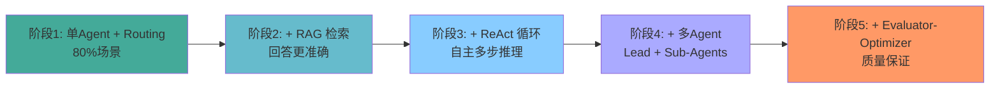
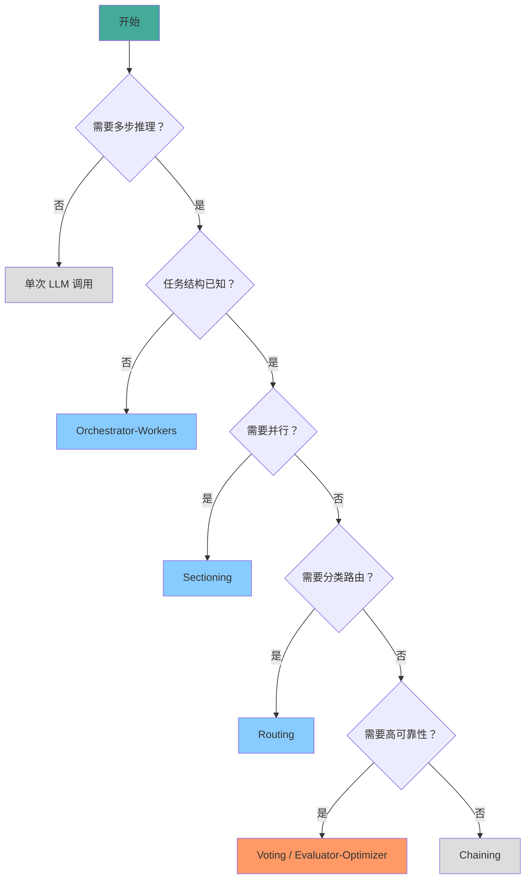

# 选型与实践

> 本章是 **Hermes Engineering 系列**第 4 模块的第 5 章。

怎么选？从简单开始，按需演进——没有银弹，只有权衡。

---

## 选型框架

选型没有标准答案，但有一个清晰的决策框架。

### 架构选型四问

**问题一：任务是否需要多步推理？**
- 否 → 直接调用 LLM，不需要 Agent 框架
- 是 → 继续

**问题二：步骤之间是否有依赖关系？**
- 否 → 可以并行（Sectioning）
- 是 → 需要串行或条件分支（Chaining / Routing）

**问题三：任务结构是否已知？**
- 是 → 静态 Workflow（Chaining、Routing、Sectioning）
- 否 → 动态编排（Orchestrator-Workers）

**问题四：输出质量是否关键？**
- 否 → 单 Agent 执行
- 是 → 加 Evaluator-Optimizer 循环

---

## 从简单开始

Anthropic 最新的 Agent 构建指南反复强调一个原则：**从简单开始**。

### 三种工作流模式

**第一种：单 Agent 单工具调用**。用户问一个问题，Agent 调用一个工具回答。最简单，覆盖 80% 的简单场景。

**第二种：单 Agent 多步 ReAct 循环**。用户给一个目标，Agent 在思考-行动-观察循环中自主完成。覆盖大部分中等复杂度场景。

**第三种：多 Agent 协作**。复杂任务需要多个 Agent 分工协作。只在前两种无法满足需求时才引入。

大多数团队的错误是从第三种开始——一上来就搭多 Agent 架构，结果系统复杂度远超需求，调试困难，成本高昂。

### 演进案例



> 💡 **图解：** 每个阶段都是在前一个阶段不够用时才引入——从阶段1走到阶段5是按需演进，不是一步到位。

**阶段一**：客服系统，单 Agent + Routing。根据用户意图路由到不同的回答模板。成本低、可控、覆盖 80% 场景。

**阶段二**：引入知识库。单 Agent + RAG 检索。回答更准确但流程不变。

**阶段三**：复杂问题需要多步推理。单 Agent + ReAct 循环。Agent 自主搜索、分析、生成报告。

**阶段四**：某些问题需要多角度研究。引入多 Agent——Lead Agent 协调，Sub-Agents 分别研究不同方面。

**阶段五**：高价值输出需要质量保证。引入 Evaluator-Optimizer 循环。

每个阶段都是在前一个阶段无法满足需求时才引入更复杂的架构。

---

## 选型决策树



> 💡 **图解：** 选型从简单开始——大多数任务 Chaining 就够了，真正需要复杂架构的场景是少数。

```
开始
  │
  ├─ 需要多步推理？── 否 ──→ 单次 LLM 调用
  │
  └─ 是
      │
      ├─ 任务结构已知？── 否 ──→ Orchestrator-Workers
      │
      └─ 是
          │
          ├─ 需要并行？── 是 ──→ Sectioning
          │
          └─ 否
              │
              ├─ 需要分类路由？── 是 ──→ Routing
              │
              └─ 否
                  │
                  ├─ 需要高可靠性？── 是 ──→ Voting 或 Evaluator-Optimizer
                  │
                  └─ 否 ──→ Chaining
```

---

## 常见错误

**过度工程**：一上来就搭多 Agent 系统，结果 80% 的功能用不上。从最简单的能工作的方案开始，按需演进。

**忽视成本**：每个 Agent 调用都是一次 LLM 调用。多 Agent 架构的成本随 Agent 数量线性甚至超线性增长。搭架构之前先算成本。

**忽略失败处理**：多 Agent 系统中任何一个环节失败都可能级联。必须有超时控制、重试机制、优雅降级。

**静态思维**：需求会变，架构要能演进。不要把当前的架构当成最终形态，设计时考虑可扩展性。

---

## 核心原则

1. **先让单 Agent 尽量工作**，不要急着引入多 Agent
2. **按需演进**，当前架构不够用时再升级
3. **成本意识**，复杂架构 = 更高成本
4. **可调试性**，越复杂的系统越难调试，设计时考虑可观测性
5. **从失败中学习**，每次失败都是架构改进的机会

---

## 本章要点

- 架构选型四问：多步推理？依赖关系？结构已知？质量关键？
- 从简单开始：单次调用 → ReAct → 多 Agent，按需演进
- 常见错误：过度工程、忽视成本、忽略失败处理、静态思维
- 核心原则：先让单 Agent 尽量工作，按需演进

---

**上一章**: [动态编排与迭代](./04-动态编排与迭代.md)

---

## 模块总结

多 Agent 架构系列全部完结，共 5 章：

| 章节 | 主题 | 核心洞察 |
|---|---|---|
| 1 | 何时用多Agent | 广度 vs 深度，验证型子Agent最安全 |
| 2 | 指挥官与工人 | Anthropic 的多 Agent 架构实践 |
| 3 | 六种Workflow模式 | Chaining/Routing/Sectioning/Voting |
| 4 | 动态编排与迭代 | Orchestrator-Workers/Evaluator-Optimizer |
| 5 | 选型与实践 | 从简单开始，按需演进 |

---

[← 返回首页](/) | [下一模块: Skill工程 →](/05-Skill工程/)
