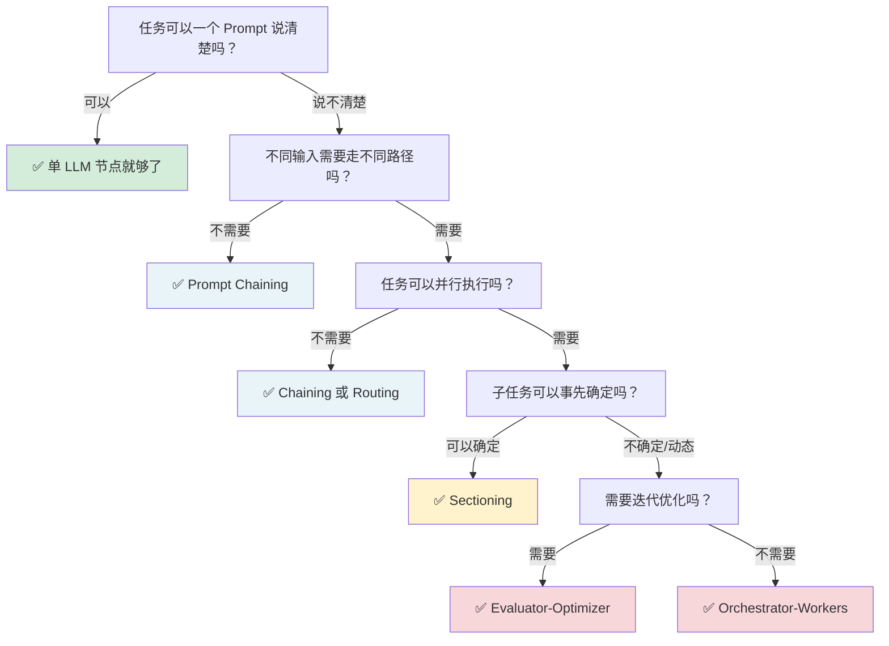
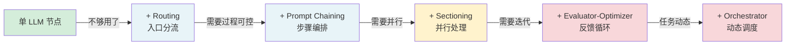

# 多 Agent 架构速查

> 快速查阅多 Agent 决策框架。按章节顺序阅读。

---

## 🔀 选型四问决策树

在考虑多 Agent 之前，先问自己四个问题：

> 💡 **核心洞察：默认解永远是单 LLM 节点。只有在单节点确实解决不了时，才引入更复杂的结构。每增加一层复杂度，就增加一分调试成本。**

---

## 📊 六种 Workflow 模式全景对比

### 确定性编排（可预测执行路径）

| 模式 | 复杂度 | 并行度 | 输入特征 | 典型案例 |
|:---|:---:|:---:|:---|:---|
| **单 LLM 节点** | ⭐ | ❌ | 任务简单，一次说清 | 翻译、摘要、分类 |
| **Prompt Chaining** | ⭐⭐ | ❌ 串行 | 步骤固定，前后依赖 | 数据清洗→分析→报告 |
| **Routing** | ⭐⭐ | ❌ 分流 | 不同类型需要不同处理 | 客服按问题类型分流 |
| **Sectioning** | ⭐⭐ | ✅ 并行 | 同质任务可拆分 | 多语言翻译、批量摘要 |

### 动态编排（执行路径在运行时决定）

| 模式 | 复杂度 | 并行度 | 输入特征 | 典型案例 |
|:---|:---:|:---:|:---|:---|
| **Voting** | ⭐⭐ | ✅ 并行 | 需要一致性保障 | 代码审查、Fact Check |
| **Orchestrator-Workers** | ⭐⭐⭐ | ✅ 动态 | 任务复杂度不确定 | 多文件代码重构 |
| **Evaluator-Optimizer** | ⭐⭐⭐ | ✅ 迭代 | 需要反复打磨质量 | 写作、方案设计 |

---

## 🎯 "需要多 Agent 吗？" 自检清单

### 三类正收益场景（Anthropic 官方判断标准）

| 场景 | 为什么多 Agent 能赢 | 反面案例 |
|:---|:---|:---|
| **上下文保护** | 不同 Agent 用不同上下文，避免信息污染 | 如果子任务上下文可以共享，不要拆 |
| **并行化** | 同时做多件事，速度倍增 | 如果子任务必须串行，不要拆 |
| **专业化** | 不同 Agent 用不同工具/模型 | 如果所有任务同质，不要拆 |

### 快速判断表

回答以下问题（是=1分，否=0分）：

- [ ] 任务有明确的子任务划分？（+1）
- [ ] 子任务需要不同的工具/技能？（+1）
- [ ] 单 Agent 的上下文窗口装不下所有信息？（+1）
- [ ] 需要并行执行来提升速度？（+1）
- [ ] 需要一个 Agent 做、另一个 Agent 检查？（+1）

**得分 0-1**：单 Agent + 好的 Harness 就够了
**得分 2-3**：考虑 Workflow（Chaining/Routing/Sectioning）
**得分 4-5**：考虑完整的多 Agent 架构

---

## 🏗️ 指挥官-工人架构速查

### 系统组件职责

| 组件 | 职责 | 关键约束 |
|:---|:---|:---|
| **Lead Agent** | 理解目标→拆解任务→分配工作→汇总结果 | 唯一有全局视角，负责最终决策 |
| **Research Sub Agent** | 执行搜索、收集信息 | 只看到分配给自己的上下文 |
| **Citation Agent** | 验证引用来源、格式化引用 | 专注于引用质量和一致性 |

### 八条提示词工程原则

| 原则 | 说明 | 常见违反 |
|:---|:---|:---|
| **提供足够上下文** | 包含任务目标、约束、成功标准 | 只给一句话"帮我做这个" |
| **明确输出格式** | 指定 JSON/Markdown/代码格式 | 不指定格式导致输出不可解析 |
| **给出判断标准** | "好的结果长什么样" vs "差的结果长什么样" | 没有标准，Agent 自己判断 |
| **使用具体指令** | 用"检查第3行的type字段"而非"检查代码" | 模糊指令导致 Agent 遗漏 |
| **控制工具数量** | 最多 5-7 个工具，按任务选择 | 给全部工具导致选择困难 |
| **用 Few-shot 示例** | 3-5 个好的输入/输出对 | 只用文字描述规则 |
| **分阶段给指令** | 先给探索阶段的指令，再给执行阶段 | 一次性给全部指令，信息过载 |
| **定期审查提示词** | 模型升级后需要重新评估 | 提示词写完就不管了 |

---

## 🔄 从简单到复杂的演进路径

> 💡 **不要跳过阶段。从单 LLM 开始，只有在当前阶段解决不了问题时才演进到下一阶段。每一个箭头都代表一次"真的不够用了"的判断，而不是"想试试更高级的"。**

---

## 🚫 多 Agent 常见反模式

| 反模式 | 症状 | 修复方案 |
|:---|:---|:---|
| **过度拆分** | Agent 太多，协调成本 > 并行收益 | 合并同质 Agent，减少跨 Agent 通信 |
| **上下文污染** | 所有 Agent 共享完整上下文 | 隔离子 Agent 的上下文窗口 |
| **没有降级策略** | 某个 Agent 挂了整个流程停摆 | 设计超时和降级回退 |
| **大模型通吃** | 所有任务都用最强模型 | 简单任务用小模型，降本 80% |
