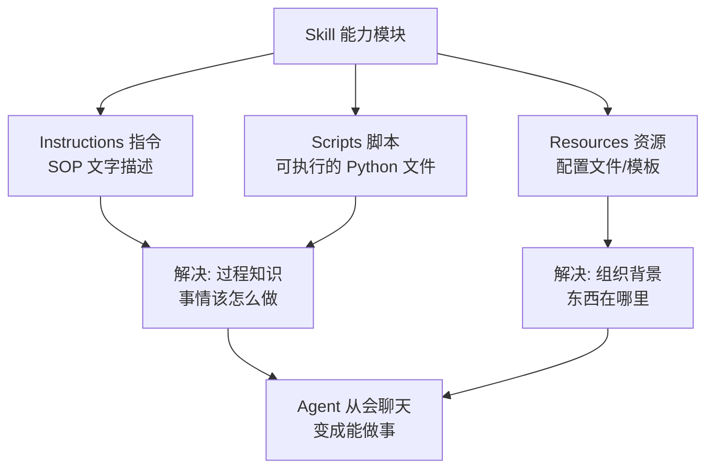

# Skill是什么

> 本章是 **Hermes Engineering 系列**第 5 模块的第 1 章。

Skill 是让 Agent 从会聊天到能做事的能力模块——由指令、脚本和资源组成的结构化文件夹。

---

## Agent 缺少的关键能力

Agent 在执行真实世界任务时面临两个巨大的能力差距：

**缺乏过程知识**——不知道事情该怎么做。就像一个聪明但没经验的新员工问"我们的报销流程是什么？""我该如何提交代码？"

**缺乏组织背景**——不知道东西在哪里。"项目 API 密钥在哪里？""PRD 模板在哪儿？"

没有这两样东西，Agent 就无法处理真实世界中的具体工作。

---

## Skill 的定义

Skill 是由指令、脚本和资源组成的结构化文件夹，智能体能够动态发现并加载这些内容，以提升特定任务的表现。

### 三要素

> 💡 **图解：** 指令和脚本解决"不知道怎么干"，资源解决"不知道东西在哪"——两者缺一，Agent 就是聪明但无能的新员工。

| 要素 | 对应 | 解决什么问题 |
|---|---|---|
| **Instructions（指令）** | 手册中的 SOP 文字 | 过程知识——告诉他如何一步步完成任务 |
| **Scripts（脚本）** | 需要执行的 Python 文件 | 过程知识——可执行的操作步骤 |
| **Resources（资源）** | 配置文件或模板（JSON、DOCX 等） | 组织背景——执行过程中用到的参考材料 |

过程知识的缺失由指令和脚本解决，组织背景的缺失由资源解决。

### 动态发现与加载

定义的后半句同样关键："智能体能够**动态发现并加载**这些内容"。Skill 不再被固定在系统提示中，而是可以被动态检索、挂载、使用。当 Agent 面对不同任务时，它会主动发现最相关的 Skills，加载其中的 SOP、脚本和模板。

Skill 不只是知识的存储单元，而是让 Agent 在特定场景下变得更专业的**能力模块**。

---

## Skill vs Tool

Tool 是原子操作——搜索、读文件、调 API。Skill 是过程知识——如何组合多个 Tool 完成一个复杂任务。

一个 Skill 可能包含：一段描述整个工作流的指令、几个辅助执行的脚本、执行过程中用到的模板文件。Agent 拿到 Skill 后，就像拿到了一本操作手册——知道该怎么做、用什么工具、参考什么模板。

---

## Skill 的本质

把一个 Agent 想象成一个聪明但没经验的新员工。这个新员工入职第一天什么都做不了，因为他面临两个巨大的能力差距。Skill 就是给新员工的标准化 SOP、入职指南或岗位手册——有了它，Agent 就能在特定场景下表现得像专家。

但和真正的手册不同，Skill 支持渐进式披露——不是一次性把所有内容塞给 Agent，而是让它按需发现和加载。这解决了上下文膨胀的问题，同时保留了完整的知识储备。

---

## 本章要点

- Agent 缺少过程知识和组织背景，Skill 解决这两个问题
- Skill 三要素：Instructions（SOP）、Scripts（可执行步骤）、Resources（模板）
- 动态发现与加载：不再固定在 System Prompt 中
- Skill vs Tool：Tool 是原子操作，Skill 是过程知识的组合
- 本质：给 Agent 的岗位手册，支持渐进式披露

---

**下一章**: [渐进式披露](./02-渐进式披露.md)

---

[← 返回首页](/) | [← 上一模块: 多Agent架构](/04-多Agent架构/) | [下一模块: Agent评估 →](/06-Agent评估/)
