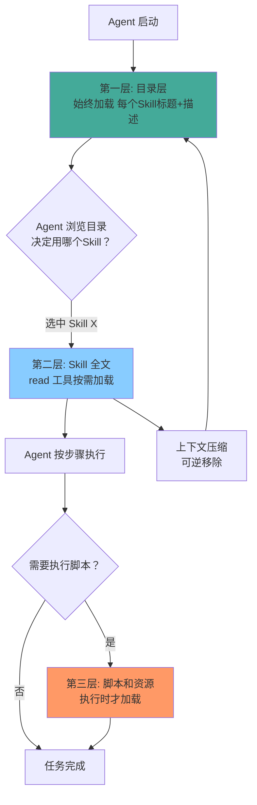

# 渐进式披露

> 本章是 **Hermes Engineering 系列**第 5 模块的第 2 章。

三层加载机制——近似无限上下文的秘密。不要一次性把所有能力暴露给模型，而是在需要的时候逐层展开。

---

## 为什么需要渐进式披露

如果把所有 Skill 的全文都塞进 System Prompt，会造成严重的上下文膨胀。100 个 Skill 每个 500 字就是 5 万字——Agent 还没开始干活，脑容量就被说明书占满一半。

而且当所有 Skill 都平铺在上下文中时，Agent 会眼花缭乱——更容易选择错误的 Skill，或者在不相关的 Skill 上浪费注意力。

---

## 三层加载机制



> 💡 **图解：** 三层加载像洋葱剥皮——目录只占一行，全文按需才来，脚本执行时才出现——能力无限增长但上下文始终精简。

### 第一层：目录层（始终加载）

每个 Skill 的标题和简短描述始终在上下文中。就像一本书的目录——你知道有哪些章节，但不知道每章的具体内容。

```
Available Skills:
- deploy-to-staging: 部署代码到预发布环境
- run-migration: 执行数据库迁移
- generate-changelog: 生成更新日志
```

这一层信息量极小，几乎不占用上下文空间。Agent 浏览目录，决定需要哪个 Skill。

### 第二层：Skill 全文（按需加载）

当 Agent 决定使用某个 Skill 时，用 `read` 工具读取该 Skill 的完整 `.md` 文件。内容包括详细的操作步骤、注意事项、示例代码。

```
Agent 决策: "我需要部署到预发布环境"
    ↓
Agent 执行: read("skills/deploy-to-staging.md")
    ↓
加载完整内容到上下文
    ↓
按步骤执行
```

这一层只在需要时才加载，用完后可以通过上下文压缩移除。

### 第三层：脚本和资源（执行时加载）

Skill 中引用的脚本文件和资源模板，只在真正执行时才被加载。比如 deploy Skill 引用了一个 `deploy.sh` 脚本，Agent 读取 Skill 文档后知道需要执行这个脚本，但脚本内容不会进入上下文——而是直接被 bash 执行。

---

## 实现方式

### Anthropic 的做法

Agent 启动时仅加载每个 Skill 的标题。当 Agent 决定使用某技能时，才用 `read` 工具完整读取。甚至连脚本也不必一开始就全部告知——Agent 通过 bash 工具在庞大脚本目录中自主寻找和阅读说明书。

### Cursor 的做法

结合 Grep（关键词搜索）和语义搜索两种发现方式。能用关键词就用关键词——确定性强、速度快、结果可解释。关键词不够再用语义匹配——解决关键词不一致问题。

MCP 工具同样按需加载：工具说明书卸载到文件系统，初始 Prompt 只保留极简菜单（名称+描述）。Agent 需要时主动读取说明书文件。Token 消耗减少 46.9%。

### Menlo 的做法

Agent 通过 `ls` 和 `--help` 在庞大脚本目录中自主寻找和学习。System Prompt 只提供关键的 API 文档索引，Agent 利用预训练编程知识组合积木块。

---

## 效果

**Token 效率**：Agent 的能力在不断增长，但工具列表并没有膨胀。上下文始终保持精简。

**认知聚焦**：Agent 不会在不相关的 Skill 上分心，注意力集中在当前任务需要的能力上。

**可扩展性**：新增 Skill 只需要在目录层增加一行描述，不需要修改核心 Prompt。系统功能可以无限扩展，但接口复杂度保持不变。

**用户体验**：当工具不可用时（比如 GitHub 账号掉线），Agent 不会说"我不会"，而是说"我有这个能力但现在需要重新登录"——从程序变成专业的合作伙伴。

---

## 设计原则

**渐进而非突变**：信息应该像水一样自然流动——从目录到全文到执行，每一层都只加载当下需要的内容。

**目录即承诺**：目录层是 Agent 的导航地图。目录描述不准确会导致 Agent 选择错误的 Skill。

**可逆的加载**：加载的内容应该可以被压缩或移除，不会永久增加上下文负担。

---

## 本章要点

- 三层加载：目录层（始终加载）→ Skill 全文（按需）→ 脚本资源（执行时）
- 发现方式：Grep 关键词 + 语义搜索
- 效果：能力增长但工具列表不膨胀，Token 效率提升 46.9%
- 设计原则：渐进、目录即承诺、可逆加载

---

**上一章**: [Skill是什么](./01-Skill是什么.md) | **下一章**: [开发、评估与安全](./03-开发与安全.md)
