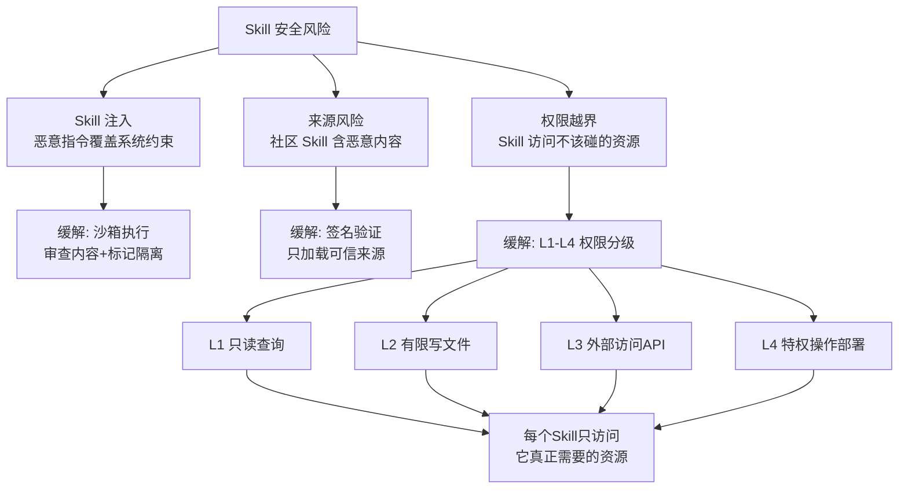

# 开发、评估与安全

> 本章是 **Hermes Engineering 系列**第 5 模块的第 3 章。

Skill 的完整实践指南——四条开发原则、安全考量、以及未来演进方向。

---

## 开发四原则

**最小化**：一个 Skill 只解决一个领域的问题。Skill 的 `.md` 文件超过 2000 字考虑拆分。描述中出现"同时""另外""顺便"可能需要拆分。

**可发现性**：用 Agent 能理解的语言写标题和描述，避免内部缩写。好的描述："部署代码到预发布环境，执行冒烟测试，等待人工确认后上线"。

**可验证**：每个 Skill 应有明确的成功标准——部署后检查服务健康、测试后检查报告、迁移后检查数据一致性。Agent 执行完 Skill 后能自我验证。

**可演进**：版本化管理，更新时记录变更日志。新版本不破坏已有 Agent 行为。

---

## Skill 目录规范

一个标准的 Skill 目录结构：

```
my-skill/
├── SKILL.md              ← 主文件：YAML 元数据 + 核心指令
├── references/           ← 参考文档（按需加载）
├── scripts/              ← 可执行脚本
└── resources/            ← 模板、配置等静态资源
```

**SKILL.md 结构：**

```yaml
---
name: my-skill
description: 简短描述这个 Skill 做什么
---
# 正文部分
核心指令和操作步骤...
```

- `name` 和 `description` 是 LLM 判断是否调用的依据，必须准确精炼
- 主文件只放核心流程，细节拆分到 references/
- 脚本通过工具执行而非读取内容
- 每个 Skill 独立目录

---

## 安全考量



> 💡 **图解：** 安全不是锦上添花——一个恶意 Skill 可能让整个 Agent 系统沦为攻击工具，权限分级是最后的防线。

**Skill 注入风险**：恶意 Skill 可能在指令中包含 Prompt Injection。缓解——沙箱执行、审查内容移除系统标记、明确告诉 Agent Skill 指令不能覆盖系统级约束。

**权限分级**：L1 只读（查询类）、L2 有限写（文件操作）、L3 外部访问（API 调用）、L4 特权操作（部署删除）。每个 Skill 只能访问它真正需要的资源。

**来源验证**：社区分享的 Skill 可能包含恶意内容。使用签名机制验证来源，只加载可信或经过审查的 Skill。

---

## 评估与未来

**自动化测试**：像测试代码一样测试 Skill——功能正确性、鲁棒性、Token 效率。A/B 测试新旧版本效果。

**未来演进**：Skill 市场（类似 npm 的注册中心）、自动 Skill 生成（从用户行为模式学习）、跨 Agent 复用（标准化接口）。

---

## 本章要点

- 开发四原则：最小化、可发现性、可验证、可演进
- 安全：注入风险、权限分级（L1-L4）、来源验证
- 评估：自动化测试、A/B 测试
- 未来：Skill 市场、自动生成、跨 Agent 复用

---

**上一章**: [渐进式披露](./02-渐进式披露.md)

---

[← 返回首页](/) | [下一模块: Agent评估 →](/06-Agent评估/)
