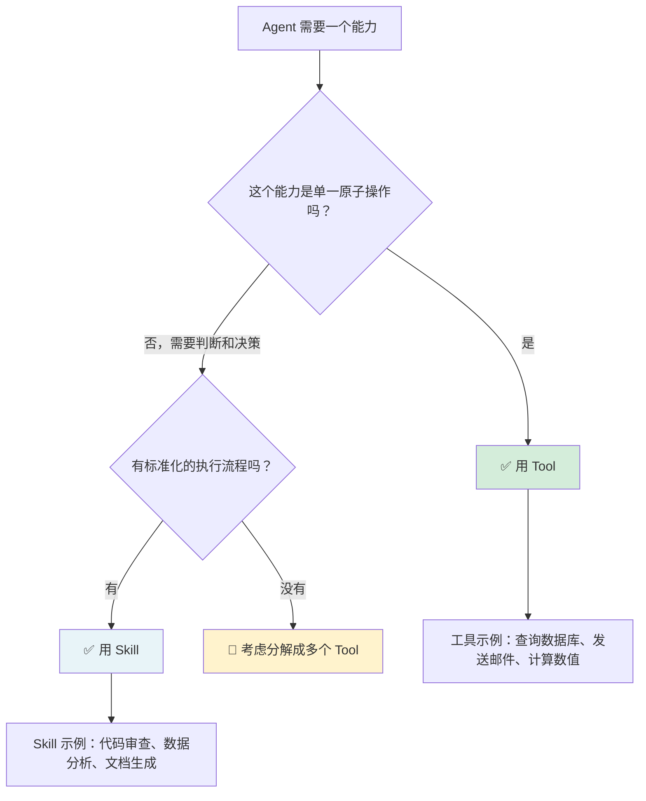
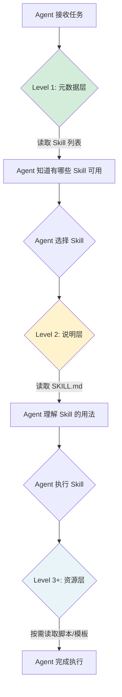

# Skill 工程速查

> 快速查阅 Skill 设计决策。按章节顺序阅读。

---

## 🔧 Skill vs Tool：什么时候用哪个？

| 维度 | Tool（工具） | Skill（技能） |
|:---|:---|:---|
| **类比** | 烤箱 | 食谱 |
| **本质** | 单一原子操作 | 可复用的过程知识 |
| **输入** | 简单参数（城市名、ID） | 上下文 + 约束 + 多个步骤 |
| **输出** | 确定性结果 | 可能有分支的流程 |
| **复杂度** | 低 | 中-高 |
| **复用性** | 跨任务复用 | 跨 Agent 复用 |
| **何时用** | 操作明确、步骤固定 | 需要判断和决策的过程 |
| **例子** | `get_weather(city)` | `review_code(file, criteria)` |

> 💡 **判断标准：如果 Agent 需要"思考"才能完成的任务，用 Skill。如果只是"执行"，用 Tool。**

---

## 📚 三层渐进式披露机制

### 机制全景

### 各层详细对照

| 层级 | 内容 | 何时加载 | Token 消耗 | 类比 |
|:---|:---|:---|:---|:---|
| **Level 1** | Skill 名称 + 一行描述 + 可用标签 | 每次对话开始 | ~100 tokens | 菜单目录 |
| **Level 2** | SKILL.md 完整说明（参数、用法、约束） | Agent 选择该 Skill 时 | ~500-2000 tokens | 菜单详情页 |
| **Level 3** | 辅助脚本、配置文件、模板 | Agent 需要执行时 | 按需加载 | 厨房里的食材 |
| **Level 4+** | 外部 API 调用、数据库查询 | 实际执行时 | 按需加载 | 外卖订单 |

### 为什么分层加载？

> 💡 **核心洞察：一次性加载所有 Skill 说明 = 把整本百科全书塞进上下文。Agent 会被信息淹没，关键指令反而被稀释。渐进式披露让 Agent 只看到当前需要的信息，其余保持在"附近但不在眼前"的状态。**

---

## 🛡️ 安全三原则

| 原则 | 做法 | 为什么重要 |
|:---|:---|:---|
| **可信来源** | 只使用官方/已验证的 Skill 包 | 恶意 Skill 可能注入后门 |
| **最小权限** | Skill 只能访问完成任务必需的资源 | 减小攻击面 |
| **审计记录** | 记录每次 Skill 的调用和结果 | 出问题可追溯 |

---

## ✅ Skill 开发四原则

| 原则 | 说明 | 实践要点 |
|:---|:---|:---|
| **从评估开始** | 先定义"怎么算用对了" | 写评估标准 > 写 Skill 本身 |
| **为规模设计** | 考虑多个 Agent 同时使用 | 冲突检测、版本管理 |
| **从 Agent 视角出发** | 以 Agent 能理解的方式组织 | 用 Seeing Like an Agent 原则 |
| **人机共创** | 人类和 Agent 协作设计 | 人类定标准，Agent 实现细节 |

---

## 🧩 Skill 设计检查清单

- [ ] SKILL.md 存在且结构清晰？
- [ ] 包含 Instructions + Scripts + Resources 三要素？
- [ ] Level 1 元数据简洁（名称 + 一行描述 + 可用标签）？
- [ ] Level 2 说明详细但不冗长（参数、用法、约束、输出格式）？
- [ ] 有评估标准（怎么算用对了、怎么算失败）？
- [ ] 渐进式披露已实现（不一次性加载全部资源）？
- [ ] 安全考虑（操作不可逆？需要沙箱？需要审批？）？
- [ ] 有 Few-shot 示例（3-5 个好的输入/输出对）？
- [ ] 有错误处理指引（什么错误可以重试、什么错误应该停止）？

---

## 🔮 Skill 的未来形态

| 趋势 | 说明 | 影响 |
|:---|:---|:---|
| **与 MCP 结合** | Skill 通过 MCP 协议标准化分发 | 跨平台 Skill 市场 |
| **共享发现** | Agent 之间互相学习 Skill | Skill 生态形成 |
| **自主创建** | Agent 根据任务自动创建 Skill | Skill 不再是人类写的 |
| **Skill 编排** | 多个 Skill 组合执行复杂任务 | 类似 API Gateway |
