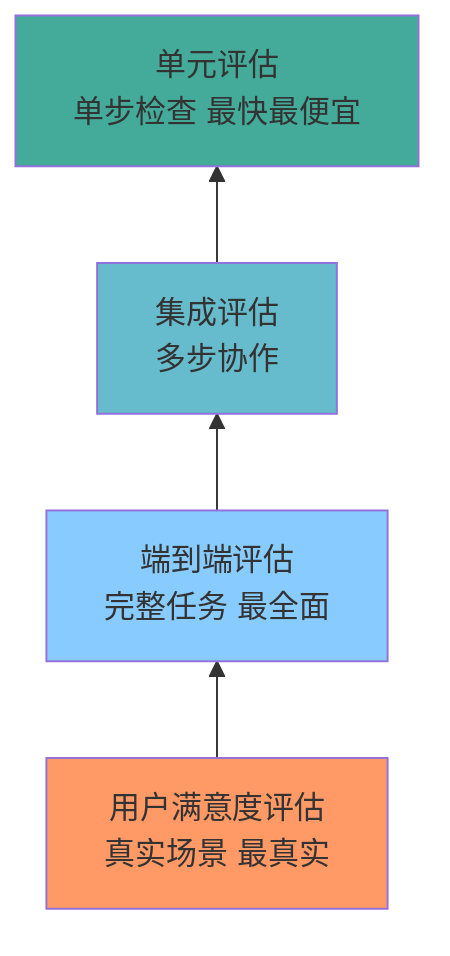

# 为什么需要评估

> 本章是 **Hermes Engineering 系列**第 6 模块的第 1 章。

Agent 不是自动贩卖机——同样的输入每次可能产出不同的结果。怎么衡量这种随机性？

---

## 评估的本质

传统软件测试很简单：输入 A，预期输出 B，运行检查是否等于 B。但 Agent 是概率性的——给定输入 A，它可能产出 B、C 或 D。每次运行的路径可能不同。

这意味着你不能用传统软件的"等于/不等于"来判断 Agent 的输出。你需要一套全新的评估方法。

评估的三元组：**输入（Input）+ 输出（Output）+ 评分器（Grader）**。你给 Agent 一个输入，它产生一个输出，评分器判断输出是否满足要求。

关键区别：传统测试的评分器是"等于"，Agent 评估的评分器可以是"代码能运行""格式正确""覆盖了所有要点"——更灵活但也更难实现。

```mermaid
flowchart TD
    A[评估三元组] --> B[Input 输入<br/>给 Agent 的任务]
    A --> C[Output 输出<br/>Agent 的回答]
    A --> D[Grader 评分器<br/>判断质量]
    B --> E[传统测试]
    C --> E
    D --> E
    E --> F[评分器 = "等于"<br/>确定性判断]
    A --> G[Agent 评估]
    C --> G
    D --> G
    G --> H[评分器 = 灵活标准<br/>代码能运行/格式正确/覆盖要点]
    style F fill:#ddd
    style H fill:#8cf
```

> 💡 **图解：** Agent 评估的核心难点不在"输入"和"输出"，而在"评分器"——概率性输出需要概率性评估。

---

## 驯服随机性

LLM 的输出质量不稳定。同一个问题问 10 次，可能有 3 次很好、5 次一般、2 次很差。你怎么衡量这种随机性？

### Pass@k

给一个问题，生成 k 个答案，至少有一个通过评估就算 Pass。这衡量的是"能力上限"——模型在最好情况下能做多好。

比如 Pass@5 = 90% 意味着：生成 5 个答案，90% 的概率至少有一个是对的。

**适用场景**：代码生成——你不在意模型第一次就写对，只要 5 次尝试内能写对就行。

### Pass^k

给一个问题，生成 k 个答案，全部通过评估才算 Pass。这衡量的是"可靠性下限"——模型在最差情况下不会差到哪去。

比如 Pass^5 = 70% 意味着：生成 5 个答案，70% 的概率全部都是对的。

**适用场景**：关键决策——你不能容忍任何一个错误答案。

### 两者的权衡

| 指标 | 衡量什么 | 适用场景 |
|---|---|---|
| **Pass@k** | 能力上限 | 代码生成、探索性任务 |
| **Pass^k** | 可靠性下限 | 关键决策、生产部署 |

大多数场景关注 Pass@k——Agent 可以尝试多次，只要最终能找到正确答案。但关键场景（金融决策、医疗建议）必须关注 Pass^k——不能容忍任何错误。

---

## 为什么需要自动化评估

手动评估不可扩展。一个 Agent 系统每天可能有数千次调用，人工评估每次输出的成本极高。而且人的判断标准不一致——同一次输出，不同评估者可能给出不同分数。

自动化评估的目标：用代码或模型代替人类来判断输出质量。速度快、成本低、标准一致。

但自动化评估不是银弹——有些质量维度很难自动化（创造性、审美、价值观）。自动化评估适合有明确标准的场景（正确性、格式、覆盖度）。

---

## 评估的层次

```
单元评估（单步）
  ↓
集成评估（多步）
  ↓
端到端评估（完整任务）
  ↓
用户满意度评估（真实场景）
```

**单元评估**：检查单次工具调用或单次 LLM 输出。成本最低、速度最快、但可能遗漏集成问题。

**集成评估**：检查多个步骤的协作。能发现步骤之间的衔接问题。

**端到端评估**：从输入到最终输出的完整流程。最接近真实使用场景，但成本最高、速度最慢。

**用户满意度**：真实用户的反馈。最真实但最难收集和量化。

从单元评估开始逐步向上。单元评估保证基础质量，集成评估保证协作正确，端到端评估保证整体效果。



> 💡 **图解：** 评估金字塔从下往上构建——先保证每个零件合格，再看组装，最后看整体使用体验。

---


---

## ⚠️ 常见错误

| ❌ 错误做法 | ✅ 正确做法 | 为什么 |
|:---|:---|:---|
| 没有评估就上线 | 先建评估基准线，再迭代优化 | 没有评估 = 随机数生成器 |
| 只用 Pass@1 评估 | 同时报告 Pass@k 和 Pass^k | Pass@1 无法反映稳定性 |
| 评估数据集不更新 | 定期刷新评估集，覆盖新场景 | 模型会过拟合旧评估 |
| 评估通过就万事大吉 | 评估是持续过程 | 模型会漂移，环境会变化 |

## 本章要点

- Agent 是概率性的，不能用传统"等于/不等于"判断
- 评估三元组：输入 + 输出 + 评分器
- Pass@k 衡量能力上限，Pass^k 衡量可靠性下限
- 自动化评估不可替代但有局限
- 四个层次：单元 → 集成 → 端到端 → 用户满意度

---

**下一章**: [评分器体系](./02-评分器体系.md)

---

[← 返回首页](/) | [← 上一模块: Skill工程](/05-Skill工程/) | [下一模块: 生产实践 →](/07-生产实践/)
