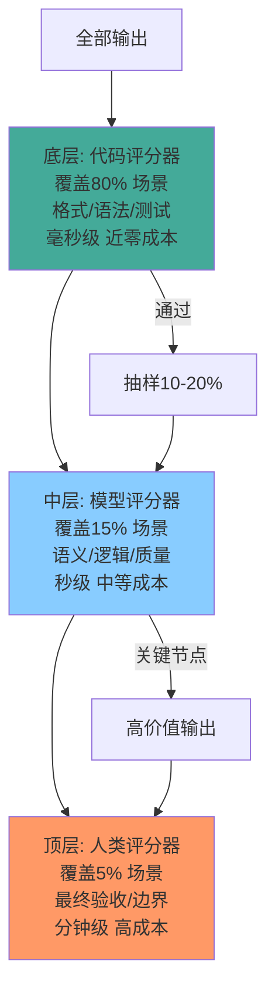

# 评分器体系

> 本章是 **Hermes Engineering 系列**第 6 模块的第 2 章。

代码、模型、人类——三种评分器的三角闭环。评估不是一次性工作，而是持续改进的循环。

---

## 三种评分器

### 代码评分器

用代码判断输出是否满足条件。最快、最便宜、最一致。

典型实现：检查输出是否包含特定关键词、JSON 格式是否正确、代码是否能编译通过、测试是否全部 Pass。

```
def grade_code(output):
    try:
        compile(output, '<string>', 'exec')
        return {"pass": True, "score": 1.0}
    except SyntaxError as e:
        return {"pass": False, "score": 0.0, "reason": str(e)}
```

**优势**：确定性——同样的输入永远给出同样的分数。速度快——毫秒级。成本低——不需要额外 LLM 调用。

**劣势**：只能判断能用代码表达的条件。不能判断创造性、语义正确性、风格。

### 模型评分器

用 LLM 判断输出质量。比代码灵活，能评估语义层面。

典型实现：把原始问题、Agent 输出、评估标准一起喂给评分模型，让评分模型打分并给出理由。

```
评估提示词：
问题：{query}
回答：{output}
评分标准：
- 准确性（0-4）：回答是否包含事实错误
- 完整性（0-4）：是否覆盖所有要求的方面
- 清晰度（0-4）：表达是否清楚易懂
请给出各项分数和总分，以及改进建议。
```

**优势**：灵活——能评估语义、逻辑、风格等软性指标。可解释——评分模型能给出打分理由。

**劣势**：不一致——同样的输出评两次可能分数不同。成本高——每次评分都需要 LLM 调用。有偏见——评分模型本身可能有系统性偏好。

### 人类评分器

人类判断输出质量。最准确但最贵最慢。

**适用场景**：高价值输出的最终验收、评分器校准（用人类评分来验证代码和模型评分器的准确性）、边界案例（自动化评分器判断不了的情况）。

---

## 评估金字塔



> 💡 **图解：** 80% 的评估用代码自动完成、15% 用模型语义检查、5% 留给人类——能用代码就不用模型，能用模型就不用人。

```
          /\
         /人\        ← 少量、高价值、高成本
        /模型\       ← 中量、中价值、中成本
       /代码 \      ← 大量、低成本、自动化
```

**底层：代码评分器**——覆盖 80% 的评估场景。格式检查、语法验证、测试执行。每个输出都过一遍。

**中层：模型评分器**——覆盖 15% 的评估场景。语义正确性、逻辑完整性、回答质量。对代码评分器通过的输出做进一步评估。

**顶层：人类评分器**——覆盖 5% 的评估场景。最终验收、边界案例、评分器校准。只在关键节点使用。

80% 的评估用代码评分器自动化完成，15% 用模型评分器做语义检查，5% 留给人类做最终判断。

---

## 评分器的校准

评分器本身也可能出错。需要定期校准——用人类评估结果来验证自动化评分器的准确性。

校准方法：随机抽样一批输出，同时用自动化评分器和人类评分。比较两者的打分一致性（Kappa 系数）。如果一致性低于阈值，需要调整评分器。

模型评分器尤其需要校准——不同版本的评分模型可能有不同的评分标准。定期用人类评分来锚定。

---

## 评分器的选择

| 维度 | 代码评分器 | 模型评分器 | 人类评分器 |
|---|---|---|---|
| 速度 | 毫秒级 | 秒级 | 分钟-小时级 |
| 成本 | 近零 | 中等 | 高 |
| 一致性 | 100% | 80-95% | 70-90% |
| 灵活性 | 低 | 中 | 高 |
| 适用 | 格式/语法/测试 | 语义/逻辑/质量 | 最终验收/边界 |

选择原则：能用代码判断的就不用模型，能用模型判断的就不用人。从最简单最快最便宜的评分器开始。

---

## 本章要点

- 三种评分器：代码（快便宜确定）、模型（灵活可解释）、人类（准确但贵慢）
- 评估金字塔：80% 代码 + 15% 模型 + 5% 人类
- 评分器需要校准：用人类评估验证自动化评分器准确性
- 选择原则：能用代码就不用模型，能用模型就不用人

---

**上一章**: [为什么需要评估](./01-为什么需要评估.md) | **下一章**: [四类评估与纵深防御](./03-四类评估与纵深防御.md)
