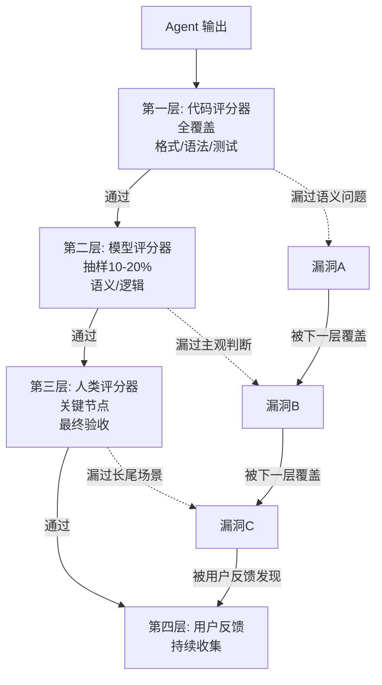

# 四类评估与纵深防御

> 本章是 **Hermes Engineering 系列**第 6 模块的第 3 章。

四类 Agent 各有评估策略——但单一评估有漏洞，必须纵深防御。

---

## 四类 Agent 的评估

### Coding Agent

最易评估——代码能编译、测试能通过、结果可复现。

评估维度：功能正确性（测试通过率）、代码质量（lint 评分、复杂度）、安全性（漏洞扫描）、性能（运行时间、内存使用）。

评估方法：SWE-Bench 等标准基准测试 + 自定义单元测试 + 集成测试。代码评分器是主力——编译检查、测试执行、lint 扫描。

### 对话 Agent

评估难度中等——回答质量主观性强。

评估维度：准确性（事实是否正确）、相关性（是否回答了用户的问题）、完整性（是否覆盖所有方面）、安全性（是否有不当内容）。

评估方法：模型评分器是主力——用评分模型判断回答质量。人工抽样验证评分器准确性。

### 研究 Agent

评估难度高——研究质量和深度难以量化。

评估维度：覆盖面（是否找到所有相关信息）、来源质量（引用是否可靠）、分析深度（是否有洞察）、报告结构（是否清晰易读）。

评估方法：混合——代码检查格式和来源链接有效性，模型评估分析质量，人类做最终验收。

### Computer Use Agent

评估难度最高——需要操作真实界面。

评估维度：任务完成率、操作效率（步骤数）、错误恢复能力、UI 理解准确性。

评估方法：端到端测试——给定任务描述，在真实环境中执行并检查最终状态。截图对比 + 状态检查。

---

## 瑞士奶酪模型



> 💡 **图解：** 每层评估都有盲区——像瑞士奶酪叠在一起，一层的洞被另一层盖住，整体防御远比单层可靠。

单一评估就像一片瑞士奶酪——有漏洞。多层评估叠在一起，漏洞互相覆盖，整体防御更可靠。

```
[代码评分器] → 漏洞 A
    ↓
[模型评分器] → 覆盖漏洞 A，但有漏洞 B
    ↓
[人类评分器] → 覆盖漏洞 B
```

每一层评估都有自己的盲区：代码评分器判断不了语义正确性，模型评分器可能有评分偏见，人类评分器可能有主观偏差。但三层叠在一起，各自的盲区被其他层覆盖。

### 纵深防御实践

**第一层：代码评分器（全覆盖）**——格式检查、语法验证、测试执行、安全扫描。每个输出都过一遍，成本近零。

**第二层：模型评分器（抽样）**——对代码评分器通过的输出做语义检查。不需要每次都跑——随机抽样 10-20% 做深度评估。

**第三层：人类评分器（关键节点）**——高价值输出的最终验收、评分器校准、边界案例处理。

**第四层：用户反馈（持续）**——真实用户的使用反馈。最真实但有延迟。

---

## 评估的边界

评估不是万能的。有些问题评估发现不了：

**分布外问题**：评估数据集只能覆盖已知场景。在未知场景中 Agent 可能失败，但评估不会检测到。

**对抗性输入**：恶意用户可能构造特殊输入绕过评估。

**长期退化**：评估通常是快照式的。Agent 可能在两次评估之间退化（比如模型更新后）。

**价值观和伦理**：很难用自动化评估判断。

应对方法：持续评估（不是一次性而是持续运行）、对抗性测试（主动寻找边界案例）、监控（生产环境中的行为追踪）。

---

## 实践建议

从代码评分器开始——成本最低效果最明显。逐步增加模型评分器覆盖软性指标。人类评分器只在关键节点使用。

评估数据集要持续更新——新的失败模式应该被加入评估集。评估结果要可视化——趋势比绝对值更重要。建立评估文化——每次发现 Bug 都问"为什么评估没检测到"。

---

## 评估漂移：当评估体系本身需要被评估

评估体系不是一成不变的。随着模型能力提升，两个问题会自然出现：

**评估饱和**：当所有测试用例通过率都接近 100%，评估体系就从"能力测试"退化为"回归测试"——只能告诉你"没有退步"，无法衡量"进步了多少"。

**评估偏移**：模型行为模式变化导致评分器给出不准确的分数。经典案例：评分器期望 `96.1249911`，模型输出 `96.12` 被扣分——实际是评分器太僵化。

**应对策略：**
- 定期审查评估结果分布——分数方差趋近于零说明评估已失效
- 每次模型升级后人工抽检 5-10% 结果
- 保留评估历史数据，排查通过率突变原因

---

## 本章要点

- 四类 Agent 评估难度递增：Coding < 对话 < 研究 < Computer Use
- 瑞士奶酪模型：多层评估叠在一起漏洞互相覆盖
- 纵深防御：代码（全覆盖）→ 模型（抽样）→ 人类（关键）→ 用户反馈
- 评估的边界：分布外、对抗性、长期退化、价值观
- 持续评估比一次性评估更重要

---

**上一章**: [评分器体系](./02-评分器体系.md) | **下一章**: [从零构建](./04-从零构建.md)
