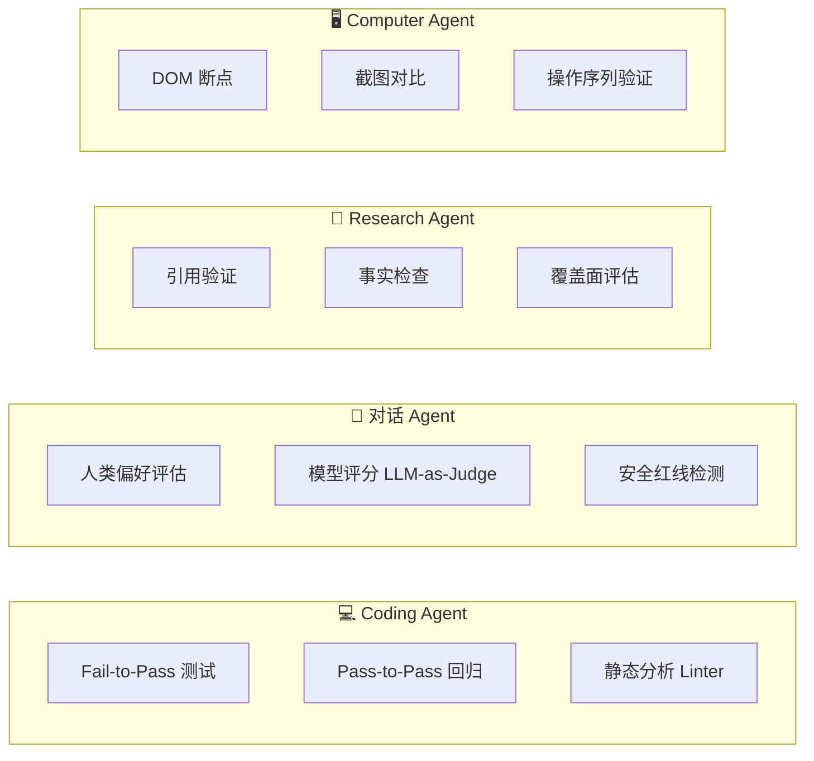
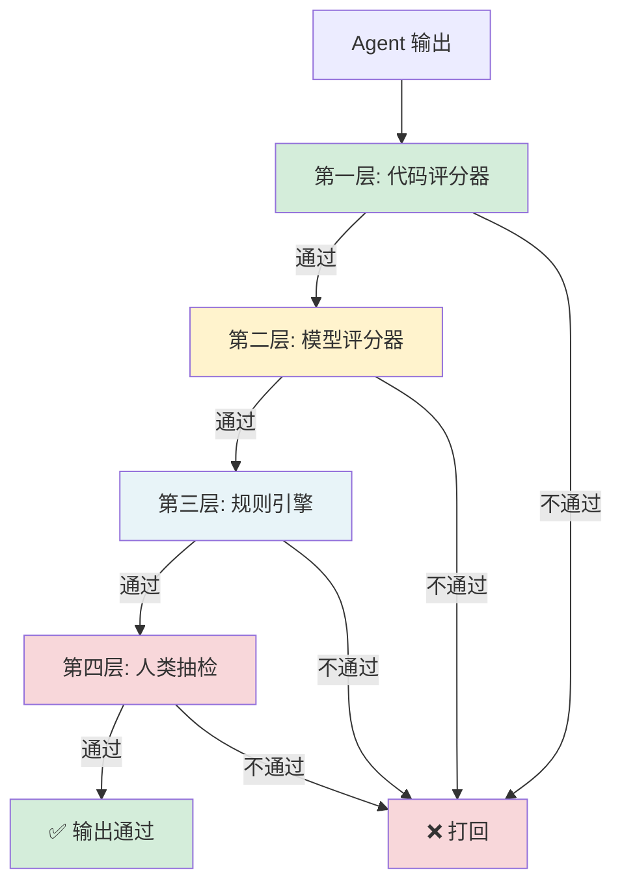

# Agent 评估速查

> 快速查阅评估方法和选择标准。按章节顺序阅读。

---

## 🎯 四类 Agent 评估策略



| Agent 类型 | 核心挑战 | 推荐评估策略 | 推荐评分器 |
|:---|:---|:---|:---|
| **Coding Agent** | 代码可运行 + 通过测试 + 不破坏现有功能 | Fail-to-Pass + Pass-to-Pass 双测试 | 代码评分器为主 |
| **对话 Agent** | 有帮助 + 无害 + 诚实 + 不胡说 | 人类偏好 + 模型评分 + 安全红线 | 模型 + 人类混合 |
| **Research Agent** | 事实准确 + 来源可靠 + 不遗漏关键信息 | 引用验证 + 事实检查 | 代码 + 模型 |
| **Computer Agent** | UI 操作正确 + 流程完整 + 异常处理 | DOM 断点 + 截图对比 | 代码评分器 |

---

## 📐 评分器选择指南

```mermaid
flowchart TD
    A[评估什么？] --> B{有明确的"正确答案"吗？}
    B -->|有| C{可以自动验证吗？}
    C -->|可以，有明确判断逻辑| D[✅ 代码评分器]
    C -->|不可以，需要语义理解| E[🤔 模型评分器]
    B -->|没有，主观性较强| F{需要专业领域知识吗？}
    F -->|不需要| E
    F -->|需要，涉及安全/合规| G[👥 人类评分器]
    
    style D fill:#d4edda
    style E fill:#fff3cd
    style G fill:#e8f4f8
```

### 三类评分器详细对比

| 评分器 | 速度 | 成本 | 精度 | 一致性 | 适用场景 |
|:---|:---:|:---:|:---:|:---:|:---|
| **代码** | ⚡ 极快 | 低 | 高（明确标准） | 完全一致 | 测试通过、格式检查、API 响应验证 |
| **模型** | 快 | 中 | 中高 | 中等 | 语言质量、相关性、事实性、意图匹配 |
| **人类** | 慢 | 高 | 最高 | 因人而异 | 复杂判断、安全审查、主观评价 |

### 代码评分器六大方法

| 方法 | 说明 | 典型应用 |
|:---|:---|:---|
| **正则提取** | 从回答中提取关键信息 | 提取 `order_id=\d{10}` |
| **二元测试** | Pass/Fail 判断 | 编译通过、测试通过 |
| **静态分析** | Linter/TypeChecker/安全扫描 | 代码风格、类型安全、漏洞检测 |
| **结果验证** | 直接查数据库/文件系统确认状态 | 文件是否真的删除了 |
| **工具调用验证** | 检查工具选择和参数是否正确 | 应该用 `get_weather` 不是 `search` |
| **格式验证** | JSON Schema、Markdown 结构 | 输出格式是否符合预期 |

### 模型评分器五大方法

| 方法 | 说明 | 典型应用 |
|:---|:---|:---|
| **语义相似度** | 计算两个文本的语义距离 | 摘要是否覆盖了关键点 |
| **事实性检查** | 验证陈述是否有依据 | 回答是否基于提供的上下文 |
| **意图匹配** | 检查是否完成了用户的意图 | 用户要的是对比，Agent 给的是列表 |
| **安全性检查** | 是否包含有害/不当内容 | 安全红线检测 |
| **结构完整性** | 检查输出是否结构完整 | 报告是否包含所有必要章节 |

---

## 🔐 纵深防御体系（瑞士奶酪模型）



> 💡 **瑞士奶酪模型：每层评估都有漏洞（"洞"），多层叠加后，漏洞重叠的概率大幅降低。单一评估方法永远有盲区，纵深防御才是唯一可靠的做法。**

### 各层评估方式速查

| 层 | 方式 | 检测什么 | 速度 | 成本 |
|:---|:---|:---|:---:|:---:|
| **L1 代码** | 正则、测试、静态分析 | 格式、语法、基本逻辑 | ⚡ | $ |
| **L2 模型** | LLM-as-Judge | 语义、意图、相关性 | 快 | $$ |
| **L3 规则** | 业务规则引擎 | 合规、安全、业务约束 | 快 | $ |
| **L4 人类** | 抽样人工审核 | 复杂判断、主观评价 | 慢 | $$$ |

---

## 📊 Pass@k vs Pass^k 概率统计

```mermaid
quadrantChart
    title 评估指标选择
    x-axis 低稳定性 --> 高稳定性
    y-axis 低能力 --> 高能力
    quadrant-1 高能力 + 低稳定性: Pass@k 更重要
    quadrant-2 高能力 + 高稳定性: 最佳状态
    quadrant-3 低能力 + 高稳定性: 稳定地失败
    quadrant-4 低能力 + 低稳定性: 需要根本改进
```

| 指标 | 公式 | 衡量什么 | 什么时候用 |
|:---|:---|:---|:---|
| **Pass@k** | k 次尝试中至少成功 1 次 | 能力上限（最佳表现） | 探索性任务、创意生成、研究 |
| **Pass^k** | 连续 k 次都成功 | 稳定性下限（可靠性） | 生产环境、关键路径、CI/CD |

**选哪个？**
- 想知道 Agent **能做什么** → Pass@k（衡量潜力）
- 想知道 Agent **可靠吗** → Pass^k（衡量稳定性）
- **两者都需要** → 同时报告（Pass@3=95%, Pass^3=72% 说明：能做但不稳定）

---

## 🗺️ 九步路线图（Anthropic 官方）

| 阶段 | 步骤 | 产出 | 预计时间 |
|:---|:---|:---|:---:|
| **发现** | 1. 梳理 Agent 核心能力 | 能力清单 | 1周 |
| | 2. 确定评估维度 | 评估框架 | |
| | 3. 定义评分标准 | 评分器设计 | |
| **构建** | 4. 收集评估数据 | 测试数据集 | 2-3周 |
| | 5. 实现评分器 | 评估管道 | |
| | 6. 搭建自动化管道 | CI 集成 | |
| **迭代** | 7. 运行首次评估 | 基准线报告 | 持续 |
| | 8. 分析结果找问题 | 改进方向 | |
| | 9. 优化 Agent 后重跑 | 改进曲线 | |

### 工具选型速查

| 工具 | 优势 | 适用场景 |
|:---|:---|:---|
| **Harbor** | 开源、轻量 | 小团队、快速启动 |
| **Promptfoo** | Prompt 评估专注 | Prompt 工程团队 |
| **Braintrust** | SaaS、可视化好 | 中大型团队 |
| **LangSmith** | 与 LangChain 集成 | LangChain 用户 |
| **自建** | 完全定制 | 特殊需求、大规模 |
