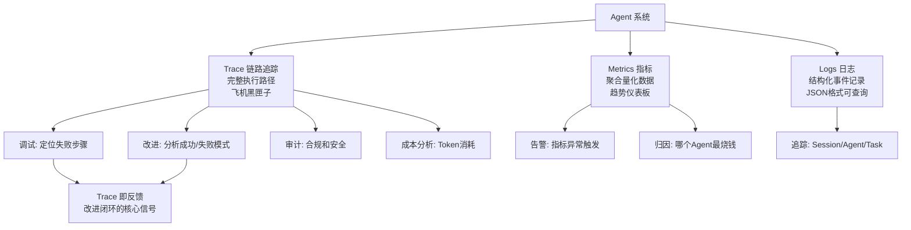
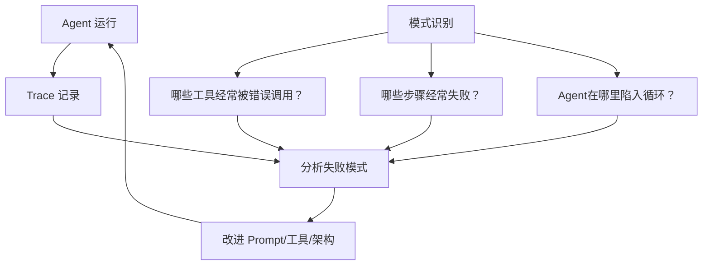

# 可观测性

> 本章是 **Hermes Engineering 系列**第 7 模块的第 1 章。

Trace/Metrics/Logs 三层可观测性——Trace 即反馈，没有 Trace 就没有改进方向。

---

## 为什么需要可观测性

Agent 系统是概率性的、多步骤的、可能长时间运行的。传统软件的可观测性（日志、监控、告警）仍然需要，但 Agent 还需要额外的维度。

传统软件可观测性关注：服务是否正常、响应时间是否达标、错误率是多少。Agent 可观测性还需要关注：Agent 在想什么、做了什么决策、为什么这样做、哪里失败了、Token 消耗了多少。

没有可观测性，Agent 就是黑盒。出了问题你不知道是 Prompt 的问题、工具的问题、还是模型的问题。LangChain 证明了 Trace 是整个改进闭环的核心信号——很多所谓"模型不够聪明"的问题其实是系统没有在合适的时机把正确的上下文交给模型。

---

## 三层架构



> 💡 **图解：** Trace 是飞机黑匣子——Agent 死了你得知道它在第几步出了什么问题，没有 Trace 就没有改进方向。

### Trace（链路追踪）

记录 Agent 的完整执行路径——每一次思考、每一次工具调用、每一次观察。像飞机的黑匣子，精确记录 Agent 在每一步做了什么。

```
Trace 示例：
[时间: 2024-01-15 10:30:01] [Agent: research] [Step: 1]
  Thought: 需要搜索竞品信息
  Action: web_search(query="OpenAI competitors 2024")
  Observation: 返回 10 条结果
  Tokens: 输入 1500, 输出 200
  Duration: 2.3s

[时间: 2024-01-15 10:30:04] [Agent: research] [Step: 2]
  Thought: 找到了 Anthropic 和 Google DeepMind 的信息
  Action: read_url(url="https://...")
  ...
```

Trace 的价值：调试（定位失败的具体步骤）、改进（分析成功和失败的模式）、审计（合规和安全审查）、成本分析（每个步骤的 Token 消耗）。

LangChain 的 Trace Analyzer Skill 把"读日志找问题"自动化：从 LangSmith 把所有运行轨迹拉下来，按批次切分启动多个分析子 Agent 并行跑，所有结论汇总成结构化的改进建议。



> 💡 **图解：** Trace 不只是事后调试——它是实时改进的燃料，LangChain 靠这套闭环推了 13.7 分。

### Metrics（指标）

聚合维度的量化数据——延迟、成本、成功率、Token 消耗。

关键指标：

| 指标 | 含义 | 为什么重要 |
|---|---|---|
| **Token 消耗/请求** | 每次交互的成本 | 直接影响费用 |
| **端到端延迟** | 从输入到输出的时间 | 用户体验 |
| **工具调用次数/任务** | Agent 执行效率 | 影响成本和延迟 |
| **任务成功率** | 完成率 | 核心业务指标 |
| **KV 缓存命中率** | 缓存效率 | 影响成本和延迟 |
| **上下文利用率** | 有效信息占比 | 影响输出质量 |

按 Agent、按任务类型、按时间维度聚合。趋势比绝对值更重要——指标在改善还是恶化？

### Logs（日志）

结构化的事件记录——工具调用、模型响应、错误信息、用户输入。

日志要结构化（JSON 格式便于查询）、要包含上下文（Session ID、Agent ID、Task ID）、要脱敏（PII 信息不要明文记录）。

---

## Trace 即反馈

Trace 不只是事后调试的工具，它是实时反馈的来源。

**诊断闭环**：Agent 运行 → Trace 记录 → 分析失败模式 → 改进 Prompt/工具/架构 → 重新运行。LangChain 用这套闭环把 Agent 跑分提升了 13.7 分。

**模式识别**：大量 Trace 中可以发现共性问题——哪些工具经常被错误调用？哪些步骤经常失败？Agent 在哪里容易陷入循环？

**成本优化**：Trace 记录了每一步的 Token 消耗。分析哪些步骤消耗最多 Token，是否有优化空间——比如上下文注入减少探索、工具响应转文件减少重复传输。

---

## 实现实践

### Trace 记录

每次 LLM 调用和工具调用都记录 Trace。使用 OpenTelemetry 等标准格式，便于集成现有工具。Trace 数据存入时序数据库（如 ClickHouse）支持大规模查询。

### 实时告警

设置关键指标的告警阈值：Token 消耗突然飙升、成功率下降、延迟增大。告警渠道：Slack、邮件、PagerDuty。

### 仪表板

构建 Agent 专属仪表板：实时展示活跃 Agent 数量、Token 消耗趋势、成功率分布、常见失败模式。支持按时间、Agent、任务类型筛选。

---


---

## ⚠️ 常见错误

| ❌ 错误做法 | ✅ 正确做法 | 为什么 |
|:---|:---|:---|
| 只监控 API 延迟 | 监控完整的 Agent Trace（工具调用链路） | API 延迟看不出 Agent 内部在做什么 |
| 日志只记录成功 | 同样详细记录失败和异常 | 失败信息是调试的关键线索 |
| 所有请求都全量 Trace | 按重要性采样 | 全量 Trace 成本太高 |
| 没有异常告警 | 设置成功率、延迟、Token 消耗告警 | 没有告警 = 出了问题才知道 |

## 本章要点

- 三层架构：Trace（执行路径）+ Metrics（聚合指标）+ Logs（事件记录）
- Trace 即反馈：诊断闭环、模式识别、成本优化
- 关键指标：Token 消耗、延迟、成功率、KV 缓存命中率
- 实践：结构化 Trace、实时告警、Agent 专属仪表板

---

**下一章**: [安全与权限](./02-安全与权限.md)

---

[← 返回首页](/) | [← 上一模块: Agent评估](/06-Agent评估/)
