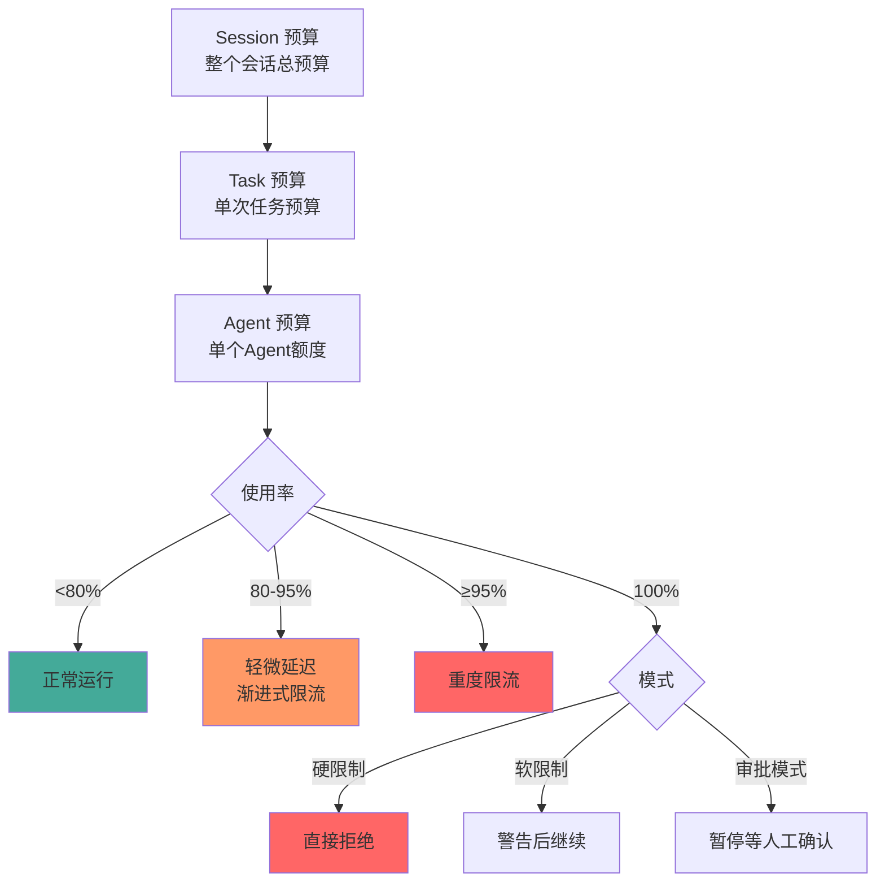
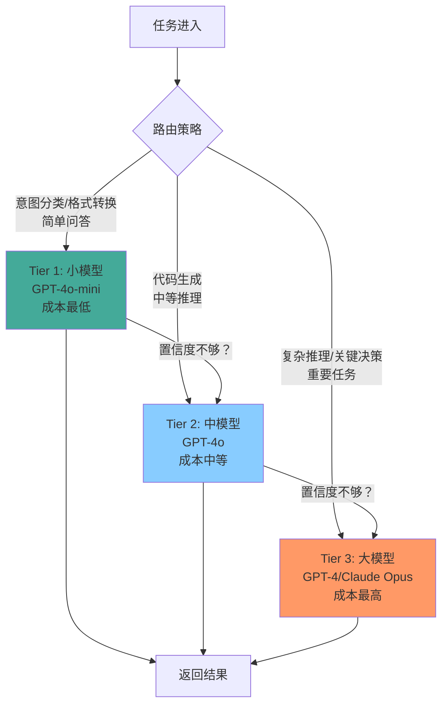

# 成本与可靠性

> 本章是 **Hermes Engineering 系列**第 7 模块的第 3 章。

Token 预算、分层模型、断点续传、优雅降级——让 Agent 系统在成本可控的前提下可靠运行。

---

## Token 预算控制

> 💡 **图解：** 预算控制是背压机制——不是到 100% 才断崖式停止，而是从 80% 开始渐进限流，给用户和系统缓冲时间。

每个 Token 都是钱。生产环境必须有预算控制——设定硬上限超了就停。

### 多层预算

Session 预算（整个会话总预算）→ Task 预算（单次任务）→ Agent 预算（单个 Agent）。分层让每个 Agent 都有自己的额度，不会相互挤占。

硬限制 vs 软限制 vs 审批模式：对外 API 用硬限制（防止单个用户烧光资源），内部工具用软限制（任务能完成更重要），关键任务用审批模式（超预算了让人确认是否继续）。

### 背压机制

预算压力增大时不是突然停止，而是渐进式限流——使用率 80% 时轻微延迟，95% 时重度限流。用户感知到响应变慢知道该省着点用，平滑降级有缓冲时间。

### 预算优化

上下文压缩减少输入 Token。工具响应转文件减少重复传输。缓存高频查询结果。选择合适大小的模型——不是所有任务都需要最大模型。

---

## 分层模型策略

> 💡 **图解：** 不是所有任务都需要最强模型——分层策略让 80% 的请求用便宜模型跑通，只把最贵的模型留给真正需要的场景。

不是所有任务都需要最强大最昂贵的模型。分层模型策略：用便宜模型做简单任务，贵模型留给真正需要的场景。

| 层级 | 模型 | 适用场景 | 成本 |
|---|---|---|---|
| **Tier 1** | 小模型（GPT-4o-mini） | 意图分类、格式转换、简单问答 | 最低 |
| **Tier 2** | 中模型（GPT-4o） | 代码生成、中等复杂度推理 | 中等 |
| **Tier 3** | 大模型（GPT-4、Claude Opus） | 复杂推理、关键决策 | 最高 |

路由策略：先用小模型尝试，如果小模型置信度不够再升级到大模型。或者按任务类型预设——分类任务用小模型，生成任务用大模型。

### 推理档位

同一模型有不同推理强度档位。LangChain 的实践：规划阶段用 X-High（最容易决定成败），实现阶段用 High（不需要过度推演），验证阶段再用 X-High（需要谨慎）。分段式算力分配把分数从 53.9% 推到 66.5%。

---

## 断点续传

长任务可能运行数小时。如果中间失败了从头再来成本太高。

### 持久化状态

Agent 的执行状态持久化到数据库：当前步骤、已完成子任务、中间结果。失败后可以从最近的检查点恢复而不是从头开始。

### Clean State 原则

Anthropic 的方案：每次会话结束前必须让代码库回到可运行状态。如果 Agent 引入错误且修复无果，用 Git 回退到上一轮稳定提交。这提供了低成本容错能力。

### 功能清单驱动

JSON 格式的功能清单，每次只做一个功能。Agent 醒来后读取清单、找到 `passes` 仍为 `false` 的条目、实现并测试、提交更新。默认失败原则——必须完成测试才允许改为 `true`。

---

## 优雅降级

Agent 系统中的任何组件都可能失败——LLM API 不可用、工具超时、数据库连接断开。系统需要优雅降级而不是直接崩溃。

### 降级策略

| 故障类型 | 降级策略 |
|---|---|
| **LLM API 不可用** | 切换到备用模型或缓存的响应 |
| **工具超时** | 返回错误让 Agent 尝试其他方法 |
| **向量数据库不可用** | 回退到关键词搜索 |
| **预算耗尽** | 停止 Agent 并返回已完成的部分结果 |

### 熔断器

下游服务故障时不傻傻重试。连续失败 N 次后进入熔断状态——拒绝请求、等待恢复、试探性放行。Shannon 的实现：失败 5 次后熔断 60 秒，60 秒后允许一个试探请求。

### 重试与退避

指数退避：0.5s → 1s → 2s → 4s。设置最大重试次数（通常 3 次）。区分可重试错误（网络超时）和不可重试错误（参数错误）。

---

## 成本监控

### 实时追踪

按 Session、Task、Agent 维度追踪 Token 消耗。实时告警——Token 消耗突然飙升时立即通知。

### 成本归因

每个 API 调用记录：输入 Token、输出 Token、缓存 Token、模型名称、调用者（哪个 Agent/Task）。支持按维度聚合分析——哪个 Agent 最烧钱？哪个工具调用成本最高？

### 优化目标

定期审查成本报告。识别高成本低价值的操作——可能是不必要的工具调用、重复的搜索、冗余的上下文。优化后重新评估成本变化。

---

## 可靠性保障

### 幂等性

Agent 的工具调用应该尽可能幂等——同样的输入多次执行结果相同。非幂等操作（发邮件、创建资源）需要去重机制。

### 超时控制

每层都有超时：工具调用超时（单次操作）、Agent 超时（单次任务）、Session 超时（整个会话）。超时后执行降级策略而不是无限等待。

### 健康检查

定期检查各组件状态：LLM API 可达性、工具服务可用性、数据库连接。健康检查失败时触发告警和自动切换。

---

## 本章要点

- Token 预算：多层预算 + 背压机制 + 优化策略
- 分层模型：便宜模型做简单任务，贵模型留给复杂推理
- 断点续传：持久化状态 + Clean State + 功能清单驱动
- 优雅降级：熔断器 + 重试退避 + 降级策略
- 成本监控：实时追踪 + 成本归因 + 定期审查

---

**上一章**: [安全与权限](./02-安全与权限.md)

---

## 模块总结

生产实践系列全部完结，共 3 章：

| 章节 | 主题 | 核心概念 |
|---|---|---|
| 1 | 可观测性 | Trace/Metrics/Logs、Trace 即反馈 |
| 2 | 安全与权限 | 沙箱隔离、L1-L4 分级、审计日志 |
| 3 | 成本与可靠性 | Token 预算、分层模型、断点续传、优雅降级 |

---

[← 返回首页](/)
