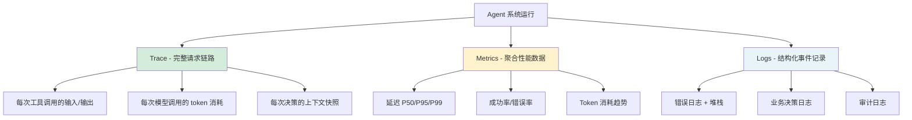
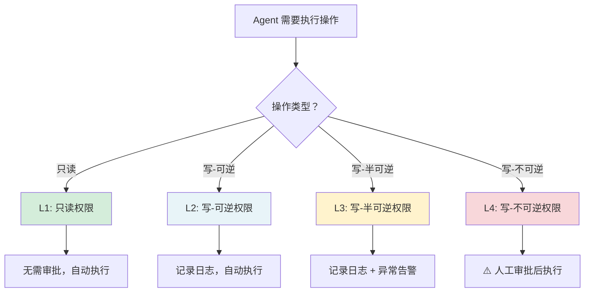
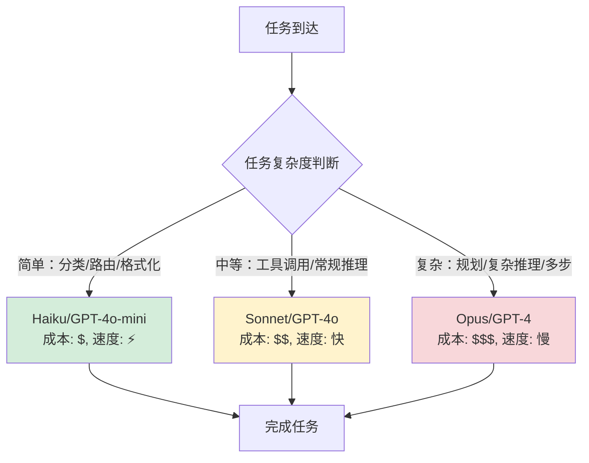
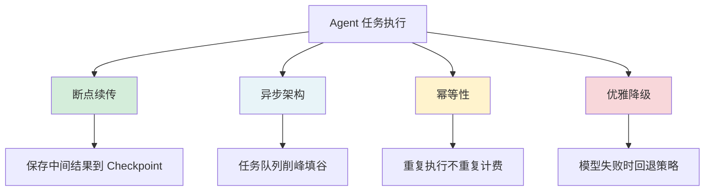
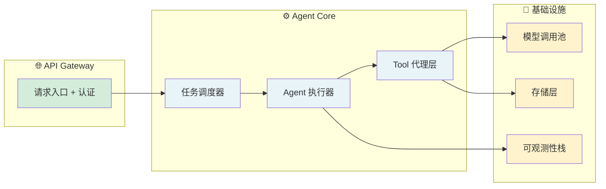

# 生产实践速查

> 快速查阅生产化决策标准。按章节顺序阅读。

---

## 📡 可观测性三层体系

> 💡 **核心洞察：Trace 是最值钱的数据——它既是调试工具（发现问题），也是评估数据源（衡量质量），还是优化依据（找到瓶颈）。没有 Trace 的 Agent 系统就像没有日志的服务器，出了问题只能猜。**

### Trace 采样策略

| 策略 | 做法 | 适用场景 |
|:---|:---|:---|
| **全量采集** | 记录每次请求的完整 Trace | 开发环境、关键路径 |
| **按错误采样** | 错误 100% 记录，成功 10% 记录 | 生产环境（推荐） |
| **按延迟采样** | 慢请求 100%，快请求 1% | 性能优化阶段 |
| **按用户采样** | 特定用户/租户全量 | 问题复现 |

---

## 🔒 权限分级速查

| 级别 | 典型操作 | 审批要求 | 风险等级 |
|:---|:---|:---|:---:|
| **L1 (只读)** | 查询数据库、读文件、搜索 | 无 | 🟢 |
| **L2 (写-可逆)** | 创建文件、提交代码、发邮件 | 记录日志 | 🟡 |
| **L3 (写-半可逆)** | 修改配置、推送代码、重启服务 | 记录 + 告警 | 🟠 |
| **L4 (写-不可逆)** | 删除数据、发布生产、修改权限 | 人工审批 | 🔴 |

> 💡 **安全原则：默认 L1，按需升级。永远不要给 Agent L4 权限而无人工审批。Agent 可能会撒谎说"已完成"，实际没有——所以 L3+ 的操作需要独立验证。**

---

## 💰 Token 预算控制

### 三级预算体系

| 层级 | 控制对象 | 典型上限 | 超限后果 |
|:---|:---|:---|:---|
| **单次调用** | 每个 API 请求 | ≤ 4K output tokens | 强制截断输出 |
| **单任务** | 一次 Agent 运行 | ≤ 50K total tokens | 告警 + 降级 |
| **Workflow** | 整个流程 | ≤ 200K total tokens | 中断 Workflow |

### 分层模型策略

| 任务类型 | 推荐模型 | 成本对比 |
|:---|:---|:---|
| 意图分类、路由分发 | 小模型 | 基准 $ |
| 常规工具调用、格式化 | 中模型 | $ × 3 |
| 复杂推理、多步规划 | 大模型 | $ × 15-30 |

> 💡 **关键技巧：80% 的 Agent 调用是"简单任务"（分类、路由、格式化），用小模型完成这些可以节省 80% 的成本。**

---

## 🔄 可靠性四层保障

| 机制 | 解决什么问题 | 典型实现 |
|:---|:---|:---|
| **断点续传** | 任务中断后恢复（不从头开始） | Checkpoint 到数据库/文件 |
| **异步架构** | 削峰填谷、避免阻塞 | 任务队列（SQS/Celery/BullMQ）|
| **幂等性** | 重复执行不重复计费 | 请求 ID + 幂等检查 |
| **优雅降级** | 模型失败时保证基本可用 | 降级到小模型 / 返回缓存结果 |

---

## 🏗️ 生产部署架构参考

### 关键架构决策

| 决策点 | 选项 | 推荐 |
|:---|:---|:---|
| **任务调度** | 同步 vs 异步 | 异步队列（可恢复、可扩展） |
| **模型调用** | 单池 vs 多池 | 多池（按模型类型分池，互不影响） |
| **存储** | 内存 vs 数据库 | 数据库（持久化 + 多实例共享） |
| **日志** | 文件 vs 专用栈 | 专用栈（ELK/Loki + Grafana） |

---

## 🚨 生产告警速查

| 指标 | 阈值建议 | 告警级别 |
|:---|:---|:---:|
| API 成功率 | < 95% | 🔴 P1 |
| 响应延迟 P95 | > 30s | 🟠 P2 |
| Token 消耗突增 | > 2× 平均 | 🟡 P3 |
| 单任务超时率 | > 10% | 🟠 P2 |
| 模型调用失败率 | > 5% | 🔴 P1 |
