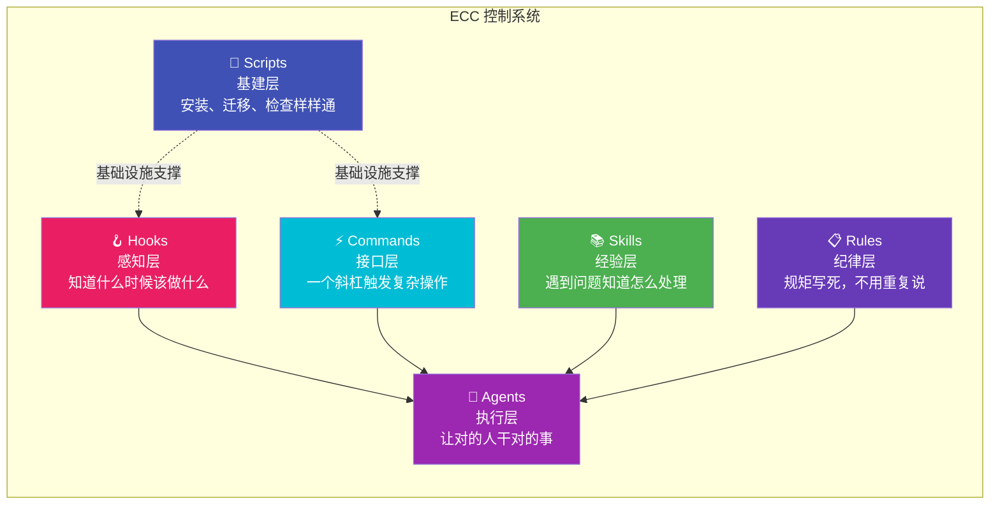
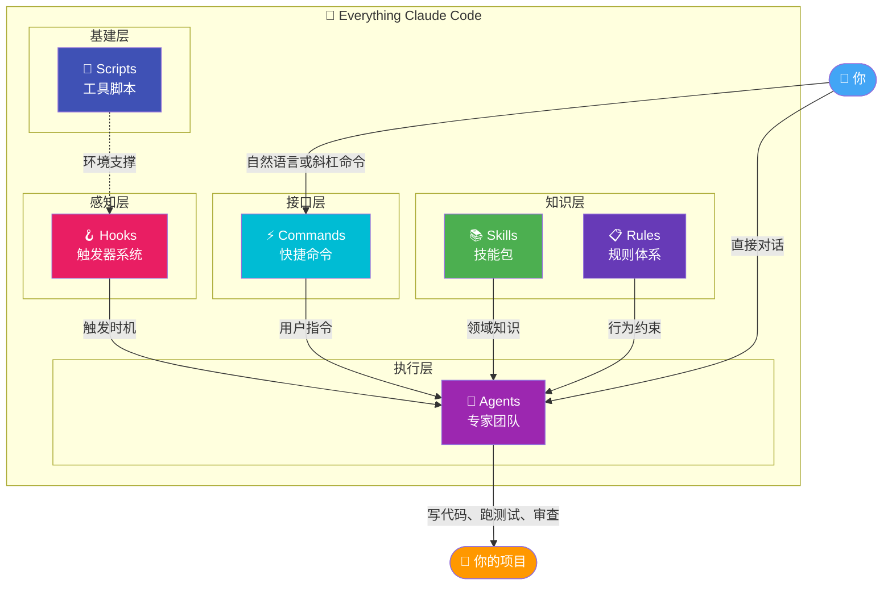

# 01-项目全景：ECC 不只是一堆配置文件，它是 AI Agent 的"缰绳"

---

## 先讲个概念：什么是 Agent Harness？

"Harness"这个词你可能在编程里见过——测试框架叫 Test Harness，CI/CD 工具叫 Build Harness。但它的原意其实是**马具**——就是马鞍、缰绳这些东西。

一匹马很强壮，能日行千里。但如果你直接骑上去，没有马鞍你坐不稳，没有缰绳你控制不了方向。马再好，你驾驭不了也没用。

**AI Agent 也是一样的。** Claude Code 是那匹强壮的马——TA 能写代码、能理解需求、能做复杂的工程任务。但如果你不给 TA 装上"缰绳"，你就会发现：

- TA 不知道你的项目规矩是什么
- TA 做完事不知道主动汇报
- TA 经常忘记之前的上下文
- TA 可能做出危险操作（比如把密钥提交到 GitHub）

**ECC 就是那套 Harness。** 它不是马本身（Claude Code），也不是骑手（你），而是让骑手能安全、高效地控制马的那套系统。

这个比喻很关键，因为很多人把 ECC 理解成"一堆配置文件"。不是的。配置文件只是 Harness 的零件，ECC 是把这些零件组装起来形成一套完整的控制系统。

---

## 为什么是这六个模块？一个完整的控制系统

如果你去研究 ECC 的目录结构，你会发现六个主要模块。看起来像是随意堆砌的？其实不是。这六个模块构成了一个完整的"控制系统"，每个模块负责控制链的一个环节：



让我用人话解释每个模块为什么存在：

**🪝 Hooks（感知层）—— "什么时候该做什么"**

没有 Hooks，Claude Code 是一个"没有触觉的机器人"。TA 不知道自己刚改了一个文件，不知道应该去格式化一下，不知道工作结束了应该存个档。Hooks 就是给 TA 装上"触觉"：在正确的时刻触发正确的动作。

**👥 Agents（执行层）—— "让对的人干对的事"**

一个 AI 什么都干，等于什么都不精。就像一个公司里，你不能让一个人又做前端、又做后端、又做测试、又做安全审计。Agent 系统把这些工作分配给专门的"专家"——每个专家的 system prompt 更短更精准，做的事更聚焦。

**⚡ Commands（接口层）—— "一个斜杠搞定"**

你经常要做的一套操作，比如"规划 → 设计 → 写代码 → 审查"。如果每次都要用自然语言描述一遍，太麻烦了。Commands 把这些流程封装成一个 `/plan` 或 `/tdd`——就像 VS Code 的快捷键，按一下就执行一套复杂操作。

**📚 Skills（经验层）—— "遇到问题翻菜谱"**

有些知识是领域特定的：TypeScript 怎么排查类型错误、Rust 怎么处理生命周期、React 性能怎么优化。这些知识不需要每次都从头教 AI——以 Skill 的形式存储，AI 遇到对应问题时自动查阅就行。就像厨师做菜前翻菜谱，而不是凭记忆从头想。

**📋 Rules（纪律层）—— "规矩立好，不用重复说"**

"代码要用 TypeScript strict 模式"、"变量命名用 camelCase"、"提交前必须跑测试"。这些规矩你跟 AI 说了十遍，第十一次 TA 还是会忘。Rules 把规矩写死在配置文件里，每次工作时自动加载。AI 不用"记住"规矩，规矩会自动"告诉"TA。

**🔧 Scripts（基建层）—— "让一切能跑起来"**

安装、迁移、健康检查、环境检测。这些是基础设施，不直接参与 AI 工作，但没有它们整个系统跑不起来。就像办公室的水电暖，你不直接用它们来工作，但没有它们你什么都干不了。

---

## 五个核心理念：每条都有"血的教训"

ECC 的设计不是拍脑袋想出来的，是 10 个月高强度实战中总结出来的。每一条理念背后，都有踩过的坑：

### 理念一：Agent-First（能用专家就用专家）

**血的教训：** 最早 ECC 没有 Agent 系统，所有事都靠主 Agent（Claude Code）一个人干。结果发现：主 Agent 的上下文窗口有限，塞太多系统提示词后，留给实际任务的空间就不够了。而且"通才"做出来的活儿，质量比不上"专才"。

**为什么这个方案：** 把不同任务分发给专门的 Agent。每个 Agent 的 system prompt 只包含跟自己职责相关的指令，更短更精准。比如 Security-Reviewer 的提示词里全是安全检查规则，不需要知道怎么写测试。这样每个 Agent 在自己的领域内做得更好，而且主 Agent 的上下文也更干净。

**对你的启发：** 如果你在构建自己的 AI 工作流，别试图让一个 prompt 干所有事。拆成多个专门的 Agent，每个 Agent 聚焦一件事，整体效果会好很多。

### 理念二：Test-Driven（先写测试，再写代码）

**血的教训：** AI 写的代码你敢直接用吗？说实话，大部分人不敢。AI 有时候会写出"看着对但有边界 bug"的代码，你肉眼很难看出来。没有测试，你永远不知道代码到底对不对。

**为什么这个方案：** 先写测试（定义"正确"是什么），再写代码（让测试通过）。测试是唯一的自动化验证手段。人可以看走眼，但测试不会骗人。ECC 把 80%+ 测试覆盖率作为硬性要求，不是为了指标好看，是因为只有这样才能放心地让 AI 写代码。

**对你的启发：** 不管你用不用 ECC，在 AI 写代码的工作流里加上"先写测试"这一步，你会省掉很多 debug 的时间。

### 理念三：Security-First（安全不是事后补救）

**血的教训：** AI 写代码的时候，有时候会把 API key 硬编码到配置文件里。你可能觉得"我不会犯这种错误"——但 AI 会，而且你不一定会注意到。一旦提交到 GitHub，后果很严重。

**为什么这个方案：** 在 Hooks 里加入安全扫描，在提交前自动检测硬编码密钥、SQL 注入风险、不安全的依赖。安全检查不是"可选的加分项"，是"必须通过的门槛"。

**对你的启发：** AI 是一个"听话但没常识"的员工。TA 会执行你的指令，但不一定理解安全后果。你需要在流程里加上安全检查，而不是依赖 AI 自己"注意安全"。

### 理念四：Plan Before Execute（先规划再动手）

**血的教训：** 你跟 AI 说"帮我重构这个模块"，AI 直接开始改代码。改到一半你发现方向错了——TA 理解的需求跟你实际想要的不一样。但代码已经改了一半，回退也不是，继续也不是，非常尴尬。

**为什么这个方案：** 强制要求"先规划再执行"。在 AI 动手改代码之前，先让 Planner 出一个方案，你确认后再执行。就像装修房子，你不会让工人直接开工——你会先出个设计图，你看了满意，再开始施工。

**对你的启发：** 复杂任务一定要先让 AI 列出计划。你可以用 `/plan` 命令触发，或者直接说"先别动手，先告诉我你打算怎么做"。多花 2 分钟确认方案，能省掉 20 分钟的返工。

### 理念五：Immutability（不改旧东西，只造新东西）

**血的教训：** AI 修改一个对象的属性时，直接在原对象上改了。结果其他地方引用这个对象的代码也跟着变了，出了一个很难排查的 bug。你花了一下午 debug，最后发现是 AI "好心"改了一个不该改的值。

**为什么这个方案：** Rules 强制要求：创建新对象返回，绝不修改原有对象。这看起来有点死板，但在 AI 编写代码的场景下，"不可变"比"灵活"更重要。因为你无法预测 AI 会在哪里修改什么，但你可以确定 TA 不会意外改掉你依赖的东西。

**对你的启发：** 如果你让 AI 写处理数据的代码，加上"不可变"这条规则。少一个 bug 排查，多一点确定性。

---

## 完整架构图：六大模块怎么配合



用户通过自然语言或斜杠命令跟 ECC 交互。Commands 把你的意图翻译成系统能理解的操作，Hooks 在正确时机触发对应的 Agent，Agent 在 Rules 的约束下，参考 Skills 的知识，执行具体任务。Scripts 在底层确保一切环境就绪。

---

## 与其他工具的对比：设计哲学的差异

你可能在想：Cursor 也有 AI 辅助、GitHub Copilot 也能写代码、我自己写 `.claude` 配置也能用——ECC 有什么不同？

关键不在于功能列表的差异，而在于**设计哲学的差异**：

| 特性 | ECC | Cursor | Copilot | 手写配置 |
|------|-----|--------|---------|---------|
| 设计哲学 | 完整控制系统 | 编辑器增强 | 代码补全 | 自定义 |
| 会话记忆 | ✅ 跨会话持久化 | ❌ 每次重新开始 | ❌ | 手动管理 |
| 自动化 Hooks | ✅ 20+ 预设触发器 | ❌ | ❌ | 自己写 |
| 专家团队 | ✅ 28 个专门 Agent | ❌ 单一模型 | ❌ | 自己配 |
| 安全检查 | ✅ 自动扫描 | ❌ | 基础 | 自己写 |
| 跨会话学习 | ✅ 持续学习 | ❌ | ❌ | 无 |
| 多 Harness 支持 | ✅ Claude/Codex/Cursor | 仅 Cursor | 仅 Copilot | 看情况 |

**核心差异是什么？**

- **Cursor** 的思路是"给编辑器加 AI"——AI 是辅助功能，你在编辑器里写代码，AI 帮你补全、解释、重构。重点是编辑体验。
- **Copilot** 的思路是"给 IDE 加自动补全"——AI 是一个更聪明的 IntelliSense，你写代码时 TA 在旁边提供建议。重点是代码生成。
- **ECC** 的思路是"给 AI Agent 装操作系统"——AI 是主角，你是导演。你告诉 AI 要做什么，ECC 确保 AI 做得对、做得好、做得安全。重点是控制和自动化。

**简单来说：** 别人在造锤子，ECC 在建工坊。锤子解决"钉钉子"的问题，工坊解决"做一个产品"的问题。你需要的不只是一个工具，而是一套工作系统。

---

## 安装：一行命令的事

```bash
# 安装 ECC
curl -fsSL https://raw.githubusercontent.com/affaan-m/everything-claude-code/main/install.sh | bash
```

就这么简单。安装完成后，ECC 会自动：

1. 把 Hooks 配置写入你的 Claude Code 配置
2. 安装 28 个 Agents 到正确位置
3. 部署 125 个 Skills
4. 配置 Rules 和 Commands
5. 检测你的项目语言和框架，适配相应的规则

**你不需要理解每个模块的细节** —— 默认配置就已经很好用了。后面几篇会帮你深入理解每个部分为什么要这么设计。

---

## 下一步

现在你知道 ECC 长什么样了。接下来读 [02-Hooks系统](./02-Hooks系统.md)，了解"智能门禁系统"是怎么工作的——这是整个 ECC 自动化的核心。理解了 Hooks，你就理解了 ECC 一半的魔力。
