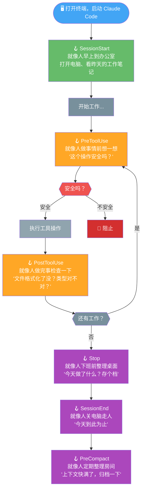
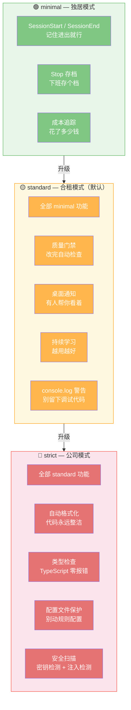

# 02-Hooks 系统：给 AI 助手装上"触觉"和"自律"

---

## 没有 Hooks 的 Claude Code 像什么？

想象你雇了一个超级聪明的员工。TA 的技术能力一流，但有一个致命问题：**TA 完全没有自我意识。**

- TA 改了一个文件，不知道应该去格式化一下
- TA 写完一段代码，不知道应该跑一下测试
- TA 忙了一下午，不知道应该把成果存个档
- TA 要做一件危险的事，不知道应该先问你一声

这不是 TA 不聪明，是 TA 没有"触觉"。TA 不知道自己刚做了一件事，更不知道做完之后应该做什么。

你可以每次手动提醒 TA——"改完文件记得格式化"、"写完代码跑一下测试"、"别忘了存档"。但你会累死，而且 TA 会忘。

**Hooks 就是给 TA 装上"触觉"和"自律"。** 在特定时刻自动触发特定动作，不需要你手动干预。就像人的神经系统——碰到烫的东西，手会自动缩回来，不需要大脑专门思考"我要缩手了"。

---

## 为什么是这个生命周期？从人是怎么做事的来理解

ECC 定义了 6 个 Hook 点，覆盖了一个工作周期的每一个关键时刻。这不是随意设计的，而是从"人是怎么做事的"来理解的：

让我用人话解释每个 Hook 为什么存在：

### SessionStart —— 早上到办公室

你每天早上到办公室，第一件事是什么？打开电脑，看看昨天的工作笔记，回忆一下做到哪了。

SessionStart 做的就是这件事。Claude Code 启动时，ECC 自动加载上次会话保存的记忆——昨天讨论了什么、改了哪些文件、遇到了什么问题。TA 不用你从头介绍，TA 自己会"想起来"。

**这个 Hook 解决了"不记事"的痛点。** 没有这个 Hook，你每次重启终端都要把背景重新说一遍。

### PreToolUse —— 做事前想一想

你准备提交代码了，按 Git commit 之前，你会想一想："我改了什么？有没有漏掉什么？"

PreToolUse 就是这个"想一想"的时刻。AI 准备使用一个工具（比如写文件、执行命令、提交代码）之前，ECC 会自动检查：

- 这个操作安全吗？会不会把密钥提交到 GitHub？
- 这个操作合规吗？有没有违反团队的规矩？
- 这个操作合理吗？有没有更安全的替代方案？

**这个 Hook 解决了"安全"的痛点。** 它是安全检查的主要防线——在 AI 动手之前就拦住危险操作。

### PostToolUse —— 做完事检查一下

你改完一个文件，保存后编辑器自动帮你格式化了。你甚至没注意到——因为这是自动的。

PostToolUse 做的就是这件事。AI 改完文件后，ECC 自动检测项目用了什么格式化工具（Biome？Prettier？），自动帮你跑一遍。还会检查类型（TypeScript 有没有报错？），检查有没有遗留 console.log。

**这个 Hook 解决了"质量"的痛点。** AI 写出来的代码，自动经过质量门禁，你看到的永远是整洁的代码。

### Stop —— 下班前整理桌面

你每天下班前会做什么？整理一下桌面，记个今天的 TODO，把重要的东西存档。

Stop 做的就是这件事。AI 完成一次回答后，ECC 自动保存会话状态、记录 token 使用和费用、在 macOS 上弹出桌面通知告诉你"任务完成了"。

**这个 Hook 解决了"存档"的痛点。** 每次重要交互都会被记录，下次启动时 SessionStart 会加载这些记录。

### SessionEnd —— 关电脑走人

你关掉终端、结束一天的工作。SessionEnd 做最后的收尾：标记会话结束、保存最终状态。

这个 Hook 和 Stop 的区别是：Stop 是"每次回答完"触发，SessionEnd 是"整个会话结束"触发。就像你每次写完一个段落会存盘（Stop），但下班关电脑时会做一次完整的备份（SessionEnd）。

### PreCompact —— 定期整理房间

Claude Code 的上下文窗口是有限的。聊得多了，前面的内容会被"压缩"掉。但在压缩之前，ECC 会在 PreCompact Hook 中把重要信息存档——这样即使上下文被压缩了，关键信息也不会丢失。

**这个 Hook 解决了"遗忘"的痛点。** 上下文窗口再大也会满，但通过 PreCompact 存档，重要的记忆不会丢失。

---

## 为什么用 Profile 三级体系？

ECC 的 Hooks 不是全开或全关的，它有一个"安保级别"系统，分为三级。为什么需要三级？因为不同场景需要不同级别的"纪律"：

**minimal —— 独居模式。** 你一个人在家，基本卫生就行。只有记忆存档和成本追踪，没有太多约束。适合快速原型、个人小项目、"先跑起来再说"的场景。

**standard —— 合租模式（默认）。** 你跟人合住，公共区域要维护好。有质量门禁、桌面通知、持续学习。适合大多数项目——既不会太自由（质量失控），也不会太严格（影响效率）。

**strict —— 公司模式。** 你在公司上班，每一步都有规范。自动格式化、类型检查、配置文件保护、安全扫描全部开启。适合团队项目、生产代码、安全敏感的项目。每一步都有人看着，质量有保障。

**默认就是 standard**——对大多数人来说刚刚好。你可以根据项目需要随时切换。

---

## 为什么 Session 记忆这么重要？

这个值得单独说一下，因为它是很多人觉得"AI 编程助手不好用"的根本原因。

**没有记忆的工作体验：**

> 你：昨天我们讨论了 OAuth 怎么配，你还记得吗？
> AI：不好意思，我不记得了。你能再说一遍吗？
> 你：（把昨天说的话重复一遍）
> AI：好的，我理解了。那我们开始吧。
> 你：等等，上次你试过方案 A，不行，要换方案 B。
> AI：方案 A 为什么不行？
> 你：（解释了一遍原因）
> AI：好的，那我们用方案 B。
> 你：（崩溃）

**有记忆的工作体验：**

> 你：继续昨天的 OAuth 工作。
> AI：好的，我记得昨天试了方案 A，因为 XX 原因不行，我们决定用方案 B。上次做到配好了 callback URL，接下来应该处理 token 刷新。需要我继续吗？
> 你：对，继续吧。
> AI：好的，我先检查一下昨天的代码...
> 你：（微笑）

差距不是一点半点。有记忆的 AI 不只是"记得你说了什么"，而是能理解**上下文**——知道为什么做了某个决策、遇到了什么问题、下一步该做什么。这就像跟一个靠谱的同事合作 vs 跟一个每次重新认识的新人合作。

---

## 实际配置的 Hooks：一览表

ECC 安装后实际配置了哪些 Hook？看这张表就够了：

### SessionStart
| 作用 | 说明 |
|------|------|
| 加载上次记忆 | 自动读取之前会话保存的状态 |
| 检测包管理器 | 自动识别项目用 npm/yarn/pnpm/bun |

### PreToolUse
| 作用 | 说明 |
|------|------|
| 阻止跳过 Git Hook | 不允许 `git commit --no-verify` 绕过检查 |
| tmux 长命令提醒 | 用 tmux 运行长耗时命令，避免终端卡住 |
| git push 提醒 | push 前提醒检查变更 |
| 文档文件警告 | 写非标准文档文件时提醒 |
| 持续学习观察 | 捕获操作数据用于学习 |
| MCP 健康检查 | MCP 服务不可用时阻止调用 |
| 配置文件保护 | 阻止修改 linter/formatter 配置 |

### PostToolUse
| 作用 | 说明 |
|------|------|
| PR 创建记录 | 创建 PR 后自动记录 URL 并提示审查 |
| 质量门禁 | 文件编辑后自动检查质量 |
| 自动格式化 | 编辑 JS/TS 文件后自动格式化（strict 级别） |
| 类型检查 | 编辑 TS 文件后自动运行 tsc（strict 级别） |
| console.log 警告 | 编辑后检查是否有遗留的调试代码 |
| 持续学习观察 | 捕获结果数据用于学习 |

### Stop
| 作用 | 说明 |
|------|------|
| console.log 最终检查 | 每次回答后检查修改文件中是否有遗留调试代码 |
| 状态持久化 | 保存会话状态 |
| 会话评估 | 分析会话中可学习的模式 |
| 成本追踪 | 记录 token 使用和费用 |
| 桌面通知 | macOS 系统通知你任务完成 |

### SessionEnd / PreCompact
| 作用 | 说明 |
|------|------|
| 会话结束标记 | 标记会话生命周期结束 |
| 上下文压缩前存档 | 压缩前保存重要信息 |

---

## 你不需要改任何东西

看到这里你可能觉得："哇，这么多 Hook，我要一个个配置吗？"

**不需要。**

ECC 安装后，默认就开启了 standard 级别的所有 Hooks。你直接用就行。

- 想少一点干扰？切到 `minimal`
- 想更严格？切到 `strict`
- 想自定义某个 Hook？参考 `hooks.json` 的配置修改

**大多数情况下，默认配置就是最佳选择。** ECC 的作者用了 10 个月才调出来的默认值，比你瞎调靠谱。

---

## 下一步

现在你知道 ECC 的"自动触发器"是怎么工作的了。接下来读 [03-Agent系统](./03-Agent系统.md)，了解那 28 个"AI 专家"是怎么帮你干活的——他们分工协作，让对的人干对的事。
