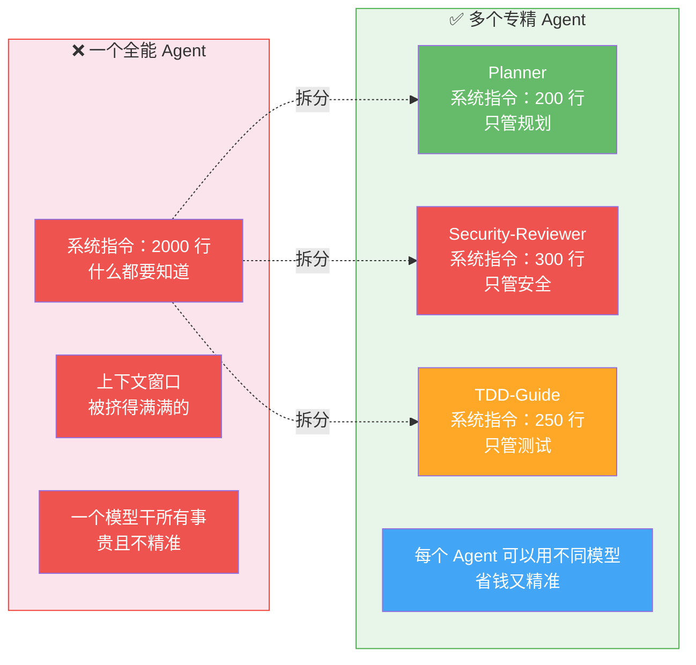
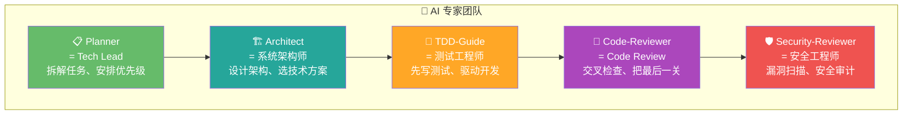
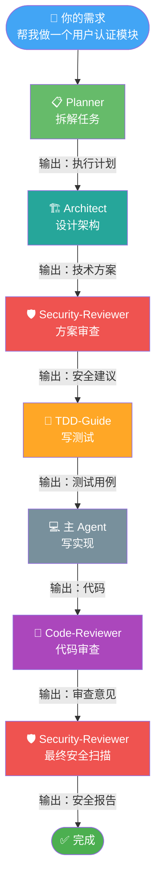

# 03-Agent 系统：不要一个全能 AI，要一整个专家团队

---

## "一个全能 Agent"的幻想 vs "多个专精 Agent"的现实

很多人对 AI 助手的想象是这样的：一个超级聪明的 AI，什么都能干——写代码、做设计、审安全、写测试、查 bug。听起来很美好，但现实很骨感。

**全能 Agent 有几个致命问题：**

**第一，上下文窗口有限。** 一个 Agent 的 system prompt（系统指令）里要塞进所有知识：怎么写代码、怎么做安全检查、怎么写测试、怎么审查代码、怎么设计架构……prompt 越长，留给实际任务的空间就越小。就像你的办公桌上堆满了参考资料，真正用来工作的面积就小了。

**第二，什么都懂 = 什么都不精。** 一个 Agent 既要知道安全漏洞的 100 种形态，又要知道测试的最佳实践，又要知道代码审查的关注点。TA 的"安全知识"跟一个专门做安全审查的 Agent 比起来，肯定差很多。就像一个人既做前端、又做后端、又做数据库、又做运维——每个领域都会一点，但都不够深。

**第三，模型选择没有灵活性。** 不同任务对模型的要求不一样：复杂规划可能需要最强大的模型（如 Opus），而简单的代码审查用轻量模型（如 Sonnet）就够了，省钱又快。但一个 Agent 只能用一个模型。

**ECC 的解决方案：拆。** 把一个"全能 Agent"拆成多个"专精 Agent"，每个 Agent 有自己的 system prompt、自己的职责、自己的模型配置。



---

## 为什么是这些角色？来自真实软件工程团队

ECC 的 Agent 角色不是拍脑袋定的，而是模仿了一个真实的软件工程团队。你把 AI 当成团队成员来看，就很好理解了：



**📋 Planner = Tech Lead**

你的团队里有个 Tech Lead，接到需求后 TA 会先拆解：这个功能要改哪些模块？依赖关系是什么？哪些可以并行做？风险点在哪？Planner 干的就是这件事。TA 不写代码，TA 写的是"计划"。

**为什么需要 Planner？** 因为"直接动手"是最常见的错误。你跟 AI 说"帮我做一个用户认证"，如果没有 Planner，AI 直接开始写代码——可能方向就错了。有了 Planner，TA 会先说"我打算这样做：先设计接口，再选 OAuth 方案，再写实现，再写测试"。你确认了方案，再让 AI 动手。

**🏗️ Architect = 系统架构师**

架构师关心的是"怎么做"而不是"做什么"。用户认证用 JWT 还是 session？数据库用 PostgreSQL 还是 MongoDB？API 用 REST 还是 GraphQL？这些决策影响深远，需要专门有人来做。

**为什么需要 Architect？** 因为技术选型错了，后面写再多代码都是在错误的方向上努力。Architect 在写代码之前就把技术路线确定了，避免走弯路。

**🧪 TDD-Guide = 测试工程师**

测试工程师的核心理念是"先定义正确，再追求实现"。TA 会先帮你想：这个功能应该怎样才算"正确"？然后写测试来定义这个"正确"。代码写完后，测试通过就说明对了，不通过就说明有问题。

**为什么需要 TDD-Guide？** 因为 AI 写的代码你不敢直接用。肉眼看代码很难发现边界 case 的 bug，但测试不会骗人。TDD-Guide 是你的"质量保险"。

**👀 Code-Reviewer = Code Review**

你的团队里有 Code Review 环节吗？代码写完了，要经过另一个人的审查才能提交。审查员会看代码风格、潜在 bug、性能问题、可读性。Code-Reviewer 干的就是这件事。

**为什么需要 Code-Reviewer？** 因为"当局者迷"。写代码的人（无论是人还是 AI）很难发现自己代码的问题。Code-Reviewer 从第三方视角审视代码，发现你可能忽略的问题。

**🛡️ Security-Reviewer = 安全工程师**

安全工程师专门找安全漏洞：有没有 SQL 注入？有没有硬编码密钥？认证授权是否完整？输入是否做了校验？Security-Reviewer 干的就是这件事。

**为什么需要 Security-Reviewer？** 因为安全漏洞是最难发现、后果最严重的 bug。通用的 Code-Reviewer 可能会遗漏安全细节，但 Security-Reviewer 的 system prompt 里全是安全检查规则，TA 对漏洞的敏感度远超普通审查。

---

## 为什么用 YAML frontmatter 定义 Agent？

你去看 ECC 的 Agent 定义文件，会发现每个 Agent 是一个 Markdown 文件，开头用 YAML frontmatter 描述属性：

```yaml
---
name: security-reviewer
description: 安全审查专家
model: claude-sonnet-4-20250514
tools: [read, glob, grep]
---
（系统指令正文）
```

**为什么选这种格式？** 有四个原因：

**第一，人可读。** YAML 是人类最容易读的配置格式之一。你打开一个 Agent 文件，一眼就能看到 TA 叫什么、用什么模型、能用什么工具。

**第二，可版本控制。** 这些文件是纯文本，可以放进 Git 仓库。你修改了一个 Agent 的配置，Git diff 就能清楚地看到改了什么。

**第三，可扩展。** 如果将来要加新的属性（比如 timeout、retry），在 YAML 里加一行就行，不影响已有配置。

**第四，Claude Code 原生支持。** Claude Code 本身就是用这种格式来定义 Agent 的，ECC 选择了跟 TA 一致的格式，不需要额外的解析层。

---

## 编排模式：为什么是 Sequential 而不是 Parallel？

当你触发一个复杂任务（比如"做一个新功能"），ECC 内部是怎么编排这些 Agent 的？答案是：**大部分情况下是 Sequential（顺序执行），不是 Parallel（并行执行）。**

为什么？因为后面的 Agent 需要前面 Agent 的输出：



Architect 需要 Planner 的执行计划才能设计架构，TDD-Guide 需要 Architect 的技术方案才能写测试，Code-Reviewer 需要代码写完才能审查。这些依赖关系是天然的，不能并行。

**但有些步骤确实可以并行。** 比如安全审查和代码审查可以同时进行——它们看的角度不同，互不依赖。ECC 在这些地方会用并行来加速。

**为什么不让所有 Agent 都并行？** 因为并行需要处理"结果合并"的问题。两个 Agent 并行运行，各自的输出可能有冲突（安全审查说"A 方案不安全"，代码审查说"A 方案写得很好"），合并这些冲突需要额外的逻辑。在大多数场景下，顺序执行更简单、更可靠。

---

## 完整的 Agent 清单

ECC 一共有 28 个 Agent，覆盖了几乎所有开发场景：

| 分类 | Agent | 一句话 |
|------|-------|--------|
| 规划 | planner | 拆解复杂任务，安排执行顺序 |
| 架构 | architect | 设计系统架构，做技术选型 |
| 测试 | tdd-guide | 先写测试，驱动开发流程 |
| 审查 | code-reviewer | 发现代码质量问题 |
| 安全 | security-reviewer | 扫描安全漏洞 |
| 构建 | build-error-resolver | 自动排查构建错误 |
| E2E | e2e-runner | 运行端到端测试 |
| 重构 | refactor-cleaner | 重构代码、清理技术债 |
| 文档 | doc-updater, docs-lookup | 更新和查找文档 |
| 优化 | harness-optimizer | 优化 Agent 配置 |
| 运营 | loop-operator | 处理循环和批量任务 |
| 参谋 | chief-of-staff | 战略级任务协调 |

还有 13 个语言专用的审查和构建专家，以及 2 个领域专用的专家（database-reviewer、flutter-reviewer）。

**你不需要记住所有 Agent。** 只需要记住核心的 5 个（Planner、Architect、TDD-Guide、Code-Reviewer、Security-Reviewer），其他的需要时自然会用到。

---

## 怎么触发这些 Agent？

有三种方式：

**方式一：斜杠命令**
```
/plan          → 触发 Planner
/tdd           → 触发 TDD-Guide
/code-review   → 触发 Code-Reviewer
```

**方式二：自然语言**
```
"帮我规划一下这个功能"  → 系统自动调用 Planner
"帮我做安全检查"       → 系统自动调用 Security-Reviewer
"帮我审查这段代码"     → 系统自动调用 Code-Reviewer
```

**方式三：自动触发**
有些 Agent 会在特定场景自动触发——比如代码修改后，Code-Reviewer 会自动介入审查。你不需要做任何事。

---

## 下一步

现在你知道 ECC 的"专家团队"是怎么运作的了。接下来读 [04-Commands系统](./04-Commands系统.md)，了解怎么用一个斜杠命令快速触发这些功能——Commands 是你日常使用中最常打交道的"接口层"。
