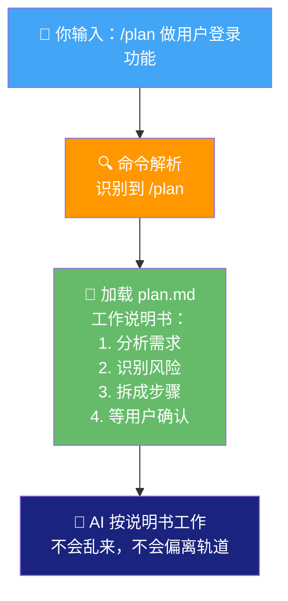
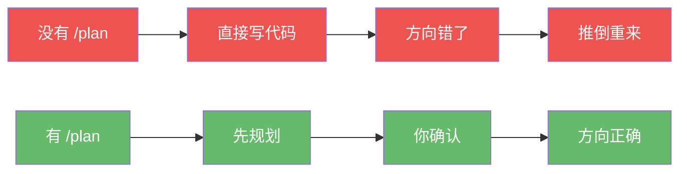
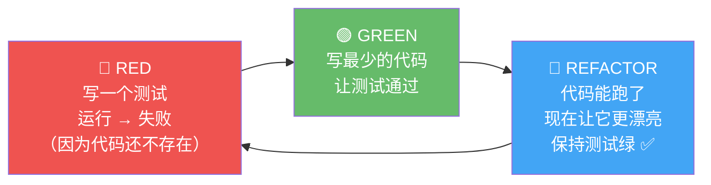
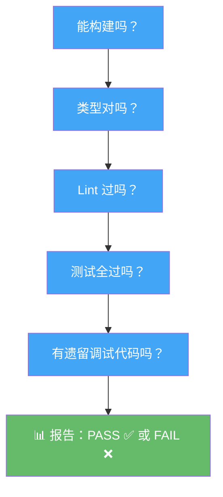
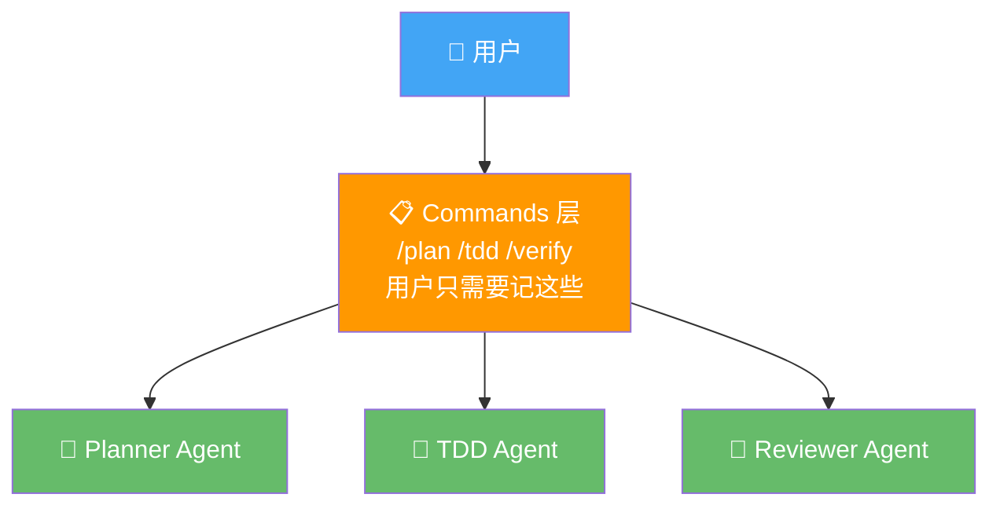
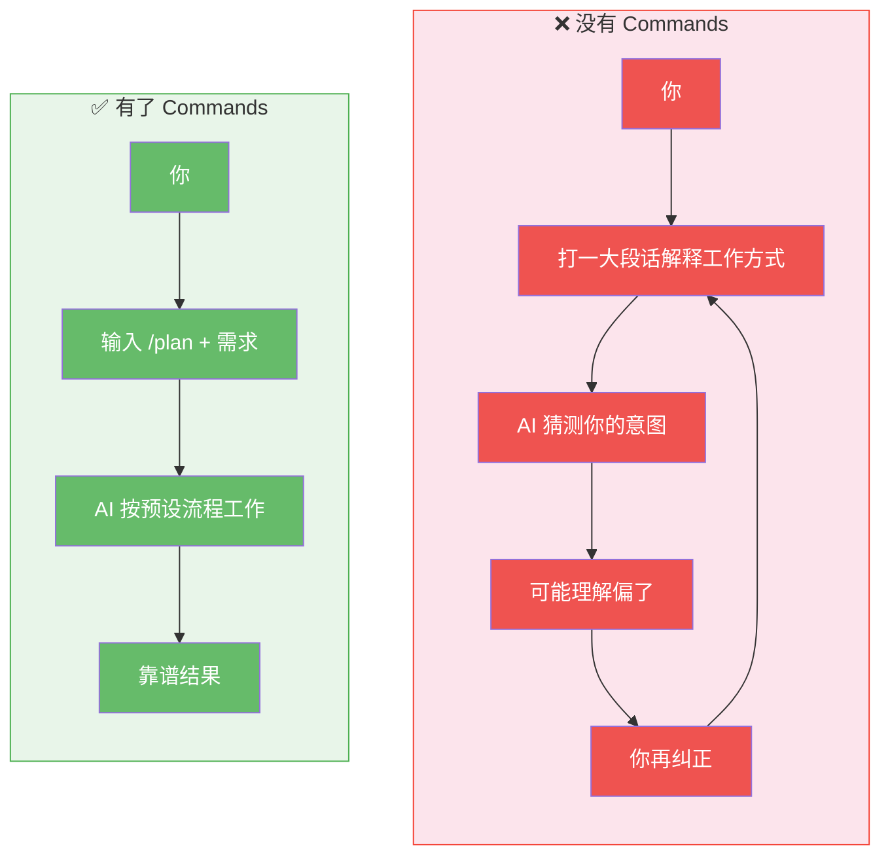

# 04 - Commands 系统：预设好的对话模板

## 一句话总结

Commands 就是给 AI 准备的"快捷键"——你不用每次打一大段话解释工作方式，一个命令搞定。

---

## 真实痛点：你在花大量时间"教 AI 怎么干活"

先来看一个你可能很熟悉的场景：

> 你：帮我写个用户登录功能。
> AI：好的！[直接开始写代码，从数据库到 API 到前端一步到位]
> 你：等等，你还没规划呢。
> AI：好的，那我先规划。
> 你：规划完别直接写，先给我看看。
> AI：好的。
> 你：规划的时候要考虑测试。
> AI：好的。
> 你：还有安全。
> AI：好的。
> ……又来回了 8 轮

发现问题了吗？你花了大量时间在**重复描述工作方式**上，而不是在解决实际问题。

为什么会这样？因为每次对话，AI 都像一个"刚入职的实习生"——TA 能力很强，但不知道你希望 TA 怎么工作。你得一遍遍告诉 TA："先规划再动手"、"写完要测试"、"改完要审查"。

**这些工作方式，其实每次都一样。** 那为什么不把它"固化"下来？

---

## Commands 的核心思想：预设对话模板

一个 Command 本质上就是一份**提前写好的"工作说明书"**。

你输入 `/plan`，系统把 plan 的说明书"喂"给 AI，AI 就按照这个说明书来工作——先分析需求、再拆步骤、识别风险、等你确认。

打个比方：

```
没有 Commands 时：

  你每次去理发 → 从头解释一遍："剪短 3 厘米，两边推平，上面打薄"
  理发师：好的，剪短 3 厘米是吧？两边推平？上面呢？
  你：打薄！
  理发师：打薄多少？
  你：……（又来一轮）

有了 Commands 时：

  你：老样子 ✂️
  理发师：好嘞！[立刻动手，因为上次已经记住了你的要求]
```

Commands 就是那个"老样子"——**把重复的沟通成本降为零**。



---

## 为什么是这些 Commands？来自真实开发流程的痛点

Commands 不是随便设计的。每一个都对应开发流程中的一个**真实痛点**：

### 1. `/plan` —— 因为"不规划直接写代码"是 AI 编程最大的坑

你有没有遇到过这种情况：让 AI 写一个功能，TA 哗哗写了一堆代码，你一看，方向就错了？

AI 写代码太快了，快到你来不及阻止。TA 可能在你还在想需求的时候，就已经把数据库表设计好了——而且设计错了。

**`/plan` 解决的就是这个问题：先想后做。** 它强制 AI 进入"规划模式"——只分析、只拆步骤，不写代码。等你确认了，才动手。



**实际效果：** 输入 `/plan 做用户登录功能，邮箱+手机号，JWT认证`，AI 会输出一个完整的实施计划：分几个阶段、每个阶段做什么、有哪些风险点。你看完觉得 OK，回复"确认"，TA 才开始写代码。

---

### 2. `/tdd` —— 因为"先写代码再补测试"永远补不完

说句实话：没有一个程序员喜欢补测试。

写代码的时候热血沸腾，写完之后回头补测试？"算了，下次吧。"然后就没有下次了。

**TDD（测试驱动开发）的核心理念是反过来：先写测试，再写代码。** 听起来很反直觉，但其实特别合理——

打个比方：你要盖房子。传统方式是先盖楼，盖完了再检查质量。TDD 是先画好"合格标准"（测试），然后按照标准来盖。



**`/tdd` 的价值不在于"多写了测试"，而在于"你的代码从第一天就有质量保障"。**

---

### 3. `/code-review` —— 因为 AI 写的代码需要第二双眼睛

AI 写代码很快，但"快"不等于"好"。

AI 可能写出这样的代码：功能正确，但没有错误处理；逻辑通了，但有安全隐患；代码能跑，但性能很差。

在人类团队里，我们有"代码审查"（Code Review）这道关卡——写完代码，让另一个人看看。**`/code-review` 就是给 AI 也加上这道关卡。**

它像一个资深工程师坐到你旁边，帮你检查：
- "这里 SQL 查询没用参数化，有注入风险"
- "这段逻辑重复了三遍，可以抽成函数"
- "这个错误处理太笼统了，用户不知道哪里出了问题"

**不只是找茬，还给改进建议。**

---

### 4. `/learn` —— 因为"这次学到的东西下次就忘了"很烦

你在看项目代码，遇到一段用了 `useEffect` 的代码，不太理解依赖数组是干嘛的。你去 Google 了，看完了，懂了。三天后，又遇到了，又忘了。

**`/learn` 的设计思路是：结合你自己的项目代码来教。** 不是给你念文档，而是指着你项目里实际的代码告诉你"看，这里就是这样用的"。

用你自己的代码做教材，比看官方文档有效 10 倍——因为那是你正在处理的真实场景。

---

### 5. `/verify` —— 因为"改了一行代码不知道有没有搞坏别的"

你改了一行代码，心想："应该没问题吧……"然后提交了。结果上线后发现，那个改动能影响到的功能全挂了。

**`/verify` 就是提交前的全面检查：** 构建能过吗？类型检查过吗？Lint 通过吗？测试全过吗？有遗留的 `console.log` 吗？

就像出门旅行前检查一遍：门锁了没？煤气关了没？灯关了没？**一个命令，全面扫描，给你一个清晰的报告。**



---

## Commands vs Agents：为什么要分开？

你可能会问：Commands 和 Agent（上一章讲的）有什么关系？为什么需要两套东西？

**一句话：Commands 是入口，Agent 是执行者。**

打个比方：

```
餐厅的运作方式：

  你（顾客）→ 看菜单点菜（Command）→ 服务员接单 → 厨房做菜（Agent）
  
  你不需要知道：
  - 厨房有几个厨师
  - 谁负责切菜谁负责炒菜
  - 用的是什么锅什么灶
  
  你只需要：
  - 看菜单（Commands 列表）
  - 点菜（输入命令）
  - 等结果
```

**这个分离的好处：**

1. **简单** — 你只需要记几个命令，不需要知道内部架构
2. **灵活** — 同一个 `/plan` 命令，背后可能调用不同的 Agent 实现
3. **可扩展** — 新增一个 Command 不需要改 Agent，反之亦然



---

## Commands 幕后：其实就是 Markdown 文件

你可能好奇，这些命令是怎么实现的？答案可能比你想象的简单——**就是一堆 `.md` 文件。**

```
commands/
├── plan.md           ← "规划时你应该这样做：……"
├── tdd.md            ← "TDD 时你应该这样做：……"
├── code-review.md    ← "审查时你应该这样做：……"
├── learn.md          ← "教学时你应该这样做：……"
└── verify.md         ← "验证时你应该这样做：……"
```

每个文件里用自然语言描述了这个命令该怎么执行。当你输入 `/plan` 时，系统找到 `plan.md`，把内容交给 AI，AI 就照着做。

**所以你完全可以自己写新的命令！** 比如写一个 `/deploy`，让 AI 按你公司的部署流程来操作。

---

## 有 Commands 和没有 Commands 的对比



---

## 速查表：什么时候用什么？

| 你的情况 | 用这个命令 | 核心价值 |
|---------|-----------|---------|
| "我要开始做一个新功能" | `/plan` | 先想后做，避免方向错误 |
| "我要写新代码" | `/tdd` | 先写测试，保证质量 |
| "我写完了想检查一下" | `/code-review` | 第二双眼睛找问题 |
| "我不懂这个技术概念" | `/learn` | 结合你的项目来教 |
| "我要提交代码了" | `/verify` | 全面检查，防止翻车 |

**最常用的就 3 个：`/plan`、`/tdd`、/verify`。** 其他的用到再查。

---

## 好处和代价

**好处：**
- 🕐 省时间：10 轮对话 → 1 个命令
- 🎯 一致性：每次执行方式一样，不会跑偏
- 🧠 降低认知负担：不用记工作流程，记命令就行
- 🔧 可扩展：自己写 .md 文件就能新增命令

**代价：**
- 📝 需要花时间写好 Command 定义文件（不过默认的已经很好用）
- 🔄 命令太多反而记不住（建议只用核心的几个）
- ⚠️ 过于模板化可能限制创意性任务的灵活性

---

## 对你自己的项目的启发

1. **识别重复沟通** — 你跟 AI 有没有经常重复说的话？那就可以做成 Command
2. **工作流程固化** — 最佳实践不该靠"记住"，应该靠"自动化"
3. **关注点分离** — 用户不需要知道实现细节，只需要知道入口命令

> 💡 **下一步**：打开你的项目，试试输入 `/plan` + 你最近想做的一个功能，看看 AI 会输出什么样的实施计划。
