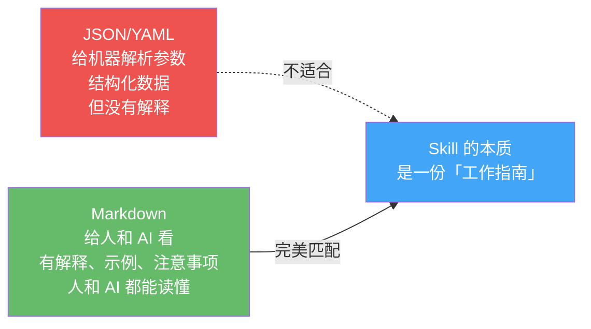
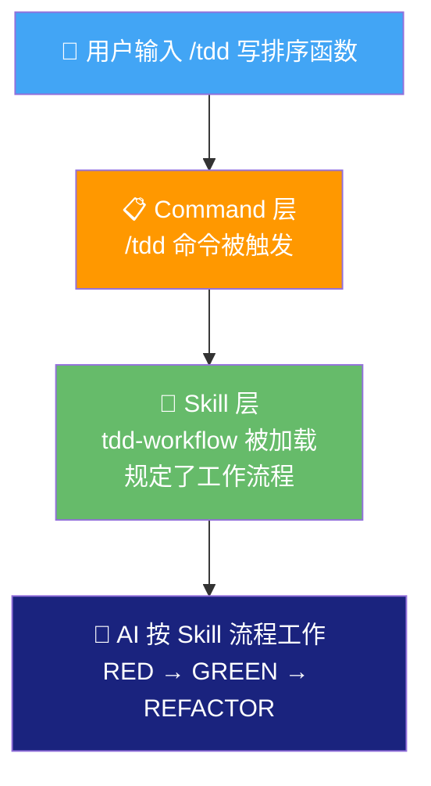
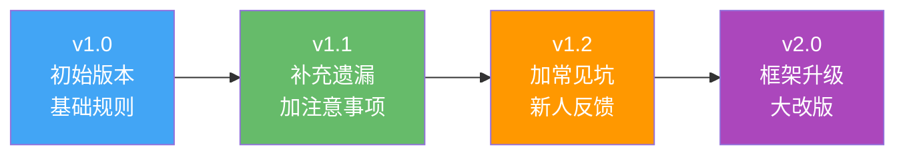

# 05 - Skills 系统：给"天才毕业生"配上行业经验

## 一句话总结

没有 Skills 的 AI 就像一个"刚毕业的天才"——聪明绝顶，但没经验。Skills 是前辈总结的经验教训，告诉 AI"在我们这个行业/项目里，事情应该怎么做"。

---

## 真实痛点：AI 聪明，但"不懂规矩"

你有没有遇到过这种情况？

> 你：帮我写一个 API 接口。
> AI：好的！[哗哗写完]
> 你：等等，我们项目用的是 RESTful 风格，你这个不是。
> AI：好的，改成 RESTful。
> 你：还有，返回格式要统一，用 `{code, message, data}`。
> AI：好的。
> 你：错误码要用枚举定义，不能写死数字。
> AI：好的。
> 你：……还有日志，每个接口要记录请求参数和响应时间。
> AI：好的……
> 你：（已经纠正了 5 次）

AI 的能力没问题，问题是：**TA 不知道你们团队/项目的规矩。**

这些规矩从哪来？从经验中来——你们踩过的坑、总结的最佳实践、团队的约定。**Skills 就是把这些经验"封装"起来告诉 AI 的方式。**

打个比方：

```
你请了一个顶级厨师来你家做饭。

厨师技术一流——什么菜都会做。但问题是：
- 你家的灶是电磁炉，不是明火
- 你对花生过敏
- 你家调料只有酱油醋，没有蚝油
- 你口味偏清淡

如果你什么都不说 → 厨师可能做了一桌爆炒花生，一样都不能吃
如果你提前说清楚 → 厨师会调整所有做法，完美适配你家

Skills = 提前说清楚的那些话
```

---

## 为什么用 Markdown 定义 Skill？而不是 JSON/YAML

这是 Skills 系统一个非常重要的设计决策。

你可能想：配置文件不都用 JSON 或 YAML 吗？为什么要用 Markdown？

**因为 Skill 的核心受众是"人和 AI"，不是"机器"。**

```
如果用 JSON 定义 Skill：

{
  "name": "tdd-workflow",
  "steps": ["write_test", "implement", "refactor"],
  "coverage": 80,
  "rules": ["no_skip_tests", "red_green_refactor"]
}

→ AI 能解析，但人看不出来"为什么"这样做
→ 你不知道"写测试"具体怎么写、有什么注意事项
→ 遇到边界情况不知道怎么处理
```

```
如果用 Markdown 定义 Skill：

# TDD 工作流

## 核心理念
先写测试，再写代码。因为"先写代码再补测试"永远补不完。

## 步骤
1. 先写一个失败的测试（RED）
2. 写最少的代码让它通过（GREEN）
3. 重构代码，保持测试通过（REFACTOR）

## 注意事项
- 测试覆盖率不低于 80%
- 不要为了覆盖率写无意义的测试
- 遇到不确定的地方，先写测试用例来澄清需求

## 常见坑
- 不要跳过 RED 阶段直接写实现
- 不要在一个测试里验证太多东西
...

→ AI 完全能理解"怎么做"和"为什么这样做"
→ 人也能看懂，还能审核、修改
→ 遇到边界情况，AI 知道"意图"是什么，能灵活处理
```

**Markdown 的好处：既能给人看，又能给 AI 看。** 一份文件，两种读者，都懂。这就是为什么不用 JSON/YAML——那些格式是给机器解析参数的，而 Skill 的本质是"指南"，需要解释、示例、注意事项。



---

## Skills 的分类：按照使用场景分，不是随便分的

Skills 不是杂乱地堆在一起的，而是按照**使用场景**分类的。这个分类方式背后有清晰的逻辑：

```
Skills 分类体系
═══════════════

🔧 语言/框架类（解决"用这个技术应该怎么写"）
├── python-patterns    ← Python 项目的最佳实践
├── golang-patterns    ← Go 项目的最佳实践
├── rust-patterns      ← Rust 项目的最佳实践
├── typescript-patterns ← TS 项目的最佳实践
├── django-patterns    ← Django 框架的最佳实践
├── springboot-patterns ← Spring Boot 的最佳实践
└── ……共 30+ 个

🔄 工作流类（解决"开发流程应该怎么走"）
├── tdd-workflow        ← 测试驱动开发
├── verification-loop   ← 质量门禁
├── continuous-learning  ← 自动学习
├── eval-harness        ← 评估框架
└── autonomous-loops    ← 自主循环

🔒 安全类（解决"怎么防止安全问题"）
├── security-review     ← 通用安全审查
├── security-scan       ← 安全扫描
├── django-security     ← Django 专属安全
├── laravel-security    ← Laravel 专属安全
└── springboot-security ← Spring Boot 专属安全

💼 业务类（解决"特定行业的专业知识"）
├── market-research     ← 市场调研
├── deep-research       ← 深度研究
├── article-writing     ← 文章写作
├── content-engine      ← 内容引擎
└── investor-materials  ← 投资者材料
```

**为什么要这样分？** 因为使用场景不同，需要的"经验"完全不同：

- 你在写 Python 代码 → 需要知道 Python 的最佳实践（语言类）
- 你在做团队协作 → 需要知道 TDD 流程怎么走（工作流类）
- 你在处理用户数据 → 需要知道安全怎么做（安全类）
- 你在做市场分析 → 需要知道调研方法论（业务类）

每种场景都有不同的"坑"，需要不同的"经验"来避免。

---

## 每个 Skill 长什么样？

一个 Skill 就是一个文件夹，里面放着"工作指南"：

```
skills/
├── tdd-workflow/
│   ├── SKILL.md          ← 核心：工作指南（给人和 AI 看的）
│   └── scripts/          ← 可能有一些辅助脚本
│
├── verification-loop/
│   └── SKILL.md
│
├── python-patterns/
│   └── SKILL.md
│
└── ...
```

**SKILL.md 是灵魂。** 它用自然语言写成，包含：
- 这个 Skill 解决什么问题
- 具体步骤是什么
- 有什么注意事项
- 常见错误有哪些
- 用实际示例说明

---

## Skills 和 Commands 的区别

学到这里你可能会混淆：Skills 和上一章的 Commands 有什么不同？

```
Commands（命令）
───────────────
你主动说的话
"/tdd 写一个排序函数"
你触发，AI 执行
像"你点了一道菜"

Skills（技能）
───────────────
AI 脑子里的工作手册
"写测试时你应该这样写……"
自动加载，默默生效
像"厨房的食品安全规定"
```

**两者配合使用：**

> 你输入 `/tdd 写一个排序函数` ← 这是 Command（你说的话）
> AI 加载 `tdd-workflow` Skill ← 这是 Skill（AI 遵守的规矩）
> AI 按照 Skill 里的流程工作 ← 先写测试 → 再实现 → 再重构
> 测试覆盖率要 80%+ ← 这是 Skill 里的规则



---

## Skill 进化：好的 Skill 不是一次写成的

这是 Skills 系统最有趣的设计之一：**Skill 可以进化。**

什么意思？一开始你写了一个 Skill，可能不完美。在使用过程中，你会发现：
- "这个步骤缺了"
- "这个注意事项应该加上"
- "这个规则太严了，改宽松一点"

Skills 系统支持这种迭代——你可以随时修改 SKILL.md，AI 下次就会按照新版本工作。

**为什么需要进化？因为经验是积累出来的。**

```
Skill 的生命周期：

  v1.0 → 团队总结了基础最佳实践
  v1.1 → 用了两个月，发现漏了"错误处理"的规范，补上
  v1.2 → 新人犯了一个常见错误，加到"常见坑"里
  v2.0 → 换了框架，整个 Skill 大改
```

打个比方：一本菜谱不是出版了就永远不变。厨师用着用着，会加新菜、改做法、标注"这个菜新手容易翻车"。Skill 也是一样。



---

## 你该怎么使用 Skills？

**好消息：大部分时候，你什么都不用做。**

Skills 有两种激活方式：

**方式 1：自动激活（AI 自己判断）**

你正常跟 AI 对话，AI 自动判断：
- "用户在写 Python 代码" → 自动加载 `python-patterns`
- "用户在写测试" → 自动加载 `tdd-workflow`
- "用户在处理用户数据" → 自动加载 `security-review`

你不需要说"请激活 xxx Skill"。

**方式 2：通过 Commands 间接触发**

你输入 `/tdd` → 系统自动加载 `tdd-workflow` Skill
你输入 `/verify` → 系统自动加载 `verification-loop` Skill

**你真正需要知道的就一件事：** Skills 在后台默默工作，确保 AI 的行为符合最佳实践。你享受结果就好。

---

## Skills 和 Rules 的区别

你可能还会问：Skills 和下一章的 Rules 又有什么不同？

```
Rules（规则）          Skills（技能）
══════════           ════════════
强制执行的"法律"       建议性的"方法论"
必须遵守               灵活应用
全局生效               按场景加载
"文件不能超过 800 行"   "TDD 流程应该怎么走"
像交通法规             像驾驶技巧
```

Rules 是底线，不能违反。Skills 是最佳实践，告诉你"更好的做法"。两者配合，既保证了下限，又提升了上限。

---

## 好处和代价

**好处：**
- 🧠 AI 不用每次重新"学规矩"，规则一次写好自动生效
- 📝 用 Markdown 写，人和 AI 都能看懂
- 🔄 可以迭代进化，越用越好
- 🎯 按场景分类，精准匹配需求
- 🤝 团队共享：一个 Skill 写好，全团队的 AI 都受益

**代价：**
- ✍️ 好的 Skill 需要花时间打磨（不过可以从社区借鉴）
- 📦 Skill 太多可能导致加载时间变长
- ⚖️ 不同 Skill 之间可能有冲突，需要合理组织

---

## 对你自己的项目的启发

1. **经验应该被固化** — 你和团队踩过的坑、总结的最佳实践，不应该只存在于"脑子里"，应该写下来让 AI 也学会
2. **Markdown 是给"人+AI"写的格式** — 如果你的配置文件既需要人看又需要机器读，考虑用 Markdown 而不是 JSON
3. **分类要按场景来** — 不要按技术栈分类（"React 的"、"Vue 的"），要按问题分类（"写代码时"、"测试时"、"部署时"）
4. **好文档是迭代出来的** — 不要追求第一版就完美，先用起来，从实践中改进

> 💡 **下一步**：去看看你项目里有没有 `skills/` 目录。打开一个 SKILL.md 看看，你会发现里面就是普通的中文/英文——没有代码，没有配置，就是一份"工作指南"。
