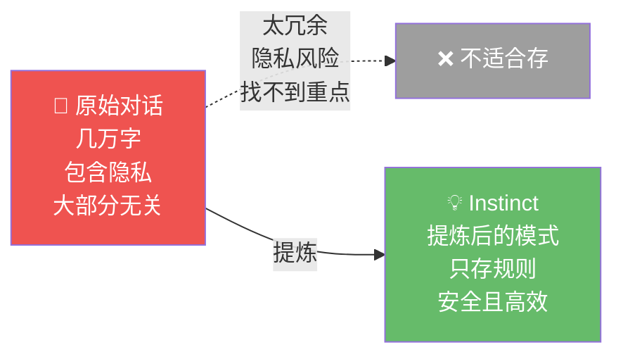
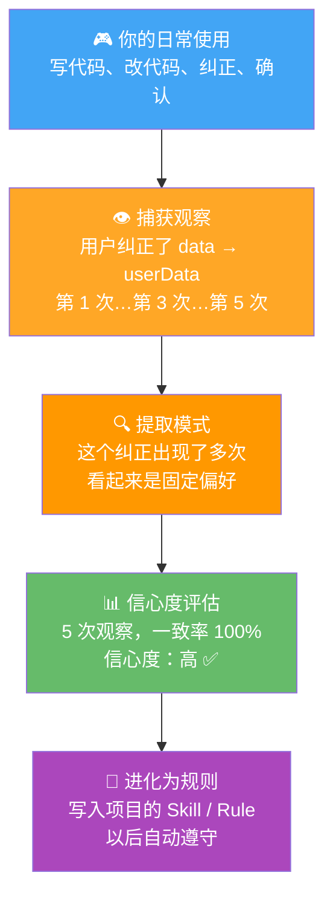
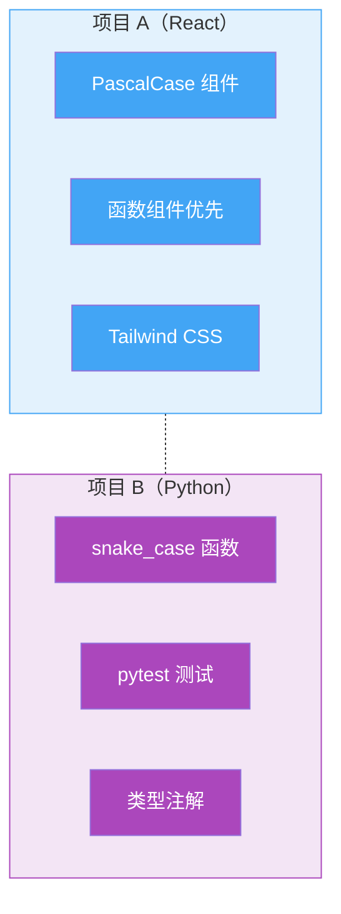

# 06 - Continuous Learning：让 AI 不再"失忆"

## 一句话总结

每次新 session，AI 就失忆了。你纠正过 TA 的错误，下次 TA 还会犯。Continuous Learning 就是解决这个问题的——让 AI 从你的行为中学习，把教训固化下来。

---

## 真实痛点：你在同一个坑里反复教 AI

来看一个你大概率遇到过的场景：

> 第 1 次：你写了一个 `data` 变量，AI 帮你改成了 `userData`，你说"对，就该这样"。
> 第 2 次：AI 自己写了一个 `data` 变量。你说："不是说过用 `userData` 吗？"
> 第 3 次：AI 又写了 `data`。你说："😤"
> 第 4 次：AI 终于记住了。
> ……然后你开了一新 session，AI 又回到了第 1 次的状态。

**为什么会这样？** 因为 AI 的对话是"一次性"的——每次新 session，TA 的记忆从零开始。你上次纠正的东西，没有被持久化。就像一个每次上班都失忆的实习生，你每天都要重新教一遍。

这个问题有多烦？想象一下：

```
你每天的工作状态：

  早上：纠正 AI 的变量命名      → AI 说"好的"
  上午：纠正 AI 的错误处理方式   → AI 说"好的"
  下午：纠正 AI 的测试写法      → AI 说"好的"
  第二天早上：一切归零，重新来过  → AI 说"好的"（但其实全忘了）
```

**你的"教学时间"不断被浪费。** Continuous Learning 就是要终结这种浪费。

---

## 核心设计：从观察到直觉，不是存对话

你可能想：直接把对话记录存下来不就行了？下次加载回来不就记得了？

不行。原因有三：

1. **太冗余** — 一天的对话可能有几万字，大部分是无关的，真正要记住的就几条
2. **隐私风险** — 对话里可能有敏感信息，全部存下来不安全
3. **找不到重点** — AI 重新读一遍对话，也不知道"哪些是重点纠正"

**所以 Continuous Learning 用的是"Instinct"（直觉）——提炼后的模式，不是原始对话。**

```
原始对话（存下来不好）：
─────────────────────
你：这个变量用 userData
AI：好的
你：这个也用 userData
AI：好的
你：还有这个
AI：好的
……（几千字对话）

提炼后的 Instinct（存这个就好）：
──────────────────────────────
{
  "pattern": "变量命名偏好",
  "rule": "用描述性名称，不要用 data/tmp",
  "confidence": "高",
  "source": "5 次纠正"
}
```

**只存"什么情况下应该怎么做"，不存原始对话。** 安全、高效、精准。



---

## 完整流程：从观察到进化

Continuous Learning 的完整流程分为四步，就像教小孩做家务：

### 第 1 步：观察（Observation）

AI 在跟你互动时，默默观察你的行为模式。你纠正了一次，TA 记一次。但这时候还只是"看到了"，不一定会记住。

```
观察 #1：用户把 data 改成了 userData    → "看到了"
观察 #2：用户又把 data 改成了 userData  → "有点意思"
观察 #3：用户又改了                    → "嗯，可能是偏好"
观察 #4：用户又改了                    → "这很可能是习惯"
观察 #5：用户又改了                    → "非常确定了"
```

### 第 2 步：提取模式（Pattern Extraction）

当一个行为重复出现足够多次，AI 会提取出一个"模式"——不记具体对话，只记"用户在什么情况下会怎么做"。

### 第 3 步：信心度评估（Confidence Scoring）

不是所有学到的模式都可靠。有些是偶然，有些是规律。

**这就是 Confidence Scoring 的价值——帮你区分"这个建议可以信"还是"仅供参考"。**

```
信心度分级：

  观察 1 次，一致率 100%  → ★☆☆☆☆ 很低，可能是巧合
  观察 3 次，一致率 100%  → ★★★☆☆ 中等，值得关注
  观察 5 次，一致率 100%  → ★★★★☆ 高，基本确定
  观察 10 次，一致率 90%  → ★★★★★ 很高，完全信任
```

**为什么需要这个？** 因为不是所有行为模式都值得记住。比如你某天特别累，连续三次把变量命名弄得很随意——AI 不应该学这个"坏习惯"。Confidence Scoring 通过"足够多次观察 + 高一致率"来过滤掉偶然行为。

### 第 4 步：进化（Evolution）

信心度够高之后，直觉会"进化"成一个 Skill 或者一条 Rule，以后自动执行。



**整个流程是全自动的。你不需要做任何额外的事——正常用就好。**

---

## 为什么 v2 要做 Project-Scoped（项目隔离）？

这是 Continuous Learning 在 v2 中最重要的升级。

**你在 React 项目学到的"用 hooks 不用 class"，不应该影响你的 Python 项目。**

为什么？因为不同项目的规矩完全不同：

```
项目 A（React 前端）
┌──────────────────────────────┐
│ 学到的：                       │
│ - 组件用 PascalCase           │
│ - 用函数组件，不用类组件        │
│ - CSS 用 Tailwind             │
│ - 提交前跑 npm test           │
└──────────────────────────────┘

项目 B（Python 后端）
┌──────────────────────────────┐
│ 学到的：                       │
│ - 函数用 snake_case           │
│ - 用 pytest，不用 unittest    │
│ - 类型注解必须完整             │
│ - 提交前跑 pytest + mypy      │
└──────────────────────────────┘

如果 A 的规矩带到 B 项目 → Python 里出现 PascalCase 函数名 → 乱套了！
```

**Project-Scoped 的本质是"上下文隔离"。** 每个项目有自己的"学习成果"，互不干扰。

这个设计思想其实很常见——就像你不会把"在家穿拖鞋"的习惯带到办公室去一样。不同的环境，不同的规矩。



---

## Continuous Learning vs Rules：有什么区别？

你可能会问：这跟 Rules 系统（下一章讲的）有什么不同？

```
Rules（规则）              Continuous Learning（学习）
══════════                ══════════════════════════
你主动写的                  AI 自动发现的
明确的、固定的              隐式的、会变化的
全局生效（跨项目）           项目隔离
"代码不能超过 800 行"       "这个用户喜欢用 const"
像法律                     像习惯
```

**一句话：Rules 是你定的"法律"，Learning 是 AI 养成的"习惯"。**

两者互补：Rules 是骨架（底线要求），Learning 是血肉（个性化偏好）。光有 Rules 没有 Learning，AI 就是个"标准化产品"；光有 Learning 没有 Rules，AI 可能学歪。

---

## 安全机制：AI 学歪了怎么办？

你可能担心：AI 自己"学习"的规则，会不会学歪了？

系统有几层保障：

```
安全机制
════════

1. 信心度门槛
   不是每次观察都记住，需要达到一定次数和一致性

2. 项目隔离
   A 项目学的不会影响 B 项目

3. 会衰减
   你改变了行为，旧的 instinct 信心度会自然下降

4. 不覆盖 Rules
   Learning 是补充，不会覆盖你明确设置的 Rules

5. 可查看
   /instinct-status 让你随时看 AI 学到了什么
```

**举个衰减的例子：**

> 你之前一直用 `var`，AI 学会了"用户喜欢 var"（信心度 ★★★★☆）。
> 后来你开始用 `const`，AI 观察到你的偏好变了。
> 经过几次新观察，旧 instinct 的信心度从 ★★★★☆ 降到 ★★☆☆☆。
> 新 instinct "用户喜欢 const"的信心度升到 ★★★★☆。
> 旧的自然被淘汰。

**这就像人的习惯一样——旧习惯会被新习惯取代，而不是永远保留。**

---

## 你能看到 AI 学到了什么吗？

能！系统提供了 `/instinct-status` 命令：

```
你输入：/instinct-status

AI 输出：
┌──────────────────────────────────────────┐
│  📊 学习状态报告                          │
├──────────────────────────────────────────┤
│  项目：my-react-app                       │
│                                          │
│  已学 Instincts（3 条）：                  │
│                                          │
│  1. 变量命名偏好                           │
│     内容：优先使用描述性名称                 │
│     信心度：★★★★☆（高）                   │
│     来源：5 次纠正                         │
│                                          │
│  2. 提交前验证                             │
│     内容：每次提交前必须跑测试和 lint        │
│     信心度：★★★★★（很高）                 │
│     来源：8 次确认                         │
│                                          │
│  3. 组件拆分风格                           │
│     内容：超过 200 行的组件应该拆分          │
│     信心度：★★★☆☆（中等）                │
│     来源：3 次纠正                         │
└──────────────────────────────────────────┘
```

这个命令让你随时了解 AI "偷偷"学会了什么，透明可控。

---

## 好处和代价

**好处：**
- 🧠 AI 越用越懂你，纠正过的错误不会再犯
- 🔒 只存提炼后的模式，不存原始对话，隐私安全
- 📊 信心度机制，过滤偶然行为
- 🏗️ 项目隔离，不同项目规矩不混淆
- 🔄 会衰减，适应你的变化

**代价：**
- ⏳ 需要一定使用量才能形成可靠直觉（不是用一次就生效）
- 📏 提炼可能丢失一些上下文细节
- 🎯 高度个性化的规则可能不适合团队共享

---

## 对你自己的项目的启发

1. **AI 应该从交互中学习** — 如果你的 AI 产品每次对话都从零开始，用户体验会很差。想办法把"学到的教训"持久化
2. **存提炼后的模式，不是原始数据** — 这既保护隐私，又提高效率。原始对话太冗余，提炼后的规则才值钱
3. **信心度是个好工具** — 不是所有观察都可靠，用"多次观察 + 一致率"来过滤噪音
4. **上下文隔离很重要** — 不同项目/场景学到的东西不应该互相污染

> 💡 **下一步**：正常使用你的 AI 项目一两周，然后试试 `/instinct-status`，看看 TA "偷偷"学会了什么。你可能会很惊讶——TA 比你想象的更了解你的习惯。
