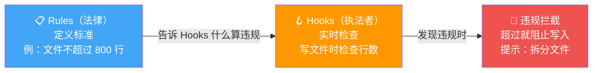
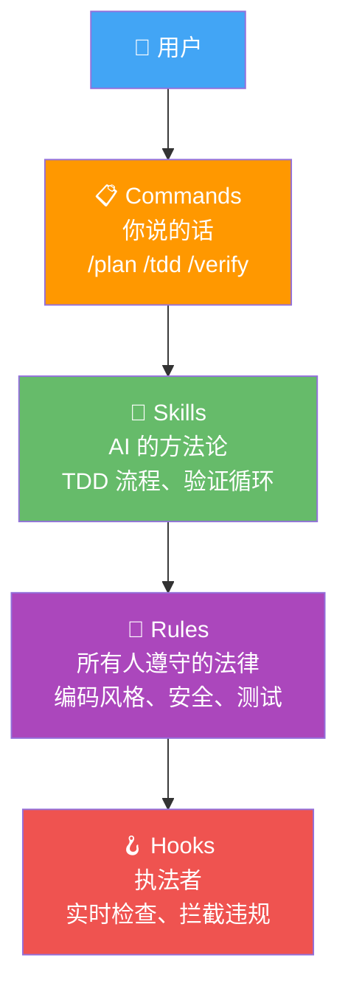

# 07 - Rules 系统：给 AI 立"家规"

## 一句话总结

没有 Rules 的 AI 写代码就像"没有风格指南的自由撰稿人"——能写，但写出来的东西风格不统一，质量参差不齐。Rules 就是给 AI 立规矩，确保 TA 在任何项目里都按统一标准行事。

---

## 真实痛点：AI 的代码"风格混乱"

想象你是一个团队负责人。你们团队有 5 个人，每人都在用 AI 写代码。

```
开发者 A 的 AI 输出：
  - tab 缩进
  - 英文注释
  - 没有测试
  - 函数写了 200 行

开发者 B 的 AI 输出：
  - 空格缩进（4 空格）
  - 中文注释
  - 有测试但覆盖率很低
  - 函数 30 行

开发者 C 的 AI 输出：
  - 空格缩进（2 空格）
  - 没有注释
  - 偶尔写测试
  - 文件有 1000 行
```

代码审查的时候你会崩溃——每个人（的 AI）都在用不同的风格。**代码能跑，但不可维护。**

为什么会这样？因为 AI 没有"团队标准"。TA 知道怎么写代码，但不知道"在我们团队，代码应该这样写"。

**Rules 就是解决这个问题的——一套明确的"法律"，所有 AI 输出都必须遵守。**

---

## Rules 的核心设计：分层

Rules 不是一锅端的，而是分层设计的。为什么？因为有些规矩是通用的，有些是语言特有的。

```
Rules = 公司员工手册（两层）

┌────────────────────────────────────────┐
│  第一层：公司制度（common/）             │
│  所有人都要遵守的通用规则                 │
│                                        │
│  - 代码风格规范                         │
│  - 安全要求                             │
│  - 测试要求                             │
│  - Git 提交规范                         │
│  - 性能要求                             │
│  - 开发工作流                            │
└────────────────────────────────────────┘

┌────────────────────────────────────────┐
│  第二层：部门规章（python/、java/、go/）  │
│  每个语言/框架自己的特殊规则              │
│                                        │
│  Python 部门：                          │
│  - 用 type hints                       │
│  - 用 pytest                           │
│  - 遵循 PEP 8                          │
│                                        │
│  Java 部门：                            │
│  - 用 JUnit 5                          │
│  - 遵循 Google Java Style              │
│                                        │
│  Go 部门：                              │
│  - 用 gofmt                            │
│  - 错误必须处理，不能忽略                 │
│  - 用 table-driven tests               │
└────────────────────────────────────────┘
```

**为什么要这样分？**

1. **避免重复** — "代码不超过 800 行"这条规则适用于所有语言，写一次就够了
2. **方便维护** — 改一个通用规则，所有语言都生效；改一个语言规则，不影响其他语言
3. **逻辑清晰** — 通用的归通用，特殊的归特殊，不混在一起

打个比方：公司有"全公司制度"（比如不能迟到早退），也有"部门规章"（比如设计部用 Figma，研发部用 VS Code）。两者都要遵守，但性质不同。

---

## 为什么支持 11 种语言？

因为**真实项目是多语言的。**

一个典型的全栈项目可能长这样：

```
一个现代 Web 应用：

  ├── 前端（TypeScript + React）
  ├── 后端 API（Python + FastAPI）
  ├── 微服务（Go）
  ├── 数据库迁移（SQL）
  ├── 基础设施（YAML / HCL）
  └── 自动化测试（JavaScript / Python）

如果 Rules 只支持 TypeScript → Python 代码没有约束
如果 Rules 只支持 Python → Go 代码没有约束
如果 Rules 只支持后端 → 前端代码没有约束
```

**Rules 系统覆盖了 11 种主流语言，每种语言都有多类规则：**

```
语言覆盖矩阵
════════════

            公共  Python  Java  Go  Rust  Swift  Kotlin  C++  C#  PHP  TS  Perl
            ────  ──────  ────  ──  ────  ─────  ──────  ───  ──  ───  ──  ────
编码风格      ✅     ✅     ✅   ✅   ✅     ✅      ✅    ✅   ✅   ✅   ✅   ✅
安全要求      ✅     ✅     ✅   ✅   ✅     ✅      ✅    ✅   ✅   ✅   ✅   ✅
测试要求      ✅     ✅     ✅   ✅   ✅     ✅      ✅    ✅   ✅   ✅   ✅   ✅
Git 规范     ✅     -      -    -    -      -       -     -    -    -    -    -
开发工作流    ✅     -      -    -    -      -       -     -    -    -    -    -
```

这样不管你项目的代码库里有几种语言，Rules 都能覆盖到。

---

## Rules 和 Hooks 的关系：立法者与执法者

这是理解 Rules 系统最关键的一点。

**Rules 是"法律条文"，Hooks 是"执法者"。**

```
类比：

  Rules = 国家法律
  "高速公路限速 120 km/h"

  Hooks = 路上的测速摄像头 + 交警
  "你超速了，摄像头拍到，交警拦下"
```

光有 Rules 没有 Hooks：
- AI 看了 Rules，说"好的"
- 写代码的时候忘了
- 代码审查时才发现违规
- 已经晚了

光有 Hooks 没有 Rules：
- Hook 知道要拦截，但不知道"什么算违规"
- 没有判断标准
- 执法没有依据

**两者配合才是完整的"治理体系"：**



再看几个 Rules + Hooks 配合的例子：

```
Rules 说                       Hooks 做
════════                       ════════
"不能有 console.log"       →   写入前扫描，发现就阻止
"必须有测试文件"            →   创建源文件时检查对应测试文件
"不能提交密钥"             →   git commit 前扫描，有密钥就拒绝
"函数不超过 50 行"         →   写函数时检查行数
"import 不能用相对路径"     →   写 import 时检查格式
"单引号，不用双引号"        →   写入时自动修正引号风格
```

**没有 Hooks 的 Rules 是"纸老虎"——好看但没用。没有 Rules 的 Hooks 是"无头苍蝇"——有力气没方向。两者缺一不可。**

---

## Rules 文件长什么样？

你可能好奇 Rules 文件里面写了什么。**就是大白话。**

```
rules/common/coding-style.md（示意）

# 编码风格规范

## 变量命名
- 使用有意义的变量名，禁止 a、b、tmp、data
- 布尔值用 is/has/can 前缀：isActive、hasError、canEdit

## 函数长度
- 单个函数不超过 50 行
- 超过 30 行就要考虑拆分

## 注释
- 公共 API 必须有注释
- 复杂逻辑必须有行内注释

## 文件大小
- 单个文件不超过 800 行
- 超过 500 行就要考虑拆分
```

没有 YAML，没有 JSON，没有复杂配置。**就是用大白话告诉 AI "你应该怎么做"。** 跟 Skills 一样，用 Markdown 写——人和 AI 都能读懂。

---

## Rules vs Skills vs Commands：三者的完整关系

学到这里，三个核心概念都讲完了。来做最后一个对比：



**一个完整的工作场景：**

> 你输入 `/tdd 写一个排序函数` ← Command（你说的话）
> AI 加载 TDD 工作流 Skill ← Skill（方法论：先写测试再写代码）
> AI 写代码时遵守 Rules ← Rules（约束：camelCase 命名、不超过 50 行）
> Hooks 实时检查 ← Hook（执法：写入前检查行数和风格）

```
四者配合：

  Commands = 你点的菜（"我要 TDD"）
  Skills   = 厨师的菜谱（"TDD 怎么做"）
  Rules    = 食品安全法规（"必须用新鲜食材"）
  Hooks    = 卫生检查员（"过期食材？不让用"）
```

---

## 我需要手动配置吗？

**99% 的情况下，不需要。**

```
需要配置的情况                不需要配置的情况
══════════════                ════════════════
你公司有特殊编码规范           你用的是主流语言和框架
你想加自定义规则              默认规则已经很合理
你想覆盖某些默认规则          你只是个人开发
你想调整规则的严格程度        你对默认标准满意
```

默认的 Rules 已经覆盖了主流语言的最佳实践。你打开就能用，不需要任何配置。

如果你确实想定制——直接编辑对应的 `.md` 文件就行。就像改一份 Word 文档一样简单。

---

## 好处和代价

**好处：**
- 🎯 跨项目风格一致——不管做什么项目，AI 输出的风格统一
- 📝 Markdown 格式——人和 AI 都能看懂、编辑
- 🏗️ 分层设计——通用规则不重复，语言规则不冲突
- 🔗 与 Hooks 配合——有规则有执法，不是纸老虎
- 🌍 11 种语言覆盖——真实项目能用到

**代价：**
- 📜 规则太多可能让 AI 过于保守（不过可以调整严格度）
- ⚖️ 不同规则之间可能有优先级冲突
- 🔄 规则更新需要重新加载

---

## 对你自己的项目的启发

1. **分层设计是好习惯** — 通用的规则写一层，特殊的规则写一层。不要把所有东西都塞在一起
2. **规则要配执法** — 光有文档没有检查机制，规则就是摆设。要么用 Hooks，要么用 CI，总之要有自动化的执行手段
3. **Markdown 适合写"规范"** — 如果你有团队编码规范，不要放在 Wiki 里（没人看），放在 AI 能读取的地方，让 TA 自动执行
4. **多语言支持是刚需** — 如果你的团队/产品涉及多种语言，规则体系必须能覆盖所有语言

> 💡 **下一步**：你可以先不管 Rules，用默认配置就好。等你熟悉了整个系统之后，再来看看 `rules/` 目录，了解有哪些规矩在默默生效。
