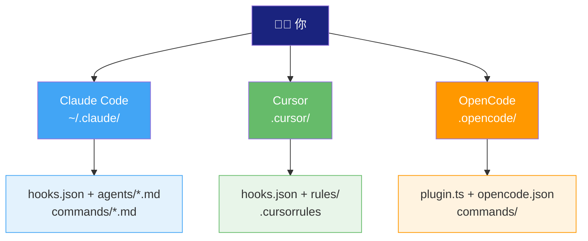
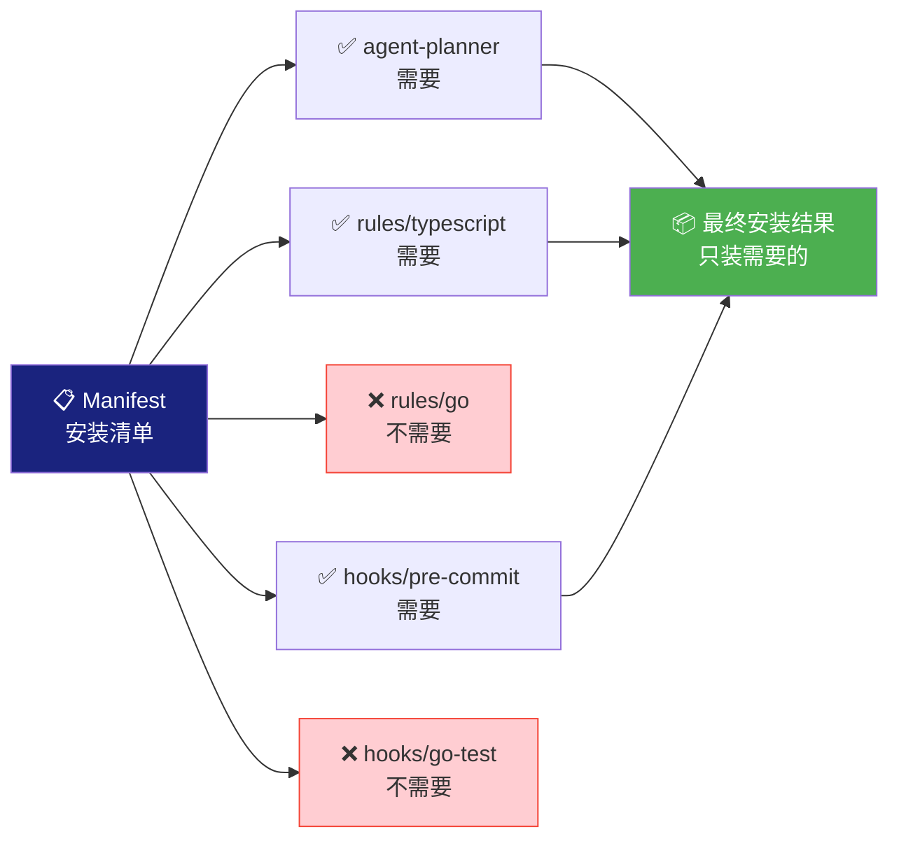
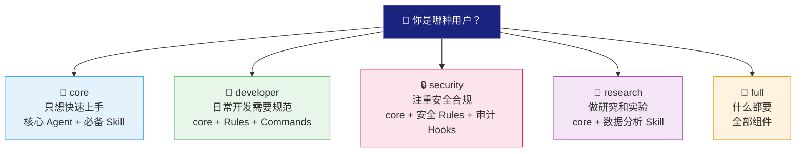
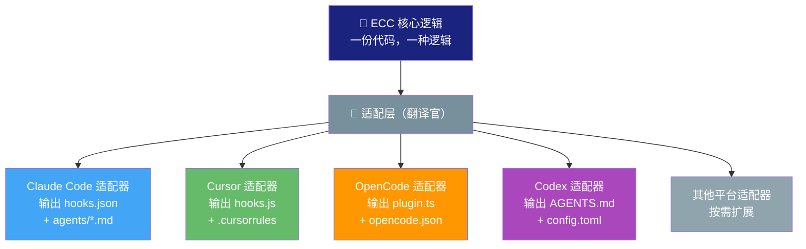

# 08 - 跨 Harness 适配：一次编写，处处运行

> 你有没有过这种经历：家里有 5 个遥控器，电视一个、空调一个、机顶盒一个、音响一个、投影仪一个。每次想换个台，都得先找遥控器。ECC 的跨 Harness 适配要解决的，就是"一个遥控器控制所有设备"的问题。

---

## 真实痛点：你不可能只用一个工具

先说一个残酷的现实：**没有一个 AI 编程工具能满足所有场景**。

你在终端里写代码时，Claude Code 很好用。但有时候你需要 IDE 的图形化界面——看代码结构、用断点调试、看 Git 历史。这时候 Cursor 可能更合适。又或者你想用开源方案自己魔改，那 OpenCode 是个选择。

问题是：**每个工具的配置格式都不一样**。

想象一下：你精心配好了一套规则——"代码风格用 Prettier，测试用 Jest，提交前跑 lint"。现在你想在另一个工具里也用同样的规则，你得手动把配置"翻译"成另一种格式。

一个规则要维护三份，十个规则就是三十份。**这不是人干的活**。

ECC 的核心理念就是：**别让我重复劳动**。我写一份配置，你帮我适配到所有平台。

---

## 为什么选 Manifest-Driven 安装？

你可能会想："为什么不把所有配置一股脑全复制过去？"

好问题。我们来类比一下：你搬家的时候，是把家里所有东西都搬到新家，还是挑需要的带？

**全复制的问题**：

- 你是一个 Python 开发者，安装后发现多了一堆 TypeScript 的 lint 规则——完全用不上，还浪费 token
- 你做纯前端，安装后多了一堆 Go 的 build resolver 配置——噪音太多
- 每次 AI 处理配置时都要读一遍这些无关内容，**白白消耗计算资源**

ECC 的做法是 **Manifest-Driven（清单驱动）安装**：

就像你去宜家买家具，不是把整个仓库搬回家，而是拿一张购物清单，按需挑选。Manifest 就是这张清单——它告诉安装器"这个项目需要哪些组件"，安装器只装清单上有的东西。

**好处**：
- 🎯 **精准** — 只装你需要的，不装多余的
- 💰 **省 token** — AI 不用处理无关配置
- 🔇 **安静** — 没有噪音干扰
- 🔄 **灵活** — 不同项目可以有不同的清单

---

## Profile 体系：五种用户画像

有了 Manifest，下一个问题是："我怎么知道该选哪些组件？"

大部分用户不想自己一个个挑。就像你去餐厅，虽然可以单点，但更多人喜欢直接选套餐——"给我来个招牌套餐"。

ECC 设计了 5 个 Profile，对应 5 种典型的用户画像：

**为什么是 5 个，不是 3 个或 10 个？**

这是设计上的取舍：
- **太少（3 个）**：覆盖不够，用户找不到合适的，还得自己拼
- **太多（10 个）**：选择困难症犯了，用户反而不知道选哪个
- **5 个**：刚好覆盖主流需求，选择成本低

这跟手机的颜色策略一样——黑白灰必有，加一两个特色色，够了。

**对你自己项目的启发**：如果你在做一个配置系统，别急着给用户无限的自由。先定义几个"刚好够用"的预设，让用户能快速上手，然后再给高级用户自定义的空间。

---

## 适配层：翻译官，而不是五套话术

这是整个跨 Harness 适配中最精妙的部分。

每个平台都有自己的"方言"：
- **Claude Code** 用 `hooks.json` 定义事件钩子
- **Cursor** 用 `hooks.js`（JavaScript 文件）
- **OpenCode** 用 `plugin.ts`（TypeScript 插件）

如果你为每个平台都写一遍逻辑，那就是五套代码做同一件事——维护噩梦。

ECC 的做法是：**写一套核心逻辑 + 一个翻译层**。

这就是软件工程中经典的 **适配器模式（Adapter Pattern）**。打个比方：

你是一个中国人，要跟美国人、日本人、法国人做生意。你不需要学会说四国语言——你只需要雇四个翻译。核心谈判逻辑是一样的，变的只是语言。

**适配器模式的好处**：
- ✅ **加新平台很容易** — 写一个新的适配器就行，不用动核心逻辑
- ✅ **改核心逻辑很安全** — 改一处，所有平台自动更新
- ✅ **维护成本低** — 只维护一套核心 + 几个薄薄的翻译层

**对你自己项目的启发**：如果你的系统要支持多个下游平台/格式，先把核心逻辑抽出来，然后为每个平台写一个适配器。别把平台相关的代码混在核心逻辑里——那是技术债的温床。

---

## 实际效果：一套配置，五个平台

来看看一个真实的配置在不同平台上的"翻译"效果：

| 配置内容 | Claude Code | Cursor | OpenCode |
|---------|------------|--------|----------|
| "提交前跑 lint" | `hooks.json` 里加 `preCommit` | `hooks.js` 里加 `onBeforeCommit` | `plugin.ts` 里加 `preCommit` 事件 |
| "Agent 角色定义" | `agents/planner.md` | `.cursor/rules/planner.mdc` | `agents/planner.ts` |
| "自定义命令" | `commands/review.md` | `.cursor/commands/review.md` | `commands/review.ts` |

**核心内容完全一样**，只是"穿了不同的衣服"。

---

## 对你项目的启发

读到这里，你可能已经想到了自己的场景。不管你在做什么项目，跨适配的思路都是通用的：

1. **先抽象核心** — 把"不管在哪个平台都一样的东西"抽出来
2. **再写适配器** — 为每个平台写一个薄薄的翻译层
3. **用清单驱动** — 别全复制，按需安装
4. **提供预设** — 给用户几个"套餐"，降低选择成本

这套方法论，从配置管理到 API 网关，从跨平台 App 到多云部署，处处都能用。

---

## 小结

ECC 的跨 Harness 适配解决了三个真实痛点：

- 🎯 **维护多套配置太累** → 一次编写，自动翻译
- 📦 **全量安装太吵** → Manifest 驱动，按需安装
- 🍽️ **不知道装什么** → 5 个 Profile，快速上手

背后的工程智慧是适配器模式——核心逻辑和平台实现分离，让系统可以低成本地扩展到新平台。

下一篇，我们来看看支撑这一切的工程基础设施——那些你平时看不见，但让一切运转如常的"幕后英雄"。

---

*上一篇：[07-Rules 系统](./07-Rules系统.md) | 下一篇：[09-工程基础设施](./09-工程基础设施.md)*
