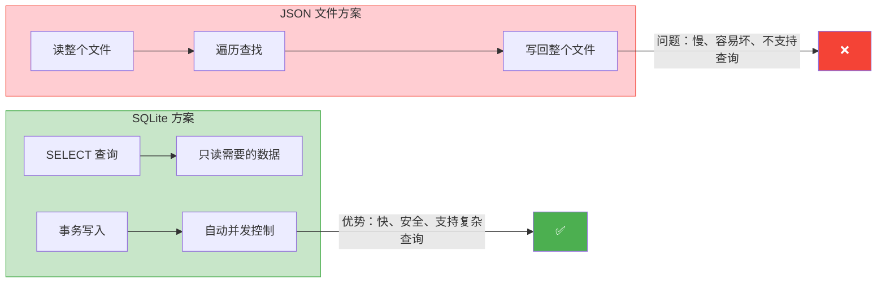
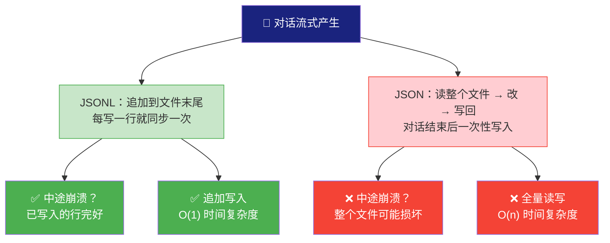
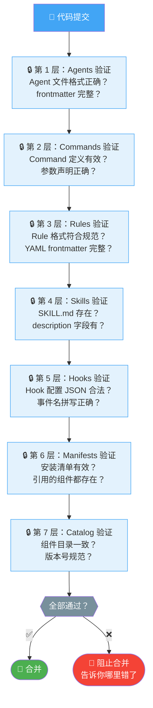
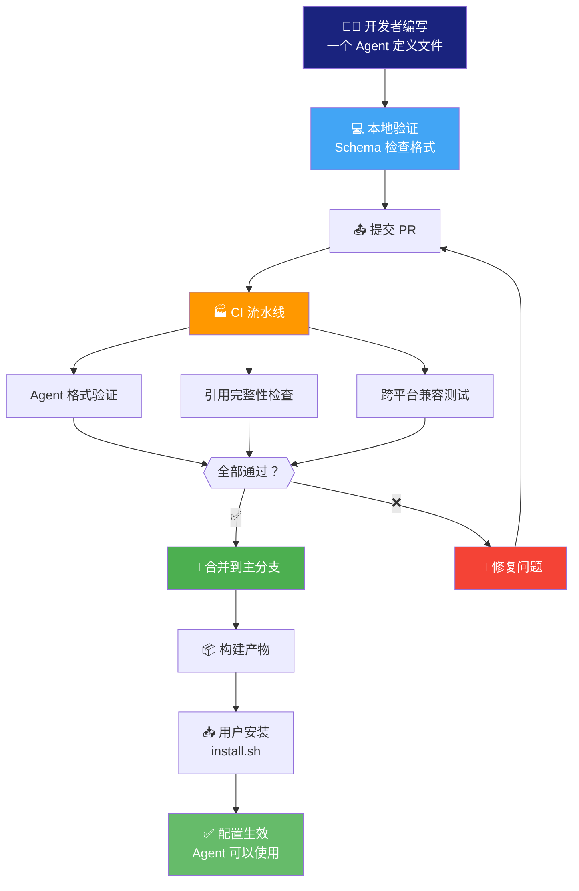

# 09 - 工程基础设施：你住的大楼，地基比装修重要

> 你租了一间公寓，装修很漂亮——木地板、落地窗、开放式厨房。但住进去第一个月，水管爆了、WiFi 不稳定、电梯总坏。你才发现：**地基和管道，比装修重要得多**。ECC 的工程基础设施就是这些"看不见但住得舒服"的地基。

---

## 为什么你需要知道这些？

你可能在想："我只是用 ECC 写代码，为什么要关心底层？"

好问题。你每天坐电梯，不需要知道它怎么运作。但如果电梯老是坏、偶尔把你困在里面，你一定会关心它的维护情况。

ECC 的工程基础设施，就是在确保"电梯永远正常运行"。了解它们，你会更有信心：

- ✅ 关掉终端再打开，状态不会莫名丢失
- ✅ 更新版本不会搞坏你的配置
- ✅ 写错了配置文件，系统会提前告诉你
- ✅ 积累的使用经验会被保留和复用

---

## State Store：为什么选 SQLite 而不是 JSON 文件？

ECC 需要记住很多东西：session 历史、skill 进化记录、安装状态、费用追踪……这些数据存在哪里？

**你可能会想**：用 JSON 文件不就行了？简单、人类可读、到处都能解析。

来，我们做个实验。想象你有一个 JSON 文件记录了 1000 次对话：

```json
{"sessions": [{"id":"s1","summary":"重构auth模块"}, {"id":"s2","summary":"写测试"}, ... 998 more ...]}
```

现在你想找到"上周三那次关于数据库的对话"。你得：
1. 把整个文件读进内存
2. 遍历所有 1000 条记录
3. 找到匹配的

**问题来了**：
- 文件越来越大，读取越来越慢
- 两个进程同时写，文件可能损坏（没有并发控制）
- 想做复杂查询（"上个月 token 花费超过 $5 的 session"），JSON 完全无能为力

SQLite 的优势就体现出来了：



**为什么是 SQLite 而不是 MySQL/PostgreSQL？**

因为 SQLite 是**单文件数据库**——不需要安装服务器，不需要配置连接，一个 `.db` 文件搞定一切。跨平台完美兼容，Linux/macOS/Windows 都能用。对 ECC 这种"本地运行的工具"来说，这是最优解。

**对你自己项目的启发**：如果你的项目需要持久化存储、支持查询、但又不想引入数据库服务器，SQLite 是最佳选择。很多你每天在用的产品（Chrome、Firefox、Android、iOS）底层都用 SQLite。

---

## Session 管理：为什么用 JSONL 而不是大 JSON？

每次你和 AI 对话，ECC 都在记录。问题来了：**怎么记？**

一个朴素的想法：用一个 JSON 文件，对话结束后一次性写入。

```
{
  "messages": [
    {"role": "user", "content": "帮我加登录功能"},
    {"role": "assistant", "content": "好的，我来..."},
    ... 可能有几十条 ...
  ]
}
```

**问题**：对话是流式的——一边聊一边产生内容。如果用单个 JSON：
- 你得等对话结束才能写入（万一中途崩了呢？）
- 每次追加都要把整个文件读进内存 → 改 → 写回（对话很长时巨慢）
- JSON 格式要求完整的结构，中途写入可能得到一个**语法错误的文件**

JSONL（JSON Lines）的解决方案优雅得多：

```jsonl
{"type":"user","content":"帮我加登录功能","ts":"2024-01-15T10:30:00Z"}
{"type":"assistant","content":"好的，我来实现...","ts":"2024-01-15T10:30:05Z"}
{"type":"tool_use","tool":"Read","file":"app.ts","ts":"2024-01-15T10:30:08Z"}
{"type":"tool_result","content":"文件内容...","ts":"2024-01-15T10:30:09Z"}
```

**每行是一个独立的 JSON 对象**，一行写一条记录。好处：

- ✅ **追加写入** — 新内容直接加到文件末尾，不需要读整个文件
- ✅ **不怕崩溃** — 即使写到一半断电了，已写入的行都是完整的
- ✅ **流式处理** — 可以一行一行地读，不需要把整个文件加载到内存
- ✅ **可追溯** — 每条记录有时间戳，出了问题可以精确定位



这是日志系统的标准做法。你手机里的日志、服务器上的 access log、甚至飞机的黑匣子，本质上都是"一行一条记录，追加写入"。JSONL 就是把这个思想用到了对话记录上。

---

## CI/CD 验证：为什么需要 7 层"安检"？

ECC 有 **200+ 配置文件**——agents、commands、rules、skills、hooks、manifests、catalog……任何一个写错了，都可能导致"AI 发疯"。

打个比方：机场安检有好几道——证件检查、行李扫描、人身检查、随机抽检。每一道都拦住一类问题。少了一道，就多一个漏洞。

ECC 的 CI/CD 就是这样的"多层安检"：



**为什么是 7 层而不是"写一个大检查函数"？**

因为分层的好处是**隔离问题**。如果所有检查混在一起，出错时你不知道是哪个环节的问题。分层后，第 3 层报错，你就知道是 Rules 有问题——定位快，修复快。

**这对用户意味着什么**：你用到的每一个配置文件，都经过了自动验证。你不会因为一个 typo 而让 AI 的行为变得不可预测。

---

## 一个配置文件的完整旅程

让我们追踪一个配置文件从"编写"到"生效"的全流程：



从开发者写一行配置，到用户端生效，中间经过了 **4 道关卡**。任何一关不过，都不会到达用户手里。

---

## 这些基础设施对你意味着什么？

把上面所有东西放在一起看：

| 基础设施 | 解决什么问题 | 你的体感 |
|---------|------------|---------|
| State Store (SQLite) | 数据持久化、查询、并发 | 关掉终端再打开，一切都在 |
| Session (JSONL) | 流式记录、崩溃恢复 | 对话历史不会丢失 |
| Skill Evolution | 经验积累、技能生成 | 用得越久，ECC 越聪明 |
| CI/CD | 质量保证、自动验证 | 更新不会搞坏配置 |
| Schema 验证 | 格式检查、提前发现问题 | 写错了立刻告诉你 |

**你不需要知道它们的存在**——就像你不需要知道大楼的水电管道在哪里。但正是因为有它们，你才能"放心住"。

---

## 对你项目的启发

不管你在做什么项目，这些工程实践都是通用的：

1. **选对存储** — 需要查询？用数据库。需要追加日志？用 JSONL/日志文件。别用大 JSON 存一切
2. **分层验证** — 别写一个"万能检查函数"，拆成多层，每层检查一类问题
3. **自动验证** — 手动检查不可靠，CI/CD 才是正道
4. **用户无感** — 最好的基础设施是用户不需要知道的基础设施

---

## 小结

ECC 的工程基础设施就像一栋大楼的水电管道系统——你平时看不见它，但它默默保障着一切正常运行。

- 📒 **State Store (SQLite)** — 比 JSON 文件快、安全、支持查询
- 📔 **Session (JSONL)** — 流式记录，崩溃也不丢数据
- 🏭 **CI/CD** — 7 层验证，确保每个配置文件都正确
- ✅ **Schema 验证** — 提前发现问题，不让错误到达用户

这些"看不见的基础设施"是 ECC 能够稳定运行、持续迭代的底气。

下一篇，我们来看看 ECC 的未来——2.0 版本会带来什么。

---

*上一篇：[08-跨 Harness 适配](./08-跨Harness适配.md) | 下一篇：[10-ECC 2.0 与未来](./10-ECC-2.0与未来.md)*
