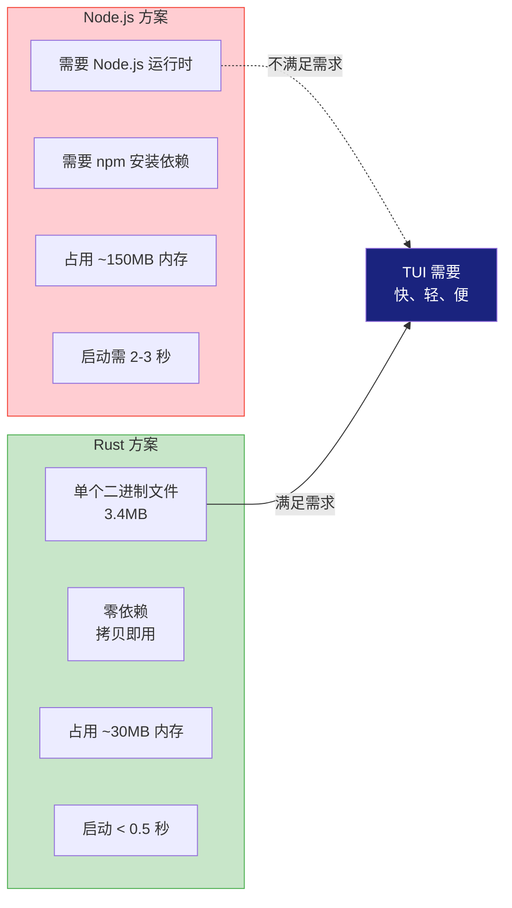
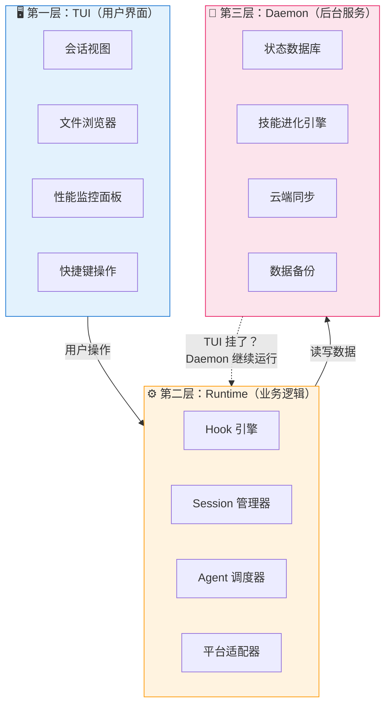
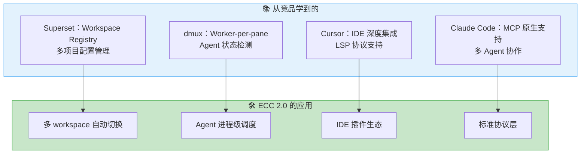
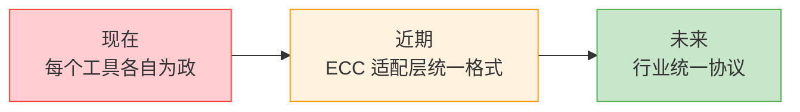

# 10 - ECC 2.0 与未来：从工具箱到指挥中心

> ECC 1.0 像给你配了一套好用的工具箱——锤子、螺丝刀、扳手，样样都有。ECC 2.0 则是直接给你造了一个"指挥中心"——终端里的控制面板，所有工具都在面前，一切尽在掌握。

---

## 为什么要做 ECC 2.0？

先说痛点。ECC 1.0 解决的是"配置管理"的问题——让 AI 编程工具的行为可控、可预测。但它也有局限：

- **配置文件散落各处** — agents、skills、rules、hooks 分散在不同目录，没有统一视图
- **没有管理界面** — 你想看看"现在有哪些 Agent 在运行"，只能去翻文件夹
- **多 Agent 编排靠脑补** — 你想让 planner 和 reviewer 协作，得自己想清楚怎么串起来
- **状态不够可视化** — 花了多少 token？哪个 session 最费钱？看不到

用一个比喻：ECC 1.0 是一个**文件柜**——东西都在，但你得自己翻。ECC 2.0 是一个**仪表盘**——关键信息一目了然，操作一个按键搞定。

---

## 为什么用 Rust 而不是继续 Node.js？

这是个好问题，因为"能跑就行"的情况下，没必要换语言。但 ECC 2.0 的目标变了，对运行环境的要求也变了。

### ECC 2.0 要做什么？

它要做一个 **TUI（Terminal User Interface）**——终端里的图形界面。你用过 `htop` 吗？在终端里也能有面板、表格、快捷键。ECC 2.0 的 TUI 就是那种体验。

TUI 需要：
- 🚀 **快速渲染** — 终端界面要流畅，不能卡顿
- 💾 **低内存** — 后台常驻运行，不能吃太多内存
- 📦 **单个二进制** — 编译成一个文件，拷贝到任何机器就能跑
- 🔌 **零依赖** — SSH 到远程服务器，不想装 Node.js/npm 一堆东西



**一个实际场景**：你在 SSH 连接到远程服务器上工作。服务器上没有 Node.js。如果 ECC 是 Node.js 写的，你得先装 Node.js 再装 ECC。但如果 ECC 是 Rust 编译的二进制文件，你 `scp` 一个 3.4MB 的文件过去就能用。

**对你自己项目的启发**：选语言不是"哪个流行选哪个"，而是看你的运行环境约束。CLI 工具、后台服务、需要分发到多平台的 → 考虑编译型语言（Rust、Go）。Web 应用、快速原型 → Node.js/Python 依然很好。

---

## 三层架构：为什么这么分？

ECC 2.0 的架构分为三层：



**为什么要分三层，而不是一个大程序？**

关键原因是**故障隔离**：

- **TUI 挂了**（比如终端窗口被关了）→ Daemon 还在运行，Agent 的任务不受影响
- **Daemon 重启了** → 因为状态存在 SQLite 里，重启后自动恢复
- **Runtime 升级了** → TUI 和 Daemon 不需要动，可以独立更新

打个比方：你的电脑显示器关了，CPU 和硬盘还在正常工作。你重新打开显示器，一切恢复。三层架构就是实现了这种"组件独立"。

**如果只有一层会怎样？** 一个大程序，终端窗口一关，所有 Agent 任务全部中断。没有状态恢复，没有故障隔离。这在长时间运行的 AI 任务中是不可接受的。

---

## 从竞品学到什么？

ECC 2.0 不是在真空中设计的。它从其他项目学到了很多——不是"抄"，而是"理解不同方案的取舍"。

### Workspace Runtime Registry（借鉴 Superset）

**问题**：你同时在 3 个项目上工作，每个项目有不同的配置。怎么管理？

**Superset 的思路**：有一个"注册表"，记录每个 workspace 的运行时配置。切换项目时，自动加载对应的配置。

**ECC 的用法**：借鉴这个概念，实现多项目配置的自动切换。你在项目 A 用 Python 规则，在项目 B 用 TypeScript 规则，ECC 自动帮你切。

### Worker-per-pane Detection（借鉴 dmux）

**问题**：你开了多个 pane，每个 pane 里可能有一个 Agent 在跑。怎么知道哪个 Agent 在忙、哪个在空闲？

**dmux 的思路**：每个 pane 有一个独立的 worker 进程，通过检测 worker 状态来判断 pane 的活跃度。

**ECC 的用法**：借鉴这个思路，给每个 Agent 分配独立的进程/线程，通过进程状态来判断 Agent 状态，实现更精确的调度。



**对你自己项目的启发**：不要闭门造车。看看同类产品在做什么，理解它们的设计取舍，然后选择性地吸收。关键不是"抄功能"，而是"理解为什么这样设计"。

---

## 未来的方向

不是空想，而是基于当前趋势的合理推演。

### 多 Agent 并行

现在的 AI 编程助手，大多是"一个 Agent 对一个任务"。但未来一定是"多个 Agent 协作"——一个写代码，一个写测试，一个做 Code Review。

ECC 2.0 的 Agent 调度器就是为这个准备的。它不只是"启动一个 Agent"，而是管理一个 Agent 团队的协作。

### Self-improving Skills

现在 ECC 的 Skill 是人写的。但未来，Skill 可以从使用经验中自动生成——你做了 100 次类似的重构，ECC 自动总结出一个"重构 Skill"。

ECC 1.0 的 Continuous Learning 系统已经迈出了第一步（Instinct → Cluster → Skill），2.0 会让这个过程更自动化。

### 跨 Harness 统一协议

现在每个 AI 编程工具各有各的格式。但就像 USB 统一了充电接口一样，未来一定会有一个统一的协议——Agent 之间怎么通信、配置怎么定义、Hook 怎么触发。

ECC 2.0 在做的，就是为这个统一协议打基础。



---

## 迁移：从 1.0 到 2.0

如果你已经在用 ECC 1.0，别担心——迁移会很平滑：

```bash
# 1. 备份（好习惯）
ecc export --all > backup.json

# 2. 安装 2.0（单个二进制，3.4MB）
cargo install ecc

# 3. 导入
ecc import backup.json

# 4. 验证
ecc doctor
```

配置格式会自动转换——就像手机系统升级，App 和数据都还在。

---

## 你学的这些，是 AI 编程的基础

读完这个系列，你已经理解了 ECC 的完整体系：

| 篇章 | 你学到了 |
|------|---------|
| 01-项目全景 | ECC 是什么、解决什么问题 |
| 02-Hooks 系统 | 事件驱动的响应机制 |
| 03-Agent 系统 | 多角色协作的方法论 |
| 04-Commands 系统 | 快捷指令的设计 |
| 05-Skills 系统 | 知识复用的机制 |
| 06-Continuous Learning | 从经验中学习的闭环 |
| 07-Rules 系统 | 代码规范的自动化 |
| 08-跨平台适配 | 适配器模式的应用 |
| 09-工程基础设施 | SQLite/JSONL/CI-CD 的选型 |
| 10-未来 | 三层架构、趋势推演 |

这些知识不会过时。即使 ECC 的具体实现会变（从 Node.js 换到 Rust），**核心理念是通用的**：

- Agent 编排的思想
- Hook 驱动的事件模型
- 持续学习的闭环
- 跨平台适配的策略
- 基础设施的选型逻辑

你现在学的这些，就是未来 AI 编程的基础。

---

## 最后的话

ECC 从一个个人配置集合，成长为一个完整的 AI 编程基础设施。它证明了一件事：**AI 编程助手不只是"能聊天就行"，它需要系统化的方法论来支撑**。

就像手机从功能机到智能机，变化不只是硬件，而是整个生态和使用方式。

ECC 2.0 正在把这个理念推到新的高度。

Happy Coding! 🚀

---

*上一篇：[09-工程基础设施](./09-工程基础设施.md) | 回到系列开头：[00-系列导读](./index.md)*
