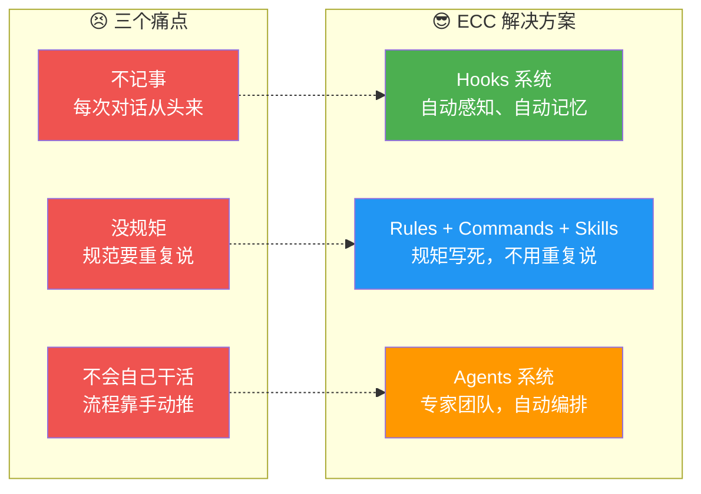
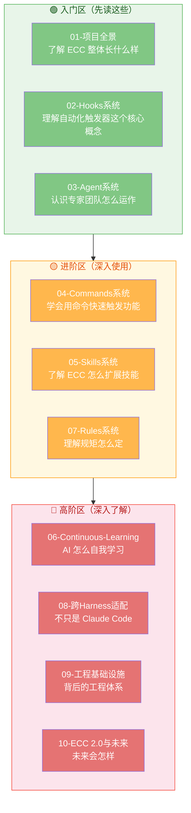

# Everything Claude Code 深度解析系列 — 导读

> **一句话说清：** ECC 就是给 Claude Code 装上操作系统的超级外挂。

---

## 一个开发者的真实故事

小明用上了 Claude Code，一开始很兴奋——TA 真的能写代码，而且写得还挺快！

但用了三天，小明开始抓头发：

**第一个坑：不记事。** 昨天研究了一下午怎么配 OAuth，今天打开终端，TA 完全不记得了。小明得把整个背景重新说一遍。这就像你每次开会都要从头自我介绍一样，太累了。你可能会想，那就别关终端呗？问题是项目有好几个，你不可能同时开一堆终端不关。而且就算你不关，Claude Code 的上下文窗口也是有限的——聊得多了，前面的内容就自动"遗忘"了。你精心调教了半天的上下文，一场长对话就没了。

**第二个坑：没规矩。** 团队规定用 2 个空格缩进、变量用 camelCase、提交前要跑测试。但 Claude Code 哪管这些，写出来的东西风格跟团队代码格格不入。你得一条一条告诉 TA——每次都是。而且你跟 TA 说了"用 2 个空格"，TA 下一个文件又给你搞成 4 个了。更麻烦的是安全规范：你说"不要在代码里写密码"，TA 点头了，转头就把 API key 硬编码到了配置文件里。你不可能时时刻刻盯着 TA 的每一个操作。

**第三个坑：不会自己干活。** 写完代码了，TA 就停在那儿。你得手动说"跑一下测试"、"格式化一下"、"检查一下有没有 console.log"。TA 就像一个需要你手把手推着走的机器人。你说"改完文件要格式化"，TA 记住了——但也就记住了这一次。下次你问别的问题，TA 又忘了。你得不断重复这些"流程指令"，烦不胜烦。

小明崩溃了：「你这么聪明，怎么就不会自己管理自己呢？」

**这就是 ECC 解决的问题。**

---

## ECC 怎么解决这三个痛点？

ECC 把这三个痛点拆成了三组解决方案，正好对应学习路线的三个阶段：

### 记忆问题 → Hooks 系统

Hooks 是 ECC 的"神经系统"。它在关键时刻自动触发动作：开始工作时自动加载上次的记忆，结束时自动保存状态。Claude Code 不再是失忆的鱼。

你不需要记住要保存什么、什么时候保存——Hooks 系统会自动帮你做。就像你用的编辑器自动保存一样，你写到一半电脑死机了，重启后文档还在，因为编辑器在背后默默帮你存盘了。Hooks 干的就是这件事。

### 规矩问题 → Rules + Commands + Skills 系统

这三个模块一起构成 ECC 的"规矩体系"。

**Rules** 定义底线：什么不能做、必须怎么做。比如"提交前必须跑测试"、"不能用 console.log"、"变量命名用 camelCase"。这些规矩一旦写好，每次 AI 工作时都会自动遵守，你不用反复说。

**Commands** 封装常用操作：你经常要做的一套流程（比如"规划 → 设计 → 写测试 → 写代码 → 审查"），用一个 `/plan` 或 `/tdd` 就能触发，不用每次都从头描述。

**Skills** 提供领域知识：遇到特定问题怎么处理。比如"碰到构建错误怎么办"、"TypeScript 类型报错怎么排查"。这些知识以"菜谱"的形式存储，AI 遇到问题时会自动查阅。

### 自动化问题 → Agent 系统

Agent 系统是 ECC 的"专家团队"。不是让一个 AI 干所有事，而是让规划师拆任务、安全员审漏洞、测试员保质量、审查员把最后一关。

你只需要说"我要做一个用户认证模块"，系统就知道：先找规划师设计方案 → 安全员审查方案 → 测试员指导写测试 → 写完代码审查员过一遍。你不需要手动调度这些专家——系统帮你安排。

---

## 为什么叫"Everything" Claude Code？

你可能会想：这名字是不是有点夸张？什么都是 Claude Code？

其实这里的"Everything"有两层意思：

**第一层：功能全覆盖。** 记忆、规矩、自动化、安全、技能——一个 AI 编程助手需要的所有辅助系统，ECC 都帮你做好了。你不需要东拼西凑一堆工具。

**第二层：多 Harness 兼容。** ECC 不只是给 Claude Code 用的。它支持 Codex、Cursor 等多种 AI Agent Harness。就像一个万能充电器，不管你的手机是什么牌子，插上就能用。

---

## 学习路线图

11 篇文章，分成三个区域。建议按顺序读，因为后面的会引用前面的概念：

### 推荐的阅读路径

**如果只有 1 小时：** 读 01 → 02 → 03，了解核心三件套就够用了。这三篇会告诉你 ECC 长什么样、怎么自动运转、专家团队怎么协作。看完你就能判断 ECC 适不适合你。

**如果有一个下午：** 读 01 → 02 → 03 → 04 → 05，完整了解怎么用。Commands 和 Skills 是日常使用中最常打交道的部分，看完你就能上手实操了。

**如果你想彻底搞懂：** 按顺序全读，大约需要 5-6 小时。特别推荐第 06 篇（Continuous Learning）和第 08 篇（跨 Harness 适配），这两篇会打开你的视野，让你看到 AI Agent 系统设计的深层逻辑。

---

## 谁适合看这个系列？

**刚用 Claude Code 的开发者。** 你可能刚装上 Claude Code，发现 TA 用起来没想象中那么顺。看完这个系列你会理解：不是 TA 不行，是你没给 TA 装上合适的系统。就像一匹好马，没有马鞍和缰绳，你骑着当然难受。

**想提效的程序员。** 你已经在用 Claude Code 了，但总觉得"也就那样"。Hooks、Agent、Skills 这些"隐藏功能"你可能都没碰过。看完你会解锁 Claude Code 的真正实力。

**技术负责人。** 你想在团队里推广 AI 工具，但担心大家用法不一致、代码质量下降。ECC 提供了一套标准化的方案：规矩写死在 Rules 里，流程封装在 Commands 里，每个人用出来的东西是一致的。

**对 AI Agent 感兴趣的人。** 你不一定要用 ECC，但 ECC 的设计思路非常值得学习。它是少数真正经历过生产环境考验的 Agent 系统，每一条设计决策背后都有"血的教训"。

**不需要你懂很多** —— 每个概念我都会用比喻和图来解释，代码只在"教你怎么做"时才出现。如果你能看懂这篇文章，你就能看懂整个系列。

---

## 预计学习时间

| 篇目 | 时长 | 难度 | 核心收获 |
|------|------|------|---------|
| 01-项目全景 | 20 分钟 | ⭐ | 知道 ECC 长什么样 |
| 02-Hooks系统 | 30 分钟 | ⭐⭐ | 理解自动化怎么运转 |
| 03-Agent系统 | 30 分钟 | ⭐⭐ | 理解专家团队怎么协作 |
| 04-Commands系统 | 20 分钟 | ⭐ | 学会用命令触发功能 |
| 05-Skills系统 | 25 分钟 | ⭐⭐ | 了解技能扩展机制 |
| 06-Continuous-Learning | 30 分钟 | ⭐⭐⭐ | 理解 AI 怎么自我进化 |
| 07-Rules系统 | 20 分钟 | ⭐⭐ | 掌握规矩制定方法 |
| 08-跨Harness适配 | 25 分钟 | ⭐⭐⭐ | 看到多平台兼容设计 |
| 09-工程基础设施 | 30 分钟 | ⭐⭐⭐ | 了解背后工程体系 |
| 10-ECC 2.0与未来 | 20 分钟 | ⭐ | 展望未来方向 |

---

## 开始吧

准备好了？从 [01-项目全景](./01-项目全景.md) 开始。

不需要先安装什么——先了解它是什么，再决定要不要装。就像买车之前先试驾，看完这系列你自然会知道 ECC 适不适合你。
