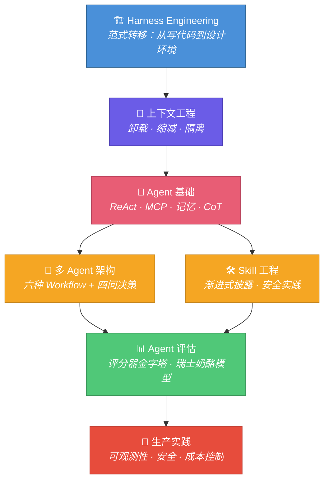

## 为什么是现在？

2024-2025，AI 工程发生了根本性变化。

模型能力已经不是瓶颈。**瓶颈变成了你如何组织上下文、如何设计 Agent 交互、如何把实验室原型推上生产环境。** 每个团队都在问同一个问题：怎么搭一个真正可用的 Agent 系统？

答案不在某个框架的文档里。答案在一套工程方法论里——**Harness Engineering**。

这套方法论由 Anthropic、OpenAI、LangChain、Cursor 等一线团队在实践中提炼。本教程把散落的碎片拼成完整地图，100+ 篇深度笔记提炼成 7 个核心模块，从范式转移到生产部署，一条路走通。

**如果你在 2025 年做 AI 工程，这不是"可以看看"的教程——这是你必须掌握的底层知识。**

---

## 🗺️ 学习路线图

学完前两个模块，你就具备了设计 Agent 系统的**架构眼光**。学完全部七个模块，你就能独立搭建生产级多 Agent 系统。不是 demo，是能跑在服务器上处理真实请求的系统。

---

## 💡 你将获得的具体能力

  <strong>✅ 设计 Harness</strong> 
  为任意 LLM 应用设计环境层——Prompt、Tools、Context 的组织方式

  <strong>✅ 管控上下文窗口</strong> 
  诊断上下文腐烂问题，应用卸载/缩减/隔离策略修复

  <strong>✅ 构建 Agent 循环</strong> 
  实现 ReAct 模式，集成 MCP 工具协议，设计记忆架构

  <strong>✅ 设计多 Agent 系统</strong> 
  从六种 Workflow 中选择合适的模式，用四问框架做架构决策

  <strong>✅ 开发 Agent Skill</strong> 
  设计三要素 Skill，实现渐进式披露的三层加载机制

  <strong>✅ 建立评估体系</strong> 
  搭建评分器金字塔，用 Pass@k 概率统计量化 Agent 质量

  <strong>✅ 部署生产系统</strong> 
  配置可观测性、安全沙箱、Token 预算、断点续传

  <strong>✅ 评估架构选型</strong> 
  面对真实需求时，判断单体 vs 多 Agent、选哪种 Workflow

---

## 🏛️ 内容来源

这不是一个人的观点。本教程综合了以下团队的公开实践和研究：

| 来源 | 贡献 |
|------|------|
| **Anthropic** | *Building Effective Agents*、*Multi-Agent Research*、*Agent Skills*、*Evals for AI Agents* |
| **OpenAI** | Codex 团队的 Harness Engineering 实践 |
| **LangChain** | 上下文工程系列、Workflow 五种模式 |
| **Cursor** | 动态上下文发现机制 |
| **Menlo** | 上下文工程生产实践 |
| **Shannon (Kocoro-lab)** | 三层架构多 Agent 系统开源实现 |

来自 100+ 篇原始笔记的系统性整理。不是翻译，是消化后的工程方法论。

---

## 📊 教程规模

  
100+

  
源笔记文章

  
7

  
核心模块

  
3,000+

  
行教程内容

---

## 👤 适合谁

- 正在构建 Agent 系统但总觉得"差了点什么"的**后端工程师**
- 需要设计多 Agent 协作架构但不确定选型的**技术负责人**
- 关心成本、安全、可观测性却找不到系统化资料的**架构师**
- 用 LangChain/CrewAI 搭过 demo 但推不上生产的**AI 开发者**

---

准备好了吗？

AI 工程的竞争窗口正在收窄。  
别人已经在用这些方法论搭建系统了。  
你还在等什么？

[开始学习 →](/01-Harness工程核心原则/)

