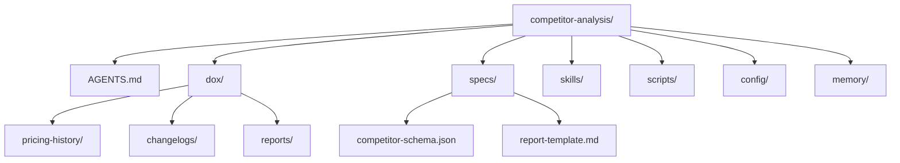
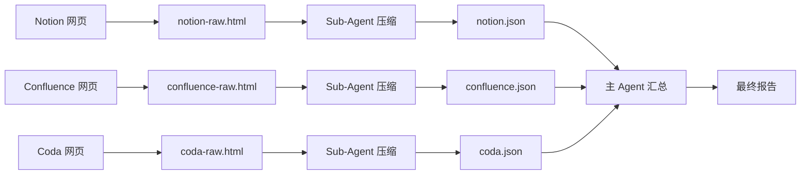
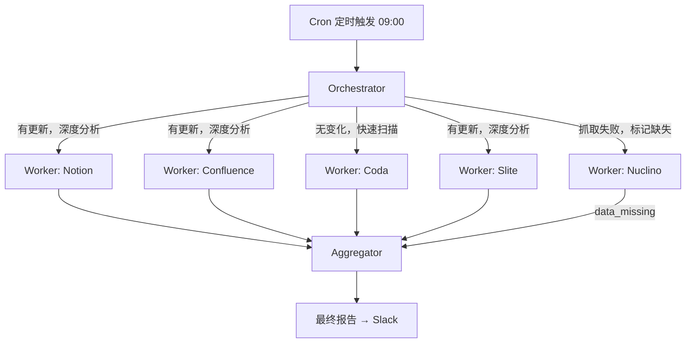
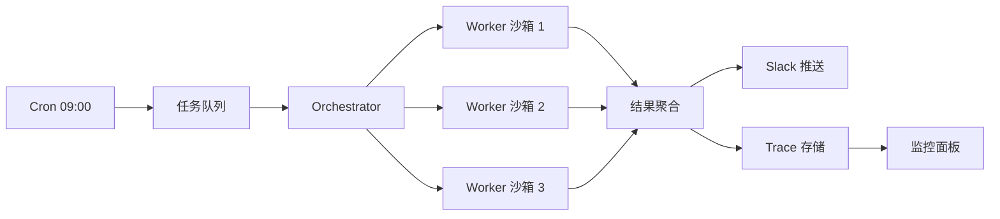

# 端到端案例：自动化竞品分析 Agent 系统

> 本案例贯穿 Hermes Engineering 全部七个模块，展示一个真实 Agent 系统从设计到上线的完整过程。

## 场景设定

- **公司**：CloudSync，一家做团队协作 SaaS 的公司
- **需求**：每天自动监控 5 个竞争对手（Notion、Confluence、Coda、Slite、Nuclino）的产品更新、定价变化和市场动态
- **产出**：结构化竞品分析报告，推送到 Slack 频道
- **用户**：产品经理 + 市场团队，每天早上 9 点收到报告

---

## 第一章对应：Harness Engineering — 设计 Agent 的运行环境

在写任何 Agent 代码之前，先解决"环境"问题。一个好的 Harness 让 Agent 有地方落脚、有东西可读、有规则可循。

**知识可发现**：项目采用以下目录结构，确保 Agent 和人类都能快速找到需要的信息：

```
competitor-analysis/
├── AGENTS.md              # Agent 行为规范和项目说明
├── dox/
│   ├── pricing-history/   # 各竞品历史价格数据
│   ├── changelogs/        # 竞品更新日志归档
│   └── reports/           # 生成的分析报告
├── specs/
│   ├── competitor-schema.json   # 竞品数据 JSON Schema
│   └── report-template.md       # 报告模板
├── skills/
│   ├── competitor-research/
│   ├── pricing-tracker/
│   └── report-generator/
├── scripts/
│   ├── fetch_pricing.py
│   ├── validate_data.py
│   └── send_slack.py
├── config/
│   ├── competitors.yaml   # 竞品配置（URL、白名单域名）
│   └── settings.yaml      # 全局配置
└── memory/
    ├── state.json         # 运行状态
    └── daily/             # 每日执行日志
```

**状态可读性**：Agent 需要三类"感官"——`web_fetch` 获取网页 HTML，`exec` 调用截图工具捕获定价页面快照，日志系统记录每次抓取的原始响应。所有感知数据落盘后再处理，确保可追溯。

**强制执行的黄金规则**（用 Schema 校验和 Linter 实现，不是文档建议）：

1. 所有外部数据必须先通过 `competitor-schema.json` 校验再使用
2. 报告中引用的每个数据点必须附带来源 URL 和抓取时间戳
3. 价格数据必须区分 `current_price` 和 `historical_price`，禁止混用字段
4. 单次抓取失败不抛异常，标记为 `data_missing` 继续执行
5. 所有写入 `dox/` 的文件必须包含元数据头（日期、来源、数据版本）



**产出物清单**：仓库目录结构、`competitor-schema.json` 数据校验规则、`config/competitors.yaml` 竞品配置、AGENTS.md 行为规范、CI 中的 Schema 校验步骤。

**本章关键决策**：把"黄金规则"编码为机器可执行的 Schema 和 Linter，而不是依赖文档——Agent 不读 README，但会遵守报错。

---

## 第二章对应：上下文工程 — 管理 Agent 的信息流

竞品分析的最大风险不是"信息不够"，而是"信息太多"。一个竞品的定价页面可能有 5000+ token 的原始 HTML，5 家公司加起来就是 25K+，还不算博客、changelog、新闻稿。如果不做上下文管理，Agent 很快就会在噪音中迷失。

**卸载策略**：Agent 抓取到的原始网页内容不进入上下文窗口，而是直接写入文件系统。上下文只保留两样东西：文件路径和一段 200 字以内的摘要。

```python
# 卸载：原始内容 → 文件，摘要 → 上下文
raw_html = web_fetch("https://notion.so/pricing")
write_file("dox/pricing-history/notion-2026-03-23.html", raw_html)
summary = llm_summarize(raw_html, max_tokens=200)  # 只保留摘要
# 上下文中只放 summary + 文件路径，不放原始 HTML
```

**缩减策略**：每家公司分析完后，压缩成一个结构化 JSON，丢弃所有自然语言叙述，只保留字段化数据：

```json
{
  "company": "Notion",
  "date": "2026-03-23",
  "current_pricing": {"free": 0, "plus": 10, "business": 18},
  "price_change": {"field": "plus", "from": 8, "to": 10, "pct": "+25%"},
  "latest_version": "2.45.0",
  "key_changes": ["新增 AI 写作助手", "API 速率限制调整"],
  "source_urls": ["https://notion.so/pricing", "https://notion.so/changelog"]
}
```

**隔离策略**：每家公司用独立的 Sub-Agent 上下文处理，主 Agent 只接收 5 份压缩后的 JSON 汇总，不接触任何原始网页内容。

**信息流**：网页 → 原始文件 → 单公司压缩 JSON → 主 Agent 汇总



单个 Sub-Agent 的上下文控制在 30K token 以内（浅腐烂阈值），超过则触发强制压缩。

**产出物清单**：上下文管理方案文档、文件系统设计（目录命名规范）、JSON 压缩模板、Sub-Agent 上下文预算配置。

**本章关键决策**：三层卸载——原始数据写文件、分析结果压缩为 JSON、主 Agent 只看汇总——把上下文从"可能爆炸"变成"可控边界"。

---

## 第三章对应：Agent 基础 — ReAct 循环与工具调用

单个竞品分析 Worker 的一次执行，本质上是一个 ReAct 循环：想一步、做一步、看结果、再想。

以下是一个分析 Notion 的具体执行示例（6 步）：

| 步骤 | Thought（思考） | Action（行动） | Observation（观察） |
|:---|:---|:---|:---|
| 1 | 需要获取 Notion 最近一周的产品更新 | `web_search("Notion product update March 2026")` | 找到 3 篇博客，最新一篇发布于 3 月 20 日 |
| 2 | 最新博客提到了定价调整，需要确认具体变化 | `web_fetch("https://notion.so/pricing")` | 获取到定价页面 HTML，Plus 方案从 $8 → $10 |
| 3 | 需要对比上周的价格数据确认变化幅度 | `read_file("dox/pricing-history/notion-2026-03-16.json")` | 上周 Plus 方案确实是 $8，确认涨了 25% |
| 4 | 这是一个值得关注的变化，需要记录详细信息 | `write_file("dox/changelogs/notion-2026-03-23.json", {...})` | 文件写入成功 |
| 5 | 需要检查是否有新功能发布 | `web_fetch("https://notion.so/changelog")` | 发现新增 AI 写作助手功能 |
| 6 | 分析完成，写入最终结果 | `write_file("dox/reports/notion-2026-03-23.json", summary)` | 任务完成 |

这个 Worker 需要 7 个工具：

| 工具 | 用途 |
|:---|:---|
| `web_search` | 搜索竞品最近的新闻、博客和更新公告 |
| `web_fetch` | 抓取定价页面、changelog 等网页内容 |
| `read_file` | 读取历史价格数据和配置文件 |
| `write_file` | 写入分析结果和原始数据归档 |
| `exec` | 执行数据校验脚本和格式化工具 |
| `compare_pricing` | 对比当前价格与历史价格，计算变化幅度 |
| `validate_schema` | 校验输出数据是否符合 Schema 定义 |

**记忆设计**：短期记忆就是上下文窗口内的 ReAct 历史（本轮抓了什么、看到了什么）；长期记忆是 `dox/pricing-history/` 下的 JSON 文件，存储每次采集的价格快照，供后续对比。

**终止条件**：三个出口——① Agent 判断分析完成并写入结果文件；② 达到最大 20 轮 ReAct 循环；③ Token 预算耗尽（单 Worker 上限 15K token）。

**产出物清单**：工具集定义文档、ReAct 执行流程图、工具调用接口规范。

**本章关键决策**：用显式的工具表定义 Worker 能力边界——不是让 Agent "自由探索"，而是在有限工具集内高效完成任务。

---

## 第四章对应：多 Agent 架构 — 编排模式选择

**为什么单 Agent 不够？** 5 家竞品的网页抓取 + 分析 + 报告生成，总 token 消耗约 75K，远超单个上下文窗口的舒适区。更重要的是，分析 5 家公司之间没有强依赖——Notion 的分析不需要等 Confluence 完成——天然适合并行。

**选型决策**：采用 Orchestrator-Workers 模式，而非简单的 Sectioning（固定并行）。原因在于任务需要动态拆分：有的公司本周有重大更新需要深度分析（可能要多抓几个页面），有的没有变化可以快速跳过。Orchestrator 能根据初步扫描结果动态决定每个 Worker 的工作量。



**退化方案**：如果 Token 预算有限，可以退化为 Sectioning 模式——固定给每家公司分配 3 轮 ReAct，不做动态判断。牺牲灵活性，换取可预测的成本。

**错误处理**：单个 Worker 失败不影响其他 Worker。失败的公司在最终报告中标记为「数据缺失」，并附带失败原因（网络超时、页面结构变化等）。连续 3 天失败触发告警。

**产出物清单**：架构设计文档（含 Mermaid 图）、Agent 拆分方案（Orchestrator / Worker / Aggregator 职责定义）、Worker 并发策略。

**本章关键决策**：选 Orchestrator-Workers 而非 Sectioning——用动态判断换灵活性，让有大更新的公司得到更多分析资源，没变化的快速跳过。

---

## 第五章对应：Skill 工程 — 封装分析能力

分析能力不应该散落在 Prompt 里，而是封装为可复用的 Skill。每个 Skill 是一个自包含的能力单元：有说明文档、有执行脚本、有参考数据。

设计 3 个 Skill：

**`competitor-research`** — 抓取并分析单个竞品：
```
skills/competitor-research/
├── SKILL.md             # 触发条件、执行步骤、输出格式
├── scripts/
│   ├── fetch_blog.py    # 抓取竞品博客和 changelog
│   └── extract_info.py  # 从 HTML 中提取结构化信息
└── references/
    └── competitor-list.md  # 竞品基本信息速查
```

**`pricing-tracker`** — 专门追踪价格变化：
```
skills/pricing-tracker/
├── SKILL.md             # 价格对比逻辑、涨跌标注规则
├── scripts/
│   ├── compare.py       # 对比当前 vs 历史价格
│   └── snapshot.py      # 保存当前价格快照
└── references/
    └── pricing-models.md  # SaaS 定价模式分类参考
```

**`report-generator`** — 生成最终 Slack 报告：
```
skills/report-generator/
├── SKILL.md             # 报告格式规范、Slack Block Kit 模板
├── scripts/
│   ├── format_slack.py  # 将 JSON 转为 Slack 消息格式
│   └── send.py          # 调用 Slack API 发送
└── references/
    └── slack-blocks.md  # Block Kit 组件速查
```

**渐进式披露**：主 Agent 只看到 Skill 的名称和一句话描述（在 `AGENTS.md` 中列出），真正需要时才通过 `read` 加载 SKILL.md 全文。这样主 Agent 的上下文中不会堆满所有 Skill 的细节。

**安全考虑**：`web_fetch` 只允许访问 `config/competitors.yaml` 中白名单的域名（notion.so、atlassian.com 等），脚本在沙箱环境中执行，禁止访问本地文件系统以外的路径。

**产出物清单**：3 个 Skill 定义（SKILL.md + 脚本 + 参考文档）、Skill 目录结构规范、白名单域名配置。

**本章关键决策**：把分析能力封装为 Skill 而非写死在 Prompt 中——Skill 可版本化、可复用、可独立测试，Prompt 只负责调度。

---

## 第六章对应：Agent 评估 — 怎么知道分析得好不好？

没有评估的 Agent 系统就是在盲飞。我们需要定义"好"的标准，然后用评分器自动测量。

**评估维度**：

| 维度 | 评分器类型 | 怎么评 | 合格线 |
|:---|:---|:---|:---|
| 数据准确性 | 代码评分器 | 对比报告中的价格/版本号与真实数据 | ≥ 95% |
| 覆盖度 | 模型评分器 | LLM-as-Judge 判断是否遗漏关键变化 | ≥ 90% |
| 时效性 | 代码评分器 | 检查报告中数据的时间戳是否为当天 | 100% |
| 可操作性 | 模型评分器 | LLM-as-Judge 判断是否有明确行动建议 | ≥ 80% |

**Pass@k vs Pass^k**：用 Pass@3 测试新功能——比如竞品上线了新的定价页面，Agent 能否在 3 次尝试内成功抓取？用 Pass^3 测试稳定性——连续 3 天的报告质量是否一致，没有大幅波动。

评分器配置伪代码：

```python
evaluators = {
    "accuracy": CodeScorer(
        check=lambda report, ground_truth: compare_pricing(
            report["prices"], ground_truth["prices"]
        ),
        threshold=0.95
    ),
    "coverage": ModelScorer(
        prompt="判断报告是否覆盖了以下关键变化: {changes}",
        model="gpt-4",
        threshold=0.90
    ),
    "timeliness": CodeScorer(
        check=lambda report: all(
            ts == today for ts in report["timestamps"]
        ),
        threshold=1.0
    ),
    "actionability": ModelScorer(
        prompt="报告中的建议是否具体可执行？",
        model="gpt-4",
        threshold=0.80
    ),
}
```

**评估漂移**：竞品网站会改版，定价逻辑会变化，Agent 的抓取策略可能逐渐失效。每季度人工抽检 5% 的报告质量，发现漂移及时更新 Skill 和工具。

**产出物清单**：4 维度评估体系、评分器配置、Pass@k / Pass^k 测试方案、季度人工抽检流程。

**本章关键决策**：代码评分器管"硬指标"（价格对不对），模型评分器管"软指标"（建议好不好）——两类评分器各司其职，避免用一种工具解决所有问题。

---

## 第七章对应：生产实践 — 上线和运维

设计得再好，跑不起来等于零。这章解决"7×24 稳定运行"的问题。

**部署架构**：



**可观测性**：每次执行生成完整 Trace（Orchestrator → Worker → 工具调用链），Metrics 监控三个核心指标——成功率（每天报告是否正常生成）、延迟（从触发到 Slack 推送的耗时）、Token 消耗（按公司和维度拆分）。

**成本控制**：预估每天 Token 消耗 = 5 家公司 × 每家约 15K token ≈ 75K token/天。按 Claude Sonnet 价格计算，月成本约 $15-20，属于可接受范围。设置日 Token 上限 100K，超过则中断并告警。

**熔断降级**：连续 3 天某家公司抓取失败 → 自动跳过该公司 + 发送 Slack 告警给运维。降级后的报告标注"本期缺失：Nuclino（连续 3 日抓取失败，已暂停监控）"。

**灰度策略**：不要一上来就监控 5 家公司。第一周只跑 Notion 一家，验证抓取逻辑、Schema 校验、Slack 推送全链路通了。第二周扩展到 3 家。第三周全量 5 家。每一步都确认监控指标正常再扩量。

**产出物清单**：部署架构图、Docker 沙箱配置、Cron 定时任务、监控仪表盘（Grafana/Datadog）、告警规则、成本预估表。

**本章关键决策**：灰度上线而非全量发布——先跑 1 家公司一周，把问题暴露在低成本阶段，而不是 5 家全挂了才发现基础设施有 bug。

---

## 案例总结

| 章节 | 解决了什么问题 | 关键决策 | 交付物 |
|:---|:---|:---|:---|
| 01-Harness | 环境设计 | 知识目录化 + 黄金规则 | 仓库结构、Lint 规则 |
| 02-上下文 | 信息爆炸 | 卸载到文件 + 隔离到子Agent | 文件系统设计 |
| 03-Agent基础 | 单 Agent 怎么跑 | ReAct + 7 个工具 | 工具集、执行流程 |
| 04-多Agent | 并行和效率 | Orchestrator-Workers | 架构设计 |
| 05-Skill | 能力复用 | 3 个 Skill 模块 | Skill 定义 |
| 06-评估 | 质量保障 | 4 维度评分器 | 评估体系 |
| 07-生产 | 稳定运行 | 灰度 + 熔断 + 成本控制 | 部署方案 |

这个案例展示了从零到一构建 Agent 系统的完整思考路径——不是一上来就写 Prompt，而是先设计环境、再管理上下文、再选架构、再封装能力、最后才上线。
