# 知识图谱与路线图

> Hermes Engineering 全局知识索引——从"是什么"到"怎么用"，一张图搞懂整个体系。

---

## 🗺️ 全局架构依赖图

六层架构，自上而下单向依赖。每一层建立在前一层之上，缺一不可。

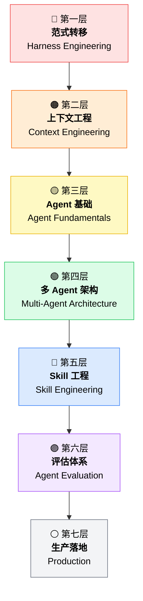

> **核心原则：** Model × Harness = 最终能力。再强的模型，没有好的框架也白搭。整个知识体系围绕这个乘法展开。

---

## 🎮 Mermaid 交互编辑器

想自己画图？试试下面的编辑器——左边改代码，右边即时预览：

<MermaidPlayground
  title="知识图谱编辑器"
  initial-code="graph TD
    A[Harness Engineering] --> B[Context Engineering]
    B --> C[Multi-Agent]
    C --> D[Skill Engineering]
    D --> E[Evaluation]
    E --> F[Production]"
/>

---

## 🧩 模块内部结构图

每个模块一张图，看清内部概念的层级和关系。

### 模块一：范式转移 — Harness Engineering

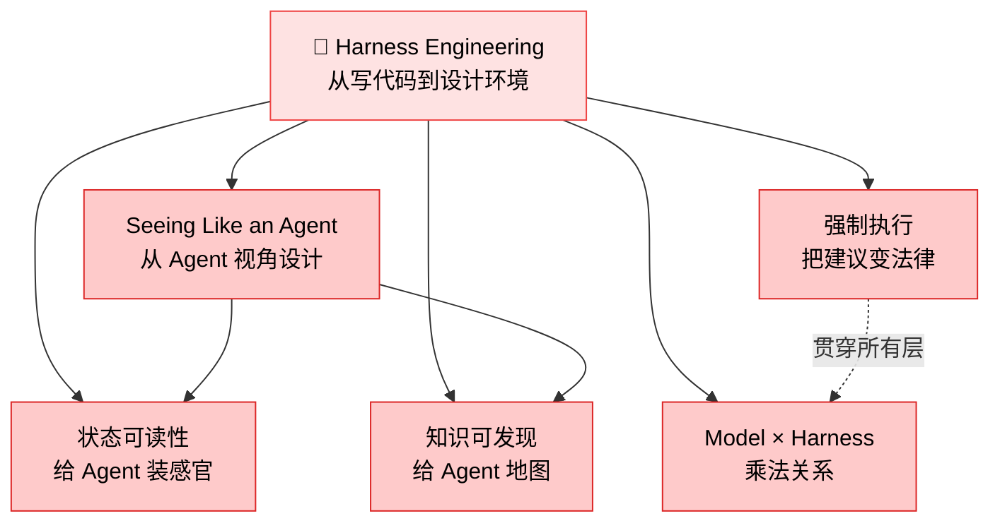

**核心洞察：** Harness Engineering 的本质是转变思维——你不是在写调用 API 的代码，而是在为一个"有感知能力的实体"设计工作环境。

---

### 模块二：上下文工程 — Context Engineering

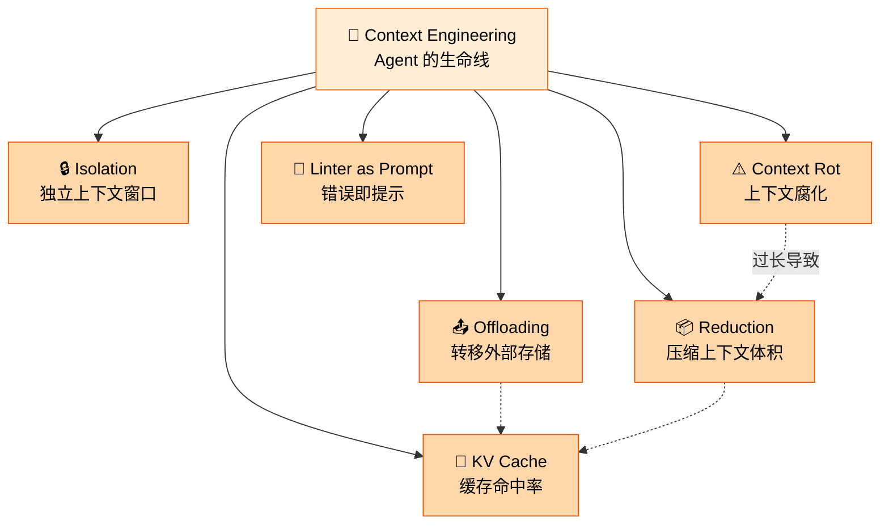

**三大支柱：** Offloading（卸载）→ Reduction（缩减）→ Isolation（隔离）。三者协同，把上下文从"洪水"变成"自来水"——精确控制，按需供给。

---

### 模块三：Agent 基础 — Agent Fundamentals

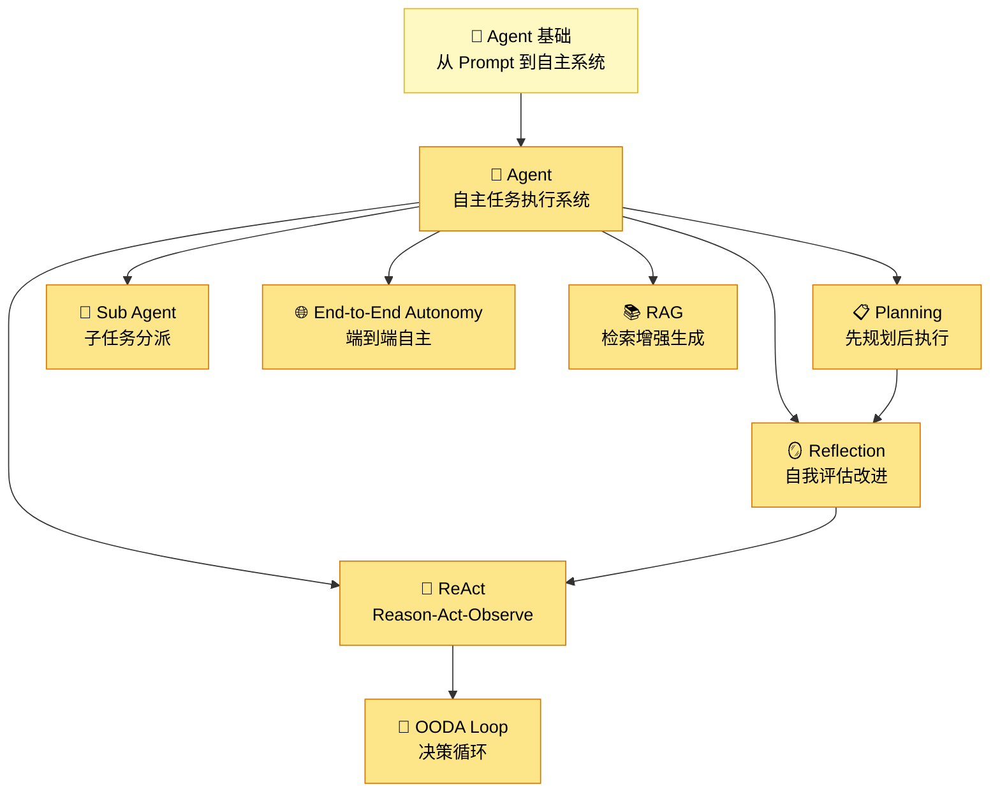

**关键循环：** ReAct 是基础运行模式（推理→行动→观察→循环）。Planning 和 Reflection 是在此基础上的增强模式。OODA Loop 把这个循环形式化。

---

### 模块四：多 Agent 架构 — Multi-Agent Architecture

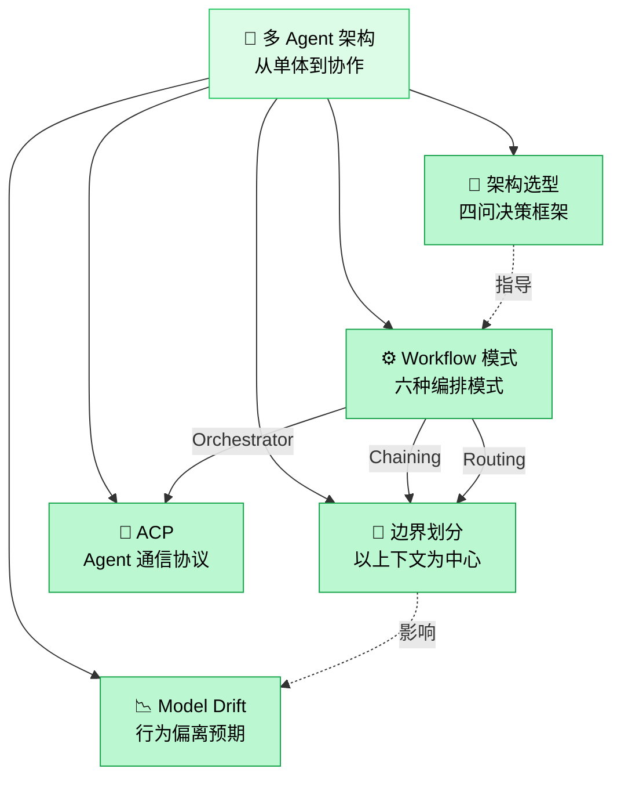

**六种 Workflow：** Chaining（串联）、Routing（路由）、Sectioning（分区）、Voting（投票）、Orchestrator-Workers（编排-工人）、Evaluator-Optimizer（评估-优化）。选哪种取决于任务复杂度和并行度。

---

### 模块五：Skill 工程 — Skill Engineering

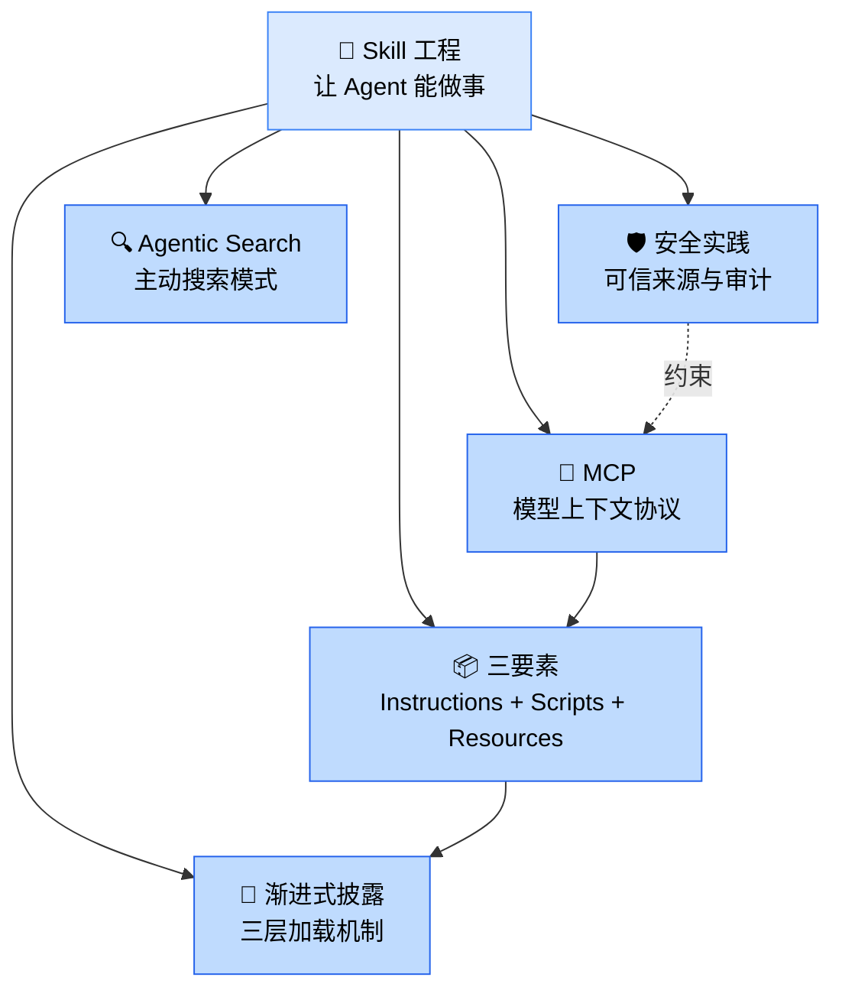

**三要素：** Instructions（做什么）+ Scripts（怎么做）+ Resources（用什么）。MCP 是这三者的标准化载体。渐进式披露确保 Agent 不会在启动时被信息淹没。

---

### 模块六：评估体系 — Agent Evaluation

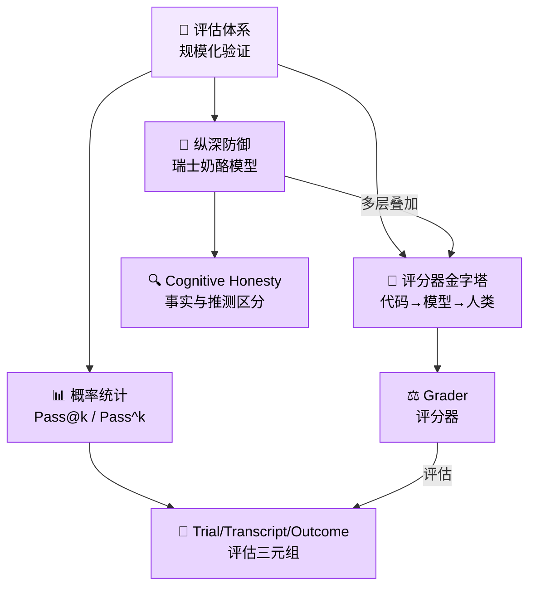

**两个指标：** Pass@k 测能力上限（至少成功一次的概率），Pass^k 测稳定性下限（连续成功的概率）。两者结合，才能全面评估一个 Agent 系统。

---

### 模块七：生产落地 — Production

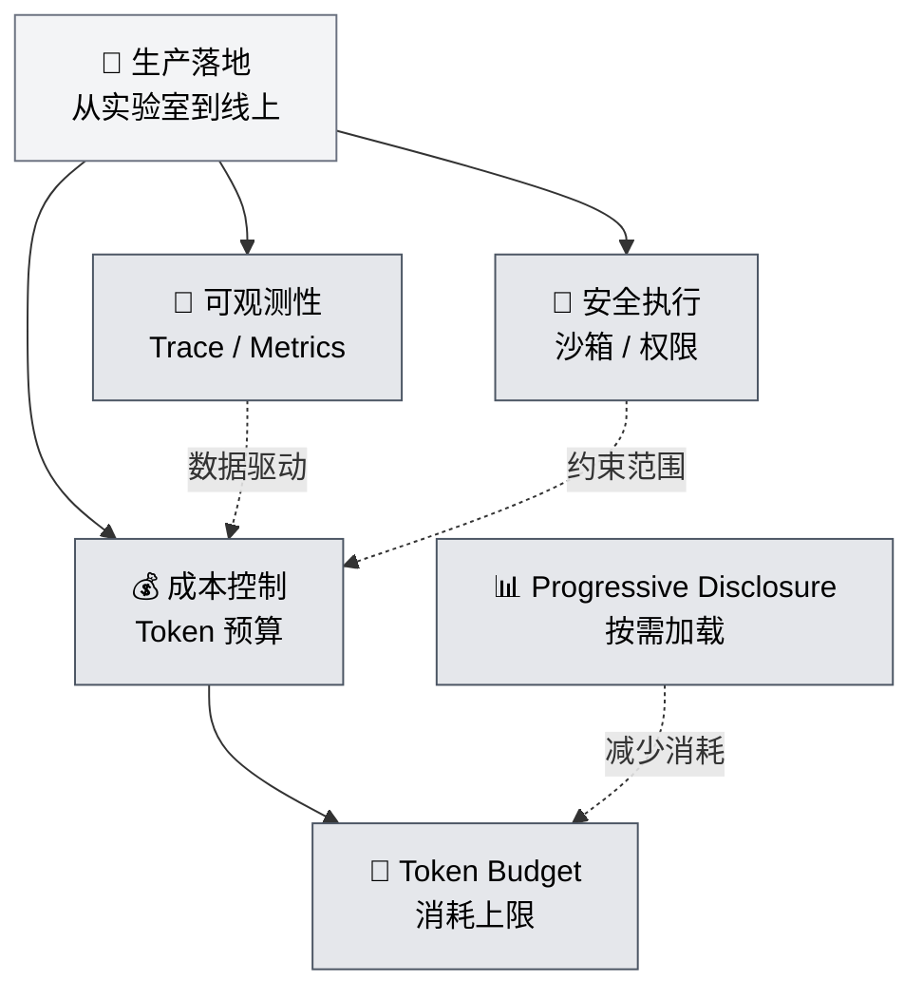

**生产三件套：** 可观测性（你能看到什么）、安全执行（你能控制什么）、成本控制（你愿意花多少）。三者缺一，系统要么失控，要么烧钱，要么裸奔。

---

## 🔗 跨层隐性关联

虚线揭示了那些"不明显但致命"的跨层依赖。忽略它们，你的架构就会有暗伤。

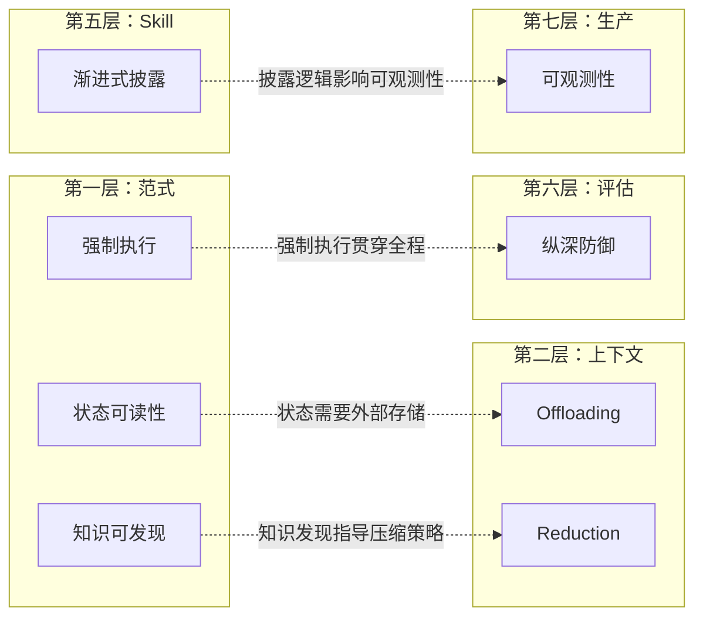

> **解读：**
> - **状态可读性 ↔ Offloading**：Agent 要"看到"状态，这些状态就必须被卸载到外部存储。没有 Offloading，状态可读性就是一句空话。
> - **强制执行 ↔ 纵深防御**：强制执行不是评估阶段才有的事——它从第一层的设计就要植入，最终在生产层形成纵深防御。
> - **渐进式披露 ↔ 可观测性**：你按需加载了什么，就得可观测到什么。否则调试就是在黑箱里猜。

---

## ⭐ 概念星图

核心概念居中，放射出关联概念。一眼看清谁是枢纽，谁是叶子节点。

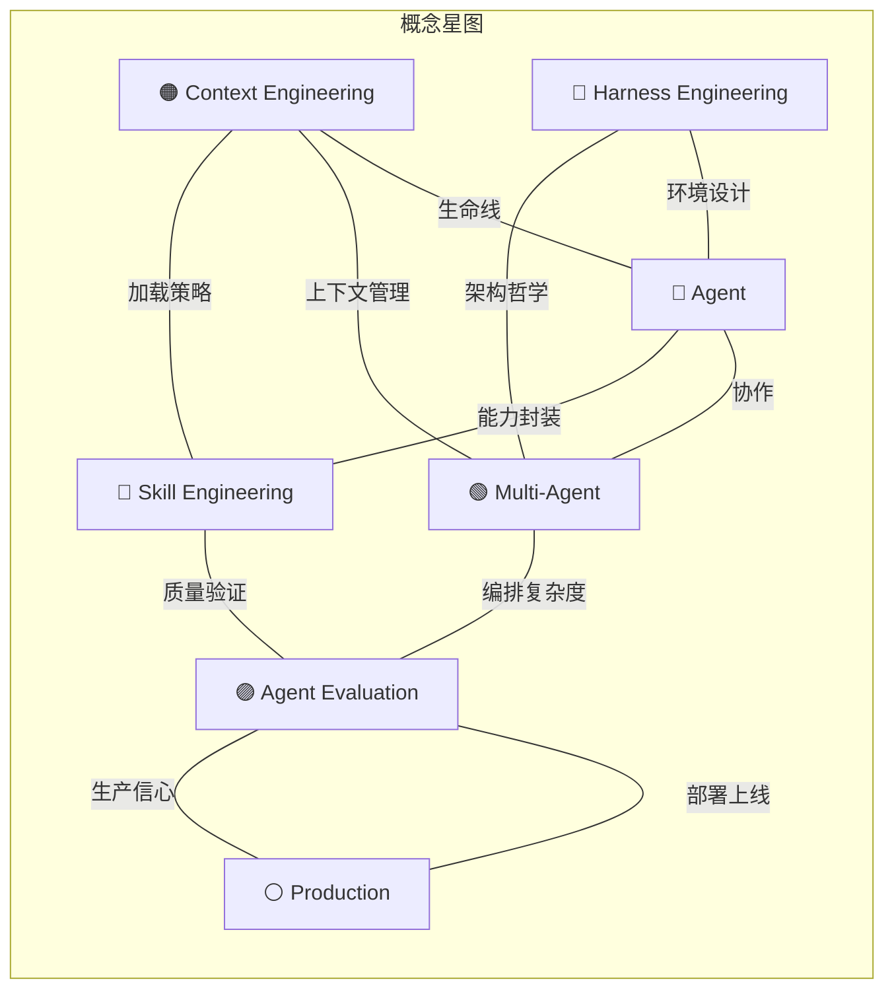

> **枢纽节点：** Agent（中心）、Context Engineering（最多输入输出）。掌握这两个，其他模块自然贯通。

---

## 📐 概念象限图

不同概念在"抽象→具体"和"基础→高级"两个维度上的位置。

```mermaid
quadrantChart
    title 概念定位象限
    x-axis "抽象" --> "具体"
    y-axis "基础" --> "高级"
    quadrant-1 "应用层" 
    quadrant-2 "理论层"
    quadrant-3 "基础理论"
    quadrant-4 "实践基础"
    Harness Engineering: [0.3, 0.85]
    Context Engineering: [0.35, 0.7]
    Model × Harness: [0.2, 0.9]
    Agent: [0.5, 0.3]
    ReAct: [0.6, 0.4]
    Planning: [0.55, 0.5]
    Multi-Agent: [0.5, 0.75]
    Workflow 模式: [0.7, 0.65]
    Skill Engineering: [0.65, 0.55]
    MCP: [0.8, 0.45]
    Pass@k: [0.4, 0.6]
    纵深防御: [0.7, 0.7]
    可观测性: [0.85, 0.5]
    Token Budget: [0.9, 0.35]
    渐进式披露: [0.75, 0.45]
    Context Rot: [0.3, 0.5]
    Seeing Like an Agent: [0.25, 0.8]
    OODA Loop: [0.45, 0.35]
    Swiss Cheese Model: [0.35, 0.65]
```

> **怎么读：** 右上角 = 高级且具体（直接能用的实践），左下角 = 基础且抽象（底层原理）。学习顺序建议从左下往右上走。

---

## 📅 概念演进时间线

从聊天机器人到生产级多 Agent 系统，关键概念的演进脉络。

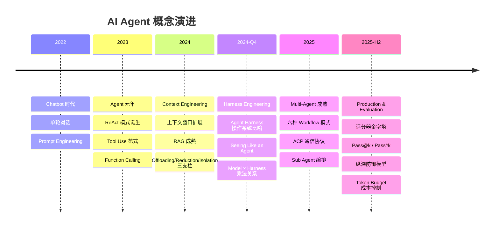

---

## 🧭 按角色推荐学习路径

不同背景，不同起点。找到你的角色，按顺序学，效率最高。

### 🎨 前端工程师

你的优势：理解用户体验和交互设计。Agent 的"环境"就是你的强项。

```
Harness Engineering（环境设计）→ Skill Engineering（UI/交互技能）→ Agent 基础（理解 Agent 行为）→ 生产实践（前端监控）
```

**重点章节：**
- [Harness Engineering 核心原则](/01-Harness工程核心原则/) — 从 UX 视角理解 Agent 环境
- [Skill Engineering](/05-Skill工程/) — 设计 Agent 的能力封装
- [渐进式披露](/05-Skill工程/) — 你比任何人都懂这个

### ⚙️ 后端工程师

你的优势：理解系统架构、API 设计、数据流。Agent 就是一个复杂的后端系统。

```
Agent 基础（理解核心循环）→ 上下文工程（数据流控制）→ 多 Agent 架构（分布式系统）→ 生产实践（部署运维）
```

**重点章节：**
- [上下文工程](/02-上下文工程/) — 数据流控制，你的核心战场
- [多 Agent 架构](/04-多Agent架构/) — 分布式编排，你熟悉的概念
- [生产实践](/07-生产实践/) — 可观测性、安全执行、成本控制

### 🏗️ 架构师

你的优势：全局视角，能看穿系统之间的依赖和权衡。

```
Harness Engineering（范式理解）→ 全局架构依赖图 → 跨层隐性关联 → 多 Agent 架构选型 → 评估体系
```

**重点章节：**
- [全局架构依赖图](#全局架构依赖图)（本页）— 你的路线图
- [跨层隐性关联](#跨层隐性关联)（本页）— 容易忽略的暗伤
- [架构选型四问框架](/04-多Agent架构/) — 决策工具
- [评估体系](/06-Agent评估/) — 验证你的架构假设

### 🔬 研究者

你的优势：理论功底，关注边界和极限。

```
Harness Engineering（新范式）→ 上下文工程理论 → 评估方法论 → 概念象限图 → 概念演进时间线
```

**重点章节：**
- [概念演进时间线](#概念演进时间线)（本页）— 知道来路，才能看清去路
- [Pass@k / Pass^k](/06-Agent评估/) — 形式化度量
- [Swiss Cheese Model](/06-Agent评估/) — 纵深防御理论
- [Cognitive Honesty](/06-Agent评估/) — Agent 认知诚实性

---

## 📖 术语表

按主题分组，每个模块下的术语按重要性排序。

---

### 🏗️ 范式转移 — Harness Engineering

#### 🎯 Harness Engineering
- **定义：** Anthropic/OpenAI 提出的 AI 工程新范式。核心思想：你不是在写调用 API 的代码，而是在为 Agent 设计运行环境。
- **为什么重要：** 这是整个知识体系的地基。不理解这个范式，后面所有模块都会建在沙子上。
- **相关章节：** [01-Harness工程核心原则](/01-Harness工程核心原则/)

#### 🎯 Agent Harness
- **定义：** 管理 Agent 运行的框架层，类似操作系统的角色。决定 Agent 能否逼近模型能力上限。
- **为什么重要：** Harness 是 Model × Harness 乘法中的那个"乘数"。差的 Harness 会把强模型拉到弱水平。
- **相关章节：** [01-Harness工程核心原则](/01-Harness工程核心原则/)

#### 👁️ Seeing Like an Agent
- **定义：** 从 Agent 视角设计工具和环境的方法论。Agent 没有人类的视觉常识，你需要让它"看见"状态。
- **为什么重要：** 很多 Agent 的失败不是模型不行，是环境设计得让人无法理解。
- **相关章节：** [01-Harness工程核心原则](/01-Harness工程核心原则/)

#### ⚖️ Model × Harness
- **定义：** 模型与框架的乘法关系——两者共同决定最终能力。强模型 + 弱 Harness = 浪费。
- **为什么重要：** 这是一个思维方式：别只换模型，也升级 Harness。
- **相关章节：** [01-Harness工程核心原则](/01-Harness工程核心原则/)

---

### 📦 上下文工程 — Context Engineering

#### 🧠 Context Engineering
- **定义：** 精确控制输入模型的上下文内容的工程实践。上下文是 Agent 的生命线——填错了，Agent 就废了。
- **为什么重要：** 上下文窗口不是越大越好，而是要精确控制"放什么、不放什么、什么时候放"。
- **相关章节：** [02-上下文工程](/02-上下文工程/)

#### 📤 Offloading
- **定义：** 上下文工程三大支柱之一：将上下文从模型窗口转移到外部存储（文件、数据库、向量库）。
- **为什么重要：** 不卸载，上下文窗口就会被历史对话填满，Agent 失去"呼吸空间"。
- **相关章节：** [02-上下文工程](/02-上下文工程/)

#### 📦 Reduction
- **定义：** 上下文工程三大支柱之一：压缩每步传给模型的上下文大小。不是删信息，是提炼精华。
- **为什么重要：** 每个 token 都是成本。精简上下文 = 降成本 + 提速度 + 减少幻觉。
- **相关章节：** [02-上下文工程](/02-上下文工程/)

#### 🔒 Isolation
- **定义：** 上下文工程三大支柱之一：为不同任务使用独立上下文窗口，避免上下文交叉污染。
- **为什么重要：** 多 Agent 场景下，没有隔离就会互相干扰，一个 Agent 的错误会传染给其他 Agent。
- **相关章节：** [02-上下文工程](/02-上下文工程/)

#### 💾 KV Cache
- **定义：** 模型推理时缓存的 Key-Value 对，命中率直接影响成本和延迟。
- **为什么重要：** KV Cache 命中率是上下文工程的"温度计"——高命中率意味着你的上下文设计是稳定的。
- **相关章节：** [02-上下文工程](/02-上下文工程/)

#### ⚠️ Context Rot
- **定义：** 上下文过长导致模型推理能力下降的现象。不是模型"忘了"，是注意力被稀释了。
- **为什么重要：** 这是上下文工程存在的根本原因——没有 Context Rot，就不需要精心设计上下文。
- **相关章节：** [02-上下文工程](/02-上下文工程/)

#### 🔧 Linter as Prompt
- **定义：** 把 Linter 错误信息设计成给 Agent 的提示，附带修复指令。让静态分析工具成为 Agent 的"眼睛"。
- **为什么重要：** 这是"状态可读性"在代码层面的具体实践。错误信息 = Agent 的感知输入。
- **相关章节：** [02-上下文工程](/02-上下文工程/)

---

### 🤖 Agent 基础 — Agent Fundamentals

#### 🤖 Agent
- **定义：** 能自主完成任务的 AI 系统。在循环中调用工具、做出决策，直到达成目标。不是一次调用就完事的 API。
- **为什么重要：** 这是所有讨论的起点。不理解 Agent 是什么，就无法理解为什么要精心设计 Harness。
- **相关章节：** [03-Agent基础](/03-Agent基础/)

#### 🔄 ReAct
- **定义：** Reason-Act-Observe 循环。Agent 的基础运行模式：推理下一步 → 执行动作 → 观察结果 → 循环。
- **为什么重要：** 这是 Agent 最核心的运行循环。所有高级模式（Planning、Reflection）都建立在 ReAct 之上。
- **相关章节：** [03-Agent基础](/03-Agent基础/)

#### 📋 Planning
- **定义：** Agent 的规划模式。先分解任务为子步骤，再逐步执行。区别于 ReAct 的"边想边做"。
- **为什么重要：** 复杂任务不能靠 ReAct 硬跑。Planning 让 Agent 有全局视野，避免走弯路。
- **相关章节：** [03-Agent基础](/03-Agent基础/)

#### 🪞 Reflection
- **定义：** Agent 的反思模式。对自身输出进行评估和改进，形成"生成→评估→改进"的闭环。
- **为什么重要：** 没有 Reflection，Agent 的输出质量只能靠运气。Reflection 把运气变成可控的质量循环。
- **相关章节：** [03-Agent基础](/03-Agent基础/)

#### 🔁 OODA Loop
- **定义：** Observe-Orient-Decide-Act 循环。Agent 的决策循环，来源于军事决策理论。
- **为什么重要：** 把 ReAct 形式化。Orient（定位）这一步是 ReAct 中"Reason"的细化——你需要先理解环境，再决定行动。
- **相关章节：** [03-Agent基础](/03-Agent基础/)

#### 👶 Sub Agent
- **定义：** 由主 Agent 派生的子 Agent，负责特定子任务。主 Agent 负责编排，子 Agent 负责执行。
- **为什么重要：** 复杂任务需要分工。没有 Sub Agent，单个 Agent 的上下文窗口会被撑爆。
- **相关章节：** [03-Agent基础](/03-Agent基础/)、[04-多Agent架构](/04-多Agent架构/)

#### 🌐 End-to-End Autonomy
- **定义：** Agent 端到端自主完成任务的能力。从接收需求到交付结果，中间不需要人类干预。
- **为什么重要：** 这是 Agent 系统的终极目标。但注意——完全自主不等于不需要人类监督。
- **相关章节：** [03-Agent基础](/03-Agent基础/)

#### 📚 RAG (Retrieval-Augmented Generation)
- **定义：** 检索增强生成。结合外部知识库提升回答质量，让 Agent 不只靠训练数据"回忆"，还能实时"查阅"。
- **为什么重要：** RAG 是上下文工程的重要工具。没有 RAG，Agent 的知识就被冻结在训练时。
- **相关章节：** [03-Agent基础](/03-Agent基础/)、[02-上下文工程](/02-上下文工程/)

#### 🔍 Agentic Search
- **定义：** Agent 主动搜索信息的模式。区别于被动接收——Agent 自己决定搜什么、怎么搜。
- **为什么重要：** 被动接收信息 = Agent 坐等喂食。主动搜索 = Agent 自己觅食。后者才是真正的自主。
- **相关章节：** [03-Agent基础](/03-Agent基础/)

---

### 🕸️ 多 Agent 架构 — Multi-Agent Architecture

#### 🕸️ Multi-Agent Architecture
- **定义：** 多个 Agent 协同工作的系统架构。从单体 Agent 到分布式 Agent 群。
- **为什么重要：** 单个 Agent 有上下文窗口和能力的天花板。多 Agent 通过协作突破这些限制。
- **相关章节：** [04-多Agent架构](/04-多Agent架构/)

#### ⚙️ Workflow 模式
- **定义：** Agent 任务的编排模式。六种经典模式：Chaining（串联）、Routing（路由）、Sectioning（分区）、Voting（投票）、Orchestrator-Workers（编排-工人）、Evaluator-Optimizer（评估-优化）。
- **为什么重要：** 不同任务适合不同模式。选错模式 = 用螺丝刀砸钉子。
- **相关章节：** [04-多Agent架构](/04-多Agent架构/)

#### 🧱 边界划分
- **定义：** 以上下文为中心划分 Agent 边界。每个 Agent 只看到与自己相关的上下文。
- **为什么重要：** 边界不清 = 责任不清 = 出了问题没人知道谁的锅。
- **相关章节：** [04-多Agent架构](/04-多Agent架构/)

#### 🧭 架构选型
- **定义：** 四问决策框架：任务是否可分解？是否可并行？是否有依赖？是否需要人工介入？
- **为什么重要：** 架构选型不是拍脑袋。四个问题答完，模式自然浮现。
- **相关章节：** [04-多Agent架构](/04-多Agent架构/)

#### 📡 ACP (Agent Communication Protocol)
- **定义：** Agent 间的通信协议。定义 Agent 如何传递消息、共享状态、协调行动。
- **为什么重要：** 没有协议，多 Agent 就是一群各自为战的个体，不是团队。
- **相关章节：** [04-多Agent架构](/04-多Agent架构/)

#### 📉 Model Drift
- **定义：** 模型行为随时间或上下文长度变化而偏离预期。不是 bug，是 feature 的副作用。
- **为什么重要：** 多 Agent 场景下 Drift 被放大——一个 Agent 偏了，可能带动整条链路偏。
- **相关章节：** [04-多Agent架构](/04-多Agent架构/)、[06-Agent评估](/06-Agent评估/)

---

### 🔧 Skill 工程 — Skill Engineering

#### 🔧 Skill
- **定义：** Agent 的能力封装。包含 Instructions（做什么）、Scripts（怎么做）、Resources（用什么）三要素。
- **为什么重要：** 没有 Skill 的 Agent 就像没有工具箱的工人——有力气没处使。
- **相关章节：** [05-Skill工程](/05-Skill工程/)

#### 📖 渐进式披露 (Progressive Disclosure)
- **定义：** 三层加载机制。Agent 启动时只加载概要，需要时加载详情，执行时加载具体指令。
- **为什么重要：** 一次性暴露全部信息 = 把 Agent 淹没。渐进式披露让 Agent 保持清醒。
- **相关章节：** [05-Skill工程](/05-Skill工程/)

#### 🔌 MCP (Model Context Protocol)
- **定义：** 模型上下文协议。定义 Agent 与外部工具/资源的交互标准——Skill 的"万能接口"。
- **为什么重要：** MCP 让 Skill 可以跨 Agent、跨平台复用。没有 MCP，每个 Agent 都要重新造轮子。
- **相关章节：** [05-Skill工程](/05-Skill工程/)

#### 🛡️ 安全实践
- **定义：** 可信来源与审计。确保 Skill 来自可信渠道，执行过程可追溯。
- **为什么重要：** 一个被篡改的 Skill 可以让 Agent 做任何事。安全不是锦上添花，是底线。
- **相关章节：** [05-Skill工程](/05-Skill工程/)

---

### 📊 评估体系 — Agent Evaluation

#### 📊 Agent Evaluation
- **定义：** Agent 的自动化评估体系。不是"看起来还行"，而是"统计上有信心"。
- **为什么重要：** 没有评估，你就不知道 Agent 是真的行还是在骗你。评估是质量的唯一保障。
- **相关章节：** [06-Agent评估](/06-Agent评估/)

#### 🔺 评分器金字塔
- **定义：** 代码评分器 → 模型评分器 → 人类评分器。从自动到人工，从快到准。
- **为什么重要：** 金字塔底层（代码）可以大规模运行，顶层（人类）提供最终判断。缺一层都不完整。
- **相关章节：** [06-Agent评估](/06-Agent评估/)

#### 📈 Pass@k
- **定义：** 在 k 次尝试中至少成功一次的概率。衡量模型能力上限——"能不能做出来"。
- **为什么重要：** Pass@k 高 = Agent 有能力完成任务，只是不一定每次都能。这是能力的天花板指标。
- **相关章节：** [06-Agent评估](/06-Agent评估/)

#### 📈 Pass^k
- **定义：** 连续 k 次都成功的概率。衡量稳定性下限——"能不能每次都做对"。
- **为什么重要：** Pass^k 高 = Agent 不只是有能力，还很稳定。这是生产可用性的关键指标。
- **相关章节：** [06-Agent评估](/06-Agent评估/)

#### 🧀 Swiss Cheese Model
- **定义：** 瑞士奶酪模型。每种评估方法都有漏洞，但多层叠加后，漏洞被互相覆盖。
- **为什么重要：** 别指望一种评估方法能捕获所有问题。纵深防御才是正道。
- **相关章节：** [06-Agent评估](/06-Agent评估/)

#### ⚖️ Grader
- **定义：** 评估 Agent 输出质量的评分器。可以是代码（精确匹配）、模型（语义判断）或人类（主观评估）。
- **为什么重要：** Grader 是评估体系的核心组件。Grader 设计得好，评估才有意义。
- **相关章节：** [06-Agent评估](/06-Agent评估/)

#### 🧪 Trial / Transcript / Outcome
- **定义：** Agent 评估的三元组：运行实例（Trial）、过程记录（Transcript）、结果判定（Outcome）。
- **为什么重要：** 没有 Transcript，你只知道失败了，不知道为什么失败。Transcript 是调试的唯一依据。
- **相关章节：** [06-Agent评估](/06-Agent评估/)

#### 🔍 Cognitive Honesty
- **定义：** Agent 能区分事实与推测，并在输出中明确标记。不是"说对"，是"说清楚哪些是对的，哪些是猜的"。
- **为什么重要：** 一个 Cognitive Honesty 低的 Agent 会一本正经地胡说八道，用户无法信任。
- **相关章节：** [06-Agent评估](/06-Agent评估/)

---

### 🚀 生产落地 — Production

#### 🚀 Production
- **定义：** 从实验室到线上的全部工程实践。Agent 能跑 ≠ Agent 能在生产环境跑。
- **为什么重要：** 实验室里的 Agent 再炫酷，不能上线就毫无商业价值。
- **相关章节：** [07-生产实践](/07-生产实践/)

#### 📡 可观测性 (Trace / Metrics)
- **定义：** Agent 运行的完整轨迹记录和关键指标。你能看到 Agent 在做什么、做了多久、花了多少钱。
- **为什么重要：** 没有可观测性，生产事故 = 黑箱爆炸。你不知道哪里出了问题，更不知道怎么修。
- **相关章节：** [07-生产实践](/07-生产实践/)

#### 🔐 安全执行 (沙箱 / 权限)
- **定义：** 在沙箱环境中运行 Agent，通过权限控制限制其行为范围。
- **为什么重要：** Agent 可以调用工具 = Agent 可以执行代码 = Agent 可以做任何事（除非你限制它）。
- **相关章节：** [07-生产实践](/07-生产实践/)

#### 💰 成本控制 (Token Budget)
- **定义：** Agent 任务的 Token 消耗上限。每个 token 都是真金白银。
- **为什么重要：** 没有预算的 Agent 可以在一次对话中烧掉你一个月的 API 预算。这不是假设，是常见事故。
- **相关章节：** [07-生产实践](/07-生产实践/)

#### 📏 Token Budget
- **定义：** 具体的 Token 消耗限额配置。设定上限、监控消耗、超限告警。
- **为什么重要：** 预算是成本控制的具体手段。没有预算 = 没有成本控制。
- **相关章节：** [07-生产实践](/07-生产实践/)

---

## 📚 核心参考文献

### Anthropic

1. *"Building Effective Agents"* — Agent 构建最佳实践
2. *"How We Built Our Multi-Agent Research System"* — 多 Agent 研究系统构建经验
3. *"Equipping Agents for the Real World with Agent Skills"* — Skill 机制详解
4. *"Evals for AI Agents"* — Agent 评估方法论
5. *"Building Multi-Agent Systems: When and How to Use Them"* — 多 Agent 使用指南

### OpenAI

6. Codex 团队工程博客 — Harness Engineering 实践
7. *"A Practical Guide to Building Agents"* — Agent 构建实用指南

### LangChain

8. 上下文工程系列博客 — 上下文工程理论与实践
9. Workflow 五种模式详解 — 编排模式参考

### 其他

10. Menlo Research — 上下文工程实战经验
11. Cursor — 动态上下文发现
12. Cognition AI — *"Don't Build Multi-Agents"*
13. Shannon (Kocoro-lab) — 三层架构多 Agent 系统参考实现
14. Rich Sutton — *"The Bitter Lesson"*
15. Filip Hráček (Google DeepMind) — Agent Harness 操作系统比喻

---

## 🔗 相关资源

- [Anthropic 官方文档](https://docs.anthropic.com)
- [OpenClaw 文档](https://docs.openclaw.ai)
- [LangChain 文档](https://docs.langchain.com)
- [Shannon GitHub](https://github.com/Kocoro-lab/Shannon)

---

*最后更新：2026-03-22*
