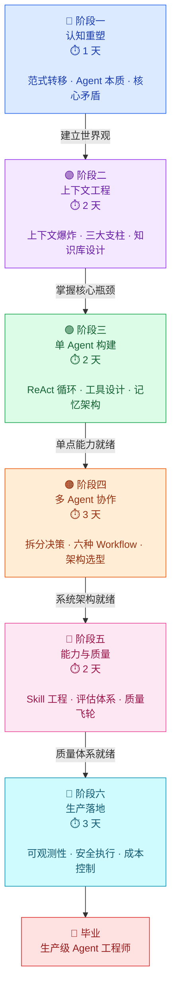
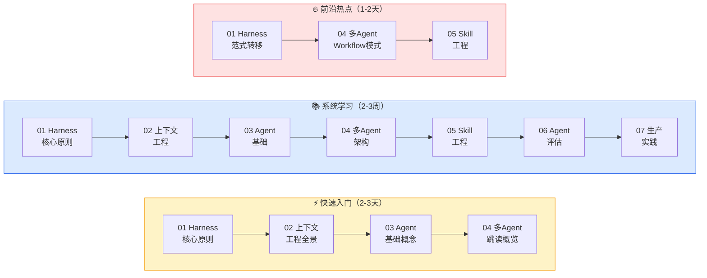
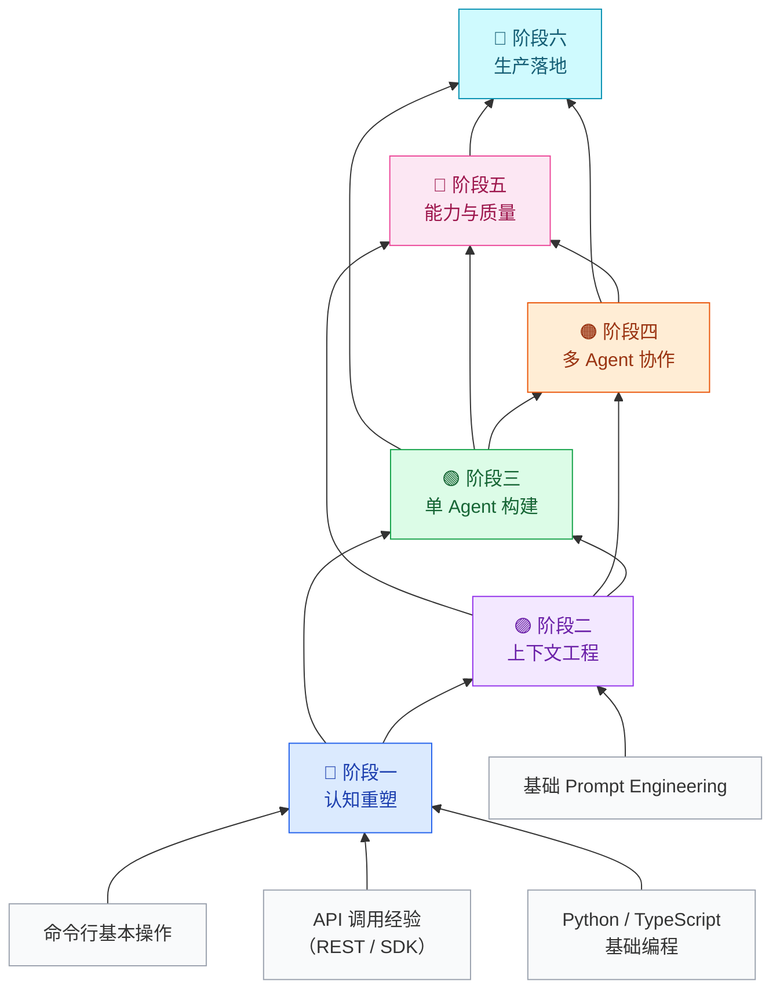

# 学习路线图

> 从零到一，14 天构建生产级 Agent 系统 🚀

这不是一份"建议你看看"的书单。这是一张**作战地图**——每一步都告诉你学什么、练什么、卡在哪里、怎么突破。跟着走，14 天后你能独立设计并交付一个生产级多 Agent 系统。

---

## 🗺️ 全局路线图



**总计：14 天，约 25 小时核心学习 + 实践**

---

## 🚦 三种学习路径

不同目标，不同节奏。选最适合你的那条路：



| 路径 | 节奏 | 适合谁 | 读完你将能… |
|:---|:---|:---|:---|
| ⚡ **快速入门** | 2-3 天，每天 2h | 刚接触 Agent 的开发者 | 和同事聊 Agent 不再一脸懵，能判断一个项目要不要用 Agent |
| 📚 **系统学习** | 2-3 周，每天 2-3h | 要构建生产级系统的工程师 | 独立设计、实现、部署一个完整的多 Agent 系统 |
| 🔥 **前沿热点** | 1-2 天，每天 3h | 有基础想了解趋势的开发者 | 掌握 Harness Engineering、多 Agent 模式、Skill 机制的最新实践 |

---

## 🧱 前置技能树

不是所有东西都需要从零学。这张图告诉你"学 X 之前必须先掌握什么"：



> 💡 **关键依赖**：多 Agent 不是单 Agent 的简单叠加。学阶段四之前，你必须同时搞懂**上下文工程**（阶段二）和**单 Agent 构建**（阶段三）——否则你设计出来的多 Agent 系统一定会在上下文管理上翻车。

---

## 🔵 阶段一：认知重塑（1 天）

> **一句话目标：把脑子里"AI 就是聊天机器人"的旧认知砸碎，建立全新的 Agent 工程世界观。**

### 📖 学习内容

| 序号 | 章节 | 核心问题 | ⏱️ |
|:---:|:---|:---|:---:|
| 1 | [Harness Engineering 核心原则](../01-Harness工程核心原则/) | 为什么 AI 时代的工程师要从"写代码"变成"设计环境"？ | 2h |
| 2 | [Agent 基础：本质与 ReAct](../03-Agent基础/) | Agent 不是更会聊天的 ChatBot——它到底是什么？ | 1h |

### 🎯 你会获得什么

- **能解释**为什么 Agent 的瓶颈不是模型能力，而是"它能看见什么"
- **能判断**你的业务场景是否适合用 Agent，而不是硬套
- **能说清**Harness Engineering 和传统软件工程的本质区别

### ✅ 阶段一检验清单

- [ ] 能用自己的话解释"Agent 不是笨而是瞎"——并举出一个具体例子
- [ ] 能说出 Harness 的三个核心原则
- [ ] 能画出 Agent 与传统自动化系统的区别图
- [ ] 能分析你的项目是否适合引入 Agent

### ⚠️ 常见卡点 & 突破方法

| 🚧 卡点 | 🔓 怎么突破 |
|:---|:---|
| "感觉 Harness 就是把 Prompt 写好点？" | 去读 [Harness 核心原则](../01-Harness工程核心原则/) 的前三节。重点不是 Prompt，是**整个运行环境的设计**——工具、文件系统、权限模型全都是 Harness 的一部分。 |
| "Agent 和 RPA 有什么区别？" | RPA 是固定流程的机械执行；Agent 能**自主规划**、**使用工具**、**从错误中恢复**。想象一下：RPA 像流水线机器人，Agent 像能自己找路的快递员。 |

---

## 🟣 阶段二：上下文工程（2 天）

> **一句话目标：掌握 Agent 系统的核心瓶颈——上下文窗口——并学会三大解法：卸载、缩减、隔离。**

### 📖 学习内容

| 序号 | 章节 | 核心问题 | ⏱️ |
|:---:|:---|:---|:---:|
| 1 | [上下文工程全景](../02-上下文工程/) | 上下文窗口为什么是 Agent 的"致命弱点"？ | 3h |
| 2 | 上下文失效模式（第 7 节） | Agent 什么时候会"失忆"？怎么防？ | 1h |
| 3 | Menlo 实战经验（第 12-15 节） | Anthropic 自己是怎么做上下文工程的？ | 2h |

### 🎯 你会获得什么

- **能诊断**你的 Agent 任务中的上下文瓶颈在哪里
- **能设计**一套上下文管理策略（哪些该放上下文、哪些该卸载到文件）
- **能计算**KV 缓存命中率，并理解它对成本和延迟的影响
- **能实现**"文件系统即上下文"的基本方案

### ✅ 阶段二检验清单

- [ ] 能画出你的 Agent 任务的上下文使用图（哪些 token 来自哪里）
- [ ] 能解释卸载、缩减、隔离分别在什么场景下用
- [ ] 知道 KV 缓存命中率为什么重要，并能估算你系统的命中率
- [ ] 能设计一个知识库的目录结构，让 Agent 能高效检索

### ⚠️ 常见卡点 & 突破方法

| 🚧 卡点 | 🔓 怎么突破 |
|:---|:---|
| "上下文工程听起来太抽象了" | 想象你在考试——上下文窗口就是你桌上能摊开的纸。**卸载**是把不用的笔记放抽屉（文件系统），**缩减**是把长段落缩成关键词，**隔离**是不同科目用不同的纸。 |
| "不知道自己的 Agent 有多少上下文浪费" | 在 Agent 框架里打开 Trace，看每次调用的 token 消耗。找那些**重复出现的 system prompt 片段**、**不必要的工具返回值**——这些就是浪费。 |

---

## 🟢 阶段三：单 Agent 构建（2 天）

> **一句话目标：你能独立构建一个可靠的单 Agent 系统——它能使用工具、管理记忆、在没有人类干预的情况下自主完成任务。**

### 📖 学习内容

| 序号 | 章节 | 核心问题 | ⏱️ |
|:---:|:---|:---|:---:|
| 1 | [Agent 基础](../03-Agent基础/) | ReAct 循环是怎么驱动 Agent 运行的？ | 2h |
| 2 | 工具调用与设计（Harness 第 15-17 节） | 什么是"Seeing Like an Agent"的工具设计？ | 2h |
| 3 | 记忆架构（Agent 书第 08 章） | 短期记忆 vs 长期记忆怎么设计？ | 1h |
| 4 | Planning 与 Reflection（Agent 书第 10-11 章） | Agent 怎么"想"、怎么"反思"？ | 2h |

### 🎯 你会获得什么

- **能实现**一个基于 ReAct 循环的 Agent，包含工具调用和错误恢复
- **能设计**面向 Agent 的工具接口（不是面向人类的 API 换个壳）
- **能构建**分层记忆系统（上下文内记忆 + 会话记忆 + 持久记忆）
- **能加入**基础的 Planning 和 Reflection 循环，让 Agent 能规划和自查

### ✅ 阶段三检验清单

- [ ] 你的 Agent 能在没有人工干预的情况下连续完成 3+ 步任务
- [ ] 工具描述是面向 Agent 优化的（清晰、无歧义、包含使用场景）
- [ ] Agent 有循环探测机制（不会无限调用同一个工具）
- [ ] 你理解了 Planning 和 Reflection 分别解决什么问题

### ⚠️ 常见卡点 & 突破方法

| 🚧 卡点 | 🔓 怎么突破 |
|:---|:---|
| "工具调用总是失败或结果不对" | 问题几乎总在**工具描述**上。你写给人看的 API 文档，Agent 不一定能理解。试试这样写：`"当你需要查询用户的订单历史时，调用此工具。传入 user_id，返回最近 10 条订单。"` ——用场景驱动，不是参数驱动。 |
| "Agent 陷入死循环不断调用同一工具" | 加**循环探测**：记录最近 N 次工具调用，如果相同工具+相同参数连续出现，强制中断并让 Agent 反思。这是生产环境的必备机制。 |

---

## 🟠 阶段四：多 Agent 协作（3 天）

> **一句话目标：你能判断什么时候该拆分 Agent、怎么划分边界、选哪种 Workflow 模式——然后把它搭起来。**

### 📖 学习内容

| 序号 | 章节 | 核心问题 | ⏱️ |
|:---:|:---|:---|:---:|
| 1 | [多 Agent 架构全景](../04-多Agent架构/) | 什么时候单 Agent 不够用？ | 3h |
| 2 | 六种 Workflow 模式（同上） | 编排/路由/并行/反思/协调者/评估器，怎么选？ | 2h |
| 3 | Prompt 实战解析（多 Agent 第 11-13 节） | 真实系统的 Prompt 长什么样？ | 2h |
| 4 | 架构选型决策（第 25 节） | 单 Agent → Workflow → 多 Agent 的演进路线 | 1h |

### 🎯 你会获得什么

- **能用四问框架**判断一个场景是否需要多 Agent
- **能设计** Agent 之间的上下文边界（不按职能，按上下文）
- **能搭出**至少两种 Workflow 模式（如：路由 + 并行）
- **能解释**为什么"简单的多 Agent 方案不如复杂的单 Agent"

### ✅ 阶段四检验清单

- [ ] 能用四问框架分析你的业务场景是否需要多 Agent
- [ ] Agent 边界是按上下文容量划分的，不是按功能模块
- [ ] 能画出你的多 Agent 系统的通信拓扑图
- [ ] 能解释六种 Workflow 模式各自的适用场景
- [ ] 有一个从单 Agent 演进到多 Agent 的清晰路径

### ⚠️ 常见卡点 & 突破方法

| 🚧 卡点 | 🔓 怎么突破 |
|:---|:---|
| "一上来就想把所有东西都拆成 Agent" | 这是最常见的错误。记住黄金法则：**先做单 Agent，性能不够再拆**。只有当你发现单 Agent 的上下文装不下所有任务信息时，才考虑拆分。 |
| "不知道 Agent 之间怎么通信" | 两种基本模式：(1) **共享状态**：通过文件/数据库传递信息；(2) **消息传递**：Agent A 的输出直接作为 Agent B 的输入。从简单的开始，别一上来就搞复杂的消息队列。 |

---

## 🩷 阶段五：能力与质量（2 天）

> **一句话目标：让你的 Agent 不只是"能跑"，而是"靠谱"——有 Skill 封装、有评估体系、有质量飞轮。**

### 📖 学习内容

| 序号 | 章节 | 核心问题 | ⏱️ |
|:---:|:---|:---|:---:|
| 1 | [Skill 工程](../05-Skill工程/) | Skill 和 Tool 到底有什么区别？ | 2h |
| 2 | [Agent 评估体系](../06-Agent评估/) | 怎么知道你的 Agent 做得对不对？ | 3h |
| 3 | 九步评估路线图（第 06 节） | 从零搭建评估体系的完整流程 | 2h |

### 🎯 你会获得什么

- **能设计** Skill 体系：把重复使用的流程知识封装成可复用的 Skill
- **能构建**自动化评估：用代码评分器跑 Pass@k 测试
- **能实施**纵深防御：输入验证 → 过程检查 → 输出评估三层质量门
- **能运用** Anthropic 九步路线图，从零搭建一个评估体系

### ✅ 阶段五检验清单

- [ ] 你有至少一个 Skill 的完整定义（触发条件 + 执行流程 + 输出格式）
- [ ] 你有自动化评估脚本（不是手动看输出）
- [ ] 你知道 Pass@k 和 Pass^k 分别衡量什么
- [ ] 你理解为什么"没有评估 = 随机数生成器"

### ⚠️ 常见卡点 & 突破方法

| 🚧 卡点 | 🔓 怎么突破 |
|:---|:---|
| "评估体系听起来工作量巨大" | 不用一步到位。先从**一个关键场景的 5 个测试用例**开始。能跑通 → 再扩展到 20 个 → 再覆盖边界情况。关键是**今天就开始**，而不是"等准备好了再做"。 |
| "分不清 Skill 和 Tool" | 简单类比：**Tool 是一把扳手**（执行单个动作），**Skill 是一套维修流程**（什么情况用什么工具、先做什么后做什么）。Skill 封装的是**过程知识**，Tool 封装的是**能力入口**。 |

---

## 🩵 阶段六：生产落地（3 天）

> **一句话目标：把 Agent 系统从"本地能跑"推到"线上稳定跑"——可观测、安全、省钱、抗故障。**

### 📖 学习内容

| 序号 | 章节 | 核心问题 | ⏱️ |
|:---:|:---|:---|:---:|
| 1 | [生产实践](../07-生产实践/) | 生产环境和开发环境有什么本质区别？ | 2h |
| 2 | 可观测性（Agent 书第 22 章） | 你的 Agent 在生产环境到底在干嘛？ | 2h |
| 3 | 安全执行（Agent 书第 25 章） | Agent 有工具执行权限，怎么防它闯祸？ | 1h |
| 4 | Token 预算控制（第 23 章） | 一次调用花 $0.10 还是 $1.00，区别在哪？ | 1h |
| 5 | 分层模型策略（第 30 章） | 什么任务用大模型、什么任务用小模型？ | 1h |

### 🎯 你会获得什么

- **能搭建**完整的 Trace 系统：每次 Agent 调用都能回溯
- **能实现**断点续传：Agent 挂了能从断点恢复，不重头来
- **能设计**安全沙箱：工具执行隔离、权限最小化
- **能实施**成本控制：Token 预算、分层模型调度、缓存策略

### ✅ 阶段六检验清单

- [ ] 你的 Agent 系统有完整的 Trace（能看到每一步的输入输出）
- [ ] 有异常恢复机制（Agent 失败不会导致整个流程报废）
- [ ] Token 预算有硬性限制（不会因为 Agent 陷入循环而爆炸式消耗）
- [ ] 关键操作有审计日志

### ⚠️ 常见卡点 & 突破方法

| 🚧 卡点 | 🔓 怎么突破 |
|:---|:---|
| "不知道从哪里开始加可观测性" | 最小方案：在 Agent 的每个 ReAct 循环里，把**工具名 + 参数 + 返回值 + 耗时**写入一个日志文件。有了这个，90% 的调试问题都能定位。然后再考虑接 Trace 平台。 |
| "担心 Agent 的安全问题" | 三板斧：(1) **沙箱隔离**——工具执行在容器里；(2) **权限白名单**——只允许预定义的操作；(3) **人类审批**——关键操作（发邮件、写数据库）必须人工确认。 |

---

## 🎓 毕业标准

完成全部六个阶段后，你不只是"学完了"——你是**能做事的 Agent 工程师**。

### 你应该能独立完成这些具体任务：

**🏗️ 系统设计**
- 设计一个包含 5 个 Agent 的代码审查系统（输入：PR diff → 输出：结构化审查报告）
- 为一个客服系统设计多 Agent 架构（路由 Agent + 专业知识 Agent + 工单 Agent）
- 画出一个 Agent 系统的完整架构图（上下文边界、通信拓扑、工具清单）

**🛠️ 工程实现**
- 从零搭建一个 Agent 评估框架（测试用例 + 自动评分 + Pass@k 报告）
- 实现一个上下文管理系统（自动卸载 + 压缩 + 隔离）
- 构建一个 Skill 库（5+ 可复用的 Skill，带触发条件和执行规范）

**📊 运维能力**
- 搭建 Agent 系统的可观测性看板（Trace + Metrics + 告警）
- 设计 Token 预算控制方案（按用户/按任务/按时间窗口的限制策略）
- 制定 Agent 系统的安全策略（沙箱 + 权限 + 审计）

**💡 架构决策**
- 用四问框架判断一个新场景是否需要多 Agent
- 在单 Agent、Workflow、多 Agent 之间做出合理的架构选型
- 设计从单 Agent 到多 Agent 的渐进式演进路线

---

## 📊 学习节奏参考表

| 阶段 | 天数 | 核心时长 | 最佳学习方式 |
|:---|:---:|:---:|:---|
| 🔵 认知重塑 | 1 天 | 3h | 读 + 画 Agent 架构草图 |
| 🟣 上下文工程 | 2 天 | 6h | 读 + 分析你现有项目的上下文使用 |
| 🟢 单 Agent 构建 | 2 天 | 7h | 读 + 动手写一个最小 Agent |
| 🟠 多 Agent 协作 | 3 天 | 8h | 读 + 设计一个多 Agent 系统架构图 |
| 🩷 能力与质量 | 2 天 | 7h | 读 + 搭建评估框架 |
| 🩵 生产落地 | 3 天 | 7h | 读 + 部署到测试环境 |

---

## 🧭 一页速查

```
我是谁？                  走哪条路？
─────────────            ─────────────────
刚接触 Agent         →   ⚡ 快速入门（2-3天）
要构建生产系统       →   📚 系统学习（2-3周）
有基础想追趋势       →   🔥 前沿热点（1-2天）

学完能干嘛？
─────────────
✅ 设计多 Agent 架构
✅ 搭建评估体系
✅ 部署到生产环境
✅ 控制成本和风险
```

---

*最后更新：2026-03-22 · 路线图版本 v2.0*
